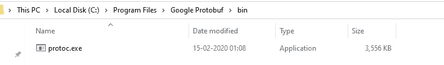
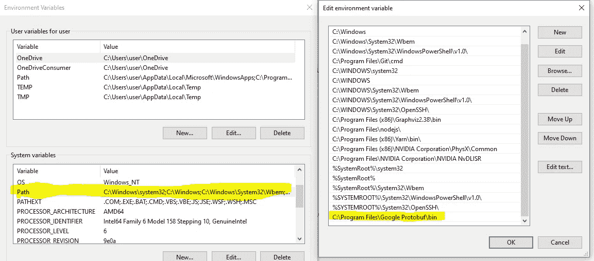
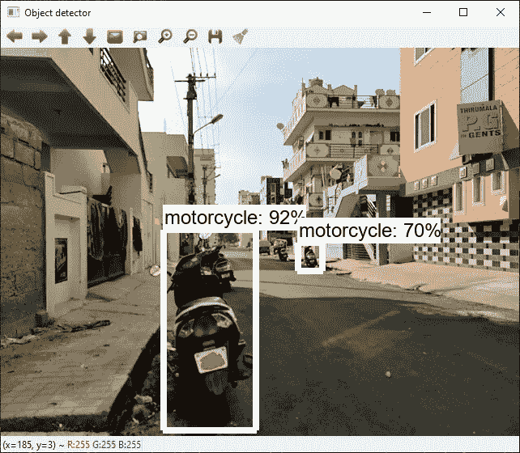
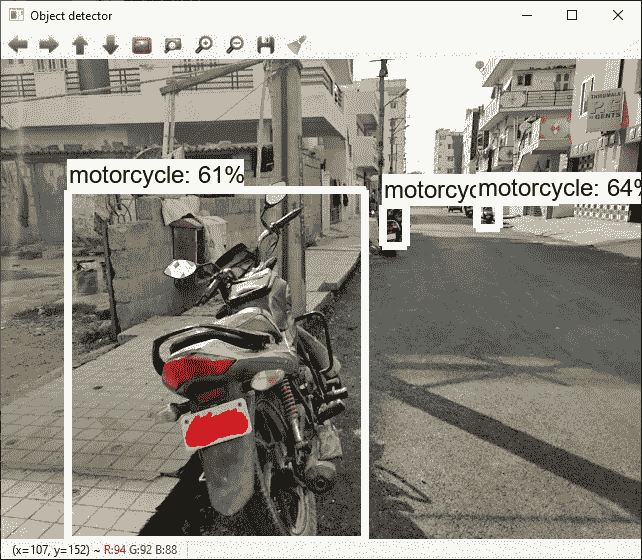
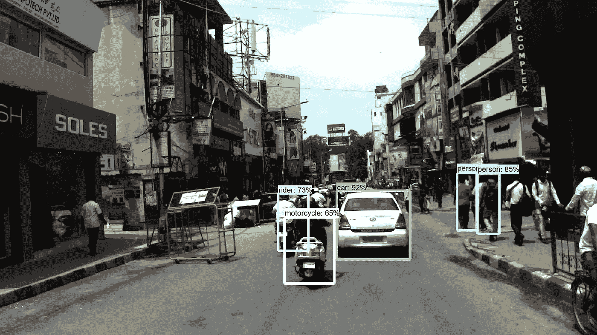

# 用于 windows 10 中印度驾驶数据集(IDD)的 Tensorflow 对象检测 api

> 原文：<https://medium.com/analytics-vidhya/tensorflow-object-detection-api-for-indian-driving-dataset-idd-in-windows-10-f1f99c19b110?source=collection_archive---------6----------------------->

这篇博客解释了如何考虑 IDD 的海量数据，使用 tensorflow 对象检测 api 构建自定义对象检测模型。


在 [Unsplash](https://unsplash.com?utm_source=medium&utm_medium=referral) 上由 [Atharva Tulsi](https://unsplash.com/@atharva_tulsi?utm_source=medium&utm_medium=referral) 拍摄的照片

## 概观

IDD 数据集由从连接到汽车的前置摄像头获得的图像组成。它由 10，000 幅图像组成，用从印度道路上的 182 个驾驶序列中收集的 34 个类别进行了精细注释。这辆车在海德拉巴、班加罗尔城市及其郊区行驶。这些图像大多是 1080p 分辨率，但也有一些图像具有 720p 和其他分辨率。这是由 IIT 海德拉巴和英特尔赞助的。

[*官网*](https://idd.insaan.iiit.ac.in/dataset/download/) *共有五个数据集。你可能需要注册才能使用它。我用过名为**的数据集数据集名称:IDD- Detection (22.8 GB)** 。我已经在 git 中解释了整个文件夹结构和代码。为了简洁起见，我在这里就长话短说。给定的输入数据是图像和包含图像信息的 xml。*

我使用 tensorflow 找出自定义对象检测的链接是 [*这个*](https://tensorflow-object-detection-api-tutorial.readthedocs.io/en/latest/) 。tensorflow 的物体检测 api 在 tensorflow **1.15.0** 中工作。我花了很长时间才弄清楚 tensorflow 的版本，它将用于对象检测 api。现在随着 tensorflow **2.x** 的发布，许多人可能会认为对象检测 api 的新代码也已经发布了。但事实绝对不是这样。为了节省你的努力，找到这个[链接](https://github.com/tensorflow/models/issues/6423)，它清楚地表明开发新模块将需要几个月的时间。

> 我们现在正与 TF 团队合作迁移到 2.0，但这是一项巨大的工作，可能需要几个月的时间。— [pkulzc](https://github.com/pkulzc) (对象检测 api 的代码贡献者)

如果你已经知道了如何为 IDD 数据集进行自定义对象检测，那么你可以跳到结果部分，我已经上传了一个显示结果的视频。如果没有，我们走吧。请从[这里](https://github.com/prabhudayala/tensorflow-object-detection-api-on-IDD)下载名为**try _ tensor flow _ object _ detection _ API**的文件夹作为参考。它会让你在创建文件夹和子文件夹时保持对齐。

这些是你需要做的事情的清单。

## 1.安装 tensorflow 1.15.0

从 windows 打开 anaconda 提示符并运行以下命令

## 2.用你选择的名字创建一个新文件夹。

我的文件夹名是**try _ tensor flow _ object _ detection _ API**

## 3.下载 tensorflow 模型。

您可以从 [git](https://github.com/tensorflow/models) 下载整个 repo 并将其放在当前工作目录(CWD)下，该目录是**try _ tensor flow _ object _ detection _ API**，或者使用 git bash 在 CWD 克隆 git。

## 4.安装 Protobuf 并添加所有必要的环境路径

Tensorflow 对象检测 API 使用 Protobufs 来配置模型和训练参数。导航到此链接并从中下载“[protocol-3 . 11 . 4-win 64 . zip](https://github.com/protocolbuffers/protobuf/releases/download/v3.11.4/protoc-3.11.4-win64.zip)”。创建名为 Google Protobuff 的文件夹。

现在将下载的 zip 文件的内容提取到 Google Protobuff 中，并将其中的 bin 文件夹添加到环境变量中。



现在导航到**try _ tensor flow _ object _ detection _ API/models/research**文件夹，运行下面的命令。

## 5.为培训创建文件夹和子文件夹

创建一个名为 **workspace** 的文件夹，并在其中创建一个文件夹 **training_demo** 。 **training_demo** 是包含所有与我们培训相关的文件的文件夹。创建名称为**注释**、**图像**、**预训练-模型**、**训练、脚本**的文件夹。创建两个名为 **train 的文件夹，在 image 文件夹中测试**，在 side scripts 文件夹中创建一个名为**预处理**的文件夹。

## 6.将所有训练图像复制到训练图像\训练文件夹

## 7.创建标签地图

在 annotations 文件夹中创建名为 label_map.pbtxt 的文件

并将以下内容粘贴到其中并保存。

```
item {
    id: 1
    name: 'truck'
}item {
    id: 2
    name: 'vehicle fallback'
}item {
    id: 3
    name: 'car'
}item {
    id: 4
    name: 'motorcycle'
}item {
    id: 5
    name: 'rider'
}item {
    id: 6
    name: 'person'
}item {
    id: 7
    name: 'bus'
}item {
    id: 8
    name: 'bicycle'
}item {
    id: 9
    name: 'autorickshaw'
}item {
    id: 10
    name: 'animal'
}item {
    id: 11
    name: 'traffic sign'
}item {
    id: 12
    name: 'train'
}item {
    id: 13
    name: 'traffic light'
}item {
    id: 14
    name: 'caravan'
}item {
    id: 15
    name: 'trailer'
}
```

## 8.将 train.csv 文件放置到位，并为 tesnsorflow 创建记录文件

您应该有一个如下格式的 train.csv。我如何处理 IDD 数据集以获得 csv 是一个不同的讨论。我们将在最后谈论它。现在让我们继续流动。我们需要将它转换成一个记录文件(tensorflow 理解的文件，以便更快地执行)，为此您需要[这段](https://github.com/prabhudayala/tensorflow-object-detection-api-on-IDD/blob/master/try_tensorflow_object_detection_api/scripts/preprocessing/generate_tfrecord.py)代码。将这段代码放在**脚本\预处理**文件夹中，执行下面的命令。

## 9.配置培训渠道

我们将使用的模型是 **ssd_inception_v2_coco** ，这是由提供的预训练模型，因为它在性能和速度之间提供了良好的平衡。然而，还有许多其他网络可以使用，可以在这里找到。我们将在这里下载 2 样东西。第一:[SSD _ inception _ v2 _ coco 预训练模型](http://download.tensorflow.org/models/object_detection/ssd_inception_v2_coco_2018_01_28.tar.gz)和[其配置文件](https://github.com/tensorflow/models/blob/master/research/object_detection/samples/configs/ssd_inception_v2_coco.config)。将配置文件放在 training 文件夹中，提取**pre-training-model**文件夹中预训练模型权重的内容。

## 10.配置文件中的参数调整

打开刚才放在培训文件夹中的配置文件，并更改以下参数。

```
model {
  ssd {
    **num_classes**: 15 # number of classes. For us its 15
    box_coder {
      faster_rcnn_box_coder {
################################################################feature_extractor {
 **type:** ‘ssd_inception_v2’ # the name pre-trained model. For us its       ssd_inception_v2 as we have downloaded that model.
 min_depth: 16
 depth_multiplier: 1.0
###############################################################train_config: {
 **batch_size:** 32 #For us its 32, as my memory crashed in higher value
 optimizer {
 rms_prop_optimizer: {
################################################################**fine_tune_checkpoint:** “pre-trained-model/model.ckpt” #*Path to extracted files of pre-trained model. We had downloaded the pretrained model and placed the extracted the content in pre-trained-model folder.
################################################################*# never decay). Remove the below line to train indefinitely.
 ** num_steps:** 20000 # number of epochs
  data_augmentation_options {
    random_horizontal_flip {
*################################################################*train_input_reader: {
  tf_record_input_reader {
    **input_path:** "annotations/train.record" #path to train record
  }
 ** label_map_path:** "annotations/label_map.pbtxt" #path to labelmap
}
```

## 11.训练模型

从对象检测文件夹中复制训练文件，并将其粘贴到 training_demo 文件夹中，然后运行 python 命令。

## 12.使用模型检测对象。

从 git 和中复制名为**export _ inference _ graph . py**的文件，粘贴到 **training_demo** 文件夹中，运行下面的命令。

这将在同一目录下创建一个名为**推理图**的文件夹，并将模型保存为**推理图**中的**冻结推理图. pb** 。

## 13.在样本图像上运行

您可以简单地运行文件**Object _ detection _ image . py**并查看结果。

要测试您的图像，请更改变量名 IMAGE_NAME。

有两个文件**Object _ detection _ video . py**和**Object _ detection _ webcam . py**分别作用于视频和 web cam。我建议你也应该这样做。很有趣。

## 14.结果

我把我的手机连接到我的电脑上，作为一个网络摄像头，从我的手机上拍摄现场直播。下面三张图中的前两张是视频截图。



网络摄像头馈送 1



网络摄像头馈送 2



来自验证的样本图像

我处理了一个 youtube 视频，也上传了结果。来源视频[https://www.youtube.com/watch?v=BqOLehUdqkU](https://www.youtube.com/watch?v=BqOLehUdqkU)。我深深感谢视频制作者。

## 15.处理 IDD 数据集以创建 train.csv

如果你记得我承诺过我会在最后解释这一点。我在 git 中有另一个 [repo，在那里我对同一个 IDD 数据集应用了更快的 RCNN。请到那里看看。](https://github.com/prabhudayala/IDD-data-set-Faster-RCNN)

如果您在两个 jupyter 笔记本下运行，您将获得与 tensorflow 对象检测 API 兼容格式的所需 train.csv。
1。 **2。解决问题和准备资料的路线图. ipynb**
2。**create _ CSV _ for _ object _ detection _ API . ipynb**

# 参考

1.  [https://github . com/EdjeElectronics/tensor flow-Object-Detection-API-Tutorial-Train-Multiple-Objects-Windows-10](https://github.com/EdjeElectronics/TensorFlow-Object-Detection-API-Tutorial-Train-Multiple-Objects-Windows-10)
2.  [https://tensor flow-object-detection-API-tutorial . readthedocs . io/en/latest/training . html](https://tensorflow-object-detection-api-tutorial.readthedocs.io/en/latest/training.html)