# TensorFlow 对象检测 API 教程—使用 Google Colab 进行风力涡轮机检测

> 原文：<https://medium.com/analytics-vidhya/tensorflow-object-detection-api-tutorial-wind-turbine-detection-using-google-colab-e8e2e120e54e?source=collection_archive---------10----------------------->

*使用 TensorFlow 对象检测 API 从航空或卫星图像中检测风力涡轮机*

# **概述**

本教程描述了一个 Jupyter 笔记本和支持文件，使用 [TensorFlow 对象检测 API](https://github.com/tensorflow/models/tree/master/research/object_detection) 来训练风力涡轮机对象检测器。这款笔记本运行在[谷歌联合实验室](https://colab.research.google.com/notebooks/welcome.ipynb)中，该实验室提供了一个免费的虚拟机，预装了 TensorFlow 并可以访问 GPU。这简化了开始使用 TensorFlow 进行有趣的事情(如对象检测)所需的设置过程。将 Google Colab 与开源 TensorFlow 对象检测 API 相结合，提供了训练自定义对象检测模型所需的所有工具。

在本教程中，描述了从航空图像中检测风力涡轮机的过程。使用 [USGS EarthExplorer](https://earthexplorer.usgs.gov/) 从公开可用的[国家农业图像计划(NAIP)数据库](https://www.fsa.usda.gov/programs-and-services/aerial-photography/imagery-programs/naip-imagery/)获得航空图像。总共收集了 488 幅图像，其中至少包含一个完整的风力涡轮机，并将其分成[系列](https://github.com/lbborkowski/wind-turbine-detector/tree/master/images/train)(约 80%)、[测试](https://github.com/lbborkowski/wind-turbine-detector/tree/master/images/test)(约 16%)和[验证](https://github.com/lbborkowski/wind-turbine-detector/tree/master/images/valid)(约 4%)组。

从训练到推理的完整流程包含在 GitHub [repo](https://github.com/lbborkowski/wind-turbine-detector) 中的 Jupyter 笔记本中，对流程中的每一步都有详细的解释。对于那些有兴趣训练自己的自定义对象检测模型的人来说，这可以作为一个教程。该过程分为三个步骤:1 .**训练**，2。**验证**和 3。**风力发电机检测和定位**。

下图显示了一幅典型的航空或卫星输入图像，以及几幅对每台风力涡轮机进行了正确检测和分类的输出图像。如您所见，TensorFlow 对象检测 API 提供了先进的预训练卷积神经网络(CNN)模型，可以自动对大范围内的结构或对象进行定位和分类。

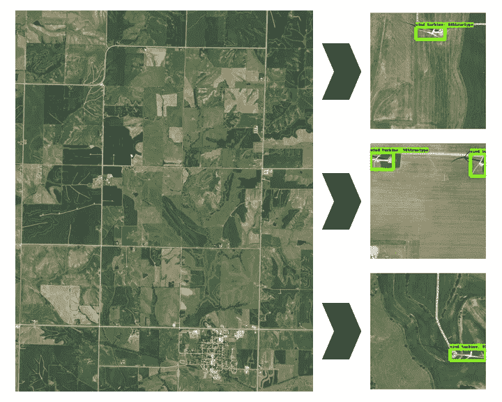

从 1 米分辨率的航空图像中探测风力涡轮机。从 [*国家农业影像计划(NAIP)数据库*](https://www.fsa.usda.gov/programs-and-services/aerial-photography/imagery-programs/naip-imagery/) *获得的原始航拍影像。*

# 培养

在从 NAIP 数据库的原始 5978 x 7648 像素航空图像中截取的标记的 300 x 300 像素图像上执行训练。选择 300 x 300 的图像大小是为了避免过度使用内存，因为基于 TensorFlow 对象检测 SSD 的模型会将所有输入图像重新缩放到该大小。此外，通过该操作提高了对象尺寸与图像尺寸的比率。每张图片包含至少一个风力涡轮机，使用[标签](https://github.com/tzutalin/labelImg)进行标记。在 LabelImg 中注释图像会创建一个对应于每个图像的 XML 文件。这些 XML 文件必须先转换为 CSV，然后再转换为 TFRecords。可以在[这里](https://towardsdatascience.com/how-to-train-your-own-object-detector-with-tensorflows-object-detector-api-bec72ecfe1d9)或者[这里](https://tensorflow-object-detection-api-tutorial.readthedocs.io/en/latest/training.html)找到示例代码(在其他地方)。

下面显示了一些带标签的图像。总共有 392 幅图像用于训练，80 幅用于测试。该培训集包括不同容量、制造商和设计的风力涡轮机。

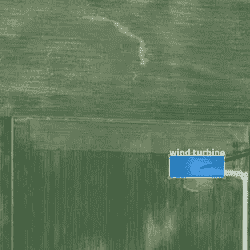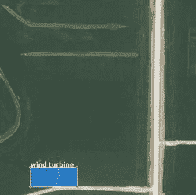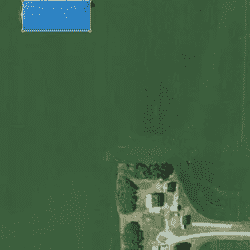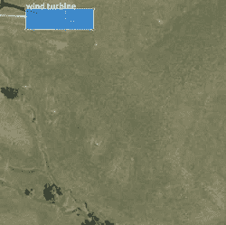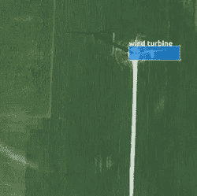

风力涡轮机检测器的标记训练图像样本

来自 [TensorFlow 对象检测模型 Zoo](https://github.com/tensorflow/models/blob/master/research/object_detection/g3doc/detection_model_zoo.md) 的预训练 CNN 模型被用作起点。选择 ssd_inception_v2_coco 模型是基于其准确性和效率的平衡。关于如何安装和配置 TensorFlow 对象检测 API 的详细信息，包括依赖关系，可以在[这里](https://github.com/tensorflow/models/blob/master/research/object_detection/g3doc/installation.md)找到。

使用来自 [TensorFlow 对象检测 API repo](https://github.com/tensorflow/models/tree/master/research/object_detection) 的经修改的 [model_main.py](https://github.com/lbborkowski/wind-turbine-detector/blob/master/model_main.py) 文件来训练风力涡轮机检测器模型，该文件包括在导入语句之后的“TF . logging . set _ verbosity(TF . logging . info)”，以每 100 步输出损失。在修改后的模型配置文件[SSD _ inception _ v2 _ coco _ wt detector . config](https://github.com/lbborkowski/wind-turbine-detector/blob/master/training/ssd_inception_v2_coco_WTDetector.config)中，对示例 ssd_inception_v2_coco.config 文件进行了以下更改/添加:

*   数量 _ 类别:1
*   批量大小:12
*   fine _ tune _ check point:" pre-trained-model/model . ckpt "
*   train _ input _ reader:{ TF _ record _ input _ reader { input _ path:" annotations/train . record " } label _ map _ path:" annotations/label _ map . Pb txt " }
*   eval _ input _ reader:{ TF _ record _ input _ reader { input _ path:" annotations/test . record " } label _ map _ path:" annotations/label _ map . Pb txt " shuffle:false num _ readers:1 }

修改后的配置文件中规定了额外的数据/图像增强。将垂直翻转和 90 度旋转与默认的水平翻转相结合，训练数据可以扩展到包含所有可能的风力涡轮机方位。由于风力涡轮机可以面向任何方向，这些操作有助于概化模型。

*   data _ augment _ options { random _ vertical _ flip { } }
*   data _ augmentation _ options { random _ rotation 90 { } }

# 确认

为了验证模型，一组未标记的验证图像与训练集和测试集分开保存。总共 16 幅图像用于验证。由于在训练期间执行的随机图像增强，验证结果可能在训练运行之间有所不同。然而，我发现，在默认的训练参数下，验证图像集中的 17 个风力涡轮机中至少有 15 个被检测到的概率很高。我甚至经历了 100%的准确性(所有风力涡轮机都被正确检测到)，但是由于训练中的随机性，每个训练的模型可能会提供略有不同的结果。验证步骤的一些结果如下所示。

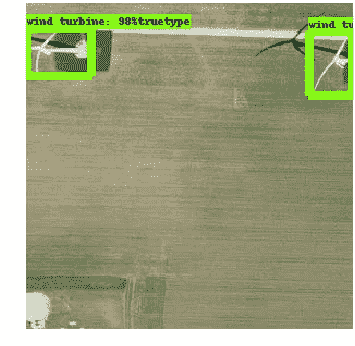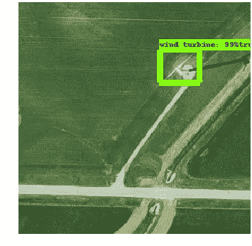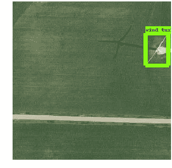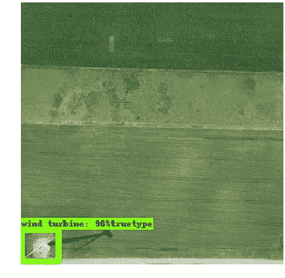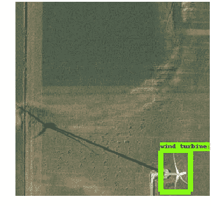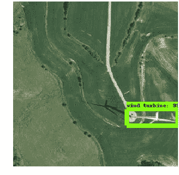

经过培训的风力涡轮机检测器的验证结果

# 风力涡轮机检测和定位

最后，经过训练的模型被应用于覆盖大约 4 英里乘 4 英里区域的完整 NAIP 图像。为了在这个大区域上执行检测，使用滑动窗口方法来分析 5978×7648 像素原始图像上的 300×300 像素图像。一旦执行了该分析，就在每个检测到的风力涡轮机的原始 NAIP 图像上绘制标记。此外，输出每台风机的经纬度以供验证。下面是两张 NAIP 图像，所有检测到的风力涡轮机都用红色标记表示。此外，包含风力涡轮机纬度和经度坐标子集的表格如下所示。该模型的检测精度很高，但是存在非风力涡轮机对象(例如房屋、谷仓或道路)被检测并分类为风力涡轮机的情况。

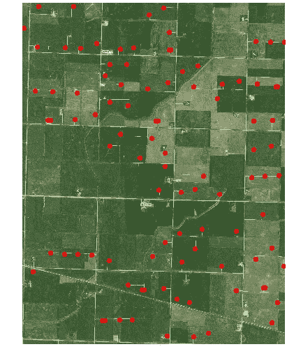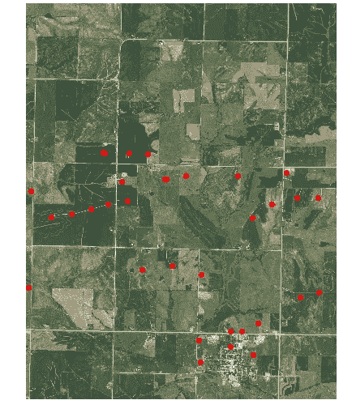

使用应用于 4 x 4 英里航空图像的训练模型检测到的风力涡轮机位置(用红色标记表示)

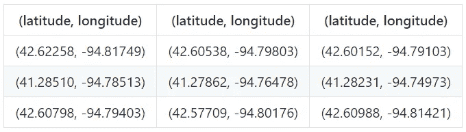

*检测到的风力涡轮机样本集的位置*

# 摘要

经训练的风力涡轮机检测模型显示具有大约 90%的准确度(在验证集中检测到 17 个风力涡轮机中的至少 15 个)。通过使用更大的图像集(训练+测试)以及使用更准确的预训练模型，可能会实现更高的准确性。在 [TensorFlow 物体探测模型动物园](https://github.com/tensorflow/models/blob/master/research/object_detection/g3doc/detection_model_zoo.md)可以找到替代模型，包括那些具有更高地图的模型。在这篇[论文](https://arxiv.org/pdf/1611.10012.pdf)中可以找到各种对象检测模型架构(例如，更快的 RCNN、SSD、R-FCN)的速度、精度和内存之间的权衡细节，这可以作为确定哪种架构最适合您的应用的良好起点。

本教程和随附的 Jupyter 笔记本中介绍的综合管道包括训练、验证和推理，可以应用于许多其他应用，包括从航空或卫星图像中检测各种对象。

*启动 Jupyter 笔记本，点击* [*此处*](https://colab.research.google.com/github/lbborkowski/wind-turbine-detector/blob/master/WindTurbineDetector_200529.ipynb) *，开始在 Google Colab 中检测风力涡轮机。*