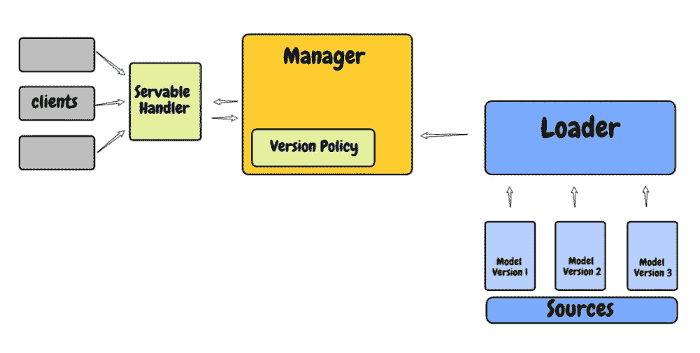

# TensorFlow 服务:部署深度学习模型变得更加容易！

> 原文：<https://medium.com/analytics-vidhya/tensorflow-serving-deploying-deep-learning-models-just-got-easier-fcb4720f2111?source=collection_archive---------26----------------------->

所以你已经建立了你的机器学习或者深度学习模型。恭喜你。这是向你的客户或顾客展示模型的重要一步。但这还不是你项目的最后阶段。

最后一个阶段——你的[机器学习](https://courses.analyticsvidhya.com/courses/applied-machine-learning-beginner-to-professional?utm_source=blog&utm_medium=tensorflow-serving-deploy-deep-learning-models)或[深度学习](https://courses.analyticsvidhya.com/courses/computer-vision-using-deep-learning-version2?utm_source=blog&utm_medium=tensorflow-serving-deploy-deep-learning-models)项目中至关重要的一环——是模型部署。您需要能够将模型提供给最终用户，对吗？具有讽刺意味的是——大多数课程、有影响的人，甚至专家——没有人支持模型部署的价值。


然而，当您参加数据科学家面试时，您将面临大量关于模型部署的问题！什么是模型部署？模型部署有哪些不同的工具？如何将一种语言编写的深度学习模型处理到需要不同语言的生产环境中？

然后，我们将研究一个流行的深度学习数据集，并了解如何使用 TensorFlow 服务来部署您的深度学习模型。这里有很多东西要打开，让我们开始吧。

**什么是模型部署？**

在一个典型的机器学习和深度学习项目中，我们通常首先定义问题陈述，然后是数据收集和准备，理解数据和建立模型。

但最终，我们希望我们的模型对最终用户可用，以便他们可以利用它。模型部署是任何机器学习项目的最后阶段之一，可能有点棘手。

这是一个典型的机器学习和深度学习项目管道的图解版本:


**部署后的挑战**

您可能会遇到一些后模型部署挑战:

*   如果您发现了一个更好的特性，提高了模型的性能，该怎么办？现在，您需要在不关闭服务器和不影响现有客户端的情况下更新生产中的模型
*   您希望回滚到以前的稳定版本，因为更新的部署模型在现实世界的数据集上不能很好地工作
*   您想要同时测试多个模型
*   理想情况下，您希望为不同类型的客户提供不同的模型

那么，如何克服这些重大挑战呢？我们将在文章的后面使用 TensorFlow 服务来回答这个问题。

1.  使用 Flask: Flask 是一个基于 Python 的框架，用于开发小型网站。在使用它部署模型时，我们必须围绕模型创建一个包装器。这里，我们需要编写额外的代码来使用这个模型。你可以在这里阅读更多关于[使用 Flask 部署机器学习模型的信息](https://www.analyticsvidhya.com/blog/2017/09/machine-learning-models-as-apis-using-flask/?utm_source=blog&utm_medium=tensorflow-serving-deploy-deep-learning-models)
2.  **用 Azure 部署模型:** Azure 机器学习提供 web 接口软件包，这样我们就可以轻松地大规模部署我们的机器学习模型和管道
3.  **使用 Kubernetes 进行部署:** Kubernetes 是一个开源系统，用于自动化容器化应用程序的部署、伸缩和管理。它可以在不增加运营团队的情况下进行扩展
4.  **TensorFlow Serving:** 它是一个高性能的模型部署系统，已经被大多数 Google 项目使用。我们将在这里详细了解如何使用 Tensorflow 服务部署模型

# TensorFlow 提供的是什么？

> *TensorFlow Serving 是一个灵活的高性能模型部署系统，用于将机器学习和深度学习模型投入生产。*

使用 TensorFlow 服务很容易部署模型。如果我们想用一个更新的版本来更新已部署的模型，那么 TensorFlow Serving 让我们以一种比其他现有工具更简单的方式来完成。我们还可以在不关闭服务器的情况下回滚到任何以前的版本。

TensorFlow 服务已经经过 1000 多个 Google 项目的测试，在这些项目中每秒处理数百万个请求。


# 什么是可服务的？

部署模型后，客户端向服务器发送请求，一些计算在服务器上执行。现在，客户机用来执行计算的对象被部署在服务器上，称为 Servable。可服务的大小和粒度是灵活的。

**Tensorflow 服务可以处理多个版本的服务，并允许在不同版本的服务之间轻松交换。**

# 可服务对象的生命周期



*   首先，在本地文件系统上创建一个 servable，源插件系统检测版本并为该特定版本创建一个加载器
*   加载程序将可用的更新版本通知给管理器
*   接下来，管理器根据版本策略确定下一步是什么(如卸载以前的版本),并向加载器提供所需的资源来加载新版本和卸载以前的版本
*   最后，客户机可能要求使用模型的特定版本，或者服务器可能为客户机的不同部分提供不同版本的 servable。在分析了所有这些因素之后，处理程序将结果返回给客户机

# TensorFlow 服务的安装步骤

## 安装 TensorFlow

您可以使用 Python-pip 包管理器安装 TensorFlow:

```
# download package information from all configured sources. 
sudo apt-get update 
# Current stable release for CPU and GPU 
# !pip install tensorflow
```

## 安装 ModelServer

添加 TensorFlow 服务分发作为包源:

```
echo "deb [arch=amd64] [http://storage.googleapis.com/tensorflow-serving-apt](http://storage.googleapis.com/tensorflow-serving-apt) stable tensorflow-model-server tensorflow-model-server-universal" | sudo tee /etc/apt/sources.list.d/tensorflow-serving.list && \ 
curl [https://storage.googleapis.com/tensorflow-serving-apt/tensorflow-serving.release.pub.gpg](https://storage.googleapis.com/tensorflow-serving-apt/tensorflow-serving.release.pub.gpg) | sudo apt-key add -
```

## 安装 Tensorflow 模型服务器

```
sudo apt-get install tensorflow-model-server
```

# 问题陈述—识别数字

打开你的 Jupyter 笔记本(或 Colab ),让我们开始编码吧！

在本文中，我们将构建和部署一个深度学习模型来识别数字。你猜对了——我们将使用著名的 [MNIST 数据集。](http://yann.lecun.com/exdb/mnist/)这是机器学习和深度学习社区中广泛使用的数据集。它是由 Yann LeCun，Corina Cortes 和 Christopher Burger 开发的，用于评估手写数字分类问题的深度学习模型。


## 构建我们的深度学习模型

让我们定义一个简单的[人工神经网络模型](https://www.analyticsvidhya.com/blog/2020/02/cnn-vs-rnn-vs-mlp-analyzing-3-types-of-neural-networks-in-deep-learning/?utm_source=blog&utm_medium=tensorflow-serving-deploy-deep-learning-models)，用于从图像中识别数字。在这里，我使用了 10，000 张图像来训练模型。

在本教程中，我们的重点将是*而不是*如何建立一个健壮的分类模型，而是学习一旦模型建立后如何部署它。如果您想了解关于构建影像分类模型的更多信息，我强烈推荐您阅读以下文章:

```
# importing the libraries
from tensorflow.keras import datasets
from tensorflow.keras.models import Sequential
from tensorflow.keras.layers import Dense# loading dataset
(train_images, train_labels), (test_images, test_labels) = datasets.mnist.load_data()# For training, we will use 10000 images 
# And we will test our model on 1000 images
train_labels = train_labels[:10000]
test_labels = test_labels[:1000]train_images = train_images[:10000].reshape(-1, 28 * 28) / 255.0
test_images = test_images[:1000].reshape(-1, 28 * 28) / 255.0# define the model
model = Sequential()
model.add(Dense(512, activation='relu', input_shape=(784,)))
model.add(Dense(10,activation='softmax'))# compile the model
model.compile(optimizer='adam',loss= 'sparse_categorical_crossentropy',metrics=['accuracy'])# model summary
model.summary()# Train the model with the new callback
model.fit(train_images, train_labels, epochs=10, validation_data=(test_images,test_labels))# Evaluate the model
loss, acc = model.evaluate(test_images,  test_labels, verbose=2)
print("model, accuracy: {:5.2f}%".format(100*acc))
```


## 如何保存 TensorFlow 模型？

只需一行代码就可以保存训练好的模型！使用 **model.save** 方法保存模型的架构、权重和训练配置。您只需要传递目录的路径来存储模型。

*确保将模型存储在具有整数名称的目录中。这个整数作为你的模型的版本号。*

如果您正在为同一个问题创建多个模型，那么将最新的模型存储在一个具有更高版本号的目录中。将两个模型目录放在同一个父目录中。

```
# save the model
model.save('my_model/1')
```

您的模型目录将如下所示:


它将包含一个 **saved_model.pb** 文件，其中 *pb* 代表 ***protobuf*** 。它包含图形定义以及模型的权重。这将创建一个名为 **assets** 的空目录(在我们的例子中是空的)。

通常，该目录包含张量流图使用的文件，例如，用于初始化词汇表的文本文件。上面的命令还将创建一个包含标准训练检查点的名为**变量**的目录。检查点是模型在模型构建过程的特定阶段使用的所有参数的精确值。

## 如何使用保存的模型进行预测？

最大的问题！我们已经保存了训练好的模型，我们将使用该模型来预测看不见的数据上的数字。

首先，我们将使用 **load_model** 方法加载模型。你只需要通过模型目录——它会自动找到**。pb** 文件并加载模型。

使用**预测**函数将返回 10 个概率的数组(因为我们有 10 个类)。数组中的第一个元素告诉我们这个数字的概率是 0，以此类推。您可以使用另一个函数 **predict_classes** ，它将返回概率最高的类:

```
# import load_model
from tensorflow.keras.models import load_model# give the path to model directory to load the model
loaded_model = load_model('my_model/1/')# predict function to predict the probabilities for each class 0-9
loaded_model.predict(test_images[0:1])# predict_classes to get the class with highest probability 
loaded_model.predict_classes(test_images[0:1])
```


# 使用 TensorFlow 服务部署您的深度学习模型

这是我们开始加载模型并运行 TensorFlow 服务器的地方。在此之后，我们将能够向服务器发出请求，并获得预测的结果。

使用以下命令启动服务器:

```
tensorflow_model_server --rest_api_port=9000 --model_base_path="path-to-directory/tensorflow_serving/my_model" --model_name=sample
```

*   **rest_api_port:** 这是您将用来发送 rest 请求的端口
*   **model_base_path:** 这里需要提供保存深度学习模型的目录路径
*   **型号名称:**您可以在此为您的型号命名。在发出 REST 请求时，您需要在 URL 中提供这个信息


恭喜你。你已经部署了你的深度学习模型。现在，让我们看看如何向已部署的模型发送请求并获得结果。

# 使用部署的深度学习模型进行预测

首先，我们将定义一个显示图像并添加标签作为图像标题的函数。我们将通过生成一个随机索引来测试该函数，并显示该索引上的图像和标签:

```
# import skimage and matplotlib and random
from skimage import io
import matplotlib.pyplot as plt
%matplotlib inline
import random# function to display image
def show(idx, title):
    plt.figure()
    plt.imshow(test_images[idx].reshape(28,28))
    plt.axis('off')
    plt.title('\n\n{}'.format(test_labels[idx]), fontdict={'size': 16})# generate a random index
r = random.randint(0,len(test_images)-1)#
print("Random Number Generated: ", r, "Image Label : ", test_labels[r])
show(r, 'Image: {}'.format(test_images[rando]))
```


接下来，我们将创建一个 **JSON** 对象，并将前 3 个数据点成批发送到服务器。在这之后，我们将使用**请求**库向我们之前定义的 **REST API 端口 9000** 发送一个 **POST** 请求。

还记得我们在部署模型时将其命名为**样本**吗？因此，在 URL 中，我们需要提供该名称以及您要求的结果的模型版本:

```
import json
import requests# create a json string to ask query to the depoyed model
data = json.dumps({"signature_name": "serving_default",
                   "instances": test_images[0:3].tolist()})# headers for the post request
headers = {"content-type": "application/json"}# make the post request 
json_response = requests.post('[http://localhost:9000/v1/models/sample/versions/1:predict'](http://localhost:9000/v1/models/sample/versions/1:predict'),
                              data=data,
                              headers=headers)# get the predictions
predictions = json.loads(json_response.text)
predictions
```


我们已经收到了每个数据点的概率数组。现在，我们可以使用 **NumPy argmax** 函数轻松找到最大概率的索引。

让我们看看我们得到的预测结果是否正确:

```
# get the prediction array
predictions = predictions['predictions']# print the actual image and the predicted result
for i, prediction in enumerate(predictions):
    print("Prediction: ",np.argmax(prediction))
    show(i,test_images[i])
```


## 如果发现新版本，自动更新模型

现在，我们知道我们不能一次建成一个完美的模型。我们总是构建多个模型，并从上一个模型改进模型的性能。在这里，我为同一个问题训练了另一个模型，并将其存储在目录名 **2** 中:


TensorFlow 服务将自动检测更高版本，并自动替换它以将其部署在服务器上:


# 配置 Tensorflow 服务器

如果我们只需要部署一个单一的模型，到目前为止我们所做的都是最好的方法之一。**但是如果我们需要部署多个模型呢？**这是一个巨大的挑战，也是一个与行业密切相关的挑战。

我们可以为 Tensorflow 提供一个名为 **models.config** 的配置文件，其中包含一个名为 **model_config_list** 的列表，该列表又包含多个模型配置。

列表中的每个模型配置指定一个要服务的模型，包括它的名称和存储模型的路径。您还可以指定要使用的模型版本。默认情况下，服务器将提供版本号最大的版本。

让我们来看一个部署多个深度学习模型的样本配置文件。

## 部署多个模型

如果您在目录 **my_model_1** 和 **my_model_2** 中为两个不同的问题存储了两个模型，您可以如下定义配置文件并同时部署这两个模型:


使用以下命令通过配置文件部署模型:

```
tensorflow_model_server --rest_api_port=9000 --model_config_file=path-to-model-directory/tensorflow_serving/models.config
```


## 在指定时间后检查更新的配置

现在，如果我们希望服务器检查配置文件中的更改并相应地部署它，该怎么办呢？为此，我们有另一个选项**model _ config _ file _ poll _ wait _ seconds**，它将在指定时间后检查更新的配置。

最初，模型目录只有版本 1:


运行以下命令，服务器将在 30 秒后检查更新的配置文件:

```
tensorflow_model_server --rest_api_port=9000 --model_config_file=/home/lakshay/Documents/tensorflow_serving/models.config --model_config_file_poll_wait_seconds=30
```


这里，我们用版本 2 训练了另一个模型。现在，我们不必关闭服务器并使用更新后的模型重新启动它。

我们只需要更新配置文件中的版本，在指定的时间后，TensorFlow 服务器将自动用更新的版本替换模型，而无需关闭服务器。完美！


## 回滚到以前的稳定版本

更新的机型性能不如之前的机型性能怎么办？这里，我们只需要将配置文件中的版本更新为 1，之前的稳定版本将自动部署在服务器上。


# 结束注释

部署深度学习模型起初可能看起来很复杂。但是通过这篇教程，你知道了如何使用 TensorFlow 服务做到这一点的具体细节。

*原载于 2020 年 3 月 2 日*[*【https://www.analyticsvidhya.com】*](https://www.analyticsvidhya.com/blog/2020/03/tensorflow-serving-deploy-deep-learning-models/)*。*