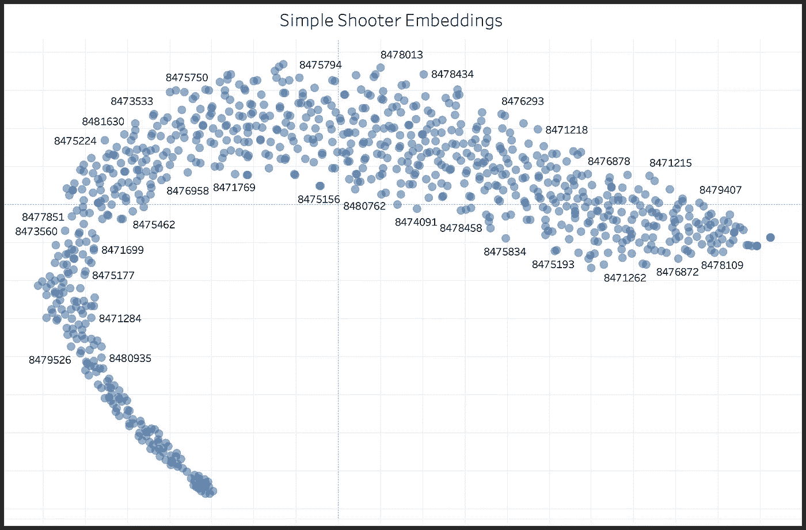

# 张量流，提示，Tableau，R 和 Python，天啊！

> 原文：<https://medium.com/analytics-vidhya/tensorflow-tip-ins-tableau-r-and-python-oh-my-3bc90fe50823?source=collection_archive---------16----------------------->



# TL:DR；

*   讨论使用 RStudio IDE 和 Rmarkdown/knitter 编写一篇文章，演示如何在 R 和 python 中并行实现相同的结果。**是的，这是可能的，鉴于惊人的** `reticulate` **包**傍编织者。
*   使用 TensorFlow 和 Keras 根据 NHL 滑冰运动员的击球位置/类型数据来估计射手嵌入。这项工作只是表面的，但展示了一条通过深度学习和详细播放数据实现可能的途径。
*   演示我们如何通过优秀的 python 库`pantab`轻松地将 Tableau 注入到我们的探索性数据分析工作中，以及我通过`pantabR`将那个项目简单地移植到 R。

# 概观

我喜欢教我的学生如何使用 R 和 python 来获取、分析和建模数据。但是不可否认的是，我并不热衷于根据所使用的语言在不同的工具集之间切换。我知道 [Visual Studio 代码](https://code.visualstudio.com/)对 python 开发人员来说似乎是新事物，但是当开始一个 python 项目时，我通常会在 [Google Colaboratory](https://colab.research.google.com/notebooks/intro.ipynb#recent=true) 上启动一个新的笔记本来启动我的想法。就我个人而言，我相信笔记本在类似谷歌文档的环境中的好处(例如，评论、访问控制、安装驱动器的能力等。)让学习如何编码比 python 中的其他传统工具集更容易。

然而，不管我使用哪种语言，最终我更喜欢一种环境来教授我的课程。最近我在博客上写了一些我在使用 RStudio 作为 python 的 [IDE 时遇到的问题。因此，我想设计一个能让我真正放松的练习。](https://brocktibert.com/post/python-development-with-rstudio-using-reticulate/)

为此，我想在演示几件事情的同时运行一个更大的测试:

*   写一个同时包含 R 和 python 代码的笔记本的可行性。你可以在这里找到。我使用 knitr 和 Rmarkdown 编译了一个文档，该文档在 R 和 python 中都使用 TensorFlow 完成了一个练习。
*   我想探索为 NHL 选手(射手)生成[嵌入](https://www.tensorflow.org/tutorials/text/word_embeddings)的概念。我最近偶然发现了[(击球手|投手)2vec](http://www.sloansportsconference.com/wp-content/uploads/2018/02/1008.pdf) 的工作，并想在 NHL 中为溜冰者执行一个类似的(但非常基础的)方法，使用“公开”可用的空间播放数据文件。射手嵌入是同时使用 R 和 python 构建的。

> 关于这方面的更多信息，我建议在这里查看我的帖子:[https://Brock tibert . com/post/tensor flow-tip-ins-and-tableau-oh-my/](https://brocktibert.com/post/tensorflow-tip-ins-and-tableau-oh-my/)

*   最后但并非最不重要的是，强调一个简单的路径来轻松地将熊猫或 R 数据帧移动到 Tableau 中，以加快项目的视觉探索阶段。是的，我们可以用任何一种语言来探索我们的数据(ggplot2 太棒了)，但是，Tableau 为新生简化了这个过程，我个人认为该软件使快速探索我们的数据集变得更加容易。简而言之，没有什么可以阻止我们使用 Tableau 这样的工具来原型化我们的可视化，并将它们移植回 R 或 python，用于我们的报告或应用程序。

# r 和 Python 在同一个文档里？

为了真正地撰写一篇包含 R 和 python 的帖子，我写了一篇专注于代码的博客，演示了 2019/20 NHL 赛季期间为玩家下载数据、清理和估计射手嵌入的过程。我通过一个利用了`reticulate`和`knitr`的 RMarkdown 文档做到了这一点。

这篇文章介绍了如何在 R 和 python 中执行相同的操作。

例如，下面是突出显示类似操作的代码块(在原始文档中):

```
```{r}
# keep shots that were on goal
shots_raw = shots_raw %>% filter(shotWasOnGoal == 1 )
shots_raw = shots_raw %>% filter(shotOnEmptyNet == 0)
shots_raw = shots_raw %>% filter(shooterPlayerId != 0)
shots_raw = shots_raw %>% filter(!is.na(shooterPlayerId))
```
```

和

```
```{python}
shots_raw = shots_raw.loc[shots_raw.shotOnEmptyNet == 0, :]
shots_raw = shots_raw.loc[shots_raw.shotWasOnGoal == 1, :]
shots_raw = shots_raw.loc[shots_raw.shooterPlayerId != 0, :]
shots_raw = shots_raw.loc[~shots_raw.shooterPlayerId.isna(), :]
```
```

与我期望大多数用户通过笔记本进行编码的方式类似，我试图在编写文档时通过代码片段进行交互工作。

那次 ***差点*** 成功了。

虽然 R 代码显然不是问题，但在整个开发过程中的不同时间，我会得到以下错误，如本期所述:

[](https://github.com/rstudio/reticulate/issues/494) [## rmarkdown 笔记本块中的 Python 错误显示:评估错误:选项错误具有空值。…

### 此时您不能执行该操作。您已使用另一个标签页或窗口登录。您已在另一个选项卡中注销，或者…

github.com](https://github.com/rstudio/reticulate/issues/494) 

显然，当试图识别 bug 时，可再现性是关键，但不幸的是，我并不总是能够系统地再现问题。

然而，如果我的 python 代码中有一个 bug(读:error ),似乎就会发生这种情况。有时，我似乎可以通过删除“坏的”python 代码块，重新运行上一个成功的 python 代码块以获得结果，然后尝试用 python 重做下一段代码来解决这个问题。然而，这并不总是奏效，坦率地说，这成了一种负担。

此外，也许更有趣的是，我发现如果手动执行 python 块，并且只执行 python 位，错误似乎不会出现。🤷‍♂️

总的来说，即使有上述情况，我实际上对将 RStudio 用于所有数据科学的可能性印象深刻。虽然在 R 和 python 之间交替使用可能不是一个常见的用例，但是很明显这个解决方案正在变得成熟。

要访问我的原始笔记本，请在这里参考[代码](https://gist.github.com/Btibert3/3cc236ca7795664bd67d7b5d17e1e705)。

# Tensorflow:不仅仅针对 python 用户

很明显，RStudio 非常努力地将深度学习，更具体地说，Tensorflow 移植到 r 中，首先也是最重要的，文档绝对非常棒。

[](https://tensorflow.rstudio.com/) [## R 的张量流

### TensorFlow 是一个使用数据流图进行数值计算的开源软件库。图表中的节点…

tensorflow.rstudio.com](https://tensorflow.rstudio.com/) 

该团队在将 pythonic 方式映射到熟悉的 tidyverse 方式方面做得非常好。当然，这不是两种语言之间 1:1 的翻译，但语法是接近的，总体上是直观的。

例如，当处理多个输入/输出时，我们通过一个列表`[obj1, obj2]`传递 python 对象，在 R 中，我们也使用一个列表，尽管它们在结构上非常不同`list(obj1, obj2)`。

退一步讲，R 环境下的 TensorFlow 是相当惊人的。如果你是一名 R 程序员，你应该为拥有一条通往深度学习的捷径而感到兴奋。要开始，您应该参考此回购:

【https://github.com/jjallaire/deep-learning-with-r-notebooks 

# Tableau 摘录

如上所述，我经常将我的原始数据帧导出到 Tableau(通过 CSV)以快速浏览我的数据。虽然用任何一种语言执行这项任务都是 100%可能的，但在我看来，Tableau 加快了我们理解数据集和识别需要纠正的问题的能力。

> 早在 2013 年，我就渴望这样。[https://github.com/Btibert3/tableau-r](https://github.com/Btibert3/tableau-r)

例如，我经常使用 Tableau 来帮助对分类数据进行重新编码，或者对开放式回答进行编码。通过查看 Tableau 中的数据，事情很简单:

1.  确定要纠正或重新编码的数据
2.  用 R/python 编写解决方案的脚本
3.  用相同的文件名/位置导出数据
4.  在表格内刷新
5.  确认代码的行为符合您的预期

使用像 python 的`pantab`或 R 的`pantabR`这样的包，作为分析师，我们可以探索 Tableau 中的数据，用我们选择的语言修复数据，导出数据，并简单地刷新 Tableau 中的摘录以查看我们的更改。

# 摘要

1.  用 R 和 python 同时编写技术文档是可能的，但是有一些*怪癖*
2.  R 中的张量流太棒了。有一些明显的区别，但是希望我上面链接的代码能够帮助你将 python 映射到 R 来完成同样的任务
3.  Tableau 可以帮助我们加快项目的数据探索阶段，特别是使用 python 中的`pantab`和 r 的衍生工具`pantabR`