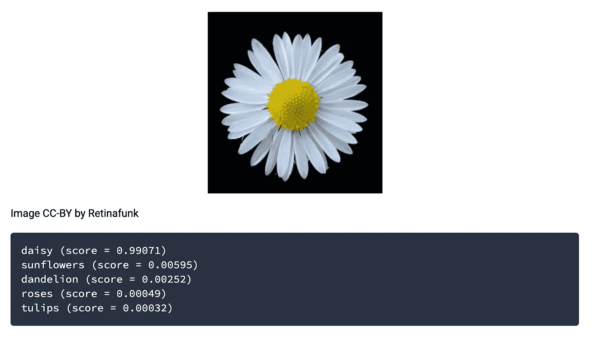
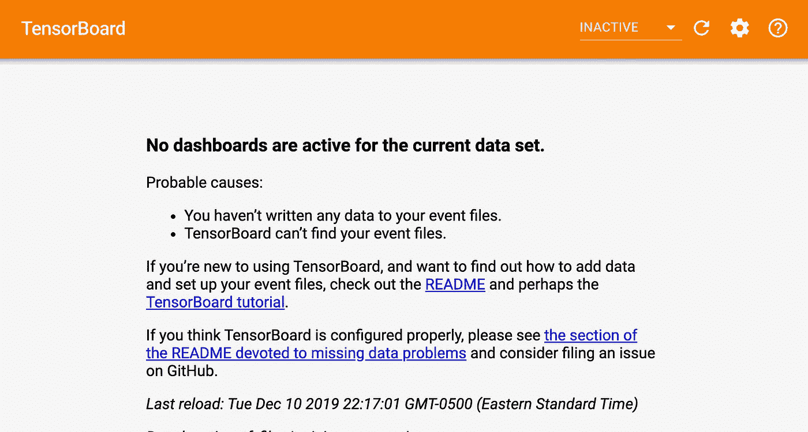
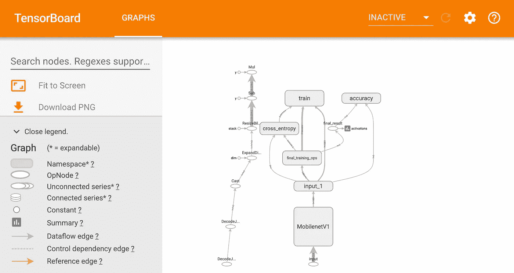

# 张量流:训练分类器🌺

> 原文：<https://medium.com/analytics-vidhya/tensorflow-train-a-classifier-4b4608988671?source=collection_archive---------28----------------------->

如果你一直关注我的博客，你会知道我的上一篇博客涵盖了机器学习的基础和类型。这篇博客将深入探讨机器学习，并通过一个具体的例子来说明如何在 TensorFlow 中制作自己的分类器。

## 概述:

监督学习依赖于分类器的构建和使用，分类器是一种将数据作为输入，并将标签作为输出的功能。

*   第一步:收集训练数据，用于构建分类器的一组已知输入和输出。同时，应该留出一些数据作为例子，以便稍后测试分类器的准确性。
*   第二步:训练分类器并测量其准确度。
*   第三步:用分类器预测其他数据。

我们将遵循 TensorFlow For Poets，以便开发一个可以对花进行分类的分类器。



最终目标

## 第一步:

当我最初开始编码时，我在加载训练数据时遇到了一个错误

AttributeError:模块“tensorflow”没有属性“app”。

为了避免这个错误，我把 tensorflow 的版本从 1.7 改成了 1.13，这样就成功了。

```
pip install --upgrade "tensorflow==1.13.*"
```

## 第二步:

可以使用下面的命令通过 github 访问实验室的代码。

```
git clone https://github.com/googlecodelabs/tensorflow-for-poets-2
```

## 第三步:

cd 复制到文件中，然后使用以下命令下载与实验相关的培训数据。

```
curl http://download.tensorflow.org/example_images/flower_photos.tgz \
    | tar xz -C tf_files
```

这是一个追随者(雏菊，蒲公英，玫瑰，向日葵，郁金香)的集合，将用于训练和测试分类器。

## 第四步:

```
IMAGE_SIZE=224
ARCHITECTURE="mobilenet_0.50_${IMAGE_SIZE}"
```

运行这两行代码，以便分别设置图像分辨率和大小。分辨率越高，分类器就越准确。

## 第五步:

您可以使用命令来监控训练进度

```
tensorboard --logdir tf_files/training_summaries &
```

要查看，请转到 localhost:6008。



训练前



训练后

通过跑步开始训练

```
python -m scripts.retrain \
  --bottleneck_dir=tf_files/bottlenecks \
  --model_dir=tf_files/models/"${ARCHITECTURE}" \
  --summaries_dir=tf_files/training_summaries/"${ARCHITECTURE}" \
  --output_graph=tf_files/retrained_graph.pb \
  --output_labels=tf_files/retrained_labels.txt \
  --architecture="${ARCHITECTURE}" \
  --image_dir=tf_files/flower_photos
```

这将贯穿所有 4000 次迭代。如果您希望运行得更少，这会影响准确性，您可以通过添加

```
--how_many_training_steps=numberOfSteps \
```

立即转到上面代码中的行—瓶颈目录=tf 文件/瓶颈。

## 第六步:

等等…

## 第七步:

测试你的分类器！！

供参考的我的分类器信息:

```
INFO:tensorflow:Final test accuracy = 90.3% (N=362)
```

测试最终目标图像的结果:

```
Evaluation time (1-image): 0.318sdaisy (score=0.99227)dandelion (score=0.00635)sunflowers (score=0.00135)roses (score=0.00003)tulips (score=0.00000)
```

# 资源