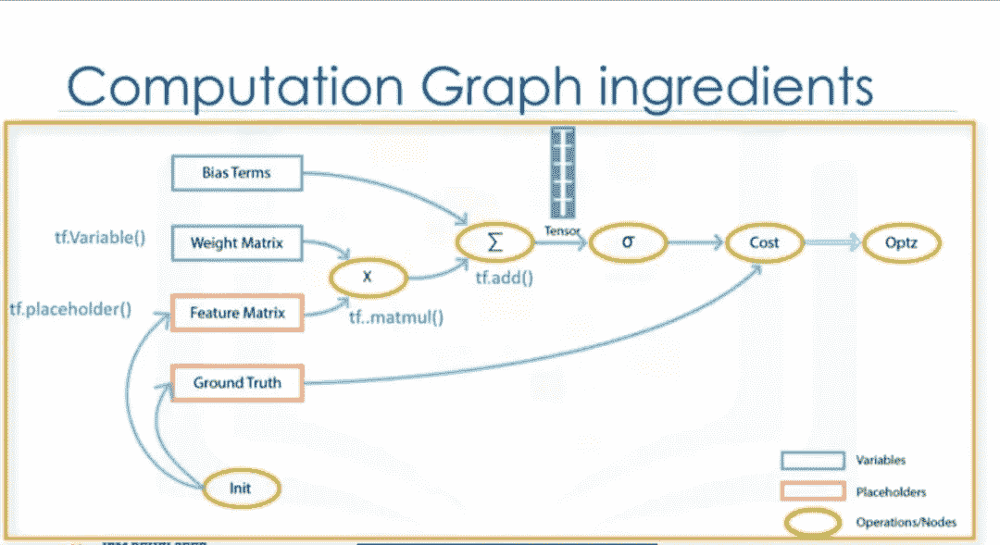
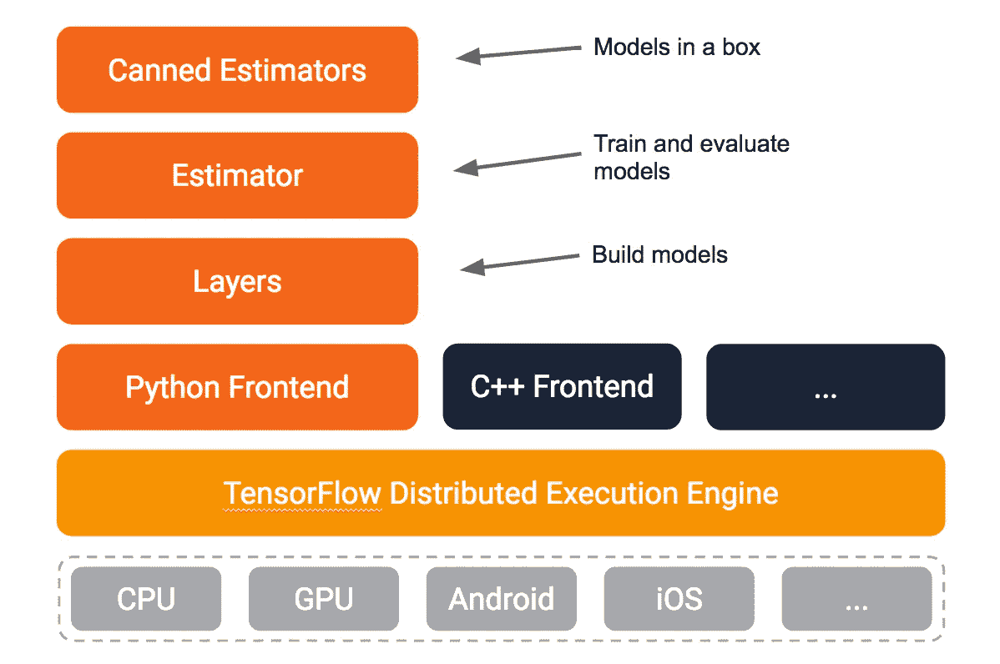

# 张量流教程:张量流初学者指南(第 1 部分)

> 原文：<https://medium.com/analytics-vidhya/tensorflow-tutorial-a-beginners-guide-to-tensorflow-part-1-e8aa7e940c2d?source=collection_archive---------9----------------------->

**什么是张量流？**

*   谷歌的开源软件库。
*   最初是为数字计算任务而创建的。
*   c/c++后端。
*   基于**数据流图**。
*   主要应用:深度神经网络。

**为什么是 tensorflow？**

*   Python 和 c++ API ( python API 更完整，一般也更容易使用。)
*   与其他深度学习库相比，它具有更快的编译时间。
*   它支持 CPU、GPU，甚至集群中的分布式处理。这是一个非常重要的功能，因为您可以使用 CPU 和多个 GPU 来训练神经网络，这使得模型在大规模系统上非常有效。

**什么是数据流图？**

TensorFlow 的结构基于数据流图的执行。

我们使用具有以下计算单元的图来创建图:

*   **节点**:表示一个数学运算。
*   **边**:表示多维数组，称为**张量**。

我们可以很容易地可视化图形的不同部分，这在使用其他 Python 库(如 Numpy 或 SciKit)时是不可行的。标准用法是首先构建一个图，然后在会话中执行它。

(来源:Tensorflow 网站)

**张量是什么意思？**

*   张量是一个多维数组。它可以是零维的，如标量值，一维的如线或向量，或二维的，如矩阵，等等。但是正如你所知道的，图像有颜色，为了增加关于颜色的信息，我们需要另一个维度，这就是三维张量变得特别有用的时候。
*   TensorFlow 程序使用一种称为张量的数据结构来表示所有数据。您计划用于模型的任何类型的数据都可以存储在张量中。简单来说，张量就是一个多维数组(0 维张量:标量，1 维张量:向量，2 维张量:矩阵，以此类推)。因此，张量流只是指计算图形中的张量流。

**图形**

关于 Tensorflow 最大的想法是所有的数值计算都被表示为一个计算图。换句话说，任何 Tensorflow 程序的主干都是一个**图**。在你的模型中发生的任何事情都由计算图来表示。现在，让我们看看数据流图，看看张量和运算是如何构建图的。如前所述，在数据流图中，节点被称为操作，代表计算单元。边是张量，表示操作消耗或产生的数据。

(来源:互联网)

在这个图中， ***特征矩阵是一个占位符*** 。占位符可以被视为模型中的“孔”，通过这些“孔”，您可以从图形外部传递数据。占位符允许我们在图形中创建操作，而不需要数据。当我们想要执行图形时，我们必须用输入数据填充占位符。这就是为什么我们需要在使用占位符之前初始化它们。

让我们看看另一个为我们的程序构建变量的操作。
在这个图中， ***权重矩阵是一个变量*** 。张量流变量用于共享和保存一些由程序操作的值。

请注意，当您定义占位符或变量时，TensorFlow 会向您的图形添加一个操作。在我们的图表中,“权重矩阵”和“特征
矩阵”应该使用乘法运算相乘。之后调用 Add 运算，将前面运算的结果加上 bias 项。***每次运算的输出都是一个张量*** *。*每一个操作的结果张量与下一个相交叉，直到可能得到期望结果的末端。在图中添加了所有这些操作之后，我们可以创建一个会话来运行图，并执行计算*。*

**tensor flow 的架构。**

(来源:互联网)

TensorFlow 附带了一个易于使用的 Python 接口来构建和执行您的计算图形。但是让 TensorFlow 今天如此受欢迎的是它的架构。TensorFlow 的灵活架构允许您在一个或多个 CPU 或 GPU 上，或者在台式机、服务器甚至移动设备上部署计算。这意味着您只需构建一次程序，就可以在不同的设备上轻松运行它。

**为什么要用 TensorFlow 进行深度学习？**

所以让我们简单回顾一下 TensorFlow 非常适合深度学习应用的原因。首先，TensorFlow 内置了对
深度学习和神经网络的支持，因此很容易组装网络、分配参数和运行训练过程。其次，它还有一组简单的、可训练的数学函数，对神经网络很有用。
最后，深度学习作为基于梯度的机器学习算法，将受益于 TensorFlow 的自动微分和优化器。

参考

*   [https://www.tensorflow.org/](https://www.tensorflow.org/)