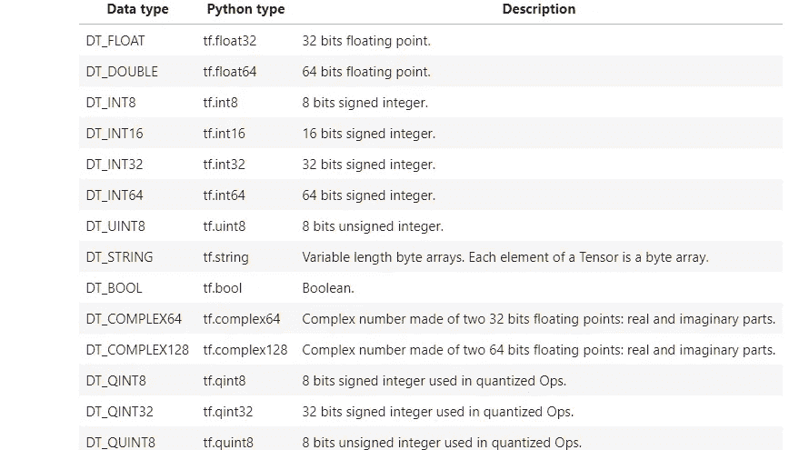

# 张量流教程:张量流初学者指南(第 2 部分)

> 原文：<https://medium.com/analytics-vidhya/tensorflow-tutorial-a-beginners-guide-to-tensorflow-part-2-5d1219a8ba5c?source=collection_archive---------9----------------------->

【TensorFlow 是如何工作的？

*   TensorFlow 将计算定义为图形，这些图形是通过运算(也称为“ops”)完成的。所以，当我们使用 TensorFlow 时，它与在图形中定义一系列操作是一样的。
*   要将这些操作作为计算来执行，我们必须将图形启动到会话中。该会话将图形中表示的操作转换并传递到您想要在其上执行这些操作的设备，无论是 GPU 还是 CPU。
*   例如，下图表示 TensorFlow 中的一个图形。 **W，x** 和 **b** 是这个图的边上的张量。 **MatMul** 是对张量 **W** 和 **x** 的运算，之后调用 **Add** ，将前一个运算符的结果与 **b** 相加。每个操作的合成张量与下一个操作交叉，直到可能得到想要的结果为止。


(图片来源:谷歌)

**导入张量流**

要使用 TensorFlow，我们需要导入库。我们导入它，并可选地给它命名为“tf”，这样模块就可以被 **tf 访问。**

```
import tensorflow as tf
```

## 构建图表

正如我们之前讨论的，TensorFlow 作为一个**图形计算模型**工作。让我们创建我们的第一个图表，命名为 **graph1** 。

```
graph1 = tf.Graph()
```

现在我们调用构造新的 **tf 的张量流函数。操作**和 **tf。张量**对象并将它们添加到**图 1** 中。如上所述，每个 **tf。操作**是一个**节点**和每个 **tf。张量**是图中的一条边。

让我们在图表中添加两个常数。例如，调用 tf.constant([2]，name = 'constant_a ')会添加一个 **tf。操作**到默认图形。该操作产生值 2，并返回一个 **tf。张量**表示常量的值。
**注意:** tf.constant([2]，name="constant_a ")创建一个新的 tf。名为“constant_a”的操作，并返回一个 tf。名为“常数 _a:0”的张量。

```
with graph1.as_default():
    a = tf.constant([2], name = 'constant_a')
    b = tf.constant([3], name = 'constant_b')
```

看看张量 a

```
a
```

正如你所看到的，它只是显示了图形中张量的名称，形状和类型。当我们在 TensorFlow 会话中运行它时，我们将看到它的价值。

```
# Printing the value of a
sess = tf.Session(graph = graph1)
result = sess.run(a)
print(result)
sess.close()
```

现在，让我们对这些张量进行运算。函数 **tf.add()** 添加两个张量(也可以使用`c = a + b`)。

```
with graph1.as_default():
    c = tf.add(a, b)
    #c = a + b is also a way to define the sum of the terms
```

然后 TensorFlow 需要初始化一个会话来运行我们的代码。在某种程度上，会话是在 TensorFlow 中创建图形的上下文。让我们来定义我们的会话:

```
sess = tf.Session(graph = graph1)
```

让我们运行该会话，以获得之前定义的“c”操作的结果:

```
result = sess.run(c)
print(result)
```

关闭会话以释放资源:

```
sess.close()
```

为了避免每次都必须关闭会话，我们可以在带有块的**中定义它们，这样在运行带有**块的**后，会话将自动关闭:**

```
with tf.Session(graph = graph1) as sess:
    result = sess.run(c)
    print(result)
```

甚至这个添加两个常数以达到简单结果的愚蠢例子也定义了张量流的基础。定义您的操作(在本例中是我们的常量和 *tf.add* )，并启动一个会话来构建一个图。

## 使用张量流定义多维数组

现在我们将尝试使用 TensorFlow 来定义这样的数组:

```
graph2 = tf.Graph()
with graph2.as_default():
    Scalar = tf.constant(2)
    Vector = tf.constant([5,6,2])
    Matrix = tf.constant([[1,2,3],[2,3,4],[3,4,5]])
    Tensor = tf.constant( [ [[1,2,3],[2,3,4],[3,4,5]] , [[4,5,6],[5,6,7],[6,7,8]] , [[7,8,9],[8,9,10],[9,10,11]] ] )
with tf.Session(graph = graph2) as sess:
    result = sess.run(Scalar)
    print ("Scalar (1 entry):\n %s \n" % result)
    result = sess.run(Vector)
    print ("Vector (3 entries) :\n %s \n" % result)
    result = sess.run(Matrix)
    print ("Matrix (3x3 entries):\n %s \n" % result)
    result = sess.run(Tensor)
    print ("Tensor (3x3x3 entries) :\n %s \n" % result)
```

tf.shape 返回我们的数据结构的形状。

```
Scalar.shape
Matrix.shape
Tensor.shape
```

现在，根据它们的结构类型，尝试使用一些以前的函数，看看它们的行为如何:

```
graph3 = tf.Graph()
with graph3.as_default():
    Matrix_one = tf.constant([[1,2,3],[2,3,4],[3,4,5]])
    Matrix_two = tf.constant([[2,2,2],[2,2,2],[2,2,2]])add_1_operation = tf.add(Matrix_one, Matrix_two)
    add_2_operation = Matrix_one + Matrix_twowith tf.Session(graph =graph3) as sess:
    result = sess.run(add_1_operation)
    print ("Defined using tensorflow function :")
    print(result)
    result = sess.run(add_2_operation)
    print ("Defined using normal expressions :")
    print(result)
```

利用常规符号定义和张量流函数，我们能够得到元素级乘法，也称为哈达玛乘积。但是如果我们想要正规的矩阵乘积呢？然后我们需要使用另一个名为 **tf.matmul():** 的张量流函数

```
graph4 = tf.Graph()
with graph4.as_default():
    Matrix_one = tf.constant([[2,3],[3,4]])
    Matrix_two = tf.constant([[2,3],[3,4]])mul_operation = tf.matmul(Matrix_one, Matrix_two)with tf.Session(graph = graph4) as sess:
    result = sess.run(mul_operation)
    print ("Defined using tensorflow function :")
    print(result)
```

我们也可以自己定义这个乘法，但是已经有一个函数可以做到这一点，所以没有必要重新发明轮子！

## 变量

现在我们更熟悉数据的结构，我们将看看 TensorFlow 如何处理变量。**首先，有张量，我们为什么需要变量？TensorFlow 变量用于共享和持久化一些由我们的程序操作的统计数据。也就是定义变量时，TensorFlow 加一个 **tf。操作**到你的图表。然后，该操作将存储一个可写的张量值，该值在 tf。会话.运行调用。因此，您可以通过每次运行来更新变量的值，而不能通过在一个会话中多次运行来更新张量(例如由 tf.constant()创建的张量)。**

**如何定义变量？**
我们使用命令 **tf 来定义变量。变量()**。为了能够在计算图形中使用变量，有必要在会话中运行图形之前初始化它们。这是通过运行**TF . global _ variables _ initializer()**来完成的。

要更新变量的值，我们只需运行一个赋值操作，为变量赋值:

```
v = tf.Variable(0)
```

让我们首先创建一个简单的计数器，一个每次增加一个单位的变量:

为此，我们使用**TF . assign(reference _ variable，value_to_update)** 命令。 **tf.assign** 接受两个参数，要更新的 **reference_variable** ，并将其赋值给 **value_to_update** it by。

```
update = tf.assign(v, v+1)
```

启动图形后，必须通过运行初始化操作来初始化变量。我们首先必须将初始化操作添加到图形中:

```
init_op = tf.global_variables_initializer()
```

然后，我们启动一个会话来运行图形，首先初始化变量，然后打印**状态**变量的初始值，然后运行更新**状态**变量的操作，并在每次更新后打印结果:

```
with tf.Session() as session:
    session.run(init_op)
    print(session.run(v))
    for _ in range(3):
        session.run(update)
        print(session.run(v))
```

## 占位符

现在我们知道了如何在张量流图中操作变量，但是如何在张量流图之外输入数据呢？

如果要从图形外部向张量流图形提供数据，需要使用占位符。

那么**这些占位符是什么，它们有什么作用？**

占位符可以被视为模型中的“洞”，您可以使用
**tf 来创建这些“洞”。placeholder( *数据类型* )** ，其中 ***数据类型*** 指定数据的类型(整数、浮点、字符串、布尔值)及其精度(8、16、32、64)位。

具有各自 python 语法的每种数据类型的定义如下:



所以我们在这里创建一个占位符:

```
a = tf.placeholder(tf.float32)
```

并定义一个简单乘法运算:

```
b = a * 2
```

现在我们需要定义和运行会话，但是由于我们在模型中创建了一个“洞”来传递数据，所以当我们初始化会话时，我们有义务传递一个带有数据的参数，否则我们会得到一个错误。

为了将数据传递到模型中，我们使用一个额外的参数 **feed_dict** 调用 session，在这个参数中，我们应该传递一个字典，每个占位符名称后面跟有它各自的数据，就像这样:

```
with tf.Session() as sess:
    result = sess.run(b,feed_dict={a:3.5})
    print (result)
```

由于 TensorFlow 中的数据是以多维数组的形式传递的，因此我们可以通过占位符传递任何类型的张量，以获得简单乘法运算的答案:

```
dictionary={a: [ [ [1,2,3],[4,5,6],[7,8,9],[10,11,12] ] , [ [13,14,15],[16,17,18],[19,20,21],[22,23,24] ] ] }with tf.Session() as sess:
    result = sess.run(b,feed_dict=dictionary)
    print (result)
```

运算是表示图上张量的数学运算的节点。这些操作可以是任何类型的函数，比如加减张量或者激活函数。

**tf.constant** ， **tf.matmul** ， **tf.add** ， **tf.nn.sigmoid** 是 TensorFlow 中的一些操作。这些类似于 python 中的函数，但是直接在张量上操作，每个函数做一件特定的事情。

```
graph5 = tf.Graph()
with graph5.as_default():
    a = tf.constant([5])
    b = tf.constant([2])
    c = tf.add(a,b)
    d = tf.subtract(a,b)with tf.Session(graph = graph5) as sess:
    result = sess.run(c)
    print ('c =: %s' % result)
    result = sess.run(d)
    print ('d =: %s' % result)
```

**tf.nn.sigmoid** 是一个激活函数，稍微复杂一点，但是这个函数帮助学习模型评估什么样的信息是好的还是不好的。

参考:

[http://Jr Meyer . github . io/tutorial/2016/02/01/tensor flow-tutorial . html](http://jrmeyer.github.io/tutorial/2016/02/01/TensorFlow-Tutorial.html)
https://www . tensor flow . org/versions/r 0.9/API _ docs/python/index . html
[https://www . tensor flow . org/versions/r 0.9/resources/dims _ types . html](https://www.tensorflow.org/api_docs/python/)
[https://en.wikipedia.org/wiki/Dimension](https://en.wikipedia.org/wiki/Dimension)