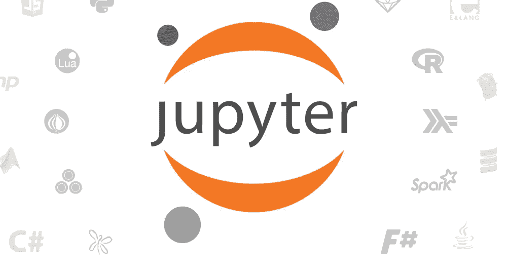

# tensor pi–移动中的机器学习！

> 原文：<https://medium.com/analytics-vidhya/tensorpi-machine-learning-on-the-go-dc1a54628c98?source=collection_archive---------19----------------------->

## 随时随地在你的 Pi 上进行机器学习。

> “未来的文盲不是那些不能读或写的人，而是那些不能学习、忘却和再学习的人”——阿尔文·托弗

> 如果你有自己的袖珍机器学习服务器，可以随身携带，在任何地方设置，或者从世界上任何地方访问，这不是很棒吗？
> 
> 这篇文章旨在教你这一点，所以继续读吧！

## 目录

1.  故事
2.  给 Pi 供电
3.  设置工具
4.  上网

## 背景故事…

我去年开始了我的数据科学和机器学习之旅，并一直使用我的 MacBook Pro 作为主要机器，但问题是，我的资源并没有全部用于模型训练之类的东西。

大多数资源都被我的浏览器和 Spotify 等其他程序占用了，所以我想为自己买一台服务器，专门用于我的机器学习需求。现在我有两个选择，要么获得云服务器，要么购买一台机器作为服务器。

这些选择的问题是:

1.  昂贵的
2.  我有云服务的安全和隐私问题
3.  不太方便携带

一天晚上，我正坐在桌旁，听到门铃响了。终于！我的新树莓 Pi 4 已经到了，在那一瞬间，我知道这个宝贝会去的地方。

## 给 Pi 上电

照片:Google.com

Raspberry Pi 是一台信用卡大小的计算机，具有 WiFi、千兆以太网和高达 8GB RAM 的包装能力，是满足我需求的完美解决方案。

公平的警告:我不处理非常大的数据集，所以 8GB 足以满足我的机器学习需求。

我喜欢使用更少的电缆和材料，所以我设置我的 Pi 无头，你可以按照我的无头设置指南[这里](/@arsalan.sahab/minimalist-raspberry-pi-headless-setup-7a75168c483b)。

一旦你完成了设置，就可以进入下一部分。

## 设置机器学习工具

既然无聊的事情已经过去了，让我们开始烹饪吧！

我的 goto 机器学习和深度学习框架是 Tensorflow，这是我们今天将使用的框架。

**先决条件:**

在安装 Tensorflow 之前，我们需要安装更多的软件包，请在您的终端中输入以下命令进行设置。

**虚拟环境设置**

> sudo 安装 virtualenv
> 
> cd 桌面
> 
> mkdir TensorPi
> 
> cd 张量积
> 
> 虚拟 python3 张量流
> 
> 源张量流/面元/激活

照片:jupyter.org

**安装库:**

> apt 安装 python 3-matplotlib python 3-scipy
> 
> pip3 安装—升级 pip
> 
> #重新启动您的 pi，然后再次激活您的 virtualenv
> 
> `sudo apt install libatlas-base-dev`
> 
> pip3 安装 numpy 熊猫
> 
> sudo pip3 安装 jupyter
> 
> #重新启动您的 pi，然后再次激活您的 virtualenv

您可以在激活 virtualenv 时，通过在终端发出以下命令来测试您的库和 jupyter。

> jupyter-笔记本

# 安装 Tensorflow 2.0

图片:tensorflow

要自己安装 Tensorflow，您可以遵循这个 [GitHub](https://github.com/PINTO0309/Tensorflow-bin/#usage:) 上的指南。

或者重新激活您的 virtualenv 并键入以下命令:

> sudo apt install-y libhdf 5-dev libc-ares-dev libe gen 3-dev gcc gfortran python-dev libgfortran 5 lib atlas 3-base lib atlas-base-dev libopenblas-dev libopenblas-base lib blas-dev liblapack-dev cy thon open MPI-bin libopenmpi-dev lib atlas-base-dev python 3-dev
> 
> sudo pip3 安装 keras _ applications = = 1 . 0 . 8-无 deps
> 
> sudo pip 3 install keras _ preprocessing = = 1 . 1 . 0—无 deps
> 
> sudo pip3 安装 h5py==2.9.0
> 
> sudo pip3 安装 pybind11
> 
> pip3 install -U —用户六轮模拟
> 
> sudo pip3 卸载 tensorflow
> 
> wget【https://github.com/lhelontra/tensorflow-on -arm/releases/download/v 2 . 0 . 0/tensor flow-2 . 0 . 0-cp37-none-Linux _ arm v7l . whl
> 
> sudo -H pip3 安装 tensor flow-2 . 0 . 0-cp37-none-Linux _ arm V7 l . whl

注意:我们已经安装了 Tensorflow 版本 2.0.0，因为其他版本会出现错误。

在这之后，你可以启动你的 jupyter 笔记本并检查。

> 导入张量流
> 
> 张量流。__ 版本 _ _

## 上线

如果你喜欢在家里使用 SSH 或 VNC 来使用你的 Pi，那么你就完成了。

但是，如果你像我一样是个旅行者，喜欢尽可能轻装旅行，那么你可以用我最近喜欢的工具 NGROK 把你的 pi 暴露在互联网上。

**安装 Ngrok**

照片:ngrok.com

要在您的 Pi 上安装 ngrok，您需要:

1.  转到 Ngrok >创建帐户>下载 Ngrok
2.  解压缩下载的文件
3.  光盘放入目录

使用>*安装 ngrok。/ngrok authtoken<your _ auth _ token>*

现在进入你的 TensorPi 目录，激活你的 virtualenv，启动你的 jupyter 笔记本。

之后，打开一个新的终端窗口，键入:。 */ngrok http 8888*

照片:ngrok.com

这将为您提供一个 URL，您可以使用它在互联网上的任何地方访问您的笔记本，而您的所有处理能力都由 Raspberry Pi 处理。

尽情享受吧！