# 定期存款开户决策/分类问题

> 原文：<https://medium.com/analytics-vidhya/term-deposit-opening-decision-f57776b88453?source=collection_archive---------1----------------------->

# 议程

资料组

*   数据集信息
*   属性信息

描述性分析

*   肉眼观察
*   相关

数据操作

*   空值缺失分析
*   编码分类变量
*   数据标准化

预测分析

*   抽样
*   分类模型和结果

摘要

# 数据集信息

*   该数据与一家葡萄牙银行机构的直接营销活动相关。营销活动以电话为基础。数据收集自[http://archive.ics.uci.edu/ml/datasets](http://archive.ics.uci.edu/ml/datasets)
*   数据集通常，需要同一个客户进行多次联系，以便了解产品(银行定期存款)是否认购(“是”)或不认购(“否”)。
*   分类的目标是预测客户是否会认购(是/否)定期存款(变量 y)。
*   名为 bank-additional-full.csv 的数据集有 41188 行和 20 个输入/列，按 2008 年 5 月至 2010 年 11 月的日期排序

# 属性信息

```
1 - Age (numeric)
2 - Job : type of job (categorical)
3 -Marital : marital status (categorical)
4 - Education (categorical)
5 - Default: has credit in default? (categorical)
6 - Housing: has housing loan? (categorical)
7 - Loan: has personal loan? (categorical)
```

## 与当前活动的最后一个联系人相关:

```
8 - Contact: contact communication type (categorical)
9 - Month: last contact month of year (categorical)
10 - Day_of_week: last contact day of the week (categorical)
11 - Duration: last contact duration, in seconds (numeric)
```

## 其他属性:

```
12 - Campaign: number of contacts performed during this campaign and for this client (numeric, includes last contact)
13 - Pdays: number of days that passed by after the client was last contacted from a previous campaign (numeric; 999 means client was not previously contacted)
14 - Previous: number of contacts performed before this campaign and for this client (numeric)
15 - Poutcome: outcome of the previous marketing campaign (categorical)
```

## 社会和经济背景属性

```
16 - Emp.var.rate: employment variation rate - quarterly indicator (numeric)
17 - Cons.price.idx: consumer price index - monthly indicator (numeric) 
18 - Cons.conf.idx: consumer confidence index - monthly indicator (numeric) 
19 - Euribor3m: euribor 3 month rate - daily indicator (numeric)
20 - Nr.employed: number of employees - quarterly indicator (numeric)
```

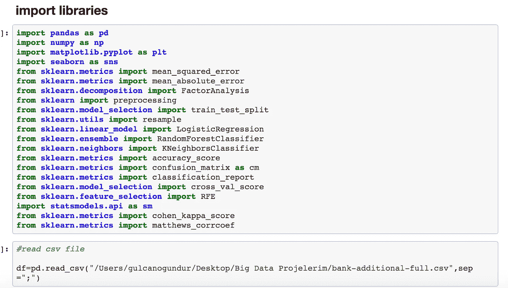

# 描述性分析

*   我们的数据集中有两种类型的变量。这些是连续变量和分类变量。

## 连续变量

*   ' age '，' duration '，' campaign '，' pdays '，' previous '，' emp.var.rate' 'cons.price.idx '，' cons.conf.idx '，' euribor3m '，' nr.employed '

## 分类变量

*   '工作'，'婚姻'，'教育'，'违约'，'住房'，'贷款'，'联系人'，'月份'，'星期几'，' poutcome '，' y '

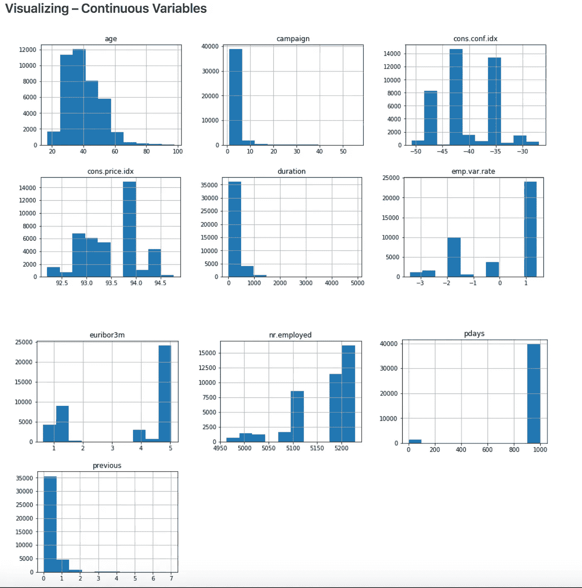

# 可视化——分类变量

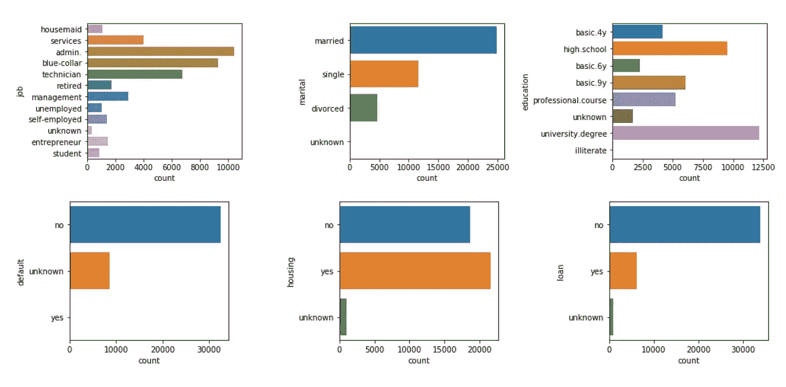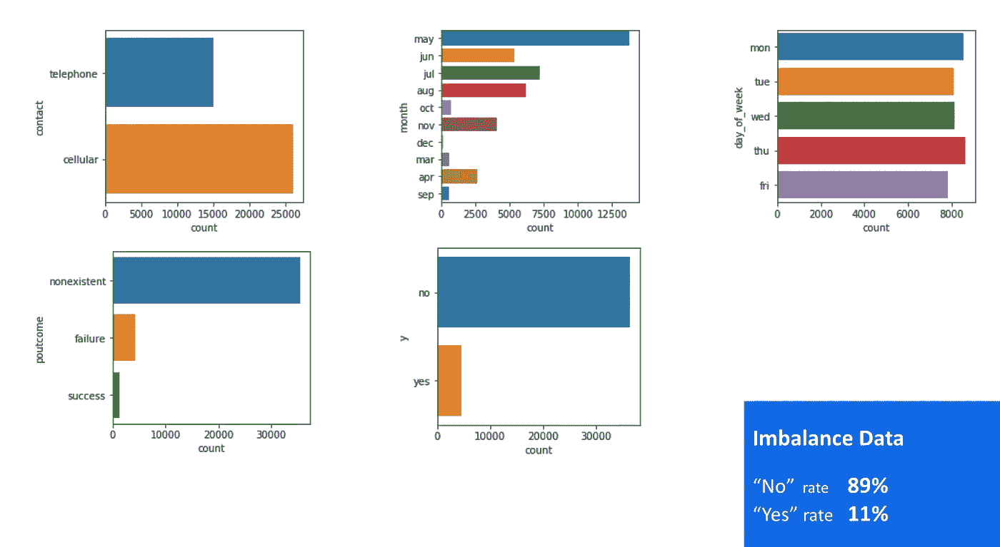

# 相关

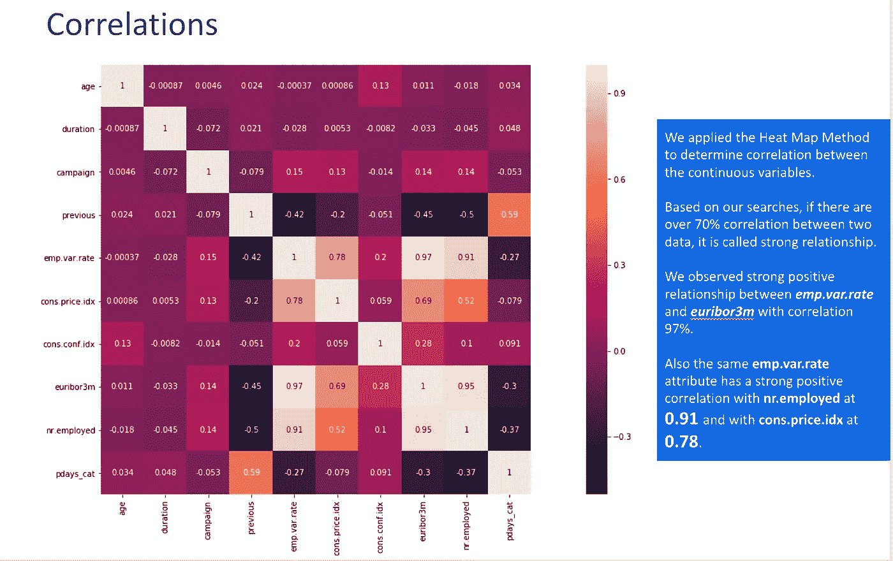

# 数据操作

*   根据热图方法，我们发现 4 个列之间有很高的相关性。这些列是 cons.price.idx、euribor3m、nr.employed、emp.var.rate。因此，我们应用了因子分析方法，创建了一个名为 X_factor 的新列。在这个过程之后，我们删除了这些列。

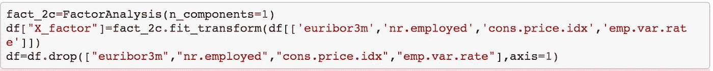

*   持续时间列/属性高度影响输出目标，我们也删除了持续时间列。因为在执行呼叫之前，持续时间是未知的。
*   我们有一个名为 pdays 的数字属性，表示从上一个活动中最后一次联系客户后经过的天数(此列中有 999 和其他数字值。999 表示之前没有联系过客户。我们将“pdays”列的数值转换为分类。如果值等于 999，我们放‘0’而不是‘999’，否则我们放 1。我们删除了常规的“pdays”列，并将列名设置为“pdays_cat”

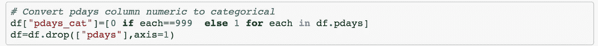

## 一键编码

我们使用 get dummies 函数对分类数据应用了一种热编码方法。一种热编码是将分类变量转换成具有 1 和 0 值的矩阵形式的过程。

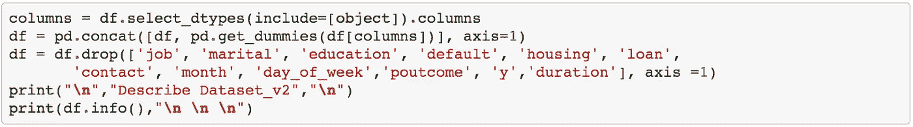

## 数据标准化

我们将我们的数值数据标准化作为数据准备。规范化的目标是更改数据集中数值列的值，以使用通用的比例，而不会扭曲值范围的差异或丢失信息。我们使用了 MinMaxScaler 函数。

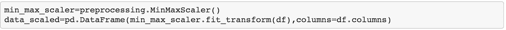

## 未知值

没有空值，但我们有未知的值。我们保留了未知的价值。因为这些信息在通话过程中是未知的。

## 测试训练数据分割

第一步是将数据一分为二，在 Python 上随机选择 80%的数据作为训练集，20%的数据作为测试集

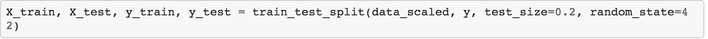

## 上采样

第二步是上采样以处理不平衡数据。我们意识到，在我们的数据集上，我们基本上没有结果。在上采样中，对于多数类中的每个观察值，我们从少数类中随机选择一个观察值进行替换。最终结果是来自少数和多数类的相同数量的观察值。

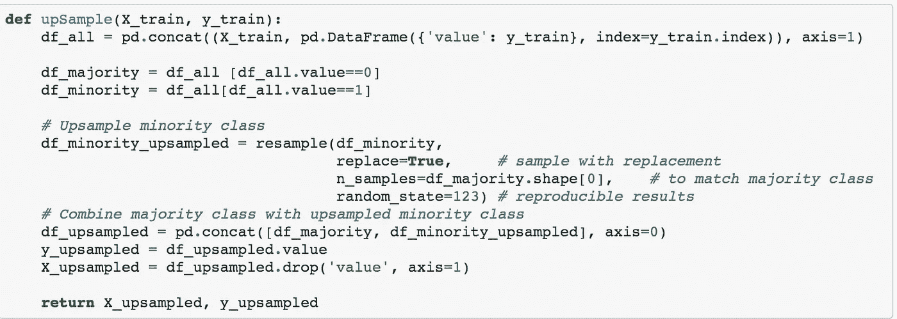

# 逻辑回归

我们应用了逻辑回归算法，这是解决所有分类问题最常用的算法。

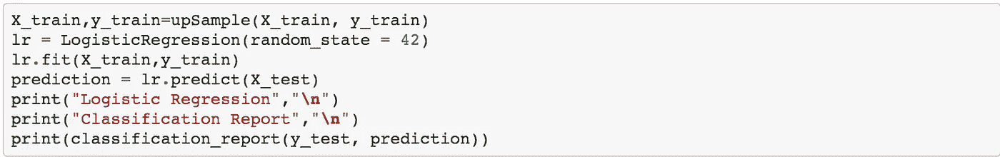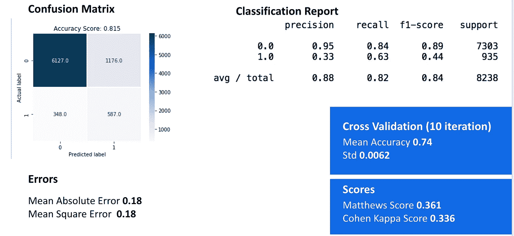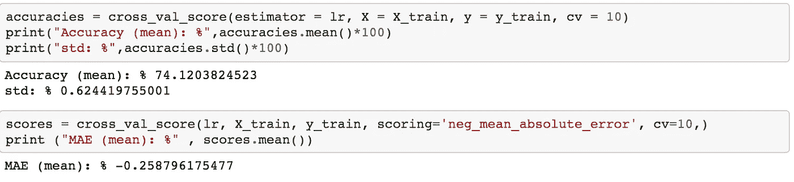

# k 个最近邻居

*   作为第二个算法，我们使用了 K 最近邻算法，这是广泛用于分类问题，因为容易解释输出，计算时间，预测能力

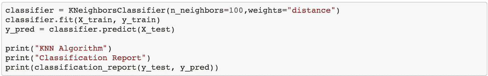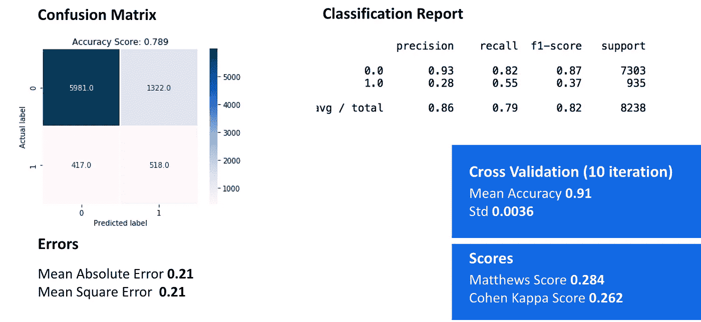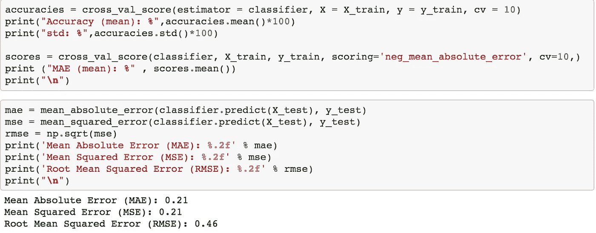

# 随机森林

*   我们应用随机森林作为第三种算法。RF 是最受欢迎的 ML 方法之一，因为它们具有相对较好的准确性、稳定性和易用性。

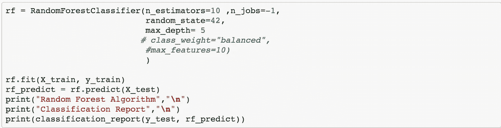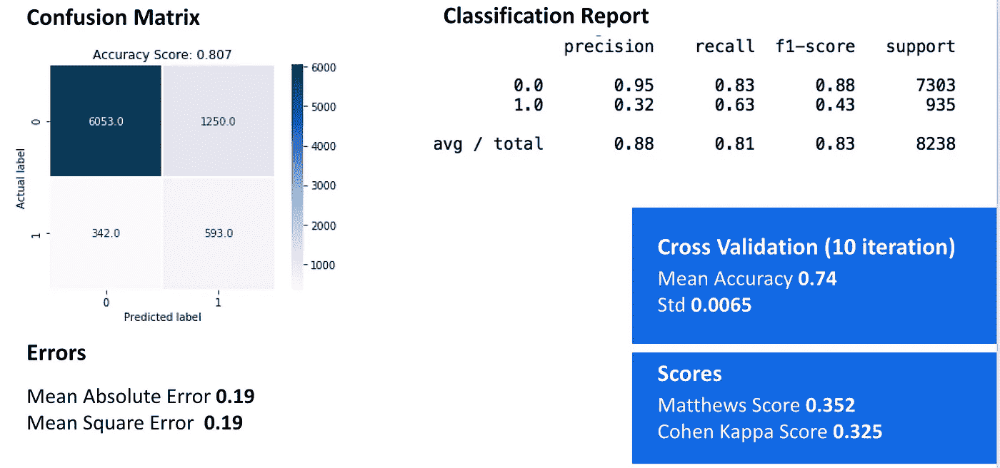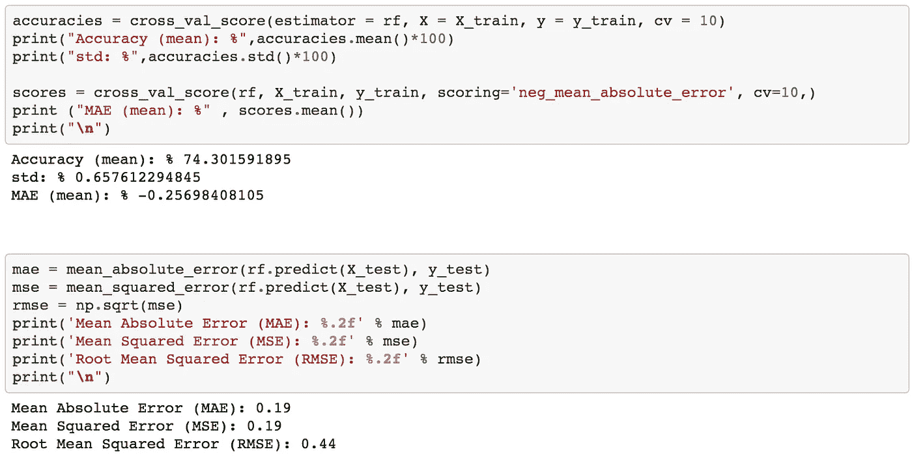

*   为了获得特征重要性分数，我们使用了 RandomForestClassifier 库的 feature_importances_ function。我们数据集最重要的特征是 X_factor。

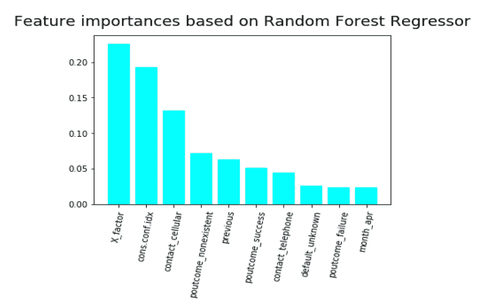

# 摘要

`In conclusion, Logistic Regression algorithm has better performance than other algorithms.`

```
Minimum MSE ( Predict target variable with minimal error )
Max Cohen Kappa Score (Controlling accuracy of  the model and compares an Observed Accuracy with an Expected Accuracy (random chance))
Max Matthew Score (quantifying the quality of predictions)
Max Accuracy (high accuracy predict the labeled values)
Max Precision (high accuracy of positive predictions)
Max Recall (high accuracy predict the target value)
```

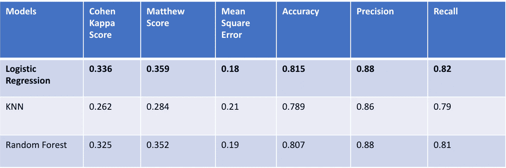

详情可以在[***Github***](https://github.com/gogundur/Classification)***上查看。***

编码快乐！