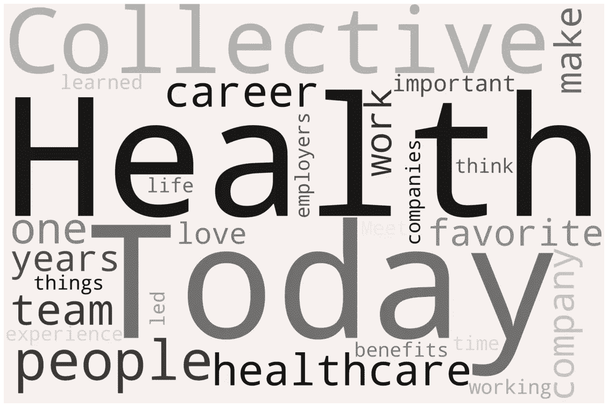

# 词频文本摘要

> 原文：<https://medium.com/analytics-vidhya/term-frequency-text-summarization-cc4e6381254c?source=collection_archive---------5----------------------->


## 通过 NLP 访问黑客:基础

最近，我正在为一系列面试做准备，这些面试都是为了获得旧金山医疗科技初创公司集体健康公司的一个职位。

他们在自己的博客上发表了一系列名为“与集体见面”的文章，其中包括对员工的广泛采访。我很想知道员工的共同主题是什么；他们为什么来中国？他们喜欢它的什么？那些员工的统一体验是什么？

不过，阅读一打冗长的采访并不是最有吸引力的提议。我决定实现一个非常简单的文本摘要方法，将采访缩减到最重要的部分；加权出现频率。简而言之，我们找到每个单词在文本中出现的频率，根据每个句子包含的单词的频率对每个句子进行加权，并只返回 *n* 个加权最高的句子。在本文中，我将带您经历这一过程。

## 进口

我们将使用[请求](https://requests.readthedocs.io/en/master/#)从[博客](https://blog.collectivehealth.com/@CollectiveHealth)中获取我们想要的信息； [BeautifulSoup](https://www.crummy.com/software/BeautifulSoup/) 和 [regex](https://docs.python.org/3/library/re.html) 清理文本； [NLTK](https://www.nltk.org/) 处理文本； [WordCloud](https://github.com/amueller/word_cloud) 和 [MatPlotLib](https://matplotlib.org/) 进行可视化；和 [heapq](https://docs.python.org/3.0/library/heapq.html) 来帮助解析我们的 NLTK 结果。

因为这里的重点是 NLP，而不是 web 抓取，我们将重复我已经收集的一些链接；《遇见集体》文章集。

## 预处理

对于每个链接:

*   我们使用 BeautifulSoup，并请求从网页中只提取采访的实际文本(包含在某一层 HTML

    标签中)。

*   我们使用正则表达式来修复和统一一些错误的标点符号；这有助于防止后面的句子互相渗透。
*   我们将该链接中的文本添加到我们的文本列表中。

最后，我们将文章文本列表合并成一个文本体。

# NLP！

既然我们的文集准备好了，我们可以认真开始了。

## 符号化

这里我们使用 NLTK 以两种不同的方式对文本进行标记化；用词，用句子。

## 加权频率

NLTK 允许我们用`nltk.FreqDist()`轻松统计每个单词在我们的文本中出现的次数；通过将给定单词出现的次数除以文本中单词的总数，我们可以找到每个单词出现的加权频率。

# 评分和总结

这才是奇迹真正发生的地方！
对于每个句子:

*   只考虑少于 30 个单词的句子(我们在总结，要简洁！);
*   把句子中的每个单词都标记出来；
*   合计句子中每个标记化单词的加权频率。

一旦完成，我们将使用`heapq`来找出得分最高的句子。在这种情况下，前 14 个得分最高的句子恰好是 CH 在每次“集体会面”采访中提出的问题，因此我们将选出前 29 个句子；常见问题，以及十五句话的采访总结。

# 成功！

我们现在可以看到我们学到了什么；具体来说，我们可以看到 CH 在每个员工面试中都问了什么问题，以及这些员工倾向于说什么的摘要。我把两者都选在下面；全部结果都在我的[笔记本这里](https://github.com/austiezr/CollectiveHealth_NLP/blob/master/CH_NLP.ipynb)里。

## 问题

```
As a kid, what did you want to be when you grew up and how does that inform what you do today.

What’s one of the most important lessons you’ve learned in your career.

What happened in your career that led you to Collective Health.

How would you explain what you do to a 5-year-old.

What excites you most about where Collective Health is going.
```

## 摘要

```
Employees’ minds tend to go to the perks of a company, but culture shows up in the minutiae of the day to day.

The fact that we can’t live up to that is pretty sad, so I love the idea of working for a company that’s going to make it better.

Coming from one of the most valued and impactful companies in the world, I wanted to work on something that I felt was destined to make a mark.

Some of the things that attracted me were the people I met during my interview process and the mission of the company.

I think it’s really important to get into the practice of taking time for yourself so that you can bring your best self to work and do great work.
```

# 额外收获:可视化！

这是我们的词频的一个快速、简洁的小可视化。

我们使用 NLTK 来帮助过滤我们的单词并找到频率，使用`heapq`来提取 40 个最常用的单词；这些被输入到 WordCloud 来生成我们的图片。

这给了我们…



这种形象化，加上我们的总结，让我们快速而有价值地了解集体健康的员工对公司的看法，以及是什么让他们来到这里；人员、文化、使命和影响。

感谢阅读！如果你想进一步探索我的工作，这个项目的笔记本可以在[这里](https://github.com/austiezr/CollectiveHealth_NLP/blob/master/CH_NLP.ipynb)找到，我的 GitHub 是[这里](https://github.com/austiezr)。