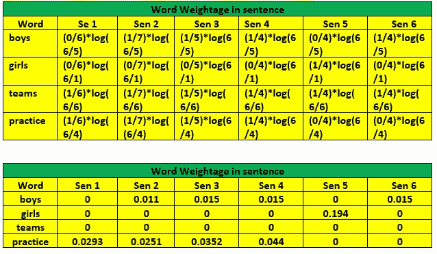

# 术语频率(TF)和反向文档频率(IDF)

> 原文：<https://medium.com/analytics-vidhya/term-frequency-tf-and-inverse-document-frequency-idf-d3a31a5e92ea?source=collection_archive---------7----------------------->

[https://pix abay . com/illustrations/word cloud-tag cloud-cloud-text-tag-679949/](https://pixabay.com/illustrations/wordcloud-tagcloud-cloud-text-tag-679949/)

术语频率(TF)和逆向文档频率(IDF)是自然语言处理技术中常见的两个术语。它用于查找单词的出现次数及其作用或影响，或者我们可以说在文档的任何给定句子中的重要性。这种技术更常用于情感分类。当机器知道一个词的意义时，从给定的词中检索情感形式的信息更容易。从任何给定的句子中传达的正面和负面信息的分类通常由上述技术处理。为了更好地理解这个概念，我们将遵循几个步骤。

假设给我们一个下面给出的巨大文档，它有许多句子，并且想要执行文本分类，并且使用 TF 和 IDF 技术推断通过下面的句子传达的情感或消息是什么。

## **今天早上，各队开始了他们的练习。男孩卡巴迪队已经经历了一轮练习。男子足球队已经开始训练了。男子板球队一直在练习。女子排球队准备好了。男子接力赛跑队上场了。**

***第一步:将句子转换成单词包***

[https://www . 123 RF . com/photo _ 18625412 _ shopping-words-shape-of-shopping-bag . html](https://www.123rf.com/photo_18625412_shopping-words-shape-of-shopping-bag.html)

这是一个去除表示代词的停用词(例如，is，are，them，them 等)或对句子意思分类没有帮助的词的过程。我们要做的下一件事是对给定的单词执行词干操作，这意味着将单词(名词、动词、形容词形式的)转换为它们的基本或词根形式。例如，考虑单词 training 被转换成 train 动词，这是基本形式。现在，在执行上述清理过程之后剩余的所有这些单词集被收集在一个表示单词包的列表中。

Bag_of_words=['team '，' boys '，' girls '，' training '，' kabaddi '，' football '，' cricket '，'排球'，' practice '，' round '，' relay '，' race '，' session '，' today '，' begin '，' go '，' 1 '，' start '，'预备'，]

***第二步:选择高频词***

在上面给定的单词包中，我们选取了出现频率最高的前 4 个单词，并在表格中将其分离出来。

***第三步:计算词频***

术语频率被定义为任何特定单词在任何给定句子中的总频率。术语频率的公式定义如下:

我们知道，上面用黄色突出显示的是我们创建的文档，它在所有 5 个句子中都有总计，我们计算了每个句子中出现频率最高的 4 个高频词。

发送 1:今天早上各队开始练习。

派 2:男生卡巴迪队围棋 1 轮练习。

发送 3:男子足球队开始练习。

发送 4:男孩板球队的做法。

发 5:女子排球队准备好了。

森 6:男生接力赛队。

***第四步:计算逆文档频率***

IDF 为我们提供了文档中所有给定句子中任何特定单词出现的度量。

***第五步:计算单词在句子中的权重***

在这一步中，我们通过评估句子中每个词的词频与该词的总 IDF 的乘积来评估句子中每个词的影响。

从上表我们可以得出以下结论。

练习这个词越来越重，表明学校正在努力练习。

男生队正在为比赛做准备

男生队正在为比赛做准备

男生队正在为比赛练习

女队正在为比赛进行练习

**句子 6 :** 男生队在为比赛努力练习。

并且通过计算整个文档中每个单词的总权重，可以观察到单词 boy 与其他单词相比具有更大的权重。因此，我们可以得出结论，该学院更注重鼓励男生在即将到来的比赛中竞争。

这样，TF 和 IDF 帮助我们识别单词在单个句子中的作用。此外，我们还可以从给定的文档中识别出学院更关注哪个领域。

希望这个例子能帮助你更好地理解事情！！

感谢阅读:)