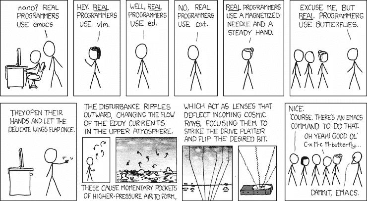
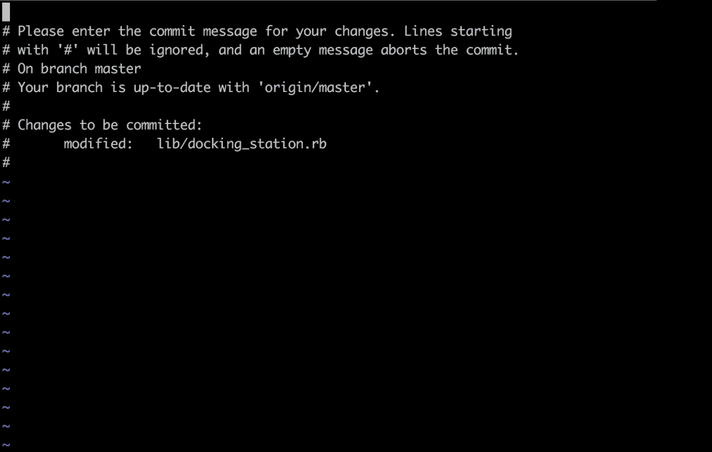
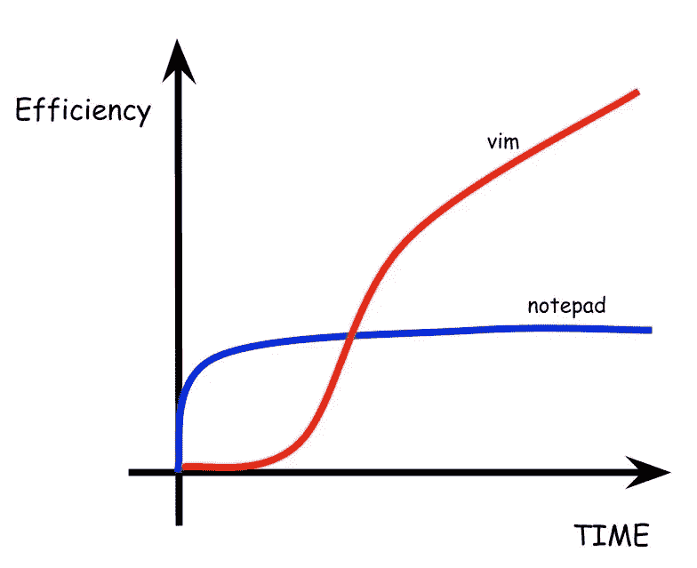
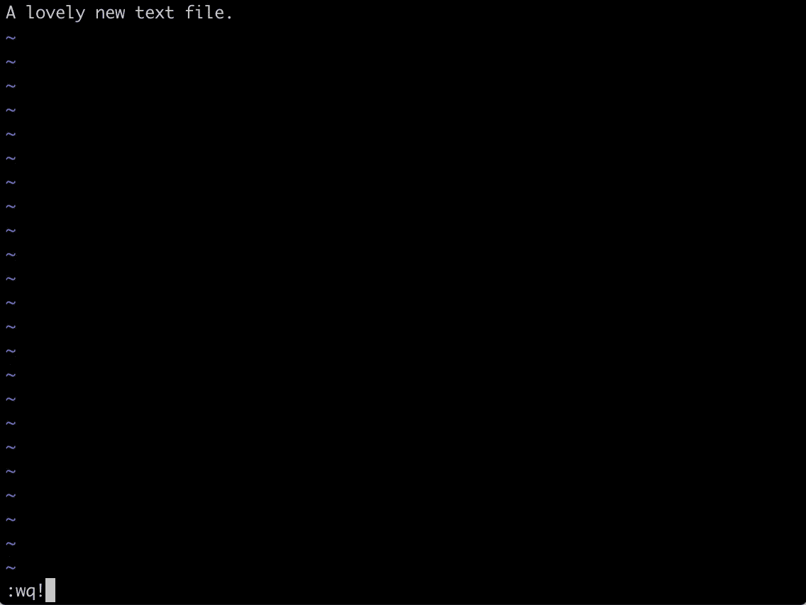
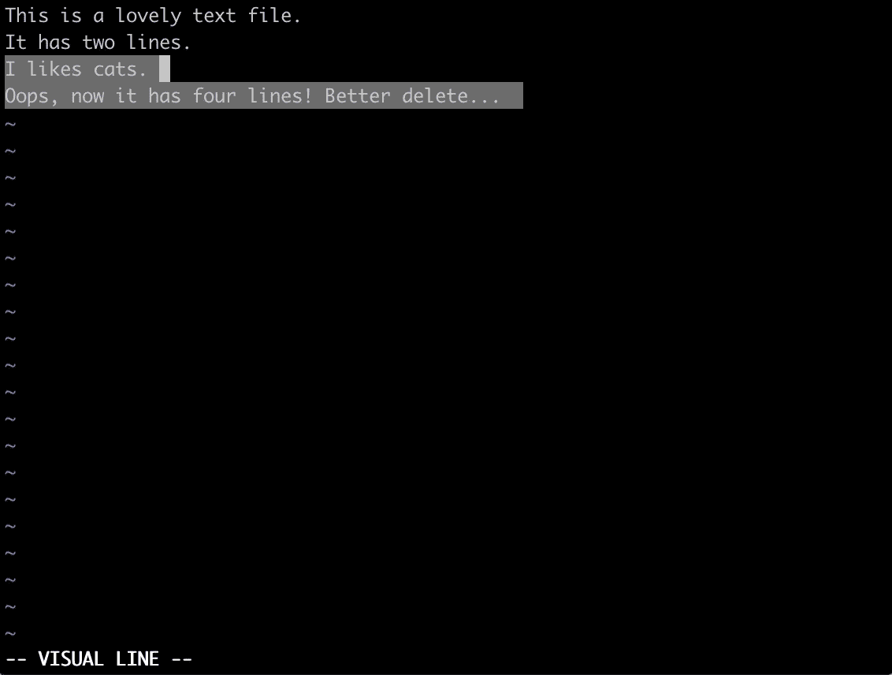
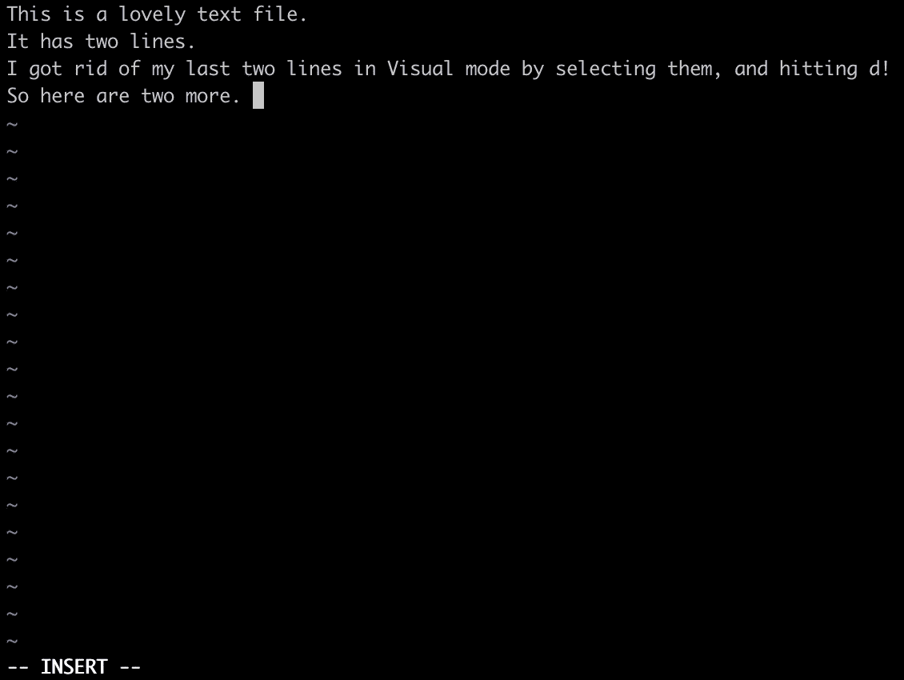

# 基于终端的文本编辑器:

> 原文：<https://medium.com/analytics-vidhya/terminal-based-text-editing-5fe946efdca0?source=collection_archive---------7----------------------->

## 给你的工作效率增加一点活力。

相关 xkcd:)

我们都去过那里。你正准备为你最新的颠覆行业的应用“ *CatPicGenerator_2.0* ”提交一个功能更新，这时你发现自己处于一个陌生而令人迷惑的地方…

在您的兴奋中，您设法键入了" *git commit"* ，而没有附加标志和消息。这很好…我们都会犯错，对吗？好吧，git 没有你的程序员同事那么宽容，所以它把你提升到上面的环境中，强迫你改正错误。问题是，你完全不知道下一步该做什么。

首先，你按下 *q* …嗯。没有。

然后，你疯狂地打 *Esc* ， *Enter，ctrl-alt-delete，q q q q q q q QQQQQ！！1!！！！！1*

最后，你把脸贴在键盘上，关闭终端，小心翼翼地折叠屏幕，把笔记本电脑扔出窗外，彻底沮丧地睁大眼睛，目光呆滞。

但是不需要这样啊！您只是被介绍了一个基于终端的文本编辑器，名为 **Vim** ，虽然学习曲线很陡，但它可以是一个高效、强大的工具供您使用。让我们来看看。

# 为什么使用 Vim？

我自己对基于文本的编辑器(以及一般的编程)的介绍发生在学术环境中，那时我还是一名计算科学家。我周围经验丰富的物理学家对 VS 代码、原子、RubyMine 或 PyCharm 一无所知。对他们来说，选择很简单:用 Vi/Vim 或 EMACS 编写一些可爱的 Fortran95 或 shell 脚本，用 Latex 编写文档。

有些武断地，我决定选择 Vim 作为我的文本编辑器。然而，有许多人做出了更理性的决定。他们认为，虽然学习曲线很陡，但在 Vim 等基于终端的编辑器中获得良好的掌握程度，可以大大提高基于 GUI 的编辑器的生产率。

首先，它强迫你只使用键盘，这意味着不要停下来移动鼠标/触控板，点击屏幕，拖动，高亮显示，放下，删除…所有这些操作都可以通过按键完成，无论是通过预先存在的键盘快捷键，还是您自己在*中定义的快捷键。vimrc* 文件。Vim 的核心理念之一是，我们花在编辑文本上的时间比写新文本的时间要多，所以它是为了实现快速的文档编辑而构建的，让您的工作流程在这个过程中不被打断。

也是无处不在。它在 Linux、Mac 和 Windows 上都是标准的，并且经常是默认的编辑器，比如本文开头提到的 Github 崩溃。事实上，如果您花大量时间在 SSH 的终端会话上，这是唯一可用的编辑器，就像我曾经在与 HPC 集群交互时所做的那样。

但是这立即引出了一个问题——如果它如此高效，如此普遍……为什么没有更多的开发人员使用它？例如，我们经常听到 VS Code 或 Atom，但很少听到 Vim。

答案是，像许多强大的工具一样，它有一个陡峭的学习曲线，直到你爬上它，它起初会感到尴尬和不直观。

典型的 Vi/Vim 学习曲线。

# 入门指南

为了保持连续性，让我们回到最初的 Github 场景，研究一下我们如何能够设法完成我们的提交，或者简单地退出 Vim，而没有任何头痛或笔记本电脑折腾。

Vim 支持多种模式，但是有三种模式是最常见的；**命令模式**、**插入模式**和**视觉模式**。

# 命令模式

命令行以冒号开头。

我们可以通过点击 *Esc* 来访问命令行。在这里，我们可以通过在冒号后键入短命令并按 enter 来执行操作。比如我们可以用 *w 保存，*用 *q* 退出，或者用 *wq* 保存并退出。我们甚至可以使用 *q 强制退出而不保存！*。

但是我们能做的远不止这些。使用*:vsplit/path-to-doc/doc*将在 splitscreen 模式下打开一个新文档，以便参考。复制、粘贴和删除分别是 *y* 、 *p* 和 *d* ，我们可以使用 *yy* 或 *dd* 将其应用于一整行，或者，实际上，通过在 *yy* 或 *dd* 前面加上相关的数字，可以应用于任意数量的行(例如 *5yy* 复制 5 行)。

# 视觉模式

视觉模式对于识别我们想要在文档中操作的文本非常有用。我们可以使用 *v* (小写)启动基于字符的选择，通过 *V* (大写)选择整行，使用 *Ctrl+v* **选择整个块。**

选择的字符/行/块可以用任何其他 Vim 编辑命令删除、复制或修改。

视觉模式，用于选择字符、线条和块。

# 插入模式

这一个是相当自明的。插入模式是我们实际将内容插入到文档中的模式。我们通过点击 *Esc* 然后点击 *i* 来访问它。

插入模式！不需要解释:)

那么，考虑到以上所有问题，我们该如何应对 Github 的崩溃呢？嗯，我们可以:

1.  通过进入插入模式( *Esc* 后跟 *i* )并添加我们的标志和消息来完成我们的提交，或者；
2.  进入命令模式( *Esc* 后跟一个分号)并按 *q 退出 Vim！。*

看到了吗？你的理智和你的笔记本电脑已经被拯救了，我们仅仅触及了 Vim 的表面。如果你有 30 分钟的空闲时间，在你的终端上输入 *Vimtutor* 并跟着做。你可以以后再感谢我…是的，我接受现金，谢谢你的邀请。

玩得开心！