# Terraform 基础知识和使用 Terraform 启动 Ec2 实例

> 原文：<https://medium.com/analytics-vidhya/terraform-basics-and-launching-an-ec2-instances-using-terraform-7c9fe0a60421?source=collection_archive---------7----------------------->

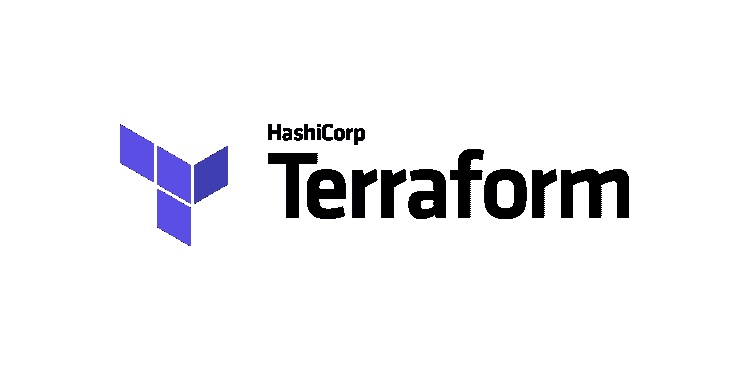

# 什么是地形？

T erraform 是一种安全高效地构建、更改和版本化基础架构的工具。配置文件向 Terraform 描述了运行单个应用程序或整个数据中心所需的组件。Terraform 生成一个执行计划，描述它将如何达到期望的状态，然后执行它来构建所描述的基础设施。随着配置的改变，Terraform 能够确定改变了什么，并创建可应用的增量执行计划。

# 安装:

您可以在 [**地形图**](https://learn.hashicorp.com/tutorials/terraform/install-cli) 的官网上，通过简单的方式下载地形图。

*   对于 Ubuntu

```
1\. sudo yum install -y yum-utils
2\. sudo yum-config-manager --add-repo    [https://rpm.releases.hashicorp.com/RHEL/hashicorp.repo](https://rpm.releases.hashicorp.com/RHEL/hashicorp.repo)
3\. sudo yum -y install terraform
```

# 验证安装:

键入 terraform-帮助检查 terra form 是否正确安装

```
$ terraform -help
Usage: terraform [-version] [-help] <command> [args]

The available commands for execution are listed below.
The most common, useful commands are shown first, followed by
less common or more advanced commands. If you're just getting
started with Terraform, stick with the common commands. For the
other commands, please read the help and docs before usage.
##...
```

# 代码组织

*   Terraform 语言使用以`.tf`文件扩展名命名的配置文件。

# 评论

Terraform 语言支持三种不同的注释语法:

*   `[#](https://www.terraform.io/docs/configuration/index.html#)`以单行注释开始，在行尾结束。
*   `[/*](https://www.terraform.io/docs/configuration/index.html#-2)`和`*/`是可能跨越多行的注释的开始和结束分隔符。

# 地形认证

对云提供商的认证可以通过 3 种方式完成。例如，对于 aws:

*   通过像 aws configure 这样的命令行
*   aws 配置文件:~/。AWS/凭据，用于存储使用 aws config 命令时输入的身份验证信息
*   中指定 aws_access_key_id 和 aws_secret_access_key。tf 文件，但这不是推荐的方法。

```
provider "aws" {
        region  = "us-east-1"
        version = "~> 2.46"
        aws_access_key_id = ____________________________
        aws_secret_access_key = ________________________
}
```

# 初始化

`terraform init`命令用于初始化包含 Terraform 配置文件的工作目录。

# 了解变化

Terraform 通过检测当前的基础设施测试并计算已知状态和期望状态之间的差异来工作。

```
terraform plan
```

这将输出迁移计划，对于让其他人验证更改或验证没有不需要的更改尤其有用。

```
terraform apply
```

Terraform 应用迁移计划。您也可以指定要应用的计划，以确保审核和有效更改之间没有更改。

每次运行 Terraform 时，它都会在 *Terraform 状态文件*中记录它创建了什么基础设施的信息。该文件的名称为 **terraform.tfstate。**

```
This file contains a custom JSON format that records a mapping from the Terraform resources in your configuration files to the representation of those resources in the real world.
```

摧毁地形管理的基础设施，即移除我们使用的基础设施的所有资源

```
terraform destroy
```

# 变量

输入变量充当 Terraform 模块的参数，允许在不改变模块自己的源代码的情况下定制模块的各个方面，并允许在不同的配置之间共享模块。

例如，我们想在 aws 中创建 IAM 用户:创建一个名为“iam_user_name_prefix”的变量，类型为 string，值为“my_iam_user”。为了访问变量，我们使用下面的命令和 count 来指定我们想要创建的 IAM 用户的数量。

```
var.VARIABLE_NAME     #var.iam_user_name_prefix
```

如果我们想在 IAM 中创建多个用户，我们创建了一个 list 类型的变量“names”

输出值:输出值类似于 Terraform 模块的返回值

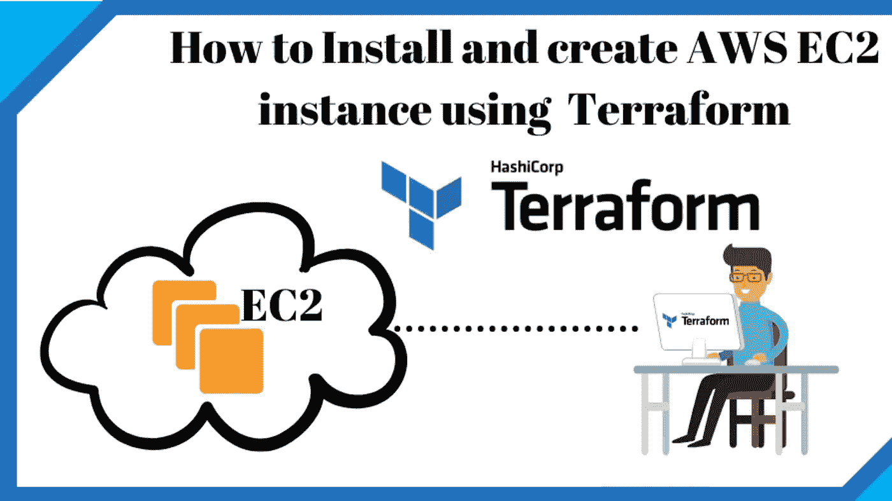

# 先决条件:

# AWS-cli 设置

1.  在 AWS 上创建一个帐户。
2.  转到**身份&访问管理** (IAM)，创建一个用户并生成一个访问密钥以在您的机器上配置 AWS。您需要向该 IAM 用户授予 AdministratorAccess 权限。
3.  打开命令行并配置 AWS

```
aws configure
```

4.提供您刚刚生成的**访问密钥**和**秘密**，以及您将要部署集群的区域。AWS 建议用户选择地理上靠近他们的地区，以减少延迟和成本。

对于那些正在使用 **AWS 教育初学者帐户。**进入 AWS 培训- >登录- > AWS 账户- > AWS 培训入门账户- >账户详情

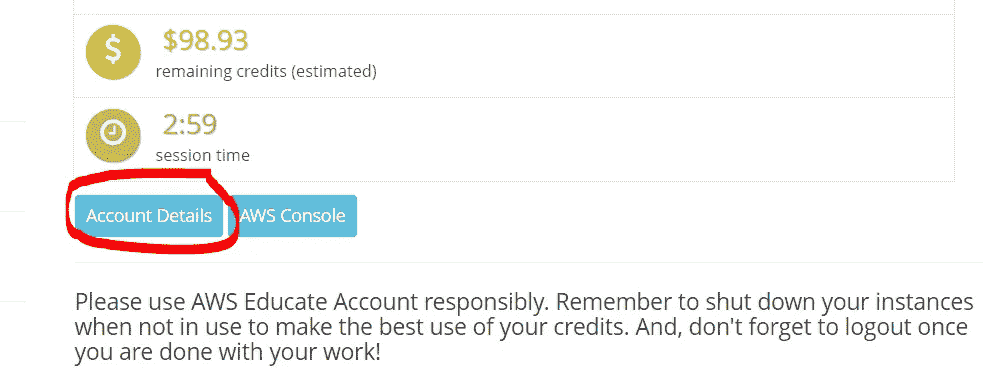

```
gedit ~/.aws/credentials
```

删除凭证文件的内容，并将以下内容粘贴到凭证文件上

# 所以现在让我们使用地形创建 S3 桶:

*   创建一个目录 S3-使用-地形导航并运行

```
mkdir S3-using-terraform
cd S3-using-terraform
terraform init
####create a file with .tf extension
```

我选择提供者“aws ”,并尝试创建名为“my-s3-bucket-sarthak-001”的 s3 存储桶，尝试使用输出值返回关于 S3 存储桶的所有信息

*   保存文件并在命令行中执行以下命令

```
terraform apply
```

*   成功执行命令后，您将看到一个名为“my-s3-bucket-sarthak-001”的 S3 铲斗

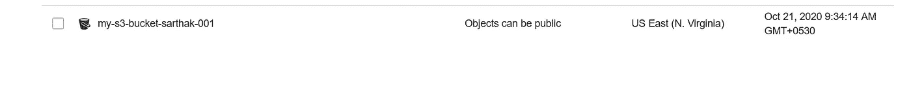

*   记得在执行后销毁资源

```
terraform destroy
```

# 使用 Terraform 创建 IAM 用户:

*   创建一个目录 IAM-using-terraform 在其中导航并运行

```
mkdir IAM-using-terraform
cd IAM-using-terraform
terraform init
####create a file with .tf extension
```

我选择提供者“aws ”,并尝试创建名为“my-s3-bucket-sarthak-001”的 IAM，尝试使用输出值返回关于 s3 存储桶的所有信息

*   保存文件并在命令行中执行以下命令

```
terraform apply
```

*   成功执行命令后，您将看到一个名为“my-iam-user-sarthak”的 IAM 用户

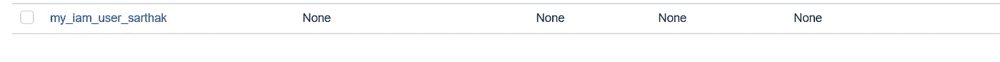

*   记得在执行后销毁资源

```
terraform destroy
```

# 现在让我们使用 Terraform 创建 EC2 实例:

在之前的[帖子](/analytics-vidhya/launching-ec2-instance-using-cli-and-attaching-ebs-volume-6ce00456e55d?source=friends_link&sk=2f35d4841272ded769b75bb5164e2b49)中，我使用 CLI 启动了 EC2 实例，并将 EBS 卷附加到它上面。

链接:[https://medium . com/analytics-vid hya/launching-ec2-instance-using-CLI-and-attaching-EBS-volume-6ce 00456 e55d？source = friends _ link&sk = 2f 35d 4841272 ded 769 b 75 bb 5164 e2b 49](/analytics-vidhya/launching-ec2-instance-using-cli-and-attaching-ebs-volume-6ce00456e55d?source=friends_link&sk=2f35d4841272ded769b75bb5164e2b49)

# 创建密钥对

由私钥和公钥组成的密钥对是一组安全凭据，用于在连接到实例时证明您的身份。Amazon EC2 存储公钥，您存储私钥。

*   您可以使用以下命令查看所有现有密钥对:

```
aws ec2 describe-key-pairs --region us-east-1
```

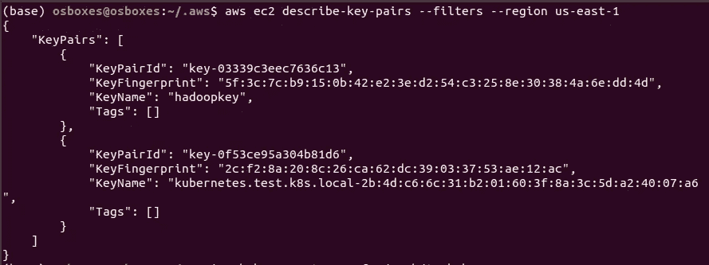

在 EC2 部分导航到创建密钥对，点击**创建密钥对**

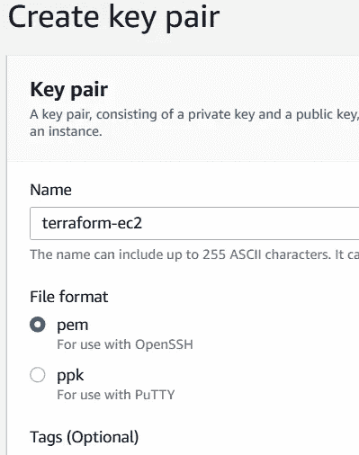

这将创建一个新的密钥对并保存它，因为我们将在以后加载它以提供身份验证

```
mkdir ~/aws
mkdir ~/aws/aws_keys
mv terraform-ec2.pem ~/aws/aws_keys
```

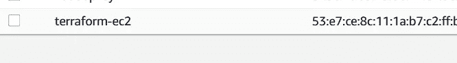

1.  我已经创建了 variables.tf 文件，其中包含所有已初始化的变量。它基本上加载了路径。pem 文件已找到。在我的例子中，它在~/AWS/AWS _ keys/terra form-ec2 . PEM 中

2.我已经创建了 data-providers.tf 文件，其中存储了以下信息:

*   VPC 默认信息
*   AMI Linux 2 映像的 Id

3.我创建了 main.tf 来存储以下信息:

*   提供商 ie aws 和地区
*   名为“http _ server _ SG”ie 安全组创建了一个入口和出口规则
*   实例详细信息
*   将加载密钥对的连接
*   当实例加载时，我们希望执行什么命令。在我的例子中，我想启动一个 httpd 服务器

4.output.tf 文件将在命令行上打印实例详细信息

5.最后执行命令

```
terraform apply
```

6.转到 EC2 实例，您将看到一个正在运行的实例和创建的安全组

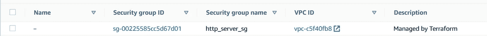

安全组已创建

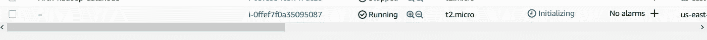

实例加速旋转

7.点击提供的网址并在浏览器中打开它，你将得到你想要的 ec2 HTTPS 服务器

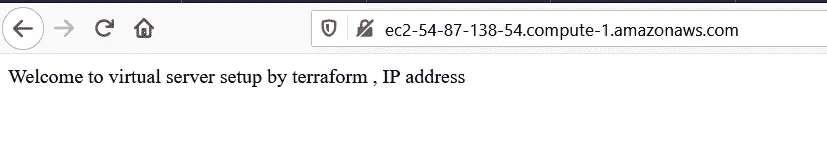

8.最后运行下面的命令，以防止不必要的计费和破坏资源。

```
terraform destroy
```