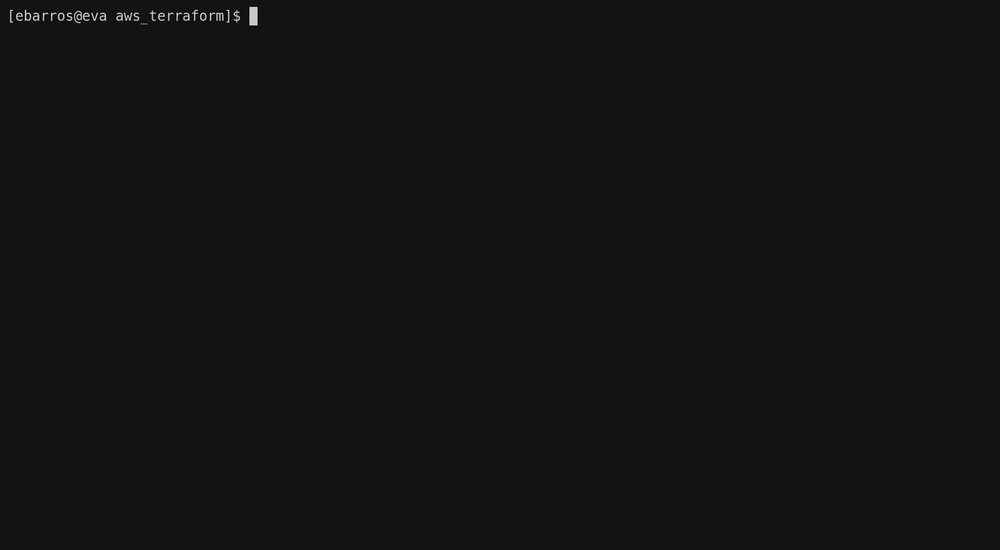
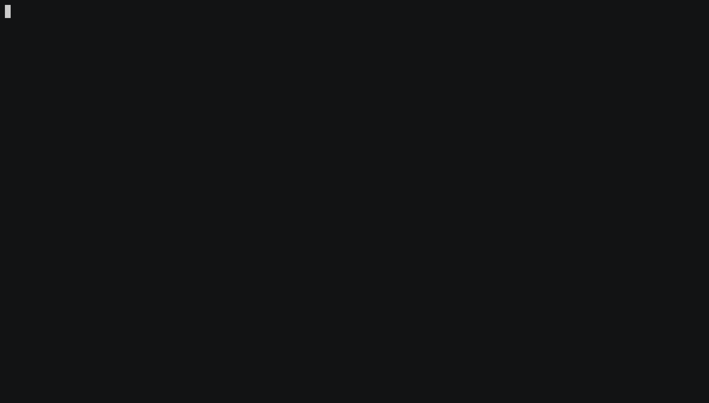
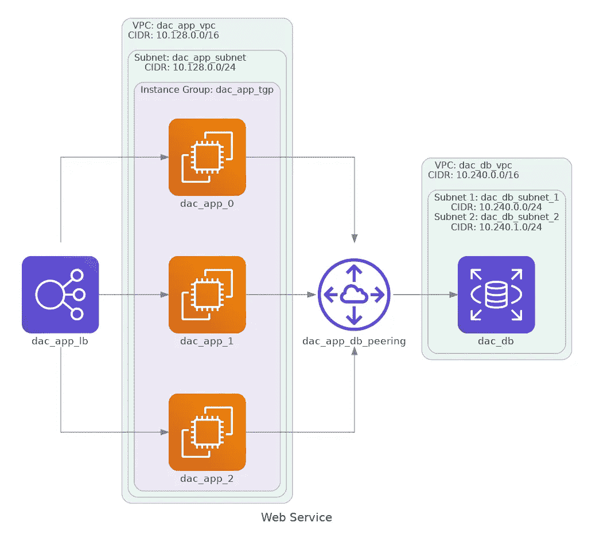

# Terraform + Diagrams:在 AWS 上提供和可视化一个简单的环境

> 原文：<https://medium.com/analytics-vidhya/terraform-diagrams-provisioning-and-visualizing-a-simple-environment-on-aws-471f5d88c95d?source=collection_archive---------0----------------------->


克里斯里德在 [Unsplash](https://unsplash.com?utm_source=medium&utm_medium=referral) 上的照片

当我们使用基础设施即代码(IaC)概念在云中或内部调配环境时，我们已经有了项目文档，作为自己代码上的声明形式，但是如果我们能够在调配后可视化环境的真实状态，事情会变得更容易，您同意吗？因此，考虑了一下，我写这篇文章只是为了展示如何使用 **Terraform** 工具调配传统环境，并获取资源名称，以便生成使用**Diagrams**(Diagrams as Code)工具调配的环境的最终拓扑。

我在 GitHub 中创建了一个包含本文中使用的所有文件的[库](https://github.com/ebarros29/terraform-diagrams)。

# 范围

范围包括提供一个具有三个实例(平衡)的基础架构，以接收 VPC 中的应用程序，其中这些实例需要访问位于另一个 VPC 中的一个数据库。

下面是简单的拓扑结构:

```
 VPC1       VPC2
         +-----+    +-----+
  +------> EC2 |    |     |
LB|------> EC2 +--->+ RDS |
  +------> EC2 |    |     |
         +-----+    +-----+
```

# AWS 用户和组

首先，我们需要创建一个用户，并将其关联到一个具有足够管理权限的组，以便提供/创建所需的资源。因此，我创建了一个名为“terraform”的用户，并关联到“coder”组，正如我们使用下面的命令所看到的。

```
aws iam list-groups-for-user --user-name <user>
```

示例:

```
[ebarros@eva ~]$ aws iam list-groups-for-user --user-name terraform 
{ 
    "Groups": [ 
        { 
            "Path": "/", 
            "GroupName": "coder", 
            "GroupId": "AGPA24FITNI6ERKVPJJ5B", 
            "Arn": "arn:aws:iam::747677903420:group/coder", 
            "CreateDate": "2019-11-28T01:09:25+00:00" 
        } 
    ] 
}
```

要了解关于 AWS 上的**用户、组和角色**的更多信息，请参考官方文档:

[https://docs.aws.amazon.com/IAM/latest/UserGuide/id.html](https://docs.aws.amazon.com/IAM/latest/UserGuide/id.html)

# 目录结构

```
diagrams-terrafom
├── aws_terraform
│   ├── ec2.tf
│   ├── provider.tf
│   ├── rds.tf
│   └── vpc.tf
├── diagrams_aws.py
├── requirements.txt
└── web_service.png
```

“diagrams_aws.py”文件包含 diagrama as code (DaC)内容，负责生成“web_service.png”文件。“requirements.txt”文件包含运行 python 代码所需的所有依赖项。在“aws_terraform”目录中，我创建了。tf 文件根据每个 AWS 服务。我建立了这个目录结构，因为我觉得使用它更舒服。没有默认，你可以随意用自己的方式去创造。只要确保”。tf”文件在同一目录中，Terraform 引擎将知道如何关联它们。

# 将（行星）地球化（以适合人类居住）

> Terraform 是一个安全有效地构建、更改和版本控制基础设施的工具。Terraform 可以管理现有的和受欢迎的服务提供商以及定制的内部解决方案。

## 我如何安装和配置它？

请参考 **Terraform** 官方文档:

[https://www.terraform.io/docs/cli-index.html](https://www.terraform.io/docs/cli-index.html)

## 供应者

我们需要创建一个“provider.tf”文件。该文件没有必需的参数，但插入区域和密钥(或它们的路径)是一个好的做法，这将允许云提供商内部的 Terraform 进行环境供应。

下面我们有文件内容:

```
provider "aws" {
  region     = "sa-east-1"
  access_key = "<Access_KEY>"
  secret_key = "<Secret_KEY>"
}
```

要了解更多关于使用 **AWS 提供商及其在 **Terraform** 上的全部资源**，请参考官方文档:

[https://registry . terraform . io/providers/hashi corp/AWS/latest/docs](https://registry.terraform.io/providers/hashicorp/aws/latest/docs)

## VPC

VPC 就像是云中所有基础设施的主要基地，因为它充当虚拟网络层。
我用两个 VPC 和三个子网理想化了这个环境，一个 VPC 有一个子网用于 APP，另一个 VPC 有两个子网位于不同的 az 中用于 DB(必需)。除此之外，我们需要创建一个互联网网关，以便允许从应用程序到互联网的流量和 VPC 对等，以便在 VPC 之间进行通信。除了安全组和路由表之外。

下面我们有“vpc.tf”文件的内容:

```
### VPC SECTION## VPC for APPresource "aws_vpc" "dac_app_vpc" {
  cidr_block           = "10.128.0.0/16"
  enable_dns_support   = "true"
  enable_dns_hostnames = "true"tags = {
    Name = "dac_app_vpc"
  }
}## VPC for DBresource "aws_vpc" "dac_db_vpc" {
  cidr_block           = "10.240.0.0/16"
  enable_dns_support   = "true"
  enable_dns_hostnames = "true"

  tags = {
    Name = "dac_db_vpc"
  }
}### SUBNET SECTION## Subnet for APPresource "aws_subnet" "dac_app_subnet" {
  vpc_id            = aws_vpc.dac_app_vpc.id
  cidr_block        = "10.128.0.0/24"
  availability_zone = "sa-east-1a"tags = {
    Name = "dac_app_subnet"
  }
}## Subnet for DBresource "aws_subnet" "dac_db_subnet_1" {
  vpc_id            = aws_vpc.dac_db_vpc.id
  cidr_block        = "10.240.0.0/24"
  availability_zone = "sa-east-1b"tags = {
    Name = "dac_db_subnet_1"
  }
}resource "aws_subnet" "dac_db_subnet_2" {
  vpc_id            = aws_vpc.dac_db_vpc.id
  cidr_block        = "10.240.1.0/24"
  availability_zone = "sa-east-1c"tags = {
    Name = "dac_db_subnet_2"
  }
}### INTERNET GW SECTION## Internet Gateway for APPresource "aws_internet_gateway" "dac_app_igw" {
  vpc_id = aws_vpc.dac_app_vpc.idtags = {
    Name = "dac_app_igw"
  }
}### VPC PEERING SECTION## Peering connection between dac_app_vpc and dac_db_vpcresource "aws_vpc_peering_connection" "dac_app_db_peering" {
  peer_vpc_id   = aws_vpc.dac_db_vpc.id
  vpc_id        = aws_vpc.dac_app_vpc.id
  auto_accept   = truetags = {
    Name = "dac_vpc_app_db_peering"
  }
}### ROUTE TABLE SECTION## Route for APPresource "aws_route_table" "dac_app_rt" {
  vpc_id = aws_vpc.dac_app_vpc.idroute {
    cidr_block                = "10.240.0.0/16"
    vpc_peering_connection_id = aws_vpc_peering_connection.dac_app_db_peering.id
  }route {
    cidr_block = "0.0.0.0/0"
    gateway_id = aws_internet_gateway.dac_app_igw.id
  }tags = {
    Name = "dac_app_rt"
  }
}## Route for DBresource "aws_route_table" "dac_db_rt" {
  vpc_id = aws_vpc.dac_db_vpc.idroute {
    cidr_block                = "10.128.0.0/16"
    vpc_peering_connection_id = aws_vpc_peering_connection.dac_app_db_peering.id
  }tags = {
    Name = "dac_db_rt"
  }
}## Route Table - Subnet Associationsresource "aws_route_table_association" "dac_app_rta2" {
  subnet_id      = aws_subnet.dac_app_subnet.id
  route_table_id = aws_route_table.dac_app_rt.id
}resource "aws_route_table_association" "dac_db_rta1" {
  subnet_id      = aws_subnet.dac_db_subnet_1.id
  route_table_id = aws_route_table.dac_db_rt.id
}resource "aws_route_table_association" "dac_db_rta2" {
  subnet_id      = aws_subnet.dac_db_subnet_2.id
  route_table_id = aws_route_table.dac_db_rt.id
}### SECURITY GROUPS SECTION## SG for APP VPCresource "aws_security_group" "dac_app_sg" {
  name = "dac_app_sg"
  description = "EC2 instances security group"
  vpc_id      = aws_vpc.dac_app_vpc.idingress {
    from_port   = 22
    to_port     = 22
    protocol    = "tcp"
    description = "Allow SSH from my Public IP"
    cidr_blocks = ["<public_IP>/32"]
  }ingress {
    from_port   = 80
    to_port     = 80
    protocol    = "tcp"
    description = "Allow HTTP traffic"
    cidr_blocks = ["0.0.0.0/0"]
  }ingress {
    from_port   = 443
    to_port     = 443
    protocol    = "tcp"
    description = "Allow HTTPS traffic"
    cidr_blocks = ["0.0.0.0/0"]
  }egress {
    from_port   = 0
    to_port     = 0
    protocol    = "-1"
    cidr_blocks = ["0.0.0.0/0"]
  }

  tags = {
    Name = "dac_app_sg"
  }
}## SG for DB VPCresource "aws_security_group" "dac_db_sg" {
  name = "dac_db_sg"
  description = "EC2 instances security group"
  vpc_id      = aws_vpc.dac_db_vpc.idingress {
    from_port   = 3306
    to_port     = 3306
    protocol    = "tcp"
    description = "Allow traffic to MySQL"
    cidr_blocks = ["10.128.0.0/24"]
  }egress {
    from_port   = 0
    to_port     = 0
    protocol    = "-1"
    cidr_blocks = ["0.0.0.0/0"]
  }tags = {
    Name = "dac_db_sg"
  }
}
```

总结以前创建的主要资源”。tf "文件:

*   应用程序的 VPC(CIDR:10 . 128 . 0 . 0/16)
*   **DAC _ DB _ VPC:**DB 的 VPC(CIDR:10 . 240 . 0 . 0/16)
*   **DAC _ APP _ Subnet:**APP 的子网(CIDR: 10.128.0.0/24)
*   **DAC _ DB _ Subnet _ 1:**DB 的子网 1(CIDR:10 . 240 . 0 . 0/24)
*   **DAC _ DB _ Subnet _ 2:**DB 的子网 2(CIDR:10 . 240 . 1 . 0/24)
*   **dac_app_igw:** 允许从应用到互联网的流量
*   **DAC _ vpc _ app _ db _ peering:**允许 VPC 之间的通信
*   **DAC _ APP _ rt:**APP 的路由表
*   **DAC _ DB _ rt:**DB 的路由表
*   **dac_app_sg:** 应用 VPC 的安全组(入口:允许端口 22、80 和 443。出口:所有网络)
*   **dac_db_sg:** 数据库 VPC 的安全组(入口:仅允许来自应用子网的端口 3306。出口:所有网络)

要了解更多关于**亚马逊 VPC** 的信息，请参考官方文档:

[https://docs . AWS . Amazon . com/VPC/latest/user guide/what-is-Amazon-VPC . html](https://docs.aws.amazon.com/vpc/latest/userguide/what-is-amazon-vpc.html)

## 无线电数据系统

RDS 是 AWS 中的一个完全托管的资源数据库，它允许创建一个数据库实例，而无需关心操作系统修补和服务器供应等问题。该资源支持主要的数据库引擎，如 SQL Server、MariaDB、ProstgreSQL 等。在这种情况下，文件“rds.tf”将使用先前在“vpc.tf”文件中声明的 DB 子网创建一个 MySQL 实例和一个 DB 子网组。

下面我们有“rds.tf”文件内容:

```
## DB Subent Groupresource "aws_db_subnet_group" "dac_db_subnet_group" {
  name       = "dac_db_subnet_group"
  subnet_ids = [aws_subnet.dac_db_subnet_1.id, aws_subnet.dac_db_subnet_2.id]tags = {
    Name = "dac_db_subnet_group"
  }
}## DB instanceresource "aws_db_instance" "dac_db" {
  allocated_storage       = 20
  storage_type            = "gp2"
  engine                  = "mysql"
  engine_version          = "8.0"
  instance_class          = "db.t2.micro"
  name                    = "mydb"
  identifier              = "dacdb"
  username                = "<db_user>"
  password                = "<db_password>"
  parameter_group_name    = "default.mysql8.0"
  db_subnet_group_name    = aws_db_subnet_group.dac_db_subnet_group.name
  vpc_security_group_ids  = [aws_security_group.dac_db_sg.id]
  skip_final_snapshot     = "true"
}
```

要了解更多关于**亚马逊 RDS** 的信息，请参考官方文档:

[https://docs . AWS . Amazon . com/Amazon rds/latest/user guide/welcome . html](https://docs.aws.amazon.com/AmazonRDS/latest/UserGuide/Welcome.html)

## EC2

AWS EC2 是一种计算层服务，它基本上允许创建/销毁基于 Linux 或 Windows 的实例(虚拟机)，根据需求向上或向外扩展。在这种情况下，文件“ec2.tf”将通过使用“Amazon Linux 2”映像创建三个 Linux 实例(t2.micro)。该文件还将创建一个 NLB(网络负载平衡器)及其所需的组件。

下面我们有“ec2.tf”文件的内容:

```
## EC2 INSTANCESresource "aws_instance" "dac_app" {
  count                         = 3
  ami                           = "ami-02898a1921d38a50b"
  instance_type                 = "t2.micro"
  key_name                      = "<KEY_name>"
  vpc_security_group_ids        = [aws_security_group.dac_app_sg.id]
  subnet_id                     = aws_subnet.dac_app_subnet.id
  associate_public_ip_address   = "true"tags = {
    Name = "dac_app_${count.index}"
  }
}## NLBresource "aws_lb" "dac_app_lb" {
  name               = "dac-app-lb"
  internal           = false
  load_balancer_type = "network"
  subnets            = aws_subnet.dac_app_subnet.*.idtags = {
    Environment = "dev"
  }
}## LB Target Groupresource "aws_lb_target_group" "dac_app_tgp" {
  name     = "dac-app-tgp"
  port     = 80
  protocol = "TCP"
  vpc_id   = aws_vpc.dac_app_vpc.id
}## LB Targets Registrationresource "aws_lb_target_group_attachment" "dac_app_tgpa" {
  count            = length(aws_instance.dac_app)
  target_group_arn = aws_lb_target_group.dac_app_tgp.arn
  target_id        = aws_instance.dac_app[count.index].id
  port             = 80
}## LB Listenerresource "aws_lb_listener" "dac_app_lb_listener" {
  load_balancer_arn = aws_lb.dac_app_lb.arn
  port              = "80"
  protocol          = "TCP"default_action {
    type             = "forward"
    target_group_arn = aws_lb_target_group.dac_app_tgp.arn
  }
}
```

总结以前创建的主要资源”。tf "文件:

*   **dac_app:** 三个 EC2 实例(dac_app_0、dac_app_1 和 dac_app_2)
*   **dac_app_lb:** 外部网络负载平衡器
*   **dac_app_tgp:** 接收来自 NLB 流量的目标群体
*   **dac_app_tgpa:** 组实例附加在 **dac_app_tgp** 上
*   **dac_app_lb_listener:** 端口 80 上的 lb 监听器(HTTP)

要了解更多关于**亚马逊 EC2** 的信息，请参考官方文档:

[https://docs . AWS . Amazon . com/AWS C2/latest/user guide/concepts . html](https://docs.aws.amazon.com/AWSEC2/latest/UserGuide/concepts.html)

## 规划和应用

Terraform 中有三个主要命令，它们是:

*   **terraform plan:** 创建一个计划，基于已声明的”。tf "文件，这是将要配置的环境的一部分。
*   **terraform apply:** 根据计划在云提供商上部署整个环境。
*   **地形摧毁:**摧毁之前创造的整个环境。

下面我们可以看到“ **terraform plan** ”和“ **terraform apply** ”命令的例子:



环境供应流程

## 设置结果

在下面的终端上，我们可以看到 AWS CLI 命令的过滤输出，显示了 Terraform 创建的资源。



显示资源

如果你想破坏整个环境，只需输入“ **terraform destroy** ”，然后确认计划，所有资源将被删除。

> **注意:**将调配的环境保留到文章的最后，因为我们将在下一个主题中使用“terraform.tfstate”文件。

# 图表

> Diagrams 允许您用 Python 代码绘制云系统架构。Diagrams 目前支持六大提供商:AWS、Azure、GCP、Kubernetes、阿里云和甲骨文云。它现在还支持本地节点以及编程语言和框架。

## 我如何安装、配置和使用它？

请参考 GitHub 上的**图**官网和项目资源库:

【https://diagrams.mingrammer.com】/
[https://github.com/mingrammer/diagrams](https://github.com/mingrammer/diagrams)

## 它是如何工作的？

这个简单的工具在 Python 上工作，所以在一个最小的配置之后，基本上我们只需要写。py "文件并运行它。

## 生成图表

首先，我们需要根据将在拓扑中显示的每个 AWS 资源，将所有必需的类导入到代码中。然后，我打开了“terraform.tfstate”文件，并将其解码为 JSON，以便获得在环境供应期间创建的所有资源名称。
之后，我构建了一个包含每个资源名称的列表，并将每个元素位置作为我的节点和集群的名称。

> **注意:**这个过程是在代码中手工完成的，但是我打算通过使用 **Python CDK for Terraform** 来自动化这个过程，并在以后的文章中展示。

sintax 构建图表方案在官方文档中有更详细的解释，但是基本上我们需要使用每个 AWS 资源类来创建节点，“<< >>”或“-”来连接节点和集群类以创建“盒子”。

“diagrams_aws.py”文件显示了下面的代码:

```
from diagrams import Cluster, Diagram
from diagrams.aws.compute import EC2
from diagrams.aws.database import RDS
from diagrams.aws.network import ELB, VPCPeering
import json
import os
from pprint import pprint## Opening the .tfstate filewith open('aws_terraform/terraform.tfstate') as json_file:
    tf_data = json.load(json_file)#pprint(data)r_names = []## looping over the namesfor x in tf_data['resources']:
    r_names.append(x['name'])print("\nResources Name List: \n")pprint(r_names)app_vpc_name = r_names[len(r_names)-3]
db_vpc_name = r_names[len(r_names)-2]app_vpc_cidr = '10.128.0.0/16'
db_vpc_cidr = '10.240.0.0/16'app_subnet_name = r_names[len(r_names)-6]
db_subnet1_name = r_names[len(r_names)-5]
db_subnet2_name = r_names[len(r_names)-4]app_subnet_cidr = '10.128.0.0/24'
db_subnet1_cidr = '10.240.0.0/24'
db_subnet2_cidr = '10.240.1.0/24'peering_name = r_names[len(r_names)-1]app_name = r_names[2]
db_name = r_names[0]tgp_name = r_names[6]
lb_name = r_names[4]print("\nGenerating Diagram...")with Diagram("Web Service", show=False):load_balancer = ELB(lb_name)with Cluster("VPC: "+app_vpc_name+"\nCIDR: "+app_vpc_cidr):
        with Cluster("Subnet: "+app_subnet_name+"\nCIDR: "+app_subnet_cidr):
            with Cluster("Instance Group: "+tgp_name):
                workers = [EC2(app_name+"_0"),
                            EC2(app_name+"_1"),
                            EC2(app_name+"_2")]

    vpc_peering = VPCPeering(peering_name)with Cluster("VPC: "+db_vpc_name+"\nCIDR: "+db_vpc_cidr):
            with Cluster("Subnet 1: "+db_subnet1_name+"\nCIDR: "+db_subnet1_cidr+"\nSubnet 2: "+db_subnet2_name+"\nCIDR: "+db_subnet2_cidr):
                database1 = RDS(db_name)load_balancer >> workers >> vpc_peering >> database1print("Congratulations! The diagram has been succesfully generated in this path: "+os.getcwd()+"\n")
```

最后，运行下面的命令:

```
python3 diagrams_aws.py
```

因此，我们有了完整而精彩的下图:



调配的 AWS 资源的最终拓扑

[1]: GitHub 库:terraform-diagrams。
[https://github.com/ebarros29/terraform-diagrams](https://github.com/ebarros29/terraform-diagrams)

[2]: Terraform 官网。地形简介
[https://www.terraform.io/intro/index.html](https://www.terraform.io/intro/index.html)

[3]:图:作为代码的图。关于图解
https://diagrams.mingrammer.com/