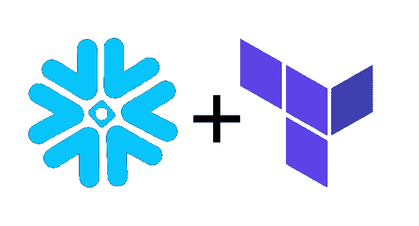

# 地球化雪花

> 原文：<https://medium.com/analytics-vidhya/terraforming-snowflake-91fc23efc488?source=collection_archive---------18----------------------->



# 什么是雪花？

[雪花](https://www.snowflake.com/)是托管云数据仓库解决方案。它类似于 BigQuery 或 Redshift，但有一些独特的功能，如计算和存储的分离以及对半结构化数据(JSON、Parquet、Avro)的强大支持，这使它与众不同。

# 什么是 Terraform？

[Terraform](https://www.terraform.io/) 是 HashiCorp 的一款工具，用于通过代码管理基础设施。您可以使用它来提供、更新或删除各种资源，如 [EC2 实例](https://www.terraform.io/docs/providers/aws/r/instance.html)、 [Datadog 监视器](https://www.terraform.io/docs/providers/datadog/r/monitor.html)、 [OpsGenie 调度](https://www.terraform.io/docs/providers/opsgenie/r/schedule.html)等等。这使您可以随时了解基础设施的当前状态，并控制其更新方式。Terraform 与许多[提供商](https://www.terraform.io/docs/providers/index.html)合作。可惜雪花不在其中！然而，它也支持第三方提供者，这意味着用户可以为几乎任何服务编写自己的提供者。作为一个例子(和无耻的插头)，检查出[这一个](https://github.com/ajbosco/terraform-provider-segment)我写的[段](https://segment.com/)的 API。

# 为什么要用雪花搭配 Terraform？

幸运的是， [Chan Zuckerberg Initiative](https://chanzuckerberg.com/) 为我们做了艰苦的工作，并开源了一个[雪花平台提供者](https://github.com/chanzuckerberg/terraform-provider-snowflake)，我们可以用它来管理许多雪花对象，如角色、授权和用户。因此，通过使用带有雪花的 Terraform，我们可以随时了解雪花环境的当前状态。比如存在哪些模式、仓库的大小，也许最重要的是，哪些用户可以访问哪些雪花对象。有了这个设置，我们可以避免这样的情况:有人*意外地*手动授予用户错误的角色过多的访问权限，或者启动一个 4 倍大的仓库，而这个仓库从来不会[自动挂起](https://docs.snowflake.net/manuals/user-guide/warehouses-overview.html#auto-suspension-and-auto-resumption)。

如果这一切听起来都很棒，那么让我们来看一个使用 Terraform 在雪花中设置角色、用户、模式和授权访问的例子。

# 设置地形

在我们开始之前，您需要安装 Terraform。对此，我建议遵循官方文档。在下面的例子中，我将使用 Terraform 0.12。我还建议设置一个[远程状态](https://www.terraform.io/docs/state/remote.html)让团队更容易管理你的资源，但这并不是开始的必要条件。远程状态将您的 Terraform 状态写入所有团队成员都可以访问的远程数据存储，如 AWS S3，而不是使用状态的本地存储。

设置好 Terraform 后，您需要从最新的[版本](https://github.com/chanzuckerberg/terraform-provider-snowflake/releases)下载雪花 Terraform 提供程序，并将其移动到适当的目录(通常是`~/.terraform.d/plugins`)。接下来，按照提供者[自述文件](https://github.com/chanzuckerberg/terraform-provider-snowflake#authentication)中的步骤，为您选择的身份验证方法创建一个名为`main.tf`的文件，如下所示:

```
provider "snowflake" {
  account = "your-snowflake-account"
  region  = "your-snowflake-region"
}
```

之后运行`terraform init`，你应该看到下面的意思，我们准备好了:

```
Initializing the backend...
Initializing provider plugins...
Terraform has been successfully initialized!
```

# 地形化图式

首先，我们将在雪花中创建两个数据库。创建一个名为`schemas.tf`的文件，如下所示:

```
locals {
  schemas = {
    "RAW" = {
      database = "DEV"
      comment = "contains raw data from our source systems"
    }
    "ANALYTICS" = {
      database = "DEV"
      comment = "contains tables and views accessible to analysts and reporting"
    }
  }
}

resource "snowflake_schema" "schema" {
  for_each = local.schemas
  name     = each.key
  database = each.value.database
  comment  = each.value.comment
}
```

注意，我们利用 Terraform 0.12 中的新循环来避免每次添加新角色时复制和粘贴`snowflake_role`资源。然后运行`terraform plan`看看将会创建什么资源。该命令应该返回 2 个新模式将在雪花中创建。如果事情看起来不错，运行`terraform apply`来创造它们。

# 地形改造角色

接下来，我们用 Terraform 创建两个[雪花角色](https://docs.snowflake.net/manuals/sql-reference/sql/create-role.html)。顺便说一句，dbt 有一篇很棒的关于他们如何为客户构建角色的博文，我推荐阅读。这个例子复制了这个结构。

创建如下所示的文件`roles.tf`:

```
locals {
  roles = {
    "LOADER" = {
      comment = "Owns the tables in raw schema"
    }
    "TRANSFORMER" = {
      comment = "Has query permissions on tables in raw schema and owns tables in the analytics schema."
    }
  }
}

resource "snowflake_role" "role" {
  for_each = local.roles
  name     = each.key
  comment  = each.value.comment
}
```

像以前一样，运行`terraform plan`看看会创建什么资源。这个命令应该返回 2 个新角色将在雪花中创建。如果事情看起来不错，运行`terraform apply`来创建它们。

角色很棒，但是如果你能利用它们做些什么，它们会更好，所以让我们把我们的`schemas.tf`文件修改成这样:

```
locals {
  schemas = {
    "RAW" = {
      database = "DEV"
      comment = "contains raw data from our source systems"
      usage_roles = ["TRANSFORMER"]
      all_roles = ["LOADER"]
    }
    "ANALYTICS" = {
      database = "DEV"
      comment = "contains tables and views accessible to analysts and reporting"
      usage_roles = []
      all_roles = ["TRANSFORMER"]
    }
  }
}

resource "snowflake_schema" "schema" {
  for_each = local.schemas
  name     = each.key
  database = each.value.database
  comment  = each.value.comment
}

resource "snowflake_schema_grant" "schema_grant_usage" {
  for_each      = local.schemas
  schema_name   = each.key
  database_name = each.value.database
  privilege     = "USAGE"
  roles         = each.value.usage_roles
  shares        = []
}

resource "snowflake_schema_grant" "schema_grant_all" {
  for_each      = local.schemas
  schema_name   = each.key
  database_name = each.value.database
  privilege     = "ALL"
  roles         = each.value.all_roles
  shares        = []
}
```

一个快速的`terraform plan`应该显示我们已经准备好授予每个角色对每个模式的适当访问权。如果一切顺利，运行`terraform apply`在雪花中创建授权。

# 地形化用户

现在我们有了角色，让我们为这些角色创建一些用户。像这样创建一个名为`users.tf`的文件:

```
locals {
  users = {
    "MAC" = {
      login_name = "MAC_DATAENGINEER@MACANDCHEESE.COM"
      role       = "TRANSFORMER"
      namespace  = "DEV.PUBLIC"
      warehouse  = "TRANSFORMER_WH"
    }
    "CHEESE" = {
      login_name = "CHEESE_DATAENGINEER@MACANDCHEESE.COM"
      role       = "TRANSFORMER"
      namespace  = "DEV.PUBLIC"
      warehouse  = "TRANSFORMER_WH"
    }
    "STITCH" = {
      login_name = "STITCH@MACANDCHEESE.COM"
      role       = "LOADER"
      namespace  = "DEV.PUBLIC"
      warehouse  = "LOADER_WH"
    }
  }
}

resource "snowflake_user" "user" {
  for_each             = local.users
  name                 = each.key
  login_name           = each.value.login_name
  default_role         = each.value.role
  default_namespace    = each.value.namespace
  default_warehouse    = each.value.warehouse
  must_change_password = false
}
```

再次运行`terraform plan`来查看将会创建什么资源。这个命令应该返回说将在雪花中创建 3 个新用户(注意，我们还假设不需要更改密码，因为我们在开始之前已经设置了 SSO)。如果事情看起来不错，运行`terraform apply`来创建它们。

但是等等，我们已经给了这些用户一个`default_role`，但是这个角色还没有授予他们！没有被授予默认角色的用户将不能在雪花中做任何事情。让我们通过修改`roles.tf`文件来解决这个问题，使它看起来像这样:

```
locals {
  roles = {
    "LOADER" = {
      comment = "Owns the tables in raw schema"
      users = ["STITCH"]
    }
    "TRANSFORMER" = {
      comment = "Has query permissions on tables in raw schema and owns tables in the analytics schema."
      users = ["MAC", "CHEESE"]
    }
  }
}

resource "snowflake_role" "role" {
  for_each = local.roles
  name     = each.key
  comment  = each.value.comment
}

resource "snowflake_role_grants" "role_grant" {
  for_each  = local.roles
  role_name = each.key
  users     = each.value.users
  roles     = []
}
```

同样，我们将运行`terraform plan`来查看变化，应该是我们现在将向我们的用户授予适当的角色。如果输出是这样说的，那么运行`terraform apply`使它在雪花中如此。

就是这样！我们现在已经在雪花中创建了角色、模式和用户，并由 Terraform 管理。是时候提交这些文件并在 GitHub 中放一个 PR 了！下一步，请查看通过拉式请求管理 Terraform 的 [Atlantis](https://www.runatlantis.io/) 或让团队更容易使用 Terraform 的 [Terraform Cloud](https://www.terraform.io/docs/cloud/index.html) 。

*原载于 2020 年 1 月 5 日*[*https://Adam . boscarino . me*](https://adam.boscarino.me/posts/terraform-snowflake/)*。*