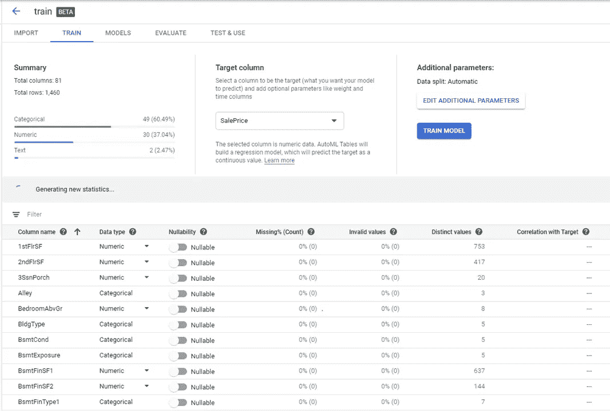
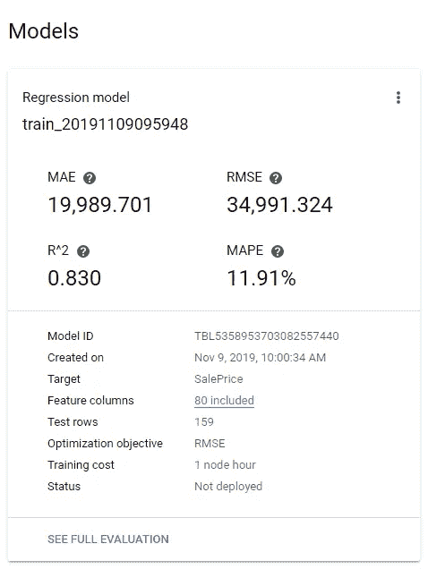
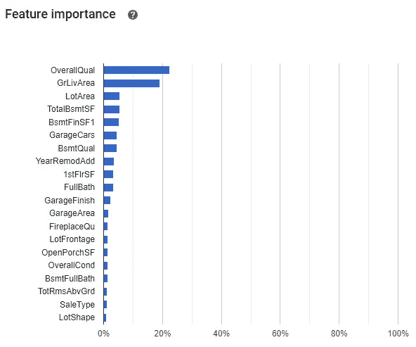
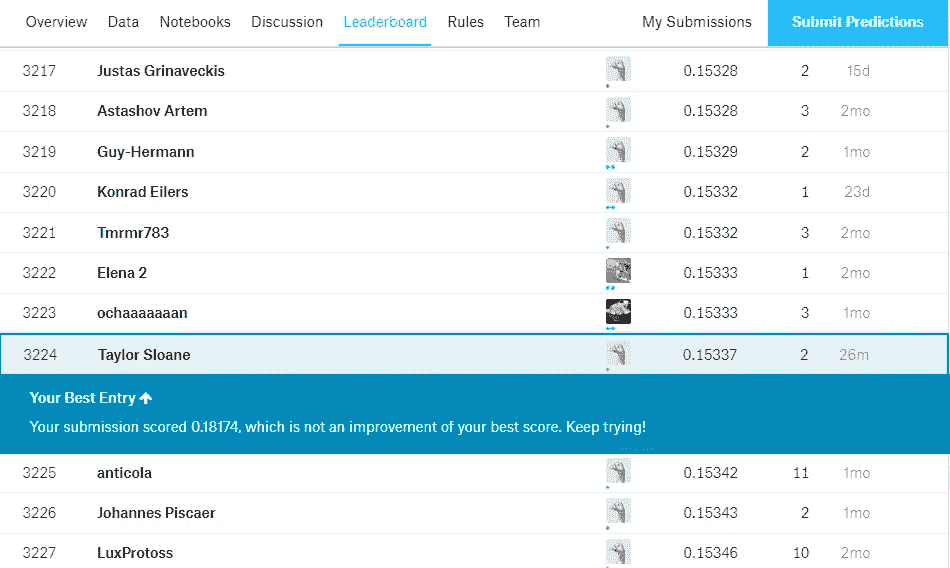

# 试驾谷歌的机器学习工具 AutoML

> 原文：<https://medium.com/analytics-vidhya/test-driving-googles-machine-learning-tool-automl-31588b49e1ce?source=collection_archive---------6----------------------->

机器学习的趋势之一是推动访问的民主化，这样没有计算机科学博士学位的人也可以使用它。今天的大多数工具仍然需要 Python 或 r 语言的编程技能。本周[谷歌宣布将为 Kaggle 带来一款名为 AutoML 的机器学习工具，据称使用该工具不需要编程技能。只是拖放。在公告中，谷歌声明:](https://cloud.google.com/blog/products/ai-machine-learning/bringing-google-automl-to-3-million-data-scientists-on-kaggle)

> AutoML 能够快速获得强大的性能结果，只需很少的努力，并且没有领域专业知识或监督。此外，他们在数据准备上花费的时间很少，几乎没有时间用于特征工程、模型选择和超参数调整。在 [IEEE 竞赛](https://www.kaggle.com/c/ieee-fraud-detection/)期间，AutoML 的时间效率变得更加明显，数千个团队花了几周时间在我们的私人排行榜上以显著优势击败了 AutoML 基准。

所以我决定自己试一试，看看有多简单。

Google AutoML 所做的是，它会自动为你的数据集搜索最优的神经网络，这样你就不用担心调整参数了。我对界面感到惊喜。在我上传数据后，它自动将我的列分类为数字、分类和文本。我可以切换“可空性”的滑块，这是一种有趣的说法，如果一行在这里没有值，我们应该忽略整行还是只忽略那个值。它还总结了丢失数据/无效数据的位置，以及每个列名的不同值的数量。

我使用的数据是 Kaggle 上的一个经典数据集，是关于[预测房价](https://www.kaggle.com/c/house-prices-advanced-regression-techniques/overview)的，使用了卧室数量、建造年份、建筑面积等预测因素。它不是一个很大的数据集，大约 1400 行 80 列= 112000 个数据点。在选择完数据类型并选择了目标列(SalePrice)之后，我单击了“Train Model”我认为这会很快，因为在 Python 中这需要几分钟。然而，由于 AutoML 正在测试多个神经网络，该过程在谷歌服务器上以 20 美元/小时的培训成本进行了约 90 分钟。

当结果出来时，它们被很好地总结了。首先，它说我的模型在训练集上预测房屋销售价格的平均误差为 11.91%。还不错。

它还指出了训练集中不同特征的相对重要性。这很好，因为对机器学习的一个常见批评是，它是一个黑箱，没有人知道它是如何得到答案的。在这里，我们可以看到前 3 名驱动因素是:

1.  总体质量:对房屋的整体材料和装修进行评级
2.  GrLiv:地面以上居住面积平方英尺
3.  LotArea:以平方英尺为单位的批量

这些似乎都是房屋销售价格的合理驱动因素。

现在我有了我的模型，我准备做一些预测。所以我上传了我的测试集，并点击了“批量预测”按钮 5 分钟后，我将结果保存在一个 csv 文件中，并提交给 Kaggle，看看我做得如何:

好吧，不太好。位置 3224/5089 或第 37 百分位。我的均方根误差是 0.15，领先的是 0.10。因此，考虑到我付出的努力和我不得不零编码的事实，这实际上是一个很好的猜测，但你不会用它赢得任何 Kaggle 比赛。另外我认为自动机器学习工具在 Kaggle 比赛中是被禁止的。

以每小时 20 美元的价格训练一个模型并不便宜，但在许多情况下，如果一家公司想涉足机器学习，但还没有完全准备好投入，这比雇用一名全职数据科学家要便宜得多。对于完全致力于与数据科学家一起进行机器学习的公司来说，有更多负担得起的选择。除了结构化数据之外，AutoML 还能够对语言(如情感分析)和视觉(照片和视频)进行分析。我还认为，如果有更多的数据，AutoML 会做得更好，因为按照今天的标准，1400 行训练数据被认为是非常小的。

总的来说，我认为这是朝着正确方向迈出的一步。俗话说“永远不要让伟大成为优秀的敌人。”这是一个很好的工具，不是灵丹妙药，但是很好。对于没有接触过机器学习的人来说，这个工具可以让你获得 80%的答案。那很酷。