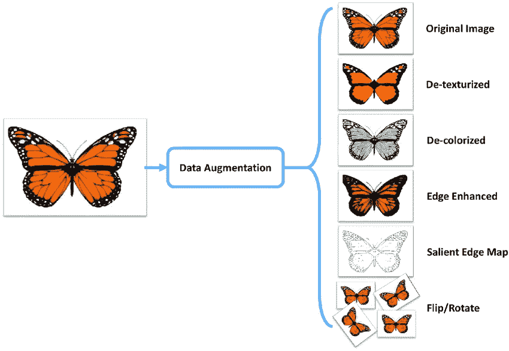

# 使用 PyTorch 增加测试时间

> 原文：<https://medium.com/analytics-vidhya/test-time-augmentation-using-pytorch-3da02d0a3188?source=collection_archive---------7----------------------->

在图像分类中，当我们要在训练我们的模型后为我们的测试集图像预测类别时， ***我们将为每个测试图像生成 n 次*** 的置信概率，最后 ***我们将把所有预测类别*** 中的最大平均值分配给 ***图像*** 。这叫做 ***测试时间增加*** 。


为了在 PyTorch 中实现这一点，首先我们要像这样定义测试数据集类

```
class **test_Dataset**(torch.utils.data.Dataset):
    def __init__(self, ids, image_ids):
        self.ids = ids
        self.image_ids = image_ids **# list of testset image ids** **#test data augmentations**
        self.aug = albumentations.Compose([
                    albumentations.RandomResizedCrop(256, 256),
                    albumentations.Transpose(p=0.5),
                    albumentations.HorizontalFlip(p=0.5),
                    albumentations.VerticalFlip(p=0.5),
                    albumentations.HueSaturationValue(
                        hue_shift_limit=0.2, 
                        sat_shift_limit=0.2,
                        val_shift_limit=0.2, 
                        p=0.5
                    ),
                    albumentations.RandomBrightnessContrast(
                        brightness_limit=(-0.1,0.1), 
                        contrast_limit=(-0.1, 0.1), 
                        p=0.5
                    ),
                    albumentations.Normalize(
                        mean=[0.485, 0.456, 0.406], 
                        std=[0.229, 0.224, 0.225], 
                        max_pixel_value=255.0, 
                        p=1.0
                    )
                ], p=1.)
    def __len__(self):
        return len(self.ids)

    def __getitem__(self, index):
        ***# converting jpg format of images to numpy array***
        img = np.array(Image.open('**_PATH_**' + self.image_ids[index])) ***#Applying augmentations to numpy array***
        img = self.aug(image = img)['image']**# converting to pytorch image format & 2,0,1 because pytorch excepts image channel first then dimension of image**img = np.transpose(img , (2,0,1)).astype(np.float32) 

        ***# finally returning image tensor and its image id***
        return torch.tensor(img, dtype = torch.float) , self.image_ids[index]
```



来源-[https://miro . medium . com/max/850/1 * AE 1 tw 5 NGF 1 zhpryh 7 AAM 1 q . png](https://miro.medium.com/max/850/1*ae1tW5ngf1zhPRyh7aaM1Q.png)

在此之后，我们称之为:

```
test_data = **test_Dataset**(ids = [i for i **in** range(len(**YOUR_LIST**))], image_ids = **YOUR_LIST**)
```

如果我们尝试对任何单个图像 id 运行这个 **n** 次，那么我们每次都会得到不同的图像，因为对它应用了放大。

```
idx = **ANY_IMAGE_ID(from 0 to length of YOUR_LIST)**print(test_data[idx][1])img = test_data[idx][0]
npimg = img.numpy()
plt.imshow(np.transpose(npimg, (1,2,0)))
```


现在，将 test_data 包装在数据加载器中，然后我们就可以在这段代码的帮助下进行预测了

```
**no_of_times_we_wanna_do_prediction_for_one_image =** *any integer value*
final_predictions = Nonefor j **in** range(**no_of_times_we_wanna_do_prediction_for_one_image**):
    for image,image_id **in** test_dataloader:
        image = image.to(device, dtype=torch.float)

        with torch.no_grad():
            preds = model(image)
    temporary_predictions = None
    for p **in** preds:
        if temporary_predictions **is** None:
            temporary_predictions = p
        else:
            temp_preds = np.vstack((temporary_predictions, p))
    if final_preds **is** None:
        final_predictions = temporary_predictions
    else:
        final_predictions += temporary_predictionsfinal_predictions /= **no_of_times_we_wanna_do_prediction_for_one_image**final_predictions = final_predictions.detach().cpu().numpy()***final_list_of_all_predictions*** = np.argmax(final_predictions)
```

现在我们将有 ***最终所有预测列表，其将*** 对应于所有测试图像的预测列表作为我们的答案。我希望你明白这一点。如果你有任何问题、意见或担忧，请在本文的评论区发表出来，在此之前享受学习的乐趣。