# 测试机器学习模型的测试人员指南

> 原文：<https://medium.com/analytics-vidhya/testers-guide-for-testing-machine-learning-models-e7e5cea81264?source=collection_archive---------1----------------------->

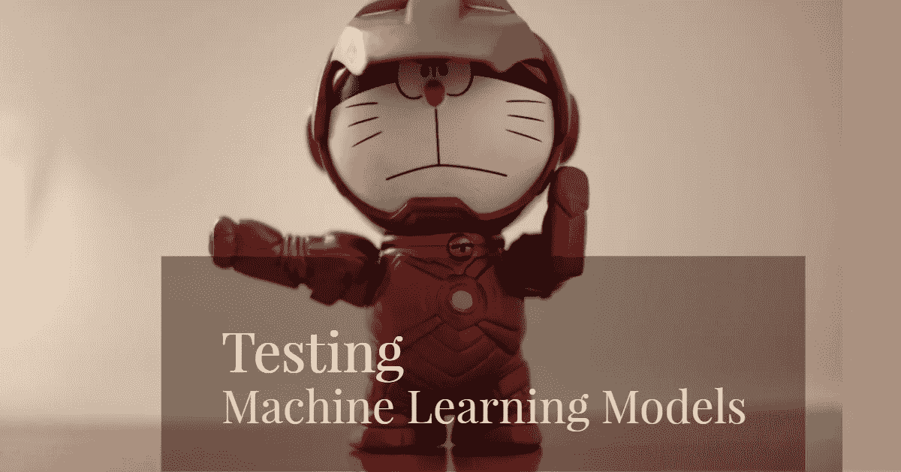

机器学习是一种应用算法和统计数据使计算机在没有明确编程的情况下进行自我学习的研究。计算机依赖于使用数学模型的算法。该模型使用一个称为“**训练数据集**的数据集来学习和预测期望的结果。有多种学习算法可用于解决该问题，但概念保持不变。所有这些算法分为两类，即。监督学习或无监督学习。

让我们了解更多关于监督学习的信息，因为它在用户分析、推荐产品列表等应用中得到了更多的研究和使用。监督学习输出生成两种类型的值，并被分为两类，一类是**分类(分类模型)**，其中值来自有限集合(男性或女性、t 恤或衬衫或内衣等)，另一类是**名义值(回归模型)**，其中值是实值标量(收入水平、产品评级等)。使用数据集训练这些算法，并预测输出。

> 请注意，机器学习算法不会生成具体的输出，但**它会提供一个近似值或结果概率**。

作为一名测试人员，你有没有想过我们如何测试一个能够自我学习并纠正其旧错误的应用程序？放心吧！！在你掉下去之前坚持住，看看这篇文章…

不用等太久，让我们找出测试这种学习算法所必须采取的测试方法。

**测试方法:**答案在数据集中。为了测试机器学习算法，tester 定义了三个不同的数据集，即训练数据集、验证数据集和测试数据集(训练数据集的子集)。

> 请记住，这个过程本质上是迭代的，如果我们在每个迭代周期都刷新我们的验证和测试数据集，效果会更好。

这里，下面是测试者为了测试开发的学习算法可以遵循的基本方法:

1.  测试人员首先定义三个数据集，训练数据集(65%)、验证数据集(20%)和测试数据集(15%)。请在分割前随机化数据集，并且**不要**在您的训练数据集中使用验证/测试数据集。

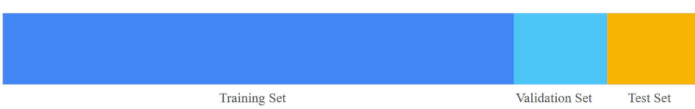

数据集的分区

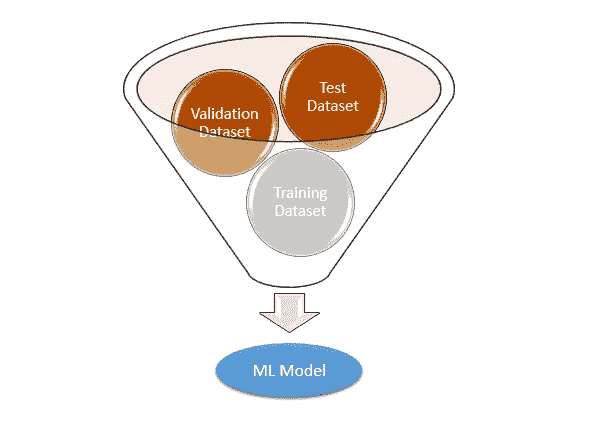

不同的数据集输入到 ML 模型

2.测试人员一旦定义了数据集，就会开始用训练数据集训练模型。一旦这个训练模型完成，测试人员就用验证数据集来评估模型。这是一个迭代过程，可以包含基于可以完成和重新评估的结果的模型所需的任何调整/更改。这确保了测试数据集保持未被使用，并且可以用于测试被评估的模型。

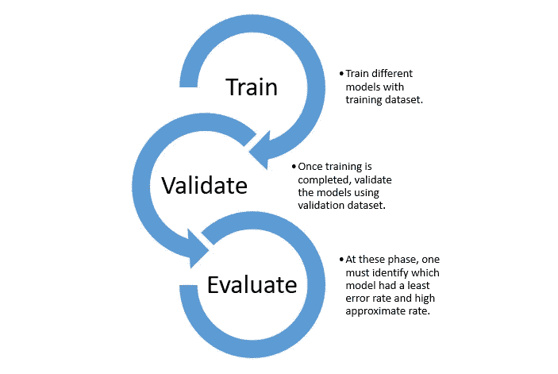

评估最佳机器学习模型的迭代过程

3.对所有模型的评估完成后，将挑选出基于最小错误率和高度近似预测的团队有信心的最佳模型，并使用测试数据集进行测试，以确保该模型仍然表现良好，并与验证数据集结果相匹配。如果您发现模型的准确性很高，那么您必须确保测试/验证集不会泄露到您的训练数据集中。

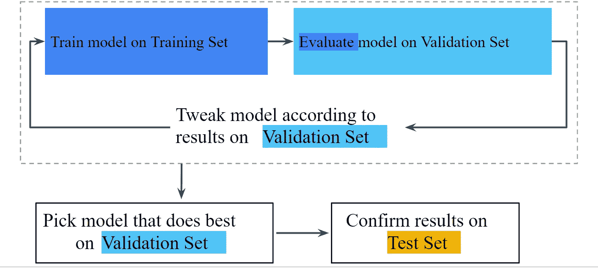

ML 模型训练、评估和测试的迭代工作流

> 如果我们用不正确的数据训练它们呢？？？如果我们用不正确的数据集训练一个模型，那么错误率就会增加，并且会导致**数据中毒**。还必须用对手数据集来训练模型，这样系统应该能够在将数据发送给训练模型之前净化数据。

有了以上信息，让我们来理解一个叫做“**交叉验证**的重要概念，它有助于我们评估模型的平均性能。

# 交叉验证

交叉验证是一种技术，其中数据集被分成多个子集，学习模型根据这些子集数据进行训练和评估。一种广泛使用的技术是 ***k 倍交叉验证*** 技术。在这种情况下，数据集被分成 k 个子集(折叠)并用于训练和验证目的，进行 ***k 次迭代*** 。每个子样本将至少使用一次作为验证数据集，剩余的( ***k-1*** )作为训练数据集。一旦所有迭代完成，就可以计算每个模型的平均预测率。

让我们通过下图来理解:

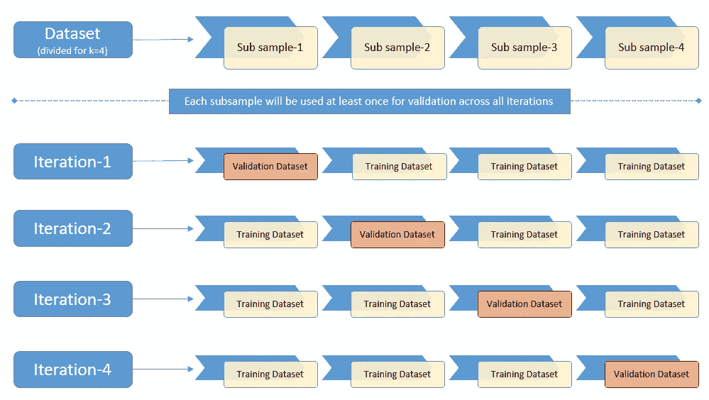

每个子样本将在所有迭代中作为验证数据集至少使用一次。

现在我们知道了测试方法，主要部分是如何用验证和测试数据集评估学习模型…让我们深入研究一下，学习测试人员必须了解的最常见的评估技术。

## 评估技术:

在深入研究评估技术之前，我们需要理解一些术语。所以我们先来了解一下它们是什么。

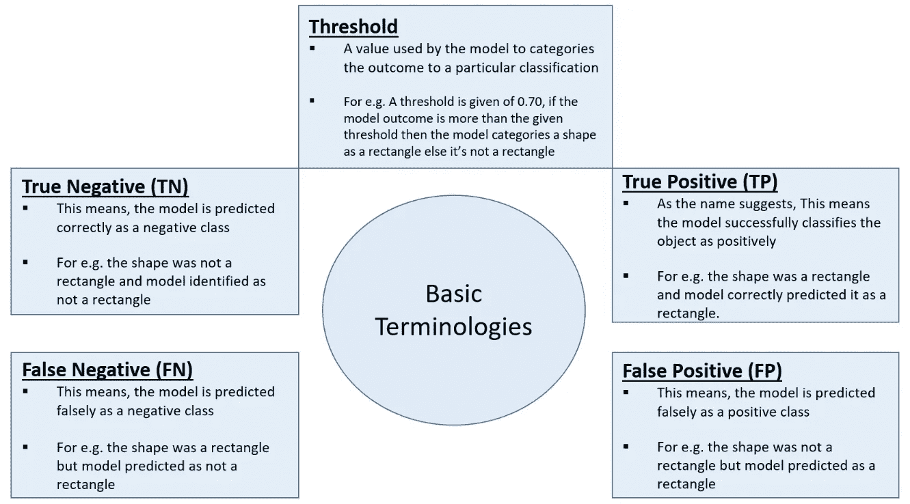

有了上面的基本术语，现在让我们深入研究一下技术:

1.  **分类准确率:**这是评估学习模型最基本的方式。它是正面(TN+TP)预测与预测总数之间的比率。如果该比率高，则该模型具有高预测率。下面是计算准确率的公式。

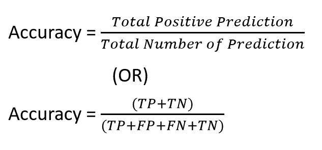

但是，可以看出，仅仅依靠精确度并不是评估模型的好方法。例如，对于 100 个形状样本，该模型可能已经正确预测了真正的阴性情况，但是对于真正的阳性情况，它可能具有较低的成功率。因此，比率/预测率可能看起来很好/很高，但是整个模型不能识别正确的矩形形状。

**2。混淆矩阵:**是 N*N 的方阵表，其中 N 是模型需要分类的类别数。它最适合用于将结果分类为有限的一组值的分类模型。这些值被称为标签。一个轴是模型预测的标签，另一个轴是实际标签。为了更好地理解这一点，让我们将这些形状分为 3 个标签[ *矩形、圆形和正方形* ]。由于有 3 个标签，我们将画一个 3*3 的表( ***混淆矩阵*** )，其中一个轴将是实际的，另一个是预测的标签。

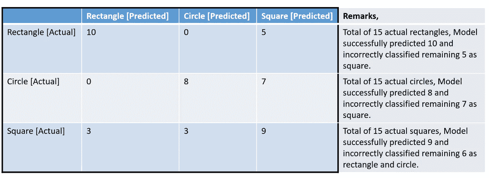

3[实际]* 3[预测]表的混淆矩阵。【**注:**备注栏是为了便于理解】

有了上面的矩阵，我们可以计算两个重要的指标来确定积极的预测率。

**精度:**精度标识预测 [**正类**](https://developers.google.com/machine-learning/glossary#positive_class) 时模型正确的频率。这意味着模型对正类的预测频率。让我们使用上面的矩阵来计算每个标签/类别的精度。

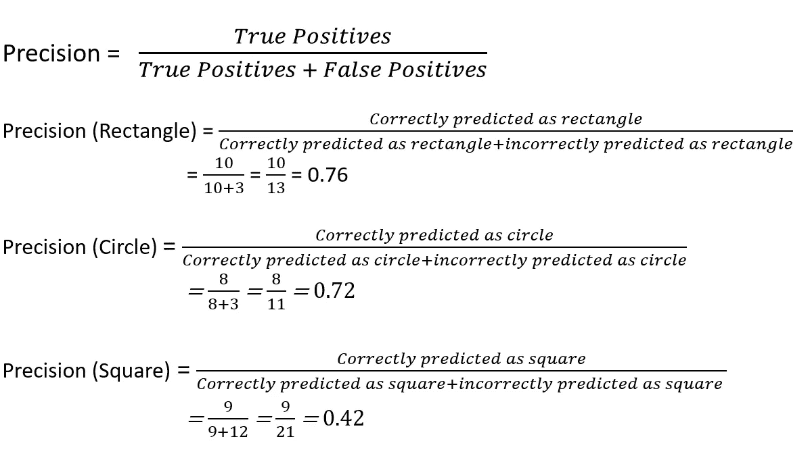

每个标签/类别的精度计算

通过以上计算，当预测为矩形形状时，该模型有 76%的时间是正确的。同样，当预测圆形和方形时，72%和 42%的时间是正确的。

**回忆:**该指标回答了以下问题:在所有可能的肯定标签中，模型正确识别了多少？。这意味着，正确识别的实际真阳性类别的百分比。换句话说，召回衡量的是正确预测的数量除以应该被正确预测的结果的数量。

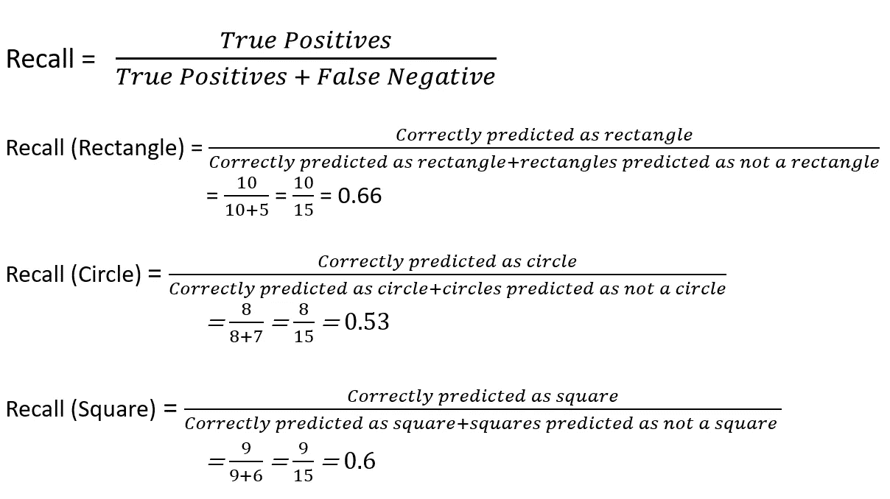

每个标签/类别的召回计算

以上仅仅意味着该模型对矩形、圆形和正方形的正确预测分别为 66%、53%和 60%。

如果阈值增加，那么正确预测的结果数量将下降，这将降低召回值。或者如果阈值降低，那么真实的预测将更高，这导致精度增加，但是将具有不正确的预测作为肯定类别。为了获得优化的度量，我们可以使用 **F1 度量**，其定义如下。这给了我们一个介于 0 和 1 之间的分数，其中 1 表示模型是完美的，0 表示无用的。一个好的分数告诉我们，该模型具有较低的假阳性(预测为矩形的其他形状)和较低的假阴性(未预测为矩形的矩形)。

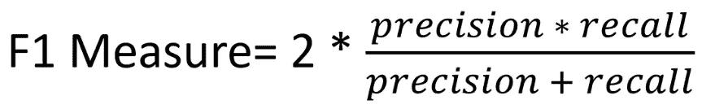

F1 度量公式

> 另一种评估技术称为 ROC[受试者操作特征]和 AOC[ROC 曲线下面积],它需要根据两个不同的参数绘制图表[针对不同阈值的真阳性率(TPR 或回忆)和假阳性率(FPR)]。然而，我们将在后面的文章中介绍这种评估技术。

上面描述的是用于嵌入了学习能力的系统的基本测试方法和评估技术。