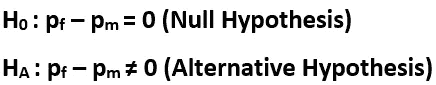
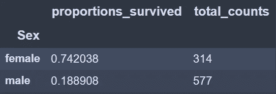

# 在 Python 中测试人口比例的差异

> 原文：<https://medium.com/analytics-vidhya/testing-a-difference-in-population-proportions-in-python-89d57a06254?source=collection_archive---------2----------------------->

[**统计检验**](https://en.wikipedia.org/wiki/Statistical_hypothesis_testing) 两组人口比例是否有显著差异。


由[叶夫根尼·斯米尔诺夫](https://unsplash.com/@smirik?utm_source=medium&utm_medium=referral)在 [Unsplash](https://unsplash.com?utm_source=medium&utm_medium=referral) 拍摄

我们得到了检验假设的数据。这里考虑的数据是著名的 [**Titanic 数据集**](https://www.kaggle.com/c/titanic/data) ，可以在 [**Kaggle**](https://www.kaggle.com/) **上找到。**

导入库:

```
import numpy as np
import pandas as pd
import scipy.stats.distributions as dist
```

**感兴趣的参数**

我们读取数据，并从数据集中只选择两个相关的列。列**‘幸存’**(1 如果个体在泰坦尼克号灾难中幸存，否则为 0)和变量**‘性别’**(表示个体的性别)。我们将感兴趣的参数设置为基于性别的泰坦尼克号灾难幸存者的比例差异。感兴趣的参数的公式为:


**感兴趣的参数**

```
data = pd.read_csv('train.csv')
data['Survived'] = data['Survived'].map({1:'Survived',0:'Not Survived'}) #Encode the values
data = data.dropna() #Drop the nan valuescontingency_table = pd.crosstab(data.Survived,data.Sex) #Contingency Table
contingency_table
```

输出:


数据的列联表

上表称为 [**列联表**](https://en.wikipedia.org/wiki/Contingency_table) ，为我们提供了每个类别的计数的交叉表视图。让我们将上述数字转换成比例，以便有个概念！

```
pd.crosstab(data.Survived,data.Sex).apply(lambda r:r/r.sum(),axis=0)
```

输出:


列联表(比例)

我们可以很好地判断(非正式地)幸存的女性和幸存的男性的比例有显著的差异。让我们用统计数据证明这一点！

**假设**

我们测试的假设是上述比例差是否为零或不等于零**(需要进行一个** [**双尾**](https://www.khanacademy.org/math/statistics-probability/significance-tests-one-sample/more-significance-testing-videos/v/one-tailed-and-two-tailed-tests) **测试)**。数学上，我们将其表示为:



**假设(空与备选项)**

**设置** [**显著性等级**](https://en.wikipedia.org/wiki/Statistical_significance)

我们预设显著性水平为 **0.10** (双尾检验的标准)

**假设**

1.  独立随机样本假设。
2.  样本的最佳大小(确保相对于总比例，每类至少有 10 个数据点)

我们必须确保样本量足够大，即每个类别中至少有 10 名幸存者和 10 名伤员。从数学角度来说，


它的对应代码:

```
total_proportion_survived = (data.Survived == "Survived").mean()num_female = data[data.Sex=="female"].shape[0]
num_male = data[data.Sex=="male"].shape[0]assert num_female*total_proportion_survived>10, "Assumptions not met"
assert num_male*total_proportion_survived>10, "Assumptions not met"
assert num_female*(1-total_proportion_survived)>10, "Assumptions not met"
assert num_male*(1-total_proportion_survived)>10, "Assumptions not met"
```

[**人口比例标准误差**](https://www.khanacademy.org/math/ap-statistics/two-sample-inference/two-sample-z-interval-proportions/v/confidence-intervals-for-the-difference-between-two-proportions)

总体差异的样本标准误差为(代码如下):


人口比例差异的标准误差。

```
#This table helps us to calculate the SE.
prop = data.groupby("Sex")["Survived"].agg([lambda z: np.mean(z=="Survived"), "size"])
prop.columns = ['proportions_survived','total_counts']
prop.head()
```



```
#Calculating standard error

variance = total_proportion_survived * (1 - total_proportion_survived)
standard_error = np.sqrt(variance * (1 / prop.total_counts.female + 1 / prop.total_counts.male))
print("Sample Standard Error",standard_error)
```


计算样本标准误差

**获取** [**检验统计**](https://en.wikipedia.org/wiki/Test_statistic)

在我们检查了**假设**成立之后，就该计算这个假设检验的检验统计量了。


检验统计量

**假设估计值是 0** (零假设)，我们有幸存的男性和女性的比例来得到最佳估计值(差值)。

```
# Calculate the test statistic 
best_estimate = (prop.proportions_survived.female - prop.proportions_survived.male)
print("The best estimate is",best_estimate)
hypothesized_estimate = 0
test_stat = (best_estimate-hypothesized_estimate) / standard_error
print("Computed Test Statistic is",test_stat)
```


最佳估计和测试统计计算

这意味着我们的样本比例差异估计值比我们的假设估计值高出 **~16.2 个标准误差**！

现在我们需要将其转换为 p 值，并根据显著性水平(由我们设定)测试我们的假设。

[**P 值计算**](https://www.khanacademy.org/math/statistics-probability/significance-tests-one-sample/idea-of-significance-tests/v/p-values-and-significance-tests?modal=1)

我们得到基于标准正态分布(零均值和单位标准差)计算的 p 值，通常称为 [**z 检验**](https://www.khanacademy.org/math/statistics-probability/significance-tests-one-sample/more-significance-testing-videos/v/z-statistics-vs-t-statistics) 。我们从**和**两个分布的尾部得到 p 值(取决于替代假设)。

```
# Calculate the  p-value
pvalue = 2*dist.norm.cdf(-np.abs(test_stat)) # Multiplied by two indicates a two tailed testing.
print("Computed P-value is", pvalue)
```


标准正态分布的 p 值

**推论**

我们可以清楚地看到，p 值远小于 0.10 的显著性水平。因此，我们可以安全地拒绝零假设，支持替代假设。**我们推断幸存雌性和幸存雄性的比例差异很大，当然不等于零**(雌性可能更容易接近救生艇)**。**

**参考文献**

1.  [**汗学院比例假设检验**](https://www.khanacademy.org/math/statistics-probability/significance-tests-confidence-intervals-two-samples)
2.  [**统计假设检验 Wiki**](https://en.wikipedia.org/wiki/Statistical_hypothesis_testing)

3.[**z 检验的 P 值计算(Python)**](https://docs.scipy.org/doc/scipy/reference/generated/scipy.stats.norm.html)