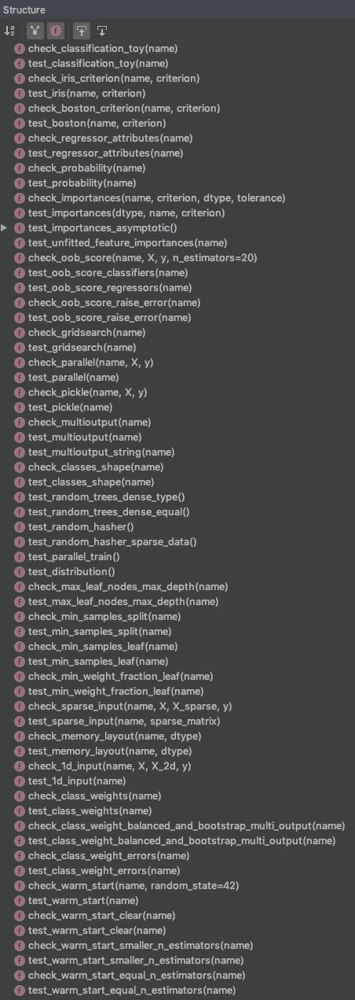
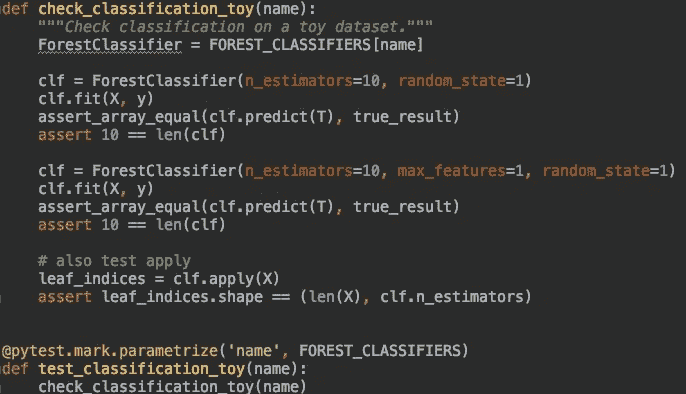
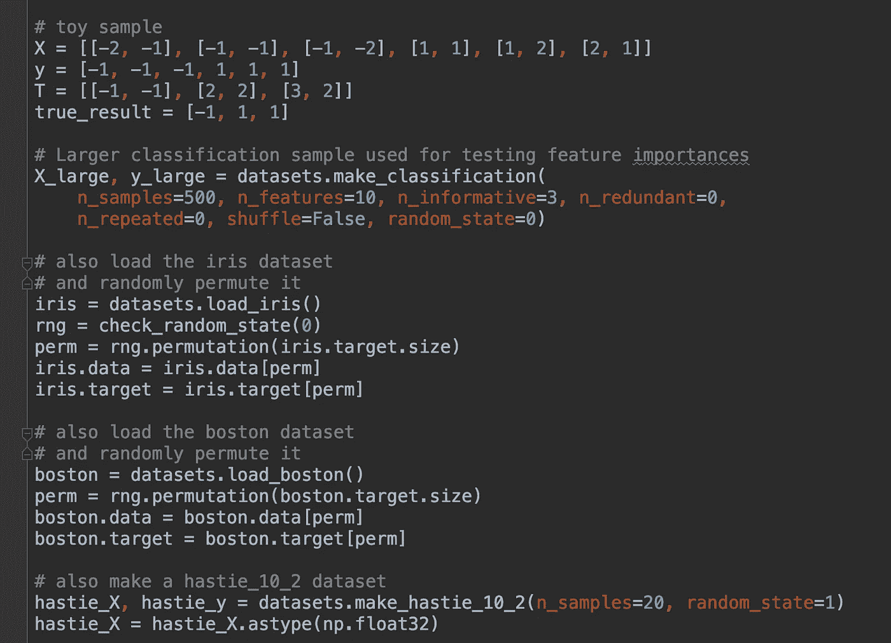
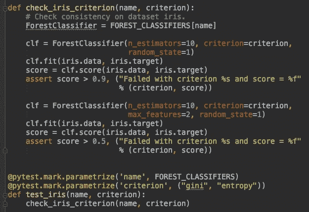
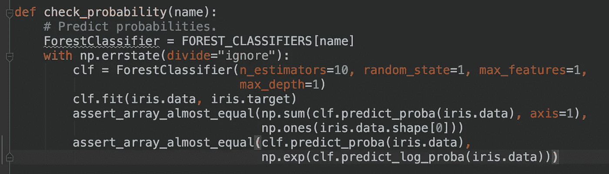
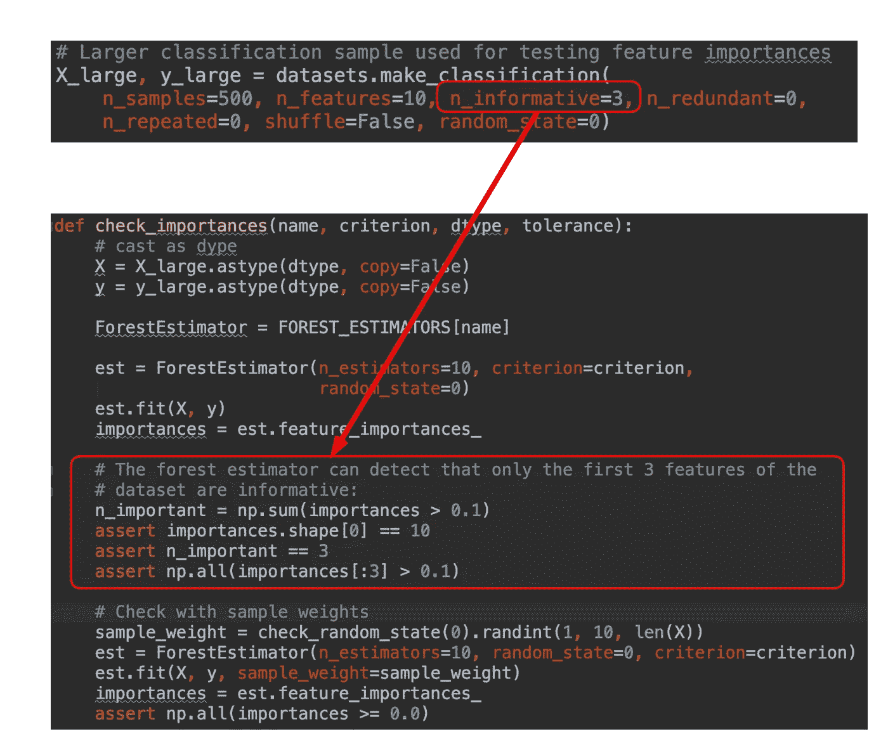
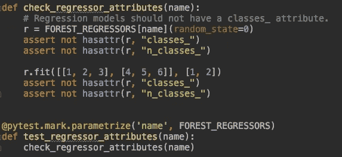

# 测试 ML 代码:Scikit-learn 是如何做到的

> 原文：<https://medium.com/analytics-vidhya/testing-ml-code-how-scikit-learn-does-it-97e45180e834?source=collection_archive---------1----------------------->

Scikit-learn 代码库中的时间旅行。

# **事件**

这一切开始于一天早上，一位数据科学家同事问我:
“我有测试用的所有东西的静态版本。但是对于 RandomForest 分类器，不能保证当我通过静态训练集时，我会得到与静态预测表相同的预测。我确实在 Numpy 和除\_(ツ)_/之外的所有地方播下了随机种子……”

测试 ML 代码对于构建健壮的机器学习管道是必要的。但是，测试文献不像其他软件工程学科那样全面。对于 ML 代码来说，在编写集成测试时有相当多的不确定性。这些集成测试实际上构建了模型。然后，他们尝试根据预定义的输入和输出来验证他们的行为。在这篇博文中，我们将概述 scikit-learn 中的一些测试策略。开发人员/维护人员使用测试来简化他们的开发。此外，测试有助于消除向现有估计器添加新功能的风险。

是时候深入研究 ML masters 编写的处理这个问题的代码了。

# 在哪里可以找到作为测试模板的 Scikit-learn 测试

我们从版本 **scikit-learn 0.21.x** 开始我们的旅程:

[https://github . com/sci kit-learn/sci kit-learn/blob/master/sk learn/ensemble/tests/test _ forest . py](https://github.com/scikit-learn/scikit-learn/blob/master/sklearn/ensemble/tests/test_forest.py)。

该文件实现了一组测试，用于验证一组树集合模型的行为。这些开发人员根据“森林”命名约定对这些模型进行了分组。

我们首先注意到的是一系列全面的测试。这些测试针对基于森林的模型系列:

test_forest.py 文件中的部分测试列表

接下来，我们注意到几乎每个“test_something”都有一个“check_something”函数。“test_something”函数使用 pytest 参数化测试功能。然后，它将测试输入传递给“check_something”。还要注意开发人员是如何添加“玩具”分类测试的。这允许他们调试与测试框架本身相关的问题。这消除了真正的图书馆问题的干扰。

使用 pytest 参数化进行测试，检查单个案例。

# 参考数据集

ML 开发人员在编写测试时主要关心的一个问题是“我应该为我的集成测试使用什么数据？”。我们正在看的 scikit-learn 测试是针对图书馆的。这可能与应用程序和 ML 产品不同。在产品中，目标数据集是不断波动的。然而，scikit-learn 开发人员提供的策略可以走很长的路。在这个测试文件中，开发人员创建了 5 个不同的数据集作为参考:

*   用于测试管道、接口和功能签名的玩具样本。
*   用于测试特征重要性的 500 个合成样本数据集。
*   iris 数据集和半真实世界数据集的波士顿数据集。
*   一个较小的 Hastie 数据集，与 T. Hastie、R. Tibshirani 和 J. Friedman 编写的经典 ML 书中的一个具体示例相匹配。2”，施普林格，2009 年

5 个具有各种测试特征的静态数据集

# 测试指标的范围

接下来，我们测试森林分类器是否按预期工作。第一批测试之一是测试模型的准确性。在下图中，测试首先在完整的 iris 数据集上进行训练，然后在相同的完整数据集上进行评分。使用相同的数据进行训练和测试，该模型具有可预测的得分，如下所示。我认为一旦开发人员运行了这个测试，就会记录一个稳定的下限。然后，他们能够设置阈值(0.9 和 0.5)来检测测试中的分类器是否有问题。

# 测试概率是否有意义

接下来是使用虹膜数据集的**检查概率**。这个函数在整个数据集上训练一个分类器。然后，它确保预测的概率总和接近 1。它还通过将对数概率与它们的指数进行比较来检查对数概率。注意 **assert_array_almost_equal 的使用。**如果两个对象的精度不相等，该函数将产生一个断言。这个函数允许开发人员调整他们测试的精度。这也允许在处理浮点数时有微小的差异。

# 使用合成数据集和噪声注入测试特定行为

接下来我们看看如何测试一个特定的行为。在这种情况下，我们有特征重要性。这些额外的信息是树集合算法的副产品。开发人员使用自定义数据集，该数据集具有适当数量的信息特征。在下图中，他们确保合成数据集具有 3 个信息特征。他们确保它们也将成为前三个特性。然后，开发人员检查分类器是否报告了三个最重要的特征。它们还包括一个特定的预先计算的阈值。

为了平衡这个测试，dev 还在原始数据集中包含了一些“噪声”。devs 通过包含样本权重来包含噪声。这具有打乱初始特征信息含量的效果。这种混排导致所有特征的重要性都不为零。这是为了确认当没有信息过多的特征时，分类器的行为符合预期。dev 能够通过随机化样本权重在合成数据集中添加噪声。

使用带有自定义信息变量的合成数据集来测试特征重要性

# 测试 API

有一组测试与测试 API 本身相关。我们来看下面的 **check_regressor_attributes。**它确保回归变量在拟合后不会得到“classes_”和“n_classes_”属性。这些属性应该只出现在分类器中。

其他此类测试包括:

*   **检查 _ 腌制**检查可采摘性。
*   **check_parallel** 分类检查并行计算。
*   **check_gridsearch** 检查基树是否可以进行网格搜索。
*   **check_warm_start** 检查热启动增量拟合是否给出了正确大小的森林以及与正常拟合相同的结果。

还包括特定于林/树的 api 测试，例如

*   **检查 _ 最小 _ 样本 _ 分割**
*   **检查 _ 最大 _ 叶 _ 节点 _ 最大 _ 深度**
*   **check_min_samples_leaf**

# 结论

这是开发人员添加到 scikit-learn 中的大量测试中的一小部分。由于其在行业中的重要性，scikit-learn 库必须保持灵活性，以添加新的特性和评估程序。开发人员和维护人员使用这些测试来防止代码腐烂、僵化和脆弱。

我们讨论了以下内容:

*   **在哪里可以找到作为测试模板的 Scikit-learn 测试。**
*   **如何制作静态参考数据集？**
*   **测试指标的范围。**
*   测试概率是否有意义。
*   **使用合成数据集和噪声注入测试特定行为。**
*   开发人员如何测试分类器的公共 API。

那都是乡亲们！

我希望你喜欢这篇文章。它旨在帮助你提高你的机器学习项目测试技能。

> 请注意，这篇文章中表达的观点是我个人的，不一定是我雇主的观点。

> 我们在招人！如果您对此感兴趣，请查看 Xandr 数据科学平台工程的空缺职位:
> 
> [https://xandr . att . jobs/job/new-York/data-science-platform-engineer/25348/12859712](https://xandr.att.jobs/job/new-york/data-science-platform-engineer/25348/12859712)