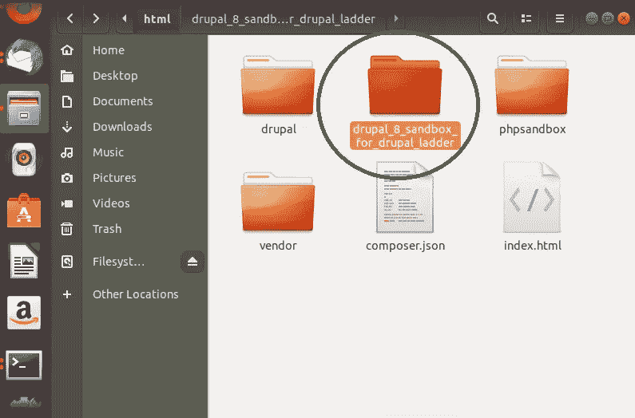
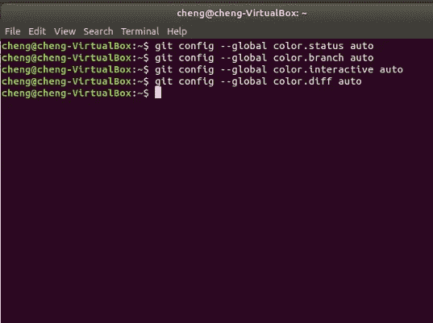
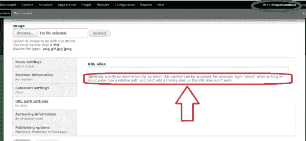
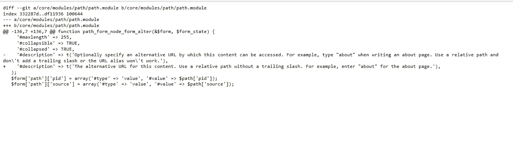
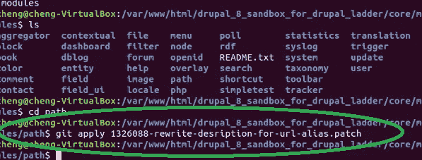
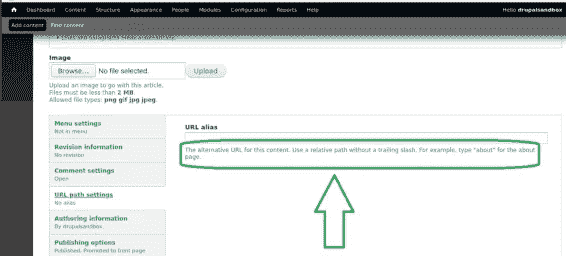

# 测试补丁——为我们的社区“Drupal 社区”做贡献的一种快速简单的方法

> 原文：<https://medium.com/analytics-vidhya/testing-patches-a-quick-and-easy-way-to-contribute-to-our-community-the-drupal-community-eb939f968289?source=collection_archive---------26----------------------->

# 简介；

在本教程中，我们将看看如何测试由 Drupal 社区的其他成员提交给[发布队列](https://www.drupal.org/project/issues/drupal)的补丁。

在进入主题的核心之前，让我们快速了解一下补丁到底是什么

*什么是补丁？*

简而言之，一个补丁就是一个由*添加*、*删除*或*修改*组成的文件，这些修改或者被带到 **Drupal 核心**或者各种**贡献的模块/主题**。

既然你们已经基本了解了补丁是什么，让我们跳到测试问题队列中提交的补丁所涉及的步骤。

# 台阶；

所有步骤的详细说明可以从[这里](http://drupalladder.org/lesson/93887717-c398-2434-394c-cf10851b4f1c)获得。在这篇博文中，我将只解释每个必要步骤的要点，并附上截图，以帮助你轻松掌握整个概念。

> ***第一步；为 Drupal 阶梯安装沙箱***

尽管我已经安装了沙盒很长时间了，我还是要简单地介绍一下安装它的步骤。

首先，进入终端(我在 ubuntu 上),通过运行以下命令在本地 web 服务器(var/www/html)的根目录下克隆 Drupal ladder 的沙箱

```
git clone --branch 8.x https://git.drupal.org/sandbox/bhirsch/1388780.git drupal_8_sandbox_for_drupal_ladder
```

克隆完成后，您可以通过在浏览器上托管来继续安装。一旦进入安装页面，你将被提示语言设置、**数据库基本配置**等

页（page 的缩写）s；一定要记得为你的沙箱创建一个数据库。否则它不会工作。

这是我的网络服务器根目录下 Drupal 梯形文件夹的*沙箱的截图*



Drupal 8 sandbox for Drupal ladder 在 var/www/html 下载

一旦沙盒安装完毕，您就可以进入下一步了

> ***步骤 2’命令使 git 更加易读***

我想明确指出，这一步是可选的，只应执行一次，因为选项将保存在您的。gitconfig 文件。

在终端上运行的命令如下

```
git config --global color.status auto 
git config --global color.branch auto 
git config --global color.interactive auto 
git config --global color.diff auto
```

下面是一张截图



在终端上运行命令

> ***第 3 步“在本地安装的沙盒上找到问题***

在下载基本上是修复问题的补丁之前，必须确保我们能够重现最初的[课](http://drupalladder.org/lesson/93887717-c398-2434-394c-cf10851b4f1c)中给出的问题。默认情况下，[问题](http://git config --global color.status auto  git config --global color.branch auto  git config --global color.interactive auto  git config --global color.diff auto)已经包含在沙箱中

要检查这个问题，请访问您的 Drupal 沙盒

```
localhost/name of your sandbox
```

从那里点击(1) **添加内容** (2) **添加文章** (3) **URL 路径设置**，并确保您看到我在下面的截图中用红色圈出的内容。



找到错误

如你所见，我们在 drupalsandbox 中，我找到的问题在上面用红色圈出

我们将要测试的补丁已经被设计成将特定的测试改变成更容易理解的东西。

> ***步骤 4‘下载补丁***

根据本课，要求下载注释 2 中的[补丁。](https://www.drupal.org/node/1388832#comment-5948668)

这里是补丁本身的截图



注释 2 中的补丁

下载它并将其放在本地 web 服务器的根目录下

完成后，按照步骤 5 中的说明继续应用补丁。

> ***第五步‘应用补丁***

一旦下载，我们必须应用补丁，看看它是否工作，并执行所需的任务，即改变上面用红色圈出的文本。

要应用补丁，请在终端上运行

```
git apply 1326088-rewrite-desription-for-url-alias.patch
```

**注；“***1326088-rewrite-description-for-URL-alias . patch”是补丁的名称。你应该在你的系统上用这个名字保存它*

这是我应用补丁时的截图



应用补丁

正如你所看到的，补丁已经应用干净。

> ***第六步‘测试补丁***

最后，回到您在 localhost 上的沙盒项目。

从那里点击(1) **添加内容** (2) **添加文章** (3) **URL 路径设置。**

检查文本是否已更改为修补程序中指定的文本

下面是截图。(变化用绿色圈出)



文本已更改

如您所见，文本已经更改，这意味着补丁已经成功应用。变化用绿色圈出(将它与上面用红色圈出的变化进行比较，以查看不同之处。

如果您想在完成测试后撤销应用的更改，只需在终端上运行

```
git reset --hard
```

就是这样…就像测试补丁一样简单。如果这是一个真正的问题，您将不得不在该特定项目的**问题页面**上报告该补丁已正确应用。如果失败，您必须在问题页面上报告该补丁没有按预期工作。

# 综上所述；

这是一个美好而丰富的任务，让我可以开始测试补丁

我已经开始审查补丁的问题队列今天本身，并将继续这样做，从现在开始

我希望获得越来越多的知识，以便能够编写补丁来帮助 Drupal 社区的其他成员解决他们的问题

也就是说，谢谢你的阅读，祝你旅途愉快…