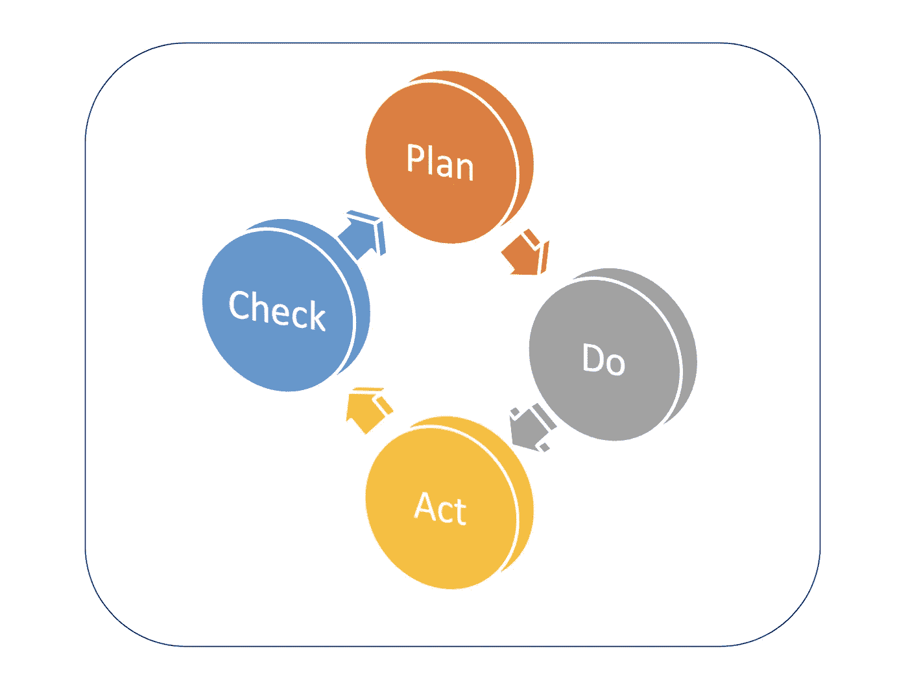
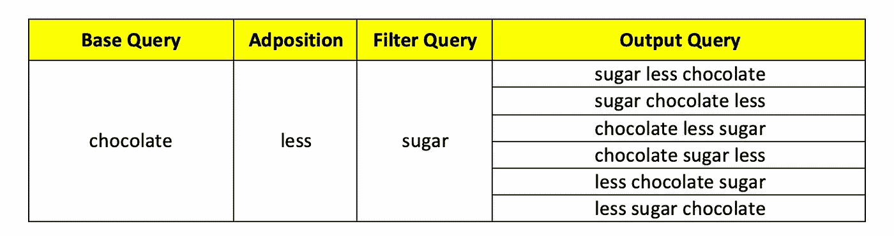

# 基于 AI/ML 的电子商务搜索模型的查询理解自动化测试

> 原文：<https://medium.com/analytics-vidhya/testing-query-understanding-ai-ml-based-model-for-an-ecommerce-search-d559510b82f?source=collection_archive---------14----------------------->

> ***“在人工智能上度过的一年，足以让人相信上帝。”****——*艾伦·珀利斯

在各个领域应用人工智能和机器学习模型来解决使用简单代码和算法无法解决的复杂问题方面，已经有了巨大的增长。因此，对于公司来说，围绕这一不断发展的技术拥有更好的质量流程已经成为一种必要。

> **机器学习(ML)** 是人工智能的一个子集，被定义为对数学/统计&算法模型的科学研究，计算机使用这些模型来完成特定的任务，而不使用明确的指令，而是依靠不同的模式和推理。机器学习算法是使用样本数据构建训练的，称为“**训练数据**”，以预测和提供输出，而无需显式编程来完成所需任务。

在解决各种问题中使用的不同类型的机器学习模型可以使用下图来说明。

此处参考图表[的更多详细说明。十大二手 ML 模型。更多详情请参见此处的](https://towardsdatascience.com/notes-on-artificial-intelligence-ai-machine-learning-ml-and-deep-learning-dl-for-56e51a2071c2)[。](https://www.natureknowsproducts.com/the-10-algorithms-every-machine-learning-engineer-should-know/)

本文以一个电子商务杂货应用程序为例，解释了测试搜索中常用的 AI / ML 模型的质量保证策略的要点。

这些机器学习模型可以集成到电子商务搜索应用程序的多个层次中。这些可能是-

*1。在用户输入到达搜索引擎之前。*

*2。在接收到搜索引擎结果之后。*

# **在用户输入到达搜索引擎之前:**

这种集成的例子有

1.  **预测文本**
2.  **自动完成**
3.  **智能作曲**
4.  [**查询了解**](https://towardsdatascience.com/understanding-the-search-query-part-i-632d1b323b50?source=---------11------------------)

这些可以是基于**深度学习、自然语言处理(NLP)** 、**神经机器翻译(NMT)** 、**序列到序列模型** ( **Seq2Seq 模型**)等。

# **收到搜索引擎结果后:**

这种集成的例子有

1.  **动态关联调整**
2.  **个性化搜索**
3.  **相关搜索**
4.  **相似搜索**

这些可以基于**添加到购物车、订单转换算法、分类相似度**以及基于**规范化或分数计算**、使用 CBOW 或**跳格模型**嵌入的 **Word2Vec、具有**线性神经网络(LNN)** 的 seq2seq 模型、脸书的 **FAISS** 。**

随着这些机器学习模型的出现，质量保证工程师必须确保模型中使用的概念、公式和技术得到彻底测试，以便这些模型一旦与服务集成，就能提供预期的结果。因此，必须使用 **PDCA 循环**来测试&是否在生产中成功部署。更多详情请参考下面的链接。

[QA 机器学习模型 PDCA 循环](https://vitalflux.com/qa-machine-learning-models-pdca-cycle/)

然而，这些周期并不容易维持，因为测试人员必须想出不同的测试技术来签署模型的输出。测试人员必须面对的一些问题是

1.定义一个 [**测试甲骨文**](https://en.wikipedia.org/wiki/Test_oracle) 。确定正确的预期输出验证器来验证结果。这必须基于使用一些实用程序或定制功能或变形测试所期望的功能来创建或使用。

***变质测试*** 是一种基于已有测试用例，特别是那些没有产生任何失败的测试用例，来创建后续测试用例，以发现未发现问题的技术。它不是一种测试用例选择的方法，而是一种重用输入测试数据来创建多个测试用例的方法，这些测试用例的输出是可以预测的。

在变形测试中，对于输入 x，如果应用变换函数 T，将产生输出 T(x)。这种类型的变换是函数的变形性质，基于该性质，可以相对于 f(x)的值来预测 f(T(x))的输出。

变形测试示例。

2.**对立的例子—** 这些是机器学习模型的不同形式的输入，它们是为了让模型出错而有意创建的。它们充当了程序的视错觉。这些也被称为**数据中毒**。在**搜索查询**的情况下，你可以通过交换输入的搜索词来添加一定的噪音，看看模型是否能正确预测用户意图并提供所需的输出。更多详情请参考[这里的](https://openai.com/blog/adversarial-example-research/)。

3.**特性测试—** 这在测试机器学习模型的不同方面起着关键作用。以下 7 个标准有助于评估和确认模型的预期输出。更多详情参见[此处](https://vitalflux.com/quality-assurance-testing-machine-learning-model/)。

*a)* ***特征阈值*** *b)****特征相关性*** *c)****特征关系*** *d)****特征适宜性*** *e)****特征符合性***

*4. [**定义测试数据**](https://scholar.google.com/scholar?q=defining+test+data+for+machine+learning+models&hl=en&as_sdt=0&as_vis=1&oi=scholart) —它是任何测试数据驱动的自动化或测试方法的核心。质量工程师应确保测试数据划分(例如**训练** [65%]、**验证** [20%] & **测试数据** [15%]集)正确完成&模型训练时不引用&使用相同的数据集。更多详情参见[此处](https://en.wikipedia.org/wiki/Training,_validation,_and_test_sets)。*

*5.**交叉验证技术** —在这种技术中，机器学习模型对数据采样活动后创建的数据进行多次测试迭代。这证实了结果是一致的，并且能够在大多数时候完美地预测它。更多详情请参见[此处](https://en.wikipedia.org/wiki/Cross-validation_(statistics))。*

*6.[**模型评估度量**](https://learning.oreilly.com/library/view/evaluating-machine-learning/9781492048756/ch02.html#idp6624) —有一些度量是基于这些度量来评估模型的效率&相关性的。这里使用的关键术语有*

**a)* ***阈值*** *b)****真阳性*** *c)* **真阴性** *d)****假阳性*** *e)****假阴性****

*使用上述关键术语，可得出以下评估指标。更多[参见此处](/analytics-vidhya/testers-guide-for-testing-machine-learning-models-e7e5cea81264)。*

**a)* ***分类精度*** *b)****混淆矩阵*** *c)****精度*** *d)****回忆**** 

**所以，现在让我们从在线杂货电子商务中上述搜索用例之一的自动化方法开始。**

## **[**测试查询理解模型:**](https://towardsdatascience.com/understanding-the-search-query-part-i-632d1b323b50?source=---------11------------------)**

**在搜索引擎给出分数并对其结果进行排名之前执行以下两个步骤——即，**

1.  **搜索者以查询形式传达意图的方法。**
2.  **搜索引擎找到这个意图的方法。**

**我们在这里测试的应用程序是一个 ML 模型，它被称为**鳄鱼模型** & **完整的查询意图。**基于人工神经网络，特别是时间序列 NN，即**递归神经网络**，它使用**[**【LSTM】**](http://colah.github.io/posts/2015-08-Understanding-LSTMs/)和 **CRF(卷积随机场)**作为概率模型。****

****reference—[https://guillaumegenthial . github . io/sequence-tagging-with-tensor flow . html](https://guillaumegenthial.github.io/sequence-tagging-with-tensorflow.html)****

****该模型可以基于**营养、品牌&类别、**等。在线杂货电子商务。****

****现在，让我们以**基于营养的查询理解模型** &为例，数据应该如何用给定字符串的不同排列组合来形成。****

> *******数据生成*******

****找到用户的**基本查询**意图。
例如**巧克力**。****

****连接**介词**和**后置**(合称为**后置)。** 如 **with，free，less，no，with，**等。****

****使用单个或多个营养过滤器组件将**过滤器查询字符串**与 adpositions 连接。(如**鸡蛋、无糖、无鸡蛋、有大豆、非蔬菜、无麸质、无、无坚果、**等。)****

******输出**用户查询 string = " **无糖无蛋巧克力**"。****

********

****使用给定输入置换的数据发生器****

****为了生成数据集，使用递归树构建定制的随机化函数，用于给定基本查询、过滤查询和广告位置的排列。过滤查询也可以像**品牌、类别、**等。其中**类别**遵循不同的模型&测试方法。这将在测试查询理解模型的下一部分中讨论。****

********

****[使用递归树](https://www.google.com/url?sa=i&url=https%3A%2F%2Fwww.geeksforgeeks.org%2Fwrite-a-c-program-to-print-all-permutations-of-a-given-string%2F&psig=AOvVaw29YOEK97XLISanQuBJkC91&ust=1581400478835000&source=images&cd=vfe&ved=2ahUKEwiWjsr_pcbnAhVMdpQKHXSJDEwQr4kDegUIARDdAQ)****

****因此，数据集可以按以下方式分类。****

****1.基础查询+前置+过滤查询(**营养或品牌** )*****

****2.基础查询+过滤查询+后置****

****3.过滤查询+后置+基本查询****

****4.过滤查询+基本查询+后置****

****5.介词+过滤查询+基本查询****

****6.介词+基本查询+过滤查询****

****7.在基本查询或过滤查询组件或 Adpositions 或所有组件中拼写错误。****

****8.基本查询和过滤查询组件之间有或没有空格。****

****9.使用 No、Non、Less、Free From、With、With、Without、And 等特殊字符( ***、—*** 等。)在基本查询或多个过滤器组件之间(例如，此处为营养)。****

# ****自动化流程图****

****在高层次上，我们遵循下面的方法来验证测试结果&评估基于营养的查询理解的模型输出。****

********

****自动化流程图****

****我们的**模型验证器**测试从**随机查询生成器**开始，其中是使用**递归树对****基本查询& Adpositions** 进行排列的搜索项生成器方法，如上所述。这作为**数据提供器**的输入。然后，测试对**模型服务**进行 REST 调用，它是我们的 **AUT** (测试中的应用程序)。********

****然后调用**过滤器属性验证器**，这是一个自定义函数，编写为 ***测试 Oracle*** ，根据测试人员创建的用户查询生成预期输出。一旦我们有了实际的&预期值，这将被传递到 **isMOPcorrect** (模型输出正确吗)方法，用于比较(模型服务)的实际输出与(过滤器属性验证器)方法生成的预期输出。这种方法也有助于根据****设置的*** w.r.t 自动化测试数据计算 ***真阳性、真阴性、假阳性、假阴性***计数。*********

****基于每个测试的上述参数，数据与**模型评估器**共享，模型评估器评估模型的度量，如**分类准确度、混淆矩阵、精确度、召回、F1 度量。**因此，这些指标将给出模型期望输出的置信度&数据科学家训练的数据输出& QA 测试数据之间的比较，并修复模型的任何缺陷/缺点或限制。****

******结论******

****通过这篇文章，我们了解了一个电子商务搜索 的 ***测试基于 AI/ML 的模型和查询理解模型的重要齿轮。测试电子商务搜索的不同 AI/ML 用例的进一步方面将在本博客的下一部分继续。*******

****快乐阅读！！如果你读到这里，感谢你的耐心。请给予反馈，敬请期待更多信息..！！:)****

******参考文献&灵感******

****[1] [Sonu Sharma](https://towardsdatascience.com/@sonusharma.mnnit?source=post_page-----632d1b323b50----------------------) ，(2019)[理解搜索查询](https://towardsdatascience.com/understanding-the-search-query-part-i-632d1b323b50?source=---------11------------------)****

****[2] [Sonu Sharma](https://towardsdatascience.com/@sonusharma.mnnit?source=post_page-----632d1b323b50----------------------) 、(2019)、 **[** [鳄鱼模型](/analytics-vidhya/understanding-the-search-query-part-ii-44d18892283f) ] & [ [整个查询意图](/analytics-vidhya/elmo-embedding-the-entire-intent-of-a-query-530b268c4cd)****

****[3] [墨菲等人(2008)](http://ecommons.luc.edu/cgi/viewcontent.cgi?article=1036&context=cs_facpubs#page=896)****