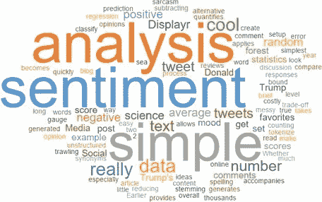
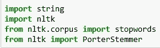
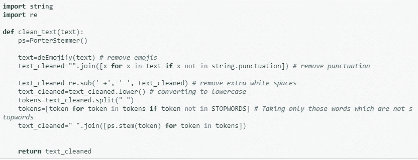
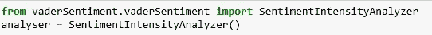
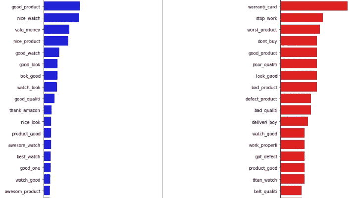

# 亚马逊顾客评论的文本分析

> 原文：<https://medium.com/analytics-vidhya/text-analysis-of-amazon-customer-reviews-b4fcf0663216?source=collection_archive---------7----------------------->

首先，让我们快速了解什么是文本分析，以及企业如何在此帮助下做出基于事实的决策。

文本分析是将非结构化文本数据转换为有意义信息的过程。我们通常从网站上提供的各种客户产品评论中获取这些信息。通过这种方式，公司可以很容易地发现问题，以及客户在使用他们的产品时遇到的优势。

因此，让我们开始从巨型电子商务平台——亚马逊的这些顾客评论中产生一些见解。

**清洁**

从亚马逊网站上搜集的评论只是原始数据。大多数评论包含表情符号、不需要的空格和类似“\n”的字符。在使用这些评论进行任何分析之前，必须对其进行清理。

要执行的任务有:

1.  删除' \n '
2.  移除表情符号
3.  删除标点符号
4.  删除多余的空格
5.  移除停用词-停用词是那些出现频率很高但不需要进行分析的词，因为它们无法提供任何见解。移除它们将减少计算量。包括我、我、我自己、那个、他等词。

为此，必须导入以下库:

下面定义的函数执行所有这些任务:

将此功能应用于“评论”列。

**对评论进行情感分析**

下一步是了解客户是否给出了正面、负面或中立的评价。这可以通过使用库**‘维德’来完成。**

上面的函数返回一个字典，包含一个正的、负的和复合的分数。这些分数中的任何一个都可以用来寻找情感。在这种情况下，只考虑复合分数。

以下两个函数将有助于仅提取复合分数:

类似于*清理*过程，对 reviews 列应用 compound_score()函数，以获得一个新列，显示每个评论的复合分数。

现在，我们得到了复合分数。下一步是根据综合得分将评论分为正面、负面和中性。

对 scores 列应用此函数以获得评论类别。

**生成文字云**

要了解更多评论中常用的词汇，无论是正面的还是负面的，我们可以使用 **wordcloud** 库。

上面的代码给出了正面评论的单词云。同样的代码，稍加修改，也可以用来生成负面评论的文字云。

**最后分析评论**

首先，我们找到正面和负面评论中出现频率最高的词。为此，我们提取所有的正面评价，并将其存储在一个列表中(负面评价也是如此)。

为了统计出现的频率，使用库**集合**。

上面的函数返回正面和负面评论列表中最常出现的 20 个单词的列表，其中每个单词都作为参数传递。所需的字数可以在论证中改变。

这里我们只寻找单个单词。这些词被称为**单字。**

为了更好地理解分布，我们可以创建这些单字的条形图。以下函数将有助于生成条形图。

这个函数将正面和负面评论列表作为参数传递，以获得各自的条形图。

unigrams 的条形图不能清楚地理解客户想要表达的意思。所以，我们更进一步。我们为正面&负面评价中最常见的**二元模型**创建柱状图。Bigram 是两个相邻单词的组合。

因此，我们定义了一个函数，它将创建二元模型并将其存储在一个列表中。

上面的函数可以用来创建 **n 元图。**如果 n=2，那么就是二元组；n=3，则为三元组，以此类推。因此，这里我们传递各自的列表(正面或负面)和 n=2 作为参数，以分别获得正面和负面评论的二元模型。

然后创建的列表作为参数传递给 plotMostCommonWords()函数以获得条形图。

从上面的柱状图我们可以看出，正面评价中最常见的二元模型是 good_product、nice_watch、value_money 等。然而，在负面评论中，常见的二元结构是保修卡、停工、最差产品等。

对三元模型、四元模型等等也可以做同样的事情，只需要改变“n”的值。

这些柱状图可以帮助公司从客户的角度了解他们产品的优点和面临的问题。这些问题可以得到解决和改进，以提高客户满意度。

要获得分析客户评论的完整代码，请单击下面的链接:

