# 印度媒体的文本分析

> 原文：<https://medium.com/analytics-vidhya/text-analysis-of-indian-media-d752de376099?source=collection_archive---------23----------------------->

量化不同媒体渠道之间的距离

使用文本分析来理解印度媒体关注的主题，并能够量化不同媒体机构之间的相似性。

# 最终结果预览

我们的最终结果将是一个仪表板，它将根据所选的术语可视化媒体网点的网络图。以下是“中国”一词的搜索结果

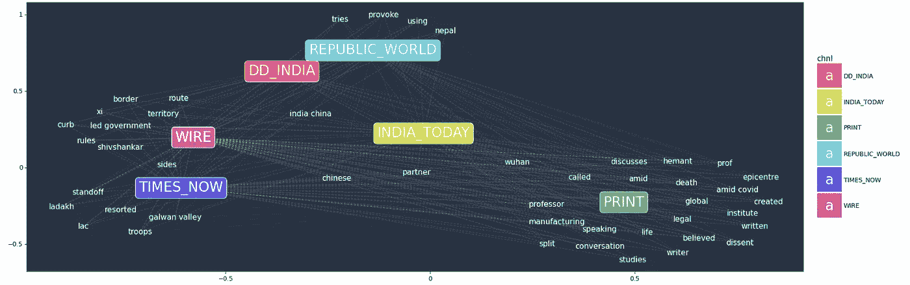

“中国”的结果

# 数据

我们拥有的数据基于 YouTube 视频。我们已经从选定的新闻频道提取了视频元数据，并将在我们的分析中使用为每个视频提供的标题和描述。下面是可用数据的预览。

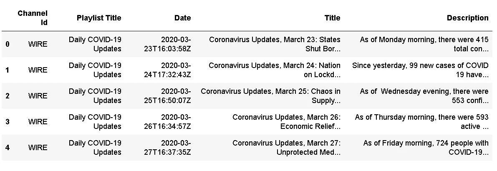

*   数据中的每一行代表一个视频

有 5 列

1.  **频道 Id** —提供印度媒体频道 Id，可用于唯一识别该频道
2.  **播放列表标题**是视频所在的播放列表的标题
3.  **日期** —该集出版的日期
4.  **标题** —视频的标题
5.  **描述** —视频的描述

# 数据预处理

*   将*标题*和*描述*列合并为“文本”列

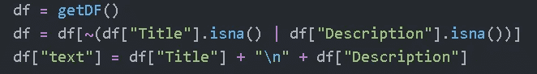

*   向量化文档

为了对文档进行矢量化，我们使用 NLTK 库中的定制标记器— RegexpTokenizer 来过滤数字术语和少于 2 个字符的术语。

我们通过 tokenizer 关键字将自定义的 tokenizer 传递给 CountVectorizer

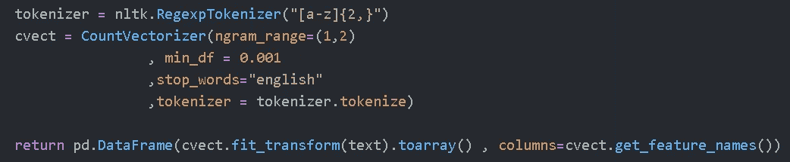

[计数矢量器](https://scikit-learn.org/stable/modules/generated/sklearn.feature_extraction.text.CountVectorizer.html)将一组文本文档转换为令牌计数矩阵，并输出如下矩阵

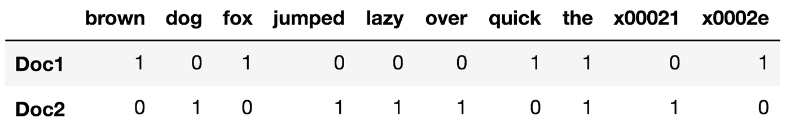

# 算法

现在我们有了每个视频的数字表示，我们继续计算距离。

1.  首先，我们根据频道对视频进行分组
2.  然后，对于每个组，我们转置数据帧并计算成对距离。

—通过换位，我们将单词/术语作为行，将每个视频作为列。因此，现在当我们使用 [pairwise_distance](https://scikit-learn.org/stable/modules/generated/sklearn.metrics.pairwise_distances.html) 时，它计算单词/术语之间的距离，而不是视频之间的距离。

3.在我们有了 x 项距离后，我们简单地合并不同组的结果

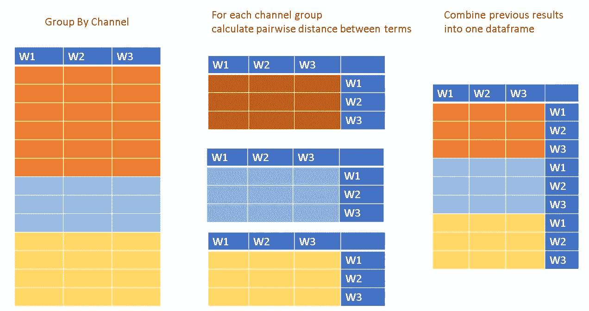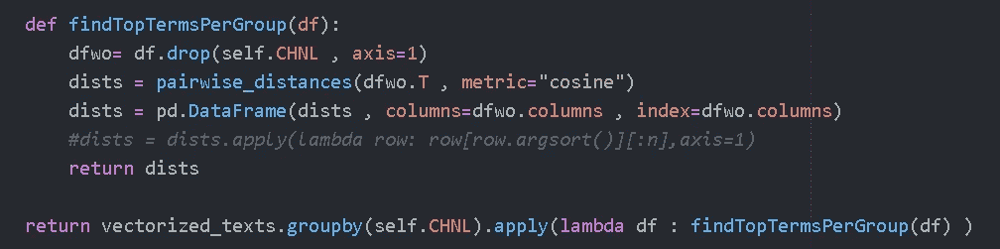

代码来实现以上功能

4.现在我们有了“项 x 项”矩阵，我们使用该矩阵来计算通道之间的距离。

5.对于每个术语，我们从“术语 x 术语”矩阵中分离出它的向量，方法是对与术语对应的列进行排序，并挑选最接近的 n 个术语。

如下例所示，W1 和 W2 是出现在前 4 名中的唯一术语，因此我们将在下一步中使用它们。

6.现在，我们在通道上旋转矢量，并计算通道之间的成对距离(欧几里德距离)

7.最后一步是融合距离，这样我们只有 3 列。第 1 列和第 2 列表示通道对，第 3 列表示两者之间的距离

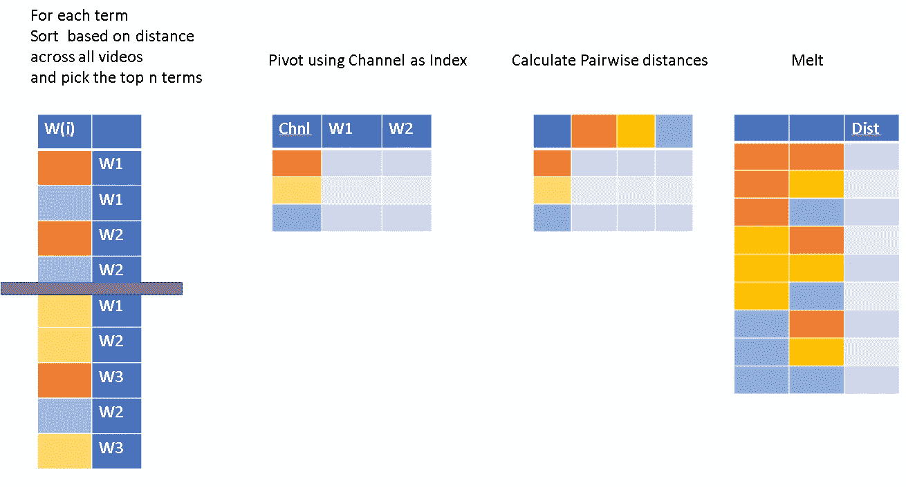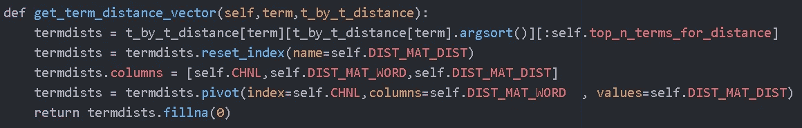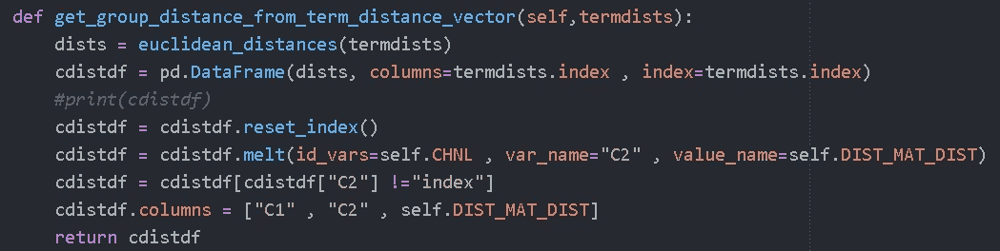

# 形象化

现在我们有了可视化所需格式的数据。

我们进行了两次计算

1.  术语 X 术语距离
2.  通道 X 通道距离

因此，我们可以做两种类型的可视化

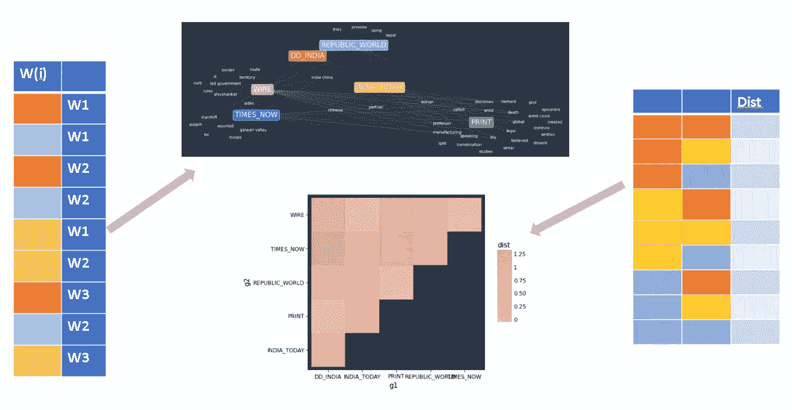

术语 x 术语距离可用于创建网络图，而通道 x 通道距离可用于生成热图。

由于热图非常简单，我们将重点关注网络可视化。

**网络可视化**

我们已经有了包含所有术语的术语距离，所以现在我们使用 [NetworkX 库](https://networkx.github.io/)将距离值作为边距离来定位网络形式中的术语和通道。

给定一个术语的距离向量，对于向量中的每一行，我们创建一个加权边，其中权重是距离值。

然后我们使用 [Fruchterman-Reingold 力定向算法](https://networkx.github.io/documentation/networkx-1.11/reference/generated/networkx.drawing.layout.fruchterman_reingold_layout.html)将节点放置在反映它们彼此距离的位置上

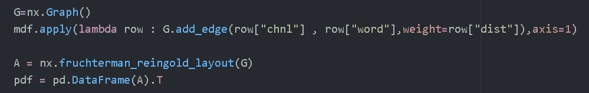

既然我们已经将网络位置保存在 pdf 数据帧中，我们只需绘制它们。

对于绘图，我们使用类似于 R 中 GGPLOT 的图形 API 语法，由 [plotnine](https://plotnine.readthedocs.io/en/stable/) 提供。

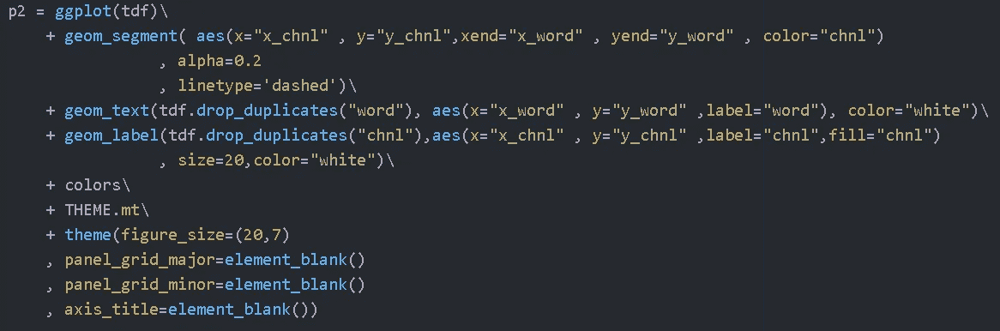

对于每条边，我们添加一条线段。对于每个单词，我们在图中添加一个文本几何，对于每个通道，我们添加一个标签。Rest 代码用于定制颜色和主题，并消除混乱。

下面是术语“中国”的最终输出

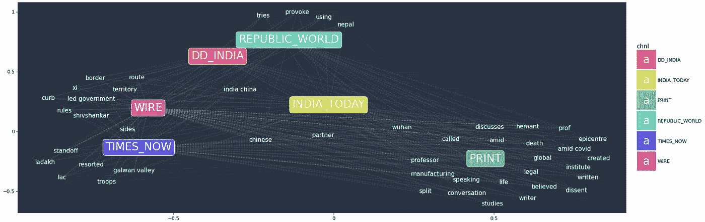

如果你喜欢这篇文章或者有建议和反馈，请随时联系 LinkedIn