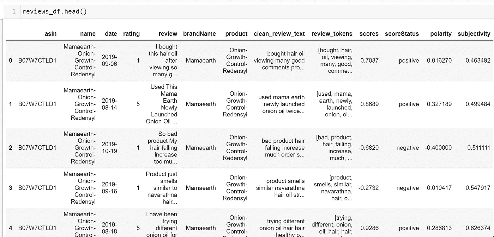

# 亚马逊印度产品评论数据的文本分析

> 原文：<https://medium.com/analytics-vidhya/text-analysis-on-the-reviews-data-of-indian-products-in-amazon-a9c21709c4d8?source=collection_archive---------0----------------------->


凯尔·格伦在 [Unsplash](https://unsplash.com/s/photos/free?utm_source=unsplash&utm_medium=referral&utm_content=creditCopyText) 上的照片

本文的目的是利用不同的自然语言处理方法，如 NLTK 和 Spacy，探索和分析亚马逊上印度产品的评论数据集。也可以用 NLTK Vader 和 TextBlob 进行情感分析。

情感分析量化文本中单词和短语的情感强度。情感分析工具会处理一个单位的文本，输出量化的分数来表示+ve/-ve。NLTK VADER 情感分析工具为给定的输入生成+ve、-ve 和中性情感分数。情感分析对于企业评估客户反应至关重要。

文本数据是非结构化数据集，借助各种 Python 库，深入探索和分析并提取对业务决策有意义的见解变得非常有效。

数据集在 ka ggle[https://www . ka ggle . com/nehaprabhavalkar/Indian-products-on-Amazon](https://www.kaggle.com/nehaprabhavalkar/indian-products-on-amazon)

作为 NLP 分析过程的一部分，典型的流水线是记号化=== >清理数据=== >移除停用词===> BoW=== >分类模型训练

作为第一步，我们加载所有需要的 python 库。接下来，我们将数据集读入系统:


有五个栏目，名字，日期，评分，评论。将检查 dataframe 和 null 列的维度。我们可以看到 4 行的 review 列有空值，因此我们删除这 4 行并重置索引:


作为预处理步骤的一部分，我们删除了 review 字段中所有不是数字或字符的字符。

> # remove all characters not number or characters
> def clean text(input _ string):
> modified _ string = re.sub('[^a-za-z0–9]+'，' '，input _ string)
> return(modified _ string)
> reviews _ df[' review ']= reviews _ df . review . apply(clean text)
> reviews _ df[' review '][150]
> 
> 输出:
> 
> “我在使用它大约 20 天后写下这篇评论，它看起来非常自然，不含化学物质，对皮肤非常温和，但它能正确清洁皮肤。它含有茶树，这是我最喜欢的护肤成分之一。试试看，它肯定比所有其他含化学物质的洗面奶都好，而且与市场上其他天然品牌相比，它甚至还很实惠。”

从名称字段中，我们可以提取品牌名称。


> reviews _ df[' brand name ']= reviews _ df[' brand name ']. str . title()
> reviews _ df . brand name . unique()
> 
> 数组([' mama aerth '，' Godrej '，' Titan '，' Maaza '，' Paper '，' Indiana '，[T1 '，' Coca '，' Natural '，' Maggi '，' Glucon '，' Amul '，' Patanjali '，' T2 '，' Dettol '，' Savlon '，' Cinthol '，' Britannia '，' Nutrichoice '，[T3 '，' Streax '，' Himalaya '，' Society '，' Tata '，' Fastrack '，' Reflex '，[T4 '，' Mysore']，dtype=object)

评级栏的分布。我们可以看到最高评论数对应于评分 5。

`#评分分布
sns.countplot(x='rating '，data=reviews_df)


查看计数和品牌


## 将使用 NLTK 和 Vader 情感分析器进行文本分析。

给出一个情感强度分数来评论句子。`polarity_scores`的结果给出了消极、中立和积极情绪的数值。复合值反映了从-1 非常负面到+1 非常正面的整体情绪。

> 文本预处理
> 
> #转换为小写
> reviews _ df[' clean _ review _ text ']= reviews _ df[' review ']. str . lower()
> 
> #删除标点符号
> reviews _ df[' clean _ review _ text ']= reviews _ df[' clean _ review _ text ']. str . translate(str . make trans('，''，string.punctuation))
> 
> stop words = stop words . words(' English ')+[' the '，' a '，' an '，' I '，' he '，' she '，' to '，' of '，' it '，' from ']
> def remove stop words(stop words，rvw_txt):
> newtxt = ' '。join([word for word in rvw _ txt . split()if word not in stop words])
> return new txt
> reviews _ df[' clean _ review _ text ']=[remove stop words(stop words，x)for x in reviews _ df[' clean _ review _ text ']]


> nltk . download(' Vader _ lexicon ')
> SentimentIntensityAnalyzer()
> sentiment _ scores =[]
> sentiment _ score _ flag =[]
> for text in reviews _ df[' clean _ review _ text ']:
> sentiment results = sentiment _ model . polarity _ scores(text)
> sentiment _ score = sentiment results[" compound "]
> # print(sentiment results)
> #复合值反映了从-到-的整体情绪
> 情绪 _ 分数.追加(情绪 _ 分数)
> #将情绪标记为积极、消极和中性
> if sensition results['复合'] > = 0.05 :
> 情绪 _ 分数 _ 标志.追加('积极')
> elif sensition results['复合'] < = — 0.05 :
> 情绪 _ 分数 _ 标志.追加('消极')
> else :
> 情绪 _ 分数 _ 标志.追加('中性')
> 
> reviews_df.head()


Wordcloud 显示评论中的热门词汇，如头发、油、产品、健康等


正面评论的 Wordcloud 显示了诸如最好的、令人宽慰的、好的等词


负面评论的文字云显示最差、假、差等词


品牌方面的正面和负面评论。只有印第安纳这个品牌没有负面评价。

对“印第安纳”品牌的 6 个评价如下，我们认为它们是正面的。


## TF 和 TF-IDF 和单词袋

对于机器学习模型，输入必须是数字，因此用数字表示我们的文本，我们有单词袋模型，如 TF，TFIDF

TF-IDF 旨在量化给定单词相对于文档和语料库中其他单词的重要性。

我们可以用来做这件事的一个工具叫做单词袋。BoW 是一种经典的文本表示技术。所考虑的文本是单词的集合，而忽略了顺序和上下文。BoW 将文本转换成给定文档中单词出现的矩阵。它关注给定的单词是否出现在文档中，并生成一个矩阵，我们可能会看到它被称为 BoW 矩阵或文档术语矩阵。

标记化是文本分析的第一步。将一个文本段落分解成更小的块，如单词或句子的过程称为标记化。标记是一个单独的实体，它是句子或段落的组成部分。

词干是将单词规范化为其词根形式。

词汇化类似于词干化，我们获取单词的基本形式或词根形式。

词性标注是将单词按词性分类并相应标注的过程，称为**词性标注或词性** - **标注**。

CountVectorizer 通过将文本文档集合转换成令牌计数矩阵来使用 BoW。“fit”将对训练数据应用 CountVectorizer，将文本文档的集合转换成令牌计数的矩阵。

features = count vectorizer()
features . fit(reviews _ df[" clean _ review _ text "])

```
{'bought': 615, 'hair': 1916, 'oil': 2879, 'viewing': 4476, 'many': 2541, 'good': 1842, 'comments': 917, 'product': 3235, 'enough': 1454, 'first': 1645, 'expensive': 1521, 'second': 3650, 'thing': 4207, 'amount': 322, 'low': 2479, 'half': 1925, 'bottle': 611, 'yes': 4671, 'completely': 946,
```

“转换”将把输入文档转换成给出 BoW 表示的文档术语矩阵。每行是一个文档，每列是训练词汇表中的一个单词。

bagofWords = features . transform(reviews _ df[" clean _ review _ text "])

```
(0, 322)	1
  (0, 611)	2
  (0, 615)	1
  (0, 626)	2
  (0, 698)	1
  (0, 805)	1
  (0, 917)	1
```

print(bagofWords.toarray())

```
[[0 0 0 ... 0 0 0]
 [0 0 0 ... 0 0 0]
 [0 0 0 ... 0 0 0]
 ...
```

print(features . get _ feature _ names())

```
'aamras', 'abandon', 'abck', 'able', 'abroad', 'absence', 'absolute', 'absolutely', 'absorbed', 'absorbing', 'abt', 'accept', 'accepted', 'access', 'accessibility', 'accompanied', 'accompaniment', 'according', 'account', 'accounts', 'accurate', 'accustomed', 'acetate', 'acid', 'acidic', 'acne', 'acnei', 'acnes', 'across', 'action', 'actions', 'active', 'actives', 'actual', 'actually', 'ad', 'add', 'added', 'addicted', 'adding', 'addition', 'additional', 'additives', 'address', 'adds', 'adequate', 'adjust', 'admit', 'adrak', 'adult', 'adulterated', 'adulteration', 'adultery', 'adults', 'advantage', 'adverse', 'adversely', 'advertised'
```

通过组合所有正行和所有负行来构建训练和测试数据。用于训练分类模型的逻辑回归。


训练好的模型如何处理新数据。好的和坏的预测是正确的，但模型错误地预测了“糟糕”和“不好”


顶级标志，如产品、好、不错等

> token ized _ word = word _ token ize((reviews _ df[' clean _ review _ text '))。to _ string())
> #频率分布
> fdist = freq dist(token ized _ word)
> #频率分布 Plot
> fdist.plot(30，cumulative=False)
> plt.show()


## 接下来用 **spacy** 库做复习文本分析。


[Malvestida 杂志](https://unsplash.com/@malvestida?utm_source=unsplash&utm_medium=referral&utm_content=creditCopyText)在 [Unsplash](https://unsplash.com/s/photos/product?utm_source=unsplash&utm_medium=referral&utm_content=creditCopyText) 上拍摄的照片

对文本进行标记

标记化是将文本分成称为标记的片段，并忽略标点符号(，)等字符的过程。“’”和空格。spaCy 的记号赋予器接受 unicode 文本形式的输入，并输出一系列记号对象。

导入空间及其英语语言模型。将审阅文本字符串分配给文本。使用 nlp(文本)，将在 spaCy 中处理该文本，并将结果赋给一个名为 doc 的变量。spaCy 将标记化的文本存储为文档。


> #停用字词
> 停用字词=spacy.lang.en.stop_words。STOP_WORDS
> stopWords = list(停用词)
> len(停用词)
> 
> for token in doc:
> if token . is _ stop = = False:
> print(token)
> 
> 油性
> 粉刺
> 易发
> 皮肤
> 产品
> 天数
> 粉刺
> 干燥
> 显著
> 改善
> 暗沉
> 斑点
> 芳香
> 温和
> 灿烂

词汇化

用空间变元法寻找所有单词的词根。

**显示**。**渲染**方法渲染一棵依赖解析树或命名实体可视化。带有空间的 NER 可以通过 doc 对象的 ent 属性来完成。


下载了大型预训练模型

> 导入 en _ core _ web _ LG
> NLP = en _ core _ web _ LG . load()
> doc = NLP(text)
> for token in doc:
> print(token . text，'— →'，token.has_vector)
> 
> 我->真
> 有- >真
> 油- >真
> 粉刺- >真
> 俯卧- >真
> 皮肤- >真
> 和- >真
> 有- >真
> 去过- >真
> 使用- >真
> 这- >真【T37

相似性得分


组合正数据集和负数据集以构建用于训练分类模型的训练数据

> df = PD . concat([positive reviews _ df，negative reviews _ df])
> df = df[[" clean _ review _ text "，" score status "]]
> df[' score status ']=(df[' score status ']= ' positive ')* 1
> 
> #Tokenization
> punct = string .标点符号
> print(punct)
> def clean text(sent):
> doc = NLP(sent)
> tokens =[]
> for token in doc:
> if token . lemma！= "-PRON-":
> tokens . append(token . lemma _。降低()。strip())
> else:
> tokens . append(token . lemma _)
> 
> cleanTokens =[]
> for tokens 中的 token:
> 如果 token 不在停用词中且 token 不在点中:
> clean tokens . append(token)
> 返回 clean tokens
> 
> # TFIDF
> TFIDF = TFIDF vectorizer(tokenizer = clean text)
> classifier = linear SVC()
> X = df[" clean _ review _ text "]
> y = df[" score status "]
> X _ train，X_test，y_train，y_test = train_test_split(X，y，test_size=0.3，random_state=0)

用 SVM 训练模型


## 使用 TextBlob 分析

极性从-1(负)到+1(正)不等

主观性从 0 到 1 不等

pol = lambda x: TextBlob(x).情操.极性
sub = lambda x: TextBlob(x).情操.主观性
reviews _ df[" polarity "]= reviews _ df[" review "]。apply(pol)
reviews_df[“主观性”] = reviews_df[“评论”]。应用(子)



> print("负面评论")
> most _ negative = reviews _ df[reviews _ df . polarity = =-1]. review . head()
> print(most _ negative)
> print("正面评论")
> most _ positive = reviews _ df[reviews _ df . polarity = = 1). review . head()
> print(most _ positive)
> 
> 差评
> 346 最差产品产品 10d 后不工作...
> 356 最差产品产品在 10d 后不工作...
> 1566 味道很差
> 1572 味道很差
> 名称:评论，dtype:对象
> 正面评论
> 384 这些价位段的最佳产品
> 394 这些价位段的最佳产品
> 402 使用 1 周后看起来很完美 10 10 对于 lo...使用一周之后，407 简直棒极了，412 对 lo 来说简直太完美了...
> 名称:审核，数据类型:对象

## 用 gensim 和 word2vec 进行文本分析


[abillionveg](https://unsplash.com/@abillionveg?utm_source=unsplash&utm_medium=referral&utm_content=creditCopyText) 在 [Unsplash](https://unsplash.com/s/photos/review?utm_source=unsplash&utm_medium=referral&utm_content=creditCopyText) 上拍摄的照片

Word2Vec

Word2Vec 实际上获取单词的语义以及它们与其他单词之间的关系。它学习单词之间的所有内部关系。它以密集的向量形式表示单词。

句子= reviews _ df[' review _ tokens '][1:10]
句子

```
1    [used, mama, earth, newly, launched, onion, oi...
2    [bad, product, hair, falling, increase, much, ...
3    [product, smells, similar, navarathna, hair, o...
4    [trying, different, onion, oil, hair, hair, he...
5    [using, product, time, roommate, planning, ord...
6    [purchased, oil, shampoo, watching, fake, yout...
7    [good, product, mamaearth, oil, gives, hair, f...
8    [showing, onion, oil, benefits, ad, ate, givin...
9    [used, one, time, say, hairfall, control, stop...
Name: review_tokens, dtype: object
```

使用 Gensim 的库，我们有 Word2Vec，它采用 min_count = 1 这样的参数，只考虑单词在整个数据中重复 1 次以上的情况。

# train model
model = word 2 vec(sentences，min_count=1)
print(model)

```
Word2Vec(vocab=229, size=100, alpha=0.025)
```

# vocab
words = list(model . wv . vocab)
print(words)

```
'used', 'mama', 'earth', 'newly', 'launched', 'onion', 'oil', 'twice', 'must', 'say', 'im', 'already', 'impressed', 'results', 'prevents', 'hair', 'loss', 'helps', 'control', 'premature', 'greying', 'dryness', 'dandruff', 'scalp', 'eruptions', 'many', 'problems', 'regular', 'use', 'avoid', 'dry', 'frizzy', 'make', 'sure', 'hairs', 'week', 'oiling', 'provides', 'essential', 'nutrients', 'also', 'strengthens', 'roots', 'mamaearth', 'works', 'best', 'seasons', 'bad', 'product', 'falling', 'increase', 'much', 'order', 'shampoo', 'mask', 'nothing', 'stop', 'hairfallafter', '3', '4', 'wash', 'badly', 'smells', 'similar', 'navarathna', 'strong', 'sticky', 'applying', 'three', 'drops', 'review', 'usage', '2', 'months1', 'worst', 'product2', 'fall', 'increased', 'lot3', 'brought', 'watching', 'youtube', 'influencer', 'mumbaiker', 'nikhil4', 'totally', 'misguided', 'never', 'take', 'suggestions', 'influencers', '5', 'using', 'since', 'months', 'result', 'losing', 'hair6', 'wasted', 'money', 'well', 'damaged', 'hair7', 'better', 'provide',
```

reviews text = reviews _ df . clean _ review _ text . values
reviews vec =[nltk . word _ token ize(review)for reviews text]
len(reviews vec)

2778

利用训练好的模型寻找某个词的相似度。


## 结论

我们经历了将文本数据编码成数字向量和训练分类模型的不同技术。但是哪种技术适合我们的机器学习模型取决于数据的结构和业务问题。