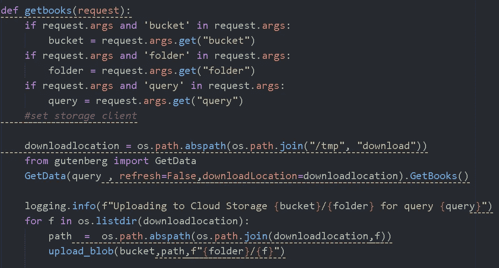

# 云中的文本分析—第 1 部分

> 原文：<https://medium.com/analytics-vidhya/text-analytics-in-cloud-part-1-e0467d5034d?source=collection_archive---------21----------------------->

使用 Google 云功能将数据提取到云存储中

作为我最近一个项目的一部分，我正在处理文本。精确的宗教文本。

我们对几个问题很好奇

*   亚伯拉罕前宗教和亚伯拉罕宗教的区别
*   按宗教划分的地理/人口统计
*   不同的宗教书籍同意/不同意什么？
*   文本主题随时间的演变/语气/语言/概念的变化
*   利用文本分析/词向量在不同的书中搜索相似的观点，比较和对比它们。

我们决定从[项目 Gutenberg](https://www.gutenberg.org/) 中提取书籍，将其加载到 Google 云存储中，使用 Apache beam 和云数据流对文本进行预处理和注释，然后使用 Python 进行分析。

体系结构

可以在这里关注代码 [@ github](https://github.com/abhijeetdtu/dsba6155project)

本文主要关注上图最左边的部分——获取数据，在其他文章中，我们将继续这个过程。

**获取数据**

整个过程的第一步是获取数据。为此，我们创建了一个 python 脚本，它使用 [BeautifulSoup](https://www.crummy.com/software/BeautifulSoup/bs4/doc/) 请求从古腾堡项目下载书籍，并将其保存到云存储中。

这里重要的一点是如何与谷歌云互动。

因此，google cloud 希望您的云功能如下所示

1.  应该有一个 main.py 文件—包含实际代码
2.  应该有一个 requirements.txt，其中包含所有指定的依赖项。

然后你可以压缩这个文件夹并提供给云函数。

对于我们的用例，我们利用了 [**terraform**](https://github.com/hashicorp/terraform) ，而不是手动完成。

为了创建 zip 文件，我们使用了 **null_resource** ，它在后台利用 powershell 命令来压缩文件夹。

在您可以看到的第二个图像中，第一个资源上传了。第二个资源使用上传的 zip 文件创建云函数。

**注意，在第二个资源中，我们指定了入口点**

这个入口点是 main.py 中由云函数调用的函数。

实际的函数在 main.py 中

*getbooks 函数*将请求作为输入，解析参数，然后调用自定义代码获取文件并上传到 google 云存储。

一旦创建了函数，我们就可以使用 url 如下调用它

[https://URL _ TO _ YOUR _ CLOUD _ function . CLOUD functions . net/data _ pull _ CLOUD _ func？**query =印度教&bucket = dsba 6155 pdatabucket&folder =下载**](https://us-east1-dsba6155p.cloudfunctions.net/data_pull_cloud_func?query=hinduism&bucket=dsba6155pdatabucket&folder=download)

查询、桶和文件夹是我们上面定义的函数所期望的参数。

**注意事项**

需要注意的几个问题

1.  云函数有只读文件系统，所以你不能随便写文件。它必须在 **/tmp/文件夹**中

2.对于使用 google cloud 的身份验证，您应该设置环境变量 GOOGLE_APPLICATION_CREDENTIALS，指向服务主体密钥文件。[创建服务帐户](https://cloud.google.com/iam/docs/creating-managing-service-accounts)