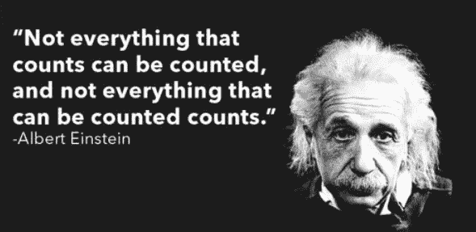
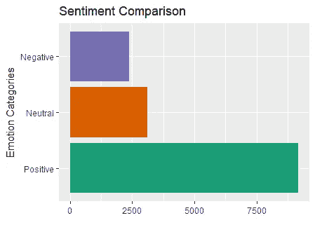
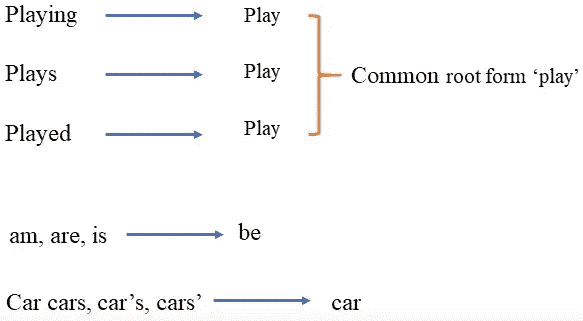
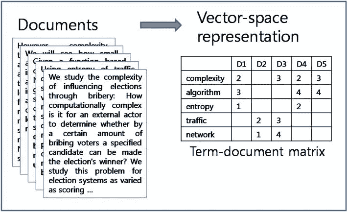
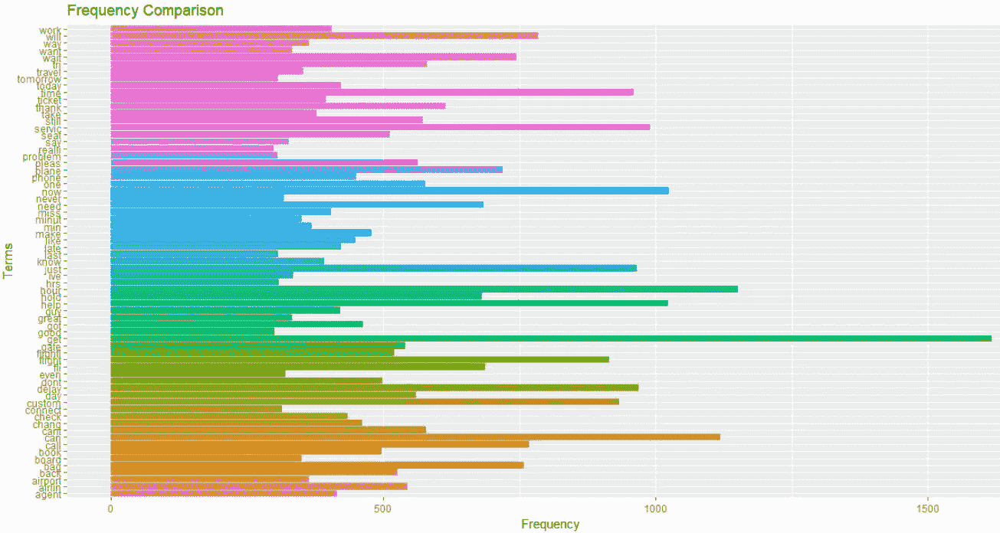
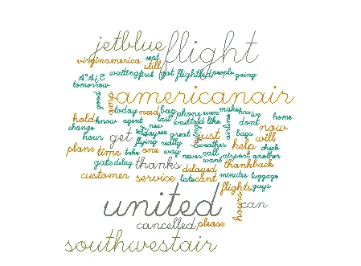
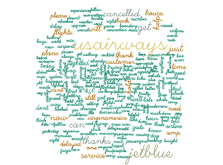
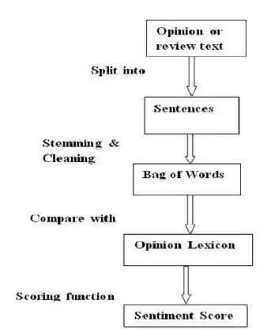
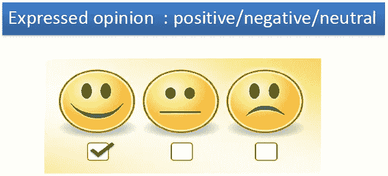

# 文本分析——挖掘浩瀚文本下的丰富财富

> 原文：<https://medium.com/analytics-vidhya/text-analytics-mining-the-abundance-of-wealth-underneath-the-vastness-of-text-324149e9e449?source=collection_archive---------0----------------------->



三十年前，操作电脑和使用互联网可能是人们渴望拥有的技能。到了世纪之交，它不再是一项可以给你吹嘘权利的技能。成了必需品！就像用电的转变一样——在很短的时间内，从奢侈品变成了绝对的基本必需品。

也就是说，随着电脑/互联网成为我们教育的一部分，千禧一代学习如何使用电脑/互联网要容易得多。我们实时地体验着世界的变化，没有什么可以忘却的。对于前几代人来说，情况要艰难得多，因为他们习惯于每天在工作场所进行手工操作。

很自然，几乎每个千禧一代都曾试图帮助他/她的父母学习如何操作电脑，进而学习互联网。十年前，在其中一次会议上，我在想，如果计算机和/或互联网能够以自然语言与我的父母互动，即理解他们的需求并给出期望的结果，那该有多好。父母和孩子都可以避免在这个话题上面对面的痛苦。当时这似乎是一厢情愿的想法。

快进到今天。好，好，好，这就是现在的现实！！！想想 Alexa enabled fire-stick，它使用户能够用自然语言与设备进行交互，设备转到所需的媒体来播放所需的视频。在计算机中实现类似的可行性(比如导航到特定位置、打开 excel 文件、保存文档、根据用户的口述写文章)即使还没有实现，也是触手可及的。

在那张一厢情愿的清单上再加上几个，你就会有一个关于时间的白日梦。就像，我希望我不用起床就能打开房间的灯。我希望我和理发店的约会能定下来，而不用我打电话给理发店。从公司客户关怀的角度来看，CEO 可能渴望减少手动回答各种常见问题的需求。


来源:https://bit.ly/2GLdxdB

我们现在有了所有这些问题的答案。我们已经在 KJO 的 *Koffee with Karan* 中看到 Google Echo 如何对自然语言做出反应并使房间的灯光变暗，我们看到桑德尔·皮帅启动 Google Assistant，演示机器人与理发师互动以预约预约时间，现在几乎每个公司都有机器人回答客户的询问。

所有这一切的关键是文本分析和自然语言处理取得的进步。文本分析是一个非常有趣的领域，在数据科学领域越来越重要。

在这篇文章中，我试图介绍文本分析的基础知识，以及如何将它用于情感分析。作为这篇文章的后续，我将介绍文本分析如何用于主题建模和网络分析。这里是我们将涉及到的主题的细节。

**目录**

1.  **文本分析到底是什么？**
2.  **文本挖掘的基础——解码&量化文本**
3.  **情感分析——一个应用**
4.  **多算法建模**
5.  **合奏的力量**

# 1.到底什么是文本分析？

文本分析是检查大量书面资源以生成新信息，并将非结构化文本转换为结构化数据以用于进一步分析的过程。它是从文本中获取高质量信息的过程。总体目标是，通过应用自然语言处理(NLP)和分析方法，将文本转化为数据进行分析。

文本挖掘可以识别隐藏在大量文本数据中的事实、关系和断言。这些事实被提取并转化为结构化数据，用于分析、可视化、与数据库或仓库中的结构化数据集成，以及使用机器学习(ML)系统进一步细化。

# **2。基础-解码&量化文本**

虽然文本被认为是非结构化的，但在高级人类语言中包含着大量的复杂性和细微差别，这使得文本分析成为收集关于人们及其想法和感觉的见解的极其肥沃的土壤。

挑战是显而易见的。数据是非结构化的，而且数量庞大，除非找到一种方法来量化数据的各个方面，否则信息推导将总是缓慢、主观和有限的。文本挖掘解决结构和规模问题的过程是数据科学的切入点。基本方法是将文本转化为数字，这样我们就可以使用机器来分析大量的文档，并通过数学算法来发现真知灼见。

让我们看一个处理数据集的真实示例，以及将非结构化数据转换为结构化数据的步骤，以便能够根据我们的目标应用我们选择的算法。我下载了一个关于美国航空公司乘客推文的数据集。我们的目标是建立一个模型，该模型可以根据客户的评论来预测客户的情绪(无需人工干预来解释)。**数据可以从 data.world 下载，链接是** [**关于美国航空公司的推特**](https://data.world/data-society/twitters-about-us-airline) **。**

文本挖掘过程的第一步是以某种方式组织和构建数据，以便对其进行定性和定量分析。基础结构是将文本转换成术语文档矩阵(TDM)或文档术语矩阵(DTM)。此外，可以进行一些数据可视化，以获得一些关于哪些单词使用频率更高的初步见解，等等。因为在这个阶段可以做很多事情，但是下面给出了主要的或必要的必须做的事情

I .清理数据集中感兴趣的列，该列是我们想要从中获取信息的文本。清理基本上包括删除空白、链接、表情符号、非英语单词、数字、标点符号、非增值单词、不常用单词等步骤。

二。绘制一个词云，它给出了 tweets 集合中词频的图形表示。

三。可视化，以初步了解目标变量的水平是如何分布的

四。将文本转换为矩阵格式，然后可用于模型构建。

下面演示了在深入研究模型构建之前，我将如何着手构建基础，以预测客户对某家航空公司的反馈时的情绪。

```
**#Import the data and check the dimensions**
Tweets = read.csv("twitter-airline-sentiment.csv")dim(Tweets)
[1] 14640    15names(Tweets)
 [1] "tweet_id"                     "airline_sentiment"            "airline_sentiment_confidence"g 
 [4] "negativereason"               "negativereason_confidence"    "airline"                     
 [7] "airline_sentiment_gold"       "name"                         "negativereason_gold"         t10] "retweet_count"                "text"                         "tweet_coord"                 
Variables of interest are airline-sentiment and text. The visual distribution  of various sentiments expressed can be seen below that was extracted from the data downloaded.e a= ggplot(Tweets, aes(x=airline_sentiment))

a+geom_bar(aes(y=..count.., fill=airline_sentiment)) +
  scale_fill_brewer(palette="Dark2") + labs(x="Emotion Categories", y="")+
  ggtitle("Sentiment Comparison")+coord_flip()+
  scale_x_discrete(labels=c("Positive","Neutral","Negative"))+guides(fill=FALSE)
```



大多数旅客对航空公司表现出积极的态度

下一步是如上所述清理数据

```
**#Preparing for sentiment analysis by creating a corpus of tweets****#Call the required library** library(tm)**#Remove links, replace '&amp' with 'and'**
Tweets$text <- gsub("http(s?)([^ ]*)", " ", Tweets$text, ignore.case = T)
Tweets$text <- gsub("&amp", "and", Tweets$text)**#Remove words starting with @**
Tweets$text=gsub("@\\w+ *", "",Tweets$text)**#Remove words starting with #**
Tweets$text=gsub("#\\w+ *", "",Tweets$text)**#Convert the text column to corpus for futher data cleaning using tm library functions**
Tweet.corpus=Corpus(VectorSource(Tweets$text))**#Checking the first 10 tweets in the corpus created**
inspect(Tweet.corpus[1:10])**#Data (corpus/tweet) cleaning as part of data preparation**
Tweet.corpus=tm_map(Tweet.corpus,tolower)
Tweet.corpus=tm_map(Tweet.corpus,stripWhitespace)
Tweet.corpus=tm_map(Tweet.corpus,removeNumbers)**#converting/encoding elements of character vectors to the native encoding or UTF-8 respectively.**Tweet.corpus=tm_map(Tweet.corpus, function(x) iconv(enc2utf8(x), sub = "byte"))
Tweet.corpus=tm_map(Tweet.corpus,removePunctuation)
more_stopwords=c(stopwords('english'),'http*',"[@VirginAmerica](http://twitter.com/VirginAmerica)","[@NYTimes](http://twitter.com/NYTimes)","flight","cancelled","thanks","AA","DM")
Tweet.corpus=tm_map(Tweet.corpus,removeWords,more_stopwords)**#checking the first 10 tweets.**
inspect(Tweet.corpus[1:10])**#The 9th tweet shows an emoticon/non-english character.**
[9] Well, I didn'tbut NOW I DO! :-D**#Remove non-eglish words if any**
Tweet.corpus=tm_map(Tweet.corpus,function(x) iconv(x,"latin1","ASCII",sub = "")) 
```

**词干**



去除无附加值单词的词干的图形表示

```
**#Remove words which are derivations of the root word.  For example, the stem of  "computational", "computers" and "computation" is "computer". Only computer is retained.Stemming reduces words to unify across documents.**Tweet.corpus=tm_map(Tweet.corpus,stemDocument)
```

**从清理后的文本中准备术语文档矩阵**



术语文档矩阵— TDM

清理完文本后，每条推文(技术上称为文档)都需要转换为单个单词的集合，并且需要统计每个单词在所有文档/推文中的出现频率。这是通过将 tweets 集合转换成类似矩阵的结构来实现的，其中列代表 tweets/文档，行代表单个单词。这种结构被称为 TDM(术语文档矩阵)。TDM 的转置是 DTM(文档术语矩阵)，其中 TDM 中的 tweets 和单词交换位置以构成 DTM。

```
**#Building a term document** matrixTweets.TDM=TermDocumentMatrix(Tweet.corpus)**#Check the dimension of the TDM. We have 14,640 tweets and 8162 terms.**
Tweets.TDM
<<TermDocumentMatrix (terms: 8162, documents: 14640)>>
Non-/sparse entries: 113858/119377822
Sparsity           : 100%
Maximal term length: 46
Weighting          : term frequency (tf)**#Check out 5 rows and 5 columns of the TDM created**
inspect(Tweets.TDM[1:5,1:5])
<<TermDocumentMatrix (terms: 5, documents: 5)>>
Non-/sparse entries: 5/20
Sparsity           : 80%
Maximal term length: 8
Weighting          : term frequency (tf)
Sample             :
          Docs
Terms      1 2 3 4 5
  commerci 0 1 0 0 0
  experi   0 1 0 0 0
  plus     0 1 0 0 0
  said     1 0 0 0 0
  tacki    0 1 0 0 0
```

**删除稀疏术语**

所创建的 TDM 是一个高维对象，除非系统的计算能力很高，否则在其上建立模型可能相当耗时。因此，从 TDM 中移除频率非常低的项是理想的。这可以通过使用如下所示的函数来实现，该函数的目标是减少 TDM，使单词的相对频率高于某个阈值(在本例中高于 98%)。

```
Tweets.IMP=removeSparseTerms(Tweets.TDM,0.98)
Tweets.IMP
<<TermDocumentMatrix (terms: 67, documents: 14640)>>
Non-/sparse entries: 36247/944633
Sparsity           : 96%
Maximal term length: 8
Weighting          : term frequency (tf)
```

TDM 现在减少到 67 个字，这似乎更容易管理，并且可以被认为是由对模型有影响的字组成的。所有其他单词的个别频率小于语料库中总单词数的 4%,都被删除。

**可视化——词频和词云**

```
wordFreq=data.frame(apply(Tweets.IMP,1,sum))
names(wordFreq)="Frequency"
wordFreq$Terms=row.names(wordFreq)
row.names(wordFreq)=NULL
wordFreq=wordFreq[,c(2,1)]
a=ggplot(wordFreq,aes(Terms,Frequency, fill=Terms))
a+geom_bar(stat = "identity")+coord_flip()+ggtitle("Frequency Comparison")+guides(fill=FALSE)findFreqTerms(Tweets.IMP,1000)
[1] "now"  "hour" "help" "get"  "can" #High frequency i.e. very commonly used terms as is seen in the bargraph belowfindAssocs(Tweets.IMP,"now",0.05)
$now
 hour delay  miss   hrs  wait 
 0.07  0.07  0.06  0.06  0.06 
#greater than 5 percent correlation of word "now" findAssocs(Tweets.IMP,"help",0.1)
$help
pleas   can  need 
 0.13  0.13  0.12#help has a minimum correlation of 10% with words pleas,can,need
```



选择不同的词频阈值构建两个不同的词云。

下面是构建单词云的代码。图表中的单词越大越密，出现的频率就越高。

```
library("RColorBrewer")
pal=brewer.pal(8,"Dark2")
library(wordcloud)#wordcloud1
wordcloud(Tweet.corpus,min.freq = 250,max.words = 30000,random.order = TRUE,
          colors=pal,vfont=c("script","plain"))
#wordcloud2
wordcloud(Tweet.corpus,min.freq = 100,max.words = 40000,random.order = TRUE,
          colors=pal,vfont=c("script","plain"))
```

# **3。情绪分析**

> 有了公众情绪，什么都不会失败。没有它，任何事情都不会成功——亚伯拉罕·林肯



情感分析是确定一篇文章是正面的、负面的还是中性的过程。分析后的数据量化了公众对某些产品、人物或想法的情绪或反应。情绪分析有助于大型企业中的数据分析师评估公众意见，进行细致入微的市场研究，监控品牌和产品声誉，以及了解客户体验。

情感分析使用数据挖掘过程和技术来提取和捕获用于分析的数据，以便辨别文档或文档集合的主观意见，如博客帖子、评论、新闻文章和社交媒体馈送，如推文和状态更新。

情绪分析允许组织跟踪以下内容:

*   品牌接受度和知名度
*   新产品认知和预期
*   公司声誉
*   火焰/火焰探测



继续我们到目前为止一直在讨论的例子，我们有各种乘客关于美国航空公司的推文，我们的下一个目标是建立一个模型，可以根据他/她关于体验的推文预测任何乘客的情绪。我们将在下一节讨论模型构建的细节。我们在这里跳过了一部分，即通过将单词包/语料库与正面和负面单词的字典进行比较，将每条推文标记为正面、中性或负面。我们不进行这一步，因为数据集已经将情感定义为变量之一。所以我们会用“情绪”这个变量来训练模型。如果这个变量不可用，我们必须首先将每条推文标记为一种情绪，并使用这个标记来训练一个模型。我会用杰弗里·布林著名的算法和字典来标记这些情绪。参考他的[教程](https://datamatters.blog/tag/sentiment-analysis/)了解更多关于情感评分算法的细节。

# **4。型号&结果**

分割数据以训练模型，然后在看不见的数据上测试模型的典型步骤如下所示。我选择建立五个模型——随机森林、决策树、SVM、最大熵和 Bagging。

所有上述算法的理论方面已经在我早期的几篇博客中提供了。

关于随机森林、决策树和装袋的工作细节，请参见[随机森林——一种在混沌中提供结构的模型](/analytics-vidhya/random-forest-a-model-designed-to-provide-structure-in-chaos-e267d559ca04)。

参考[综合支持向量机指南——利用幻觉解决现实！](/analytics-vidhya/comprehensive-support-vector-machines-guide-using-illusion-to-solve-reality-ad3136d8f877)详细了解 SVM 的工作情况。

从我们在前面部分离开的地方继续，我们使用 caret 将数据分成训练和测试部分。事实上，我首先从 14000 多条推文中挑选出最初的 2000 条，以便用我的计算能力建立模型。计算能力非常强的人可以尝试在整个数据集上建立模型。使用 RTextTools 库训练模型。详情如下

```
**#Data Splitting**library(caret)
**#Building model on the first 2000 tweets due to memory limitations**Tweets1=Tweets[1:2000,]
Index=createDataPartition(Tweets1$airline_sentiment,times = 1,p=0.7,list = FALSE)Tweets1$type=NA
Tweets1$type[Index]="train"
Tweets1$type[-Index]="test"**#Remove links**
Tweets1$text <- gsub("http(s?)([^ ]*)", " ", Tweets1$text, ignore.case = T)
**#Replace '&amp'**
Tweets1$text <- gsub("&amp", "and", Tweets1$text)
**#Remove words starting with @**
Tweets1$text=gsub("@\\w+ *", "",Tweets1$text)
**#Remove words starting with #**
Tweets1$text=gsub("#\\w+ *", "",Tweets1$text)

Tweet.corpus=Corpus(VectorSource(Tweets1$text))#converting/encoding elements of character vectors to the native encoding or UTF-8 respectively,
Tweet.corpus=tm_map(Tweet.corpus, function(x) iconv(enc2utf8(x), sub = "byte"))
Tweet.corpus=tm_map(Tweet.corpus,removePunctuation)
more_stopwords=c(stopwords('english'),'http*',"[@VirginAmerica](http://twitter.com/VirginAmerica)","[@NYTimes](http://twitter.com/NYTimes)","flight","cancelled","thanks","AA","DM")
Tweet.corpus=tm_map(Tweet.corpus,removeWords,more_stopwords)
**#Remove non-eglish words if any**
Tweet.corpus=tm_map(Tweet.corpus,function(x) iconv(x,"latin1","ASCII",sub = ""))
Tweets1$text= data.frame(text = sapply(Tweet.corpus, as.character), stringsAsFactors = FALSE)**#Build the models** #Call the required library to build the modelslibrary(RTextTools)
models = train_models(container, algorithms=c("RF","TREE","SVM","MAXENT","BAGGING"))**#Test the model**results = classify_models(container, models)
head(results)
  FORESTS_LABEL FORESTS_PROB TREE_LABEL TREE_PROB SVM_LABEL  SVM_PROB MAXENTROPY_LABEL
1             1        0.765          1 0.6486486         1 0.9089133                1
2             1        0.720          1 0.6486486         1 0.6766424                1
3             1        0.980          1 0.6486486         1 0.6363762                1
4             1        0.540          1 0.6486486         3 0.4018248                2
5             3        0.710          1 0.6486486         3 0.7301996                3
6             1        0.675          1 0.6486486         1 0.7626651                1
  MAXENTROPY_PROB BAGGING_LABEL BAGGING_PROB
1       1.0000000             1         0.96
2       0.9981853             1         1.00
3       0.9838523             1         1.00
4       0.8151790             3         0.52
5       0.9998144             3         0.84
6       1.0000000             1         0.96
```

**精度对比**

然后根据测试数据和混淆矩阵对模型进行测试，以测试通过每个模型实现的准确性。详见下文。可以看出，从 SVM 模型获得的准确度最高，为 70.73%。在尝试的模型中，决策树似乎表现最差。如果要从五个人中选一个，你很可能会选择 SVM。

```
**#RandomForest**CM_RF=table(Tweets1$airline_sentiment[as.numeric(row.names(Tweets1[Tweets1$type=="test",]))], results[,"FORESTS_LABEL"])
Acc_RF=sum(diag(CM_RF)/sum(CM_RF))**#Decision Tree**
CM_Tree=table(Tweets1$airline_sentiment[as.numeric(row.names(Tweets1[Tweets1$type=="test",]))], results[,"TREE_LABEL"])
Acc_Tree=sum(diag(CM_Tree)/sum(CM_Tree))**#SVM**
CM_SVM=table(Tweets1$airline_sentiment[as.numeric(row.names(Tweets1[Tweets1$type=="test",]))], results[,"SVM_LABEL"])
Acc_SVM=sum(diag(CM_SVM)/sum(CM_SVM))**#MAXENT**
CM_MAXENT=table(Tweets1$airline_sentiment[as.numeric(row.names(Tweets1[Tweets1$type=="test",]))], results[,"MAXENTROPY_LABEL"])
Acc_MAXENT=sum(diag(CM_MAXENT)/sum(CM_MAXENT))**#BAGGING**
CM_BAGGING=table(Tweets1$airline_sentiment[as.numeric(row.names(Tweets1[Tweets1$type=="test",]))], results[,"BAGGING_LABEL"])
Acc_BAGGING=sum(diag(CM_BAGGING)/sum(CM_BAGGING))Compare=data.frame(Models=c("RF","DecisionTree","SVM","MAXENT","BAGGING"),Accuracy=c(Acc_RF,Acc_Tree,Acc_SVM,Acc_MAXENT,Acc_BAGGING))Compare
       Models   Accuracy
1           RF 0.6889632
2 DecisionTree 0.6270903
3          SVM 0.7073579
4       MAXENT 0.6755853
5      BAGGING 0.6672241
```

# **5。合奏的力量**

RTextTools 有一个令人惊叹的功能，如果我们有一个模型，它是一些或所有已经训练过的模型的集合，它可以创建关于准确度的分析。此外，该函数还会调出 recall 和 n 组合的统计数据所覆盖的数据比例，其中 n 是所选模型的数量。

```
analytics = create_analytics(container, results)
summary(analytics)ENSEMBLE SUMMARY

       n-ENSEMBLE COVERAGE n-ENSEMBLE RECALL
n >= 1                1.00              0.69
n >= 2                1.00              0.69
n >= 3                0.99              0.70
n >= 4                0.84              0.74
n >= 5                0.64              0.79

ALGORITHM PERFORMANCE

       SVM_PRECISION           SVM_RECALL           SVM_FSCORE    BAGGING_PRECISION 
           0.6433333            0.5600000            0.5866667            0.5833333 
      BAGGING_RECALL       BAGGING_FSCORE    FORESTS_PRECISION       FORESTS_RECALL 
           0.4600000            0.4466667            0.6066667            0.5000000 
      FORESTS_FSCORE       TREE_PRECISION          TREE_RECALL          TREE_FSCORE 
           0.5100000            0.3933333            0.4200000            0.3900000 
MAXENTROPY_PRECISION    MAXENTROPY_RECALL    MAXENTROPY_FSCORE 
           0.5633333            0.5533333            0.5566667
```

可以通过以下代码提取分析摘要

```
analytics@ensemble_summary
       n-ENSEMBLE COVERAGE n-ENSEMBLE RECALL
n >= 1                1.00              0.69
n >= 2                1.00              0.69
n >= 3                0.99              0.70
n >= 4                0.84              0.74
n >= 5                0.64              0.79
```

应该选择四个模型用于集成，以获得覆盖率(84%)和准确度(74%)的最佳组合。单独来看，SVM 给出了最好的结果，但是从集合总结中可以看出，集合可以给出更高的准确度。

通过选择具有 4 个最佳准确度结果的模型，决策树失败了。最终的系综构建如下所述。

```
results1<-results[,c(1,5,7,9)]
**# Function to build an ensemble model using "For" loop**results1$majority=NA
for(i in 1:nrow(results1))
{
 **#Getting the frequency distribution of the classifications** 
  p<-data.frame(table(c(results1$FOREST_LABEL[i],results1$SVM_LABEL[i],
                        results1$MAXENTROPY_LABEL[i],results1$BAGGING_LABEL[i])))
  #Choosing the classification that occurs maximum
  #Putting this value into the new column "majority"

  results1$majority[i]<-paste(p$Var1[p$Freq==max(p$Freq)])
  rm(p)
}
results1$majority<-as.numeric(results1$majority)
table(results1$majority)
```

比较单独和通过集合模型获得的准确度分数。

```
Compare=data.frame(Models=c("RF","DecisionTree","SVM","MAXENT","BAGGING","ENSEMBLE"),                 Accuracy=c(Acc_RF,Acc_Tree,Acc_SVM,Acc_MAXENT,Acc_BAGGING,0.74))Compare
        Models  Accuracy
1           RF 0.6889632
2 DecisionTree 0.6270903
3          SVM 0.7073579
4       MAXENT 0.6755853
5      BAGGING 0.6672241
6     ENSEMBLE 0.7400000
```

# **结论**

到目前为止，我们专注于通过在一个单词序列上训练算法来建立预测情绪的模型。我们通过四个模型的集合达到了 74%的准确率，这还不错。然而，我认为，如果我们在两个单词或三个单词甚至更多单词的序列上训练模型，情感可以被更好地预测。例如，就个人而言，“喜欢”这个词可能会给人积极情绪的印象。然而，如果句子是“我不喜欢乘坐 XYZ 航空公司的航班”，这种情绪显然是负面的。在我的后续文章中，我将探索使用两个单词和三个单词序列来训练模型。不过需要注意的是，使用这种方法，训练数据的大小将呈指数级增长，计算能力的限制将会大大增加。敬请关注下一篇博客！！！