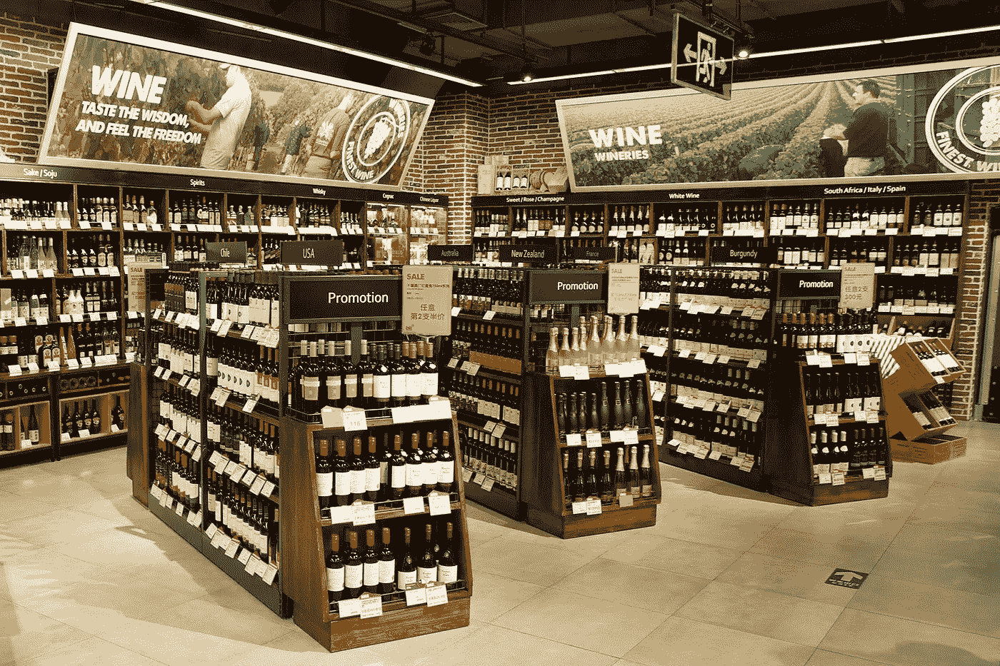
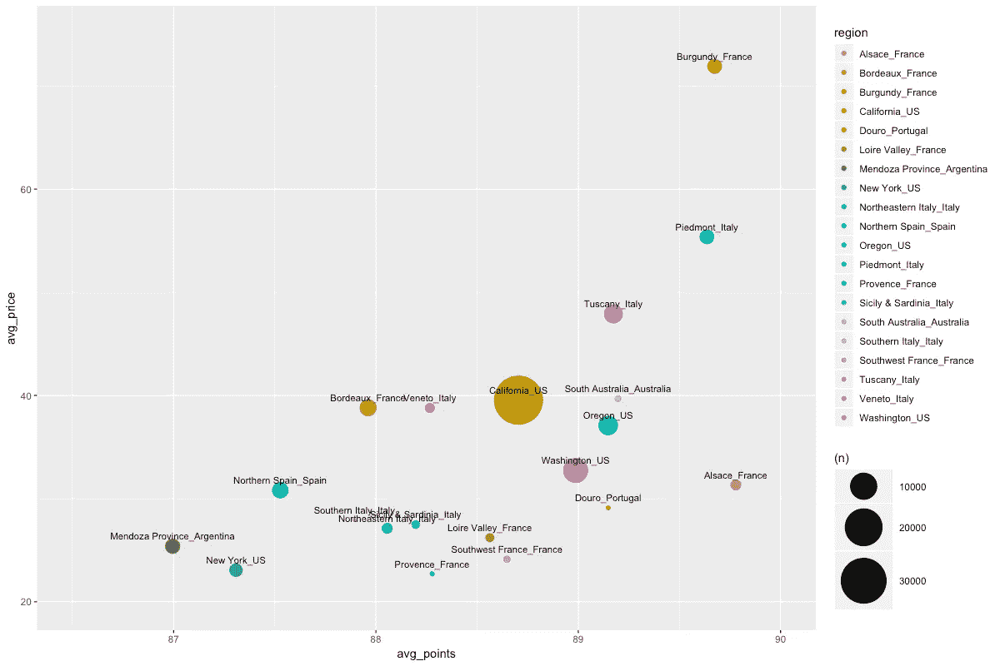
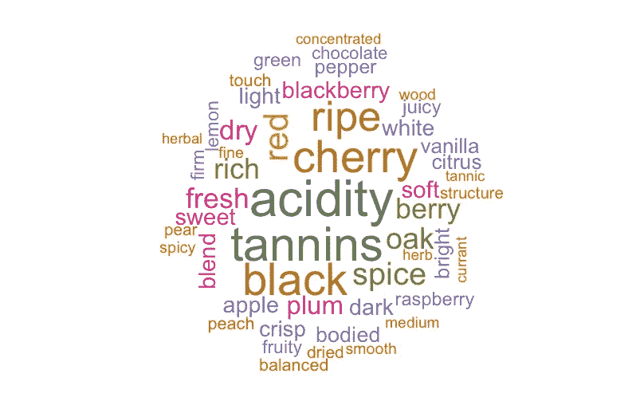
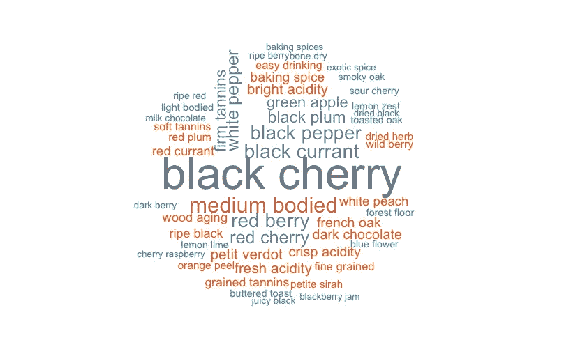
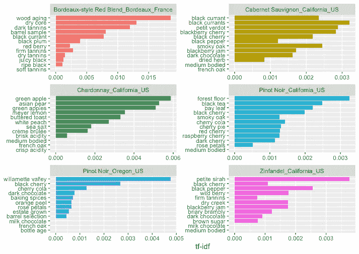
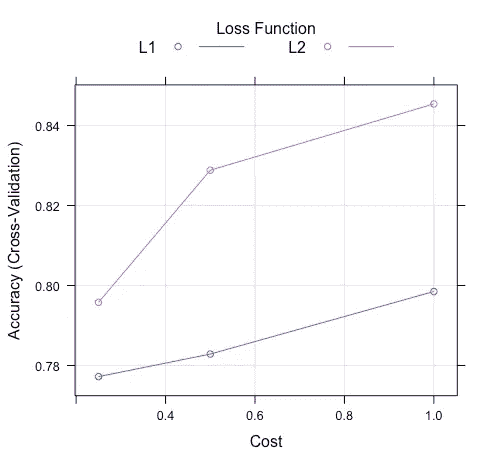
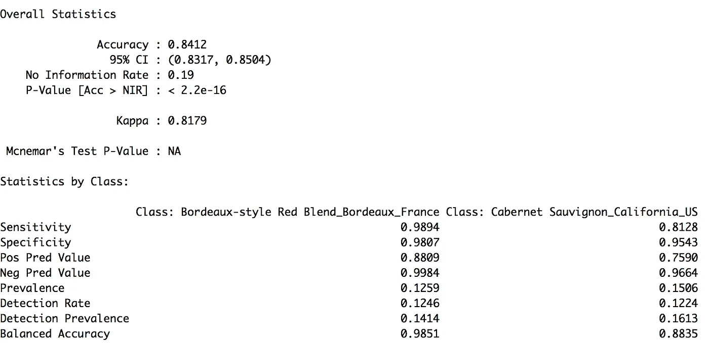
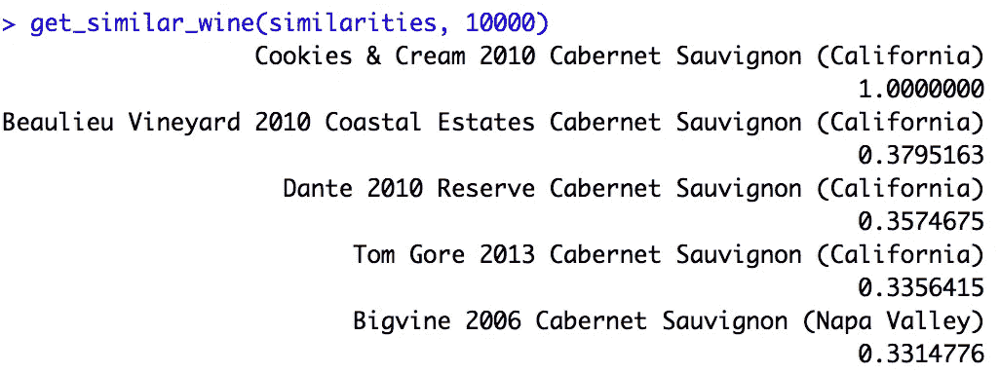

# 根据品酒笔记进行葡萄酒分类和推荐

> 原文：<https://medium.com/analytics-vidhya/text-analytics-wine-classification-and-recommendation-by-tasting-notes-6657733fd60d?source=collection_archive---------3----------------------->

## 基于 R 的文本挖掘和分类

**简介**

葡萄酒的选择是复杂和个人化的。你爱的人不一定取决于收视率或价格。看你个人口味了。作为一个葡萄酒爱好者，我总是被葡萄酒商店或餐厅的大量选择所淹没。

如果你可以有一个虚拟的个人侍酒师，他可以根据你的口味或你已经尝试过的葡萄酒推荐合适的葡萄酒，会怎么样？就像侍酒师如何为你推荐葡萄酒一样，这个项目旨在通过分析品尝记录来对葡萄酒品种进行分类并识别相似的葡萄酒。

我用的数据集是扎克特·https://www.kaggle.com/zynicide/wine-reviews 的。它包含 130，000 条葡萄酒评论，有 14 个变量，如品种、地点、酒厂、价格和描述。

**探索数据**

您可以看到该数据集拥有来自美国加利福尼亚州的最大数量。价格和积分在其他地区中处于平均水平。与加州相比，美国俄勒冈州和华盛顿州的葡萄酒似乎质量更高，但价格更低。法国勃艮第拥有平均价格和平均点数最高的高端葡萄酒。

葡萄酒产区概述

有更多的 EDA 可以用这个数据集来完成，但我在这里将重点放在使用 tidytext 包的文本分析上。首先，我用词袋法分析了词频。我用 wordcloud 包把出现频率最高的词可视化。

词频上的词云

除了词袋法，我还使用了包括相邻词序列的 N 元语法分析。这里我使用了二元模型分析，包括两个相邻的单词。与单个单词相比，双字词似乎更具信息性和描述性，例如樱桃与黑樱桃，中等与中等酒体等等。

bigram 频率上的 Wordcloud

接下来，我计算每个二元模型的 TF-IDF。TF-IDF 是术语频率(term frequency -- inverse document frequency)的缩写，是一种数值方法，旨在反映一个词对集合或语料库中的文档有多重要。TF-IDF 值与一个单词在文档中出现的次数成比例，并被该单词在语料库中的频率所抵消，这有助于调整某些单词通常出现得更频繁的事实。

TF-IDF 二元模型(按品种 _ 地区)

你可以看到来自不同地区的每个品种都有其独特的描述符。与来自加州的赤霞珠相比，来自加州的黑皮诺有独特的术语，如月桂叶、玫瑰花瓣和森林地面等。来自俄勒冈州的黑皮诺有独特的术语，如黑巧克力、烘焙香料和橘子皮等。

**造型**

下一步是建立一个模型，根据品尝记录对品种区域进行分类。为了确保每个类别都有足够的数据并简化模型，我使用来自前 10 个品种区域的 20k 个样本的 TF-IDF 来建立模型。训练和测试数据集按 70/30 分割，并以完全相同的方式分别处理，以确保它们具有相同的结构和特征用于建模。这里的测试数据集处理非常棘手。quanteda 包为此提供了一个有用的函数。处理文本有 7 个步骤:

1.  标记化
2.  下部外壳
3.  停用词移除。我为葡萄酒数据集构建了定制的停用词
4.  堵塞物
5.  转换到 DFM
6.  移除稀疏术语
7.  确保测试数据帧与列车数据帧具有相同的特征

创建数据集后，训练集有 14004 个样本，511 个预测器和 10 个类；测试集有 5996 个样本，511 个预测值。你可以看到这是一个非常高维的数据集。

对于模型选择，我使用线性支持向量机，因为它推荐用于文本分类，因为它具有大量的特征。我正在使用插入式列车功能与 10 倍交叉验证。代码如下:

token_model_svm = train(Label~。，data = train.tokens.tfidf.df，method = 'svmLinear3 '，tr control = train control(method = ' cv '，number = 10))

最终模型选择成本= 1，损失= L2，准确率为 0.845。现在我用测试数据来预测拟合模型的结果。总体准确率为 0.841，非常接近拟合模型。波尔多红混合的准确率最高，为 0.985，而西拉加州美国的准确率最低，为 0.775。这可能是因为这些变化区域具有较少的训练样本。你可以得到一个完整的每个类的混淆矩阵。

**推荐**

我还创建了一个简单的推荐函数，使用余弦相似度来计算每个文档之间的距离。我用 tidytext 包中的 cast_sparse 函数创建了一个稀疏矩阵，用 text2vec 包中的 sim2 函数计算相似度。

相似性= sim2(sparse.matrix，method = "cosine "，norm = "l2 ")

然后我写了一个简单的函数来识别每个参考的最相似的酒。

get _ similar _ wine = function(similarities，reference_wine，n _ re commendations = 3){
sort(similarities[reference _ wine，]，decreasing = TRUE)[1:(2+n _ re commendations)]
}

在这个例子中，参考葡萄酒是 2010 年的饼干和奶油赤霞珠，最相似的葡萄酒是 2010 年的博利乌葡萄酒。结果的准确性需要通过品尝进一步调查。

**总结**

总的来说，我认为分类模型的准确率相当高。下一步可能是品尝一些葡萄酒，看看类似的葡萄酒推荐是否准确。

你可以在 [Github](https://github.com/ellendeng/wine_recommendation) 上找到 R 代码，如果有任何问题，请随时在 [LinkedIn](https://www.linkedin.com/in/ellen-deng/) 上联系我。