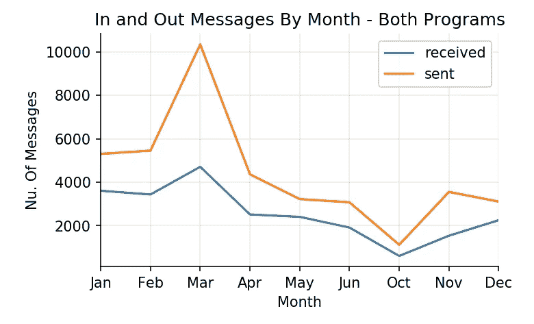
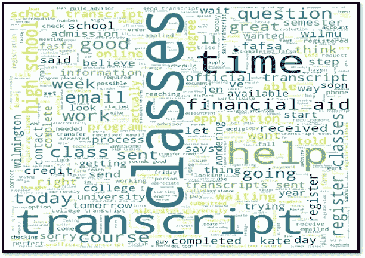
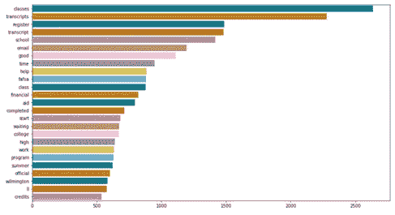
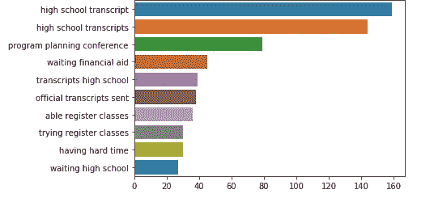
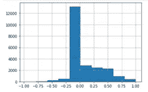
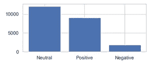

# 基于文本的通信分析与机器学习

> 原文：<https://medium.com/analytics-vidhya/text-based-communication-analysis-with-machine-learning-17138c0a4a4e?source=collection_archive---------13----------------------->

这项研究通过应用各种机器学习技术对历史文本消息进行了更深入的研究。该研究的目的是应用自然语言处理(NLP)技术来确定沟通趋势，评估现有流程的有效性，并从历史数据中提供任何见解。

# 方法学

为了分析数据，我使用 Python 作为编程语言，同时使用了许多软件库，如 pandas、math、numpy、sklearn、matplotlib 等。此外，我还使用了自然语言处理(NLP)，这是一种机器学习(ML)技术，有助于使用人工智能来理解、解释和操纵人类语言。

# 数据探索

这里的重点是探索大量的非结构化数据，并发现任何初始模式、特征和兴趣点。在这一步中，并不期望揭示数据集包含的每一点信息，而是帮助创建重要趋势和主要点的大致情况，以进行更详细的研究。

**寻找春夏进出信息趋势**

当前数据集包含有限数量的列。为了按月获取消息计数，我们需要从时间字段中提取年和月。

```
df_text=pd.read_csv('../Data/clean_text.csv')df_text.info()<class 'pandas.core.frame.DataFrame'>
RangeIndex: 62513 entries, 0 to 62512
Data columns (total 7 columns):
message_type    62513 non-null object
text            62513 non-null object
time            62513 non-null object
ID              62513 non-null object
group_list      62513 non-null object
term            62513 non-null object
sent_by         62513 non-null object
dtypes: object(7)
memory usage: 3.3+ MB#Extracting year and month from 'time' column and append the dataframe with new columns.df_text['year'] = pd.DatetimeIndex(df_text['time']).year
df_text['month'] = pd.DatetimeIndex(df_text['time']).month
df_text.head() 
```

现在我们可以按月统计入站和出站消息的数量。

```
# Getting the message count by message type and month
# reset_index() gives a column for counting, after groupby uses year and category
df_cnt = (df_text.reset_index()
          .groupby(['month','message_type'], as_index=False)
          .count()
          # rename isn't strictly necessary here, it's just for readability
          .rename(columns={'index':'count'})
       )
#sorting the values by month
df_cnt.sort_values(by = 'month', ascending = True)
```

现在是时候使用 *matplotlib* 来呈现数据了。

```
import matplotlib.pyplot as pltdf_all_cnt =df_cnt#adding month name for better presentation
df_all_cnt['month_t'] = df_all_cnt['month'].apply(lambda x: calendar.month_abbr[x])fig, ax = plt.subplots(figsize=(5, 3), dpi=150)# key gives the group name (i.e. category), data gives the actual values
for key, data in df_all_cnt.groupby('message_type'):
    data.plot(x='month_t', y='count', ax=ax, label=key)

# Hide the right and top spines
ax.spines['right'].set_visible(False)
ax.spines['top'].set_visible(False)#draw the grid
ax.grid( linestyle='-', linewidth=0.2)     
ax.legend()
ax.set_xlabel('Month')
ax.set_ylabel('Nu. Of Messages')
ax.set_title('In and Out Messages By Month - Both Programs')
```



同样，我们可以使用数据集中的其他列作为 x 轴和 y 轴来填充不同类型的图形，以显示同一数据集的各个方面。

# 使用自然语言处理的文本分析

NLP 是一种分析和解释文本数据(如学生回答)的优秀方法。这是一种机器用来理解人类语言(如文本、语音、表情符号)的 ML 技术，目前在行业中广泛使用(即 Siri 和 Alexa)。

# 清洁、去除停用词和堵塞

通过删除所有不必要的单词、符号和任何对您进行有意义的分析没有帮助的文本来清理您的数据是非常重要的。下面的函数将帮助我们清理，删除停用词，但我们也需要一些库来帮助。

```
from nltk.corpus import stopwords
nltk.download('stopwords')
nltk.download('punkt')
from gensim.parsing.preprocessing import STOPWORDS
from gensim.parsing.preprocessing import remove_stopwords
set(stopwords.words('english'))
from nltk.tokenize import word_tokenize
from contractions import contractions_dict
import unicodedatadef remove_punctuation(text):
    text = ''.join([i for i in text if not i.isdigit()])
    return re.sub("[!@#$+%*:()/|,;:'-]", ' ', text)def removebrackets(text):
    return re.sub('[\(\[].*?[\)\]]', ' ', text)def remove_accented_chars(text):
    return unicodedata.normalize('NFKD', text).encode('ascii', 'ignore').decode('utf-8', 'ignore')def remove_special_chars(text, remove_digits=False):
    pattern = r'[^a-zA-Z0-9\s]' if not remove_digits else r'[^a-zA-Z\s]'
    return re.sub(pattern, '', text)def remove_stopwords(text):
   # text_tokens = word_tokenize(text)
   # text = remove_stopwords(text)

    from gensim.parsing.preprocessing import STOPWORDSall_stopwords_gensim = STOPWORDS.union(set(['thank', 'need', 'yes', 'okay']))text_tokens = word_tokenize(text)
    tokens_without_sw = ' '.join([word for word in text_tokens if not word in all_stopwords_gensim])

    return tokens_without_swdef stemming (text):

   ps = nltk.porter.PorterStemmer()
   return ' '.join([ps.stem(word) for word in text.split()])

  stopword_list = stopwords.words('english')
  tokens = nltk.word_tokenize(text)
  tokens = [token.strip() for token in tokens]
  return ' '.join([token for token in tokens if token not in stopword_list])def lemmatize(text):
    text = nlp(text)
    return ' '.join([word.lemma_ if word.lemma_ != '-PRON-' else word.text for word in text])def expand_contractions(text, contraction_mapping=contractions_dict):

    contractions_pattern = re.compile('({})'.format('|'.join(contraction_mapping.keys())), 
                                      flags=re.IGNORECASE|re.DOTALL)
    def expand_match(contraction):
        match = contraction.group(0)
        first_char = match[0]
        expanded_contraction = contraction_mapping.get(match)\
                                if contraction_mapping.get(match)\
                                else contraction_mapping.get(match.lower())                       
        expanded_contraction = first_char+expanded_contraction[1:]
        return expanded_contraction

    expanded_text = contractions_pattern.sub(expand_match, text)
    return re.sub("'", "", expanded_text)
```

清理完数据后，我们可以填充单词 cloud 进行分析。单词云是表示这些数据的最有效的方式之一，它通过大小、颜色的深度和单词的粗体来指示文本的重要性。

```
from wordcloud import WordCloud, STOPWORDS, ImageColorGeneratorwc = WordCloud(stopwords=STOPWORDS,max_font_size=200, max_words=1000000, background_color="white", width=1000, height=1000).generate(' '.join(df_filtered['text_clean']))
plt.figure(figsize=(20,20))
plt.imshow(wc)
plt.axis("off")
plt.show()
```



*字云基于历史数据分析*

在填充了单词 cloud 之后，您可以识别出您的分析不需要的任何其他文本。您可以简单地通过添加那些标识的单词来扩展当前的停用词库，如下所示。

```
def clean_text_again(text):from gensim.parsing.preprocessing import STOPWORDSall_stopwords_gensim = STOPWORDS.union(set(['thank', 'need', 'yes', 'okay','ok','thanks','morning','hello','sure','hi', 'know', 'got','yesterday']))text_tokens = word_tokenize(text)
    tokens_without_sw = [word for word in text_tokens if not word in all_stopwords_gensim]return ' '.join([word for word in text_tokens if not word in all_stopwords_gensim])
```

# **字云扩展— Ngram 探索**

Ngrams 只是 n 个字的连续序列。查看最频繁的 n-grams 可以让我们更好地理解上下文。

下面的函数在条形图中显示了最频繁出现的不间断单词。

```
import seaborn as snsdef plot_top_non_stopwords_barchart(text):

    new= text.str.split()
    new=new.values.tolist()
    corpus=[word for i in new for word in i]counter=Counter(corpus)
    most=counter.most_common()
    x, y=[], []
    for word,count in most[:40]:
        if (word not in stop):
            x.append(word)
            y.append(count)

    plt.figure(figsize=(15,8))
    sns.barplot(x=y,y=x,palette="colorblind")
```



*最常出现的不间断单词*

但是，为了理解不间断单词的上下文及其关系；我们需要用紧随其后的单词填充图表。我修改了上面的函数，使用 3 个直接的单词来绘制*三元模型*，如下所示。

```
def plot_top_ngrams_barchart(text, n=3): #n is the number of immediate words you need.

    new= text.str.split()
    new=new.values.tolist()
    corpus=[word for i in new for word in i]def _get_top_ngram(corpus, n=None):
        vec = CountVectorizer(ngram_range=(n, n)).fit(corpus)
        bag_of_words = vec.transform(corpus)
        sum_words = bag_of_words.sum(axis=0) 
        words_freq = [(word, sum_words[0, idx]) 
                      for word, idx in vec.vocabulary_.items()]
        words_freq =sorted(words_freq, key = lambda x: x[1], reverse=True)
        return words_freq[:10]top_n_bigrams=_get_top_ngram(text,n)[:10]
    x,y=map(list,zip(*top_n_bigrams))
    sns.barplot(x=y,y=x)
```



*出现频率最高的三元组*

# **情感分析**

情感分析是一种广泛使用的工具，具有 NLP 工具包，可以自动对文本数据(如学生回答)的情感进行分类。首先，我们可以使用极性直方图找到情感的分布。极性是介于-1 到 1 之间的浮点数，其中 1 表示肯定的陈述，而-1 表示否定的陈述。

```
from textblob import TextBlob

def plot_polarity_histogram(text):

    def polarity(text):
        return TextBlob(text).sentiment.polarity

    df_x = pd.DataFrame() 
    polarity_score =text.apply(lambda x : polarity(x))
    df_filtered['polarity_score']=df_filtered['text'].\
       apply(lambda x : polarity(x))
    polarity_score.hist()
```



*整体情绪极性*

我们可以进一步分析情绪，以查看积极、消极和中性情绪的分布。下面的函数对情绪进行分类，并显示一个条形图。

```
from textblob import TextBlob
import matplotlib.pyplot as plt
from nltk.sentiment.vader import SentimentIntensityAnalyzer
import nltkdef sentiment_vader(text, sid):
    ss = sid.polarity_scores(text)
    ss.pop('compound')
    return max(ss, key=ss.get)def sentiment_textblob(text):
        x = TextBlob(text).sentiment.polarity

        if x<0:
            return 'Negative'
        elif x==0:
            return 'Neutral'
        else:
            return 'Positive'

def sentiment_x(x):
    if x<0:
        return 'Negative'
    elif x==0:
        return 'Neutral'
    else:
        return 'Positive' 

def plot_sentiment_barchart(text, method):
    if method == 'TextBlob':
        sentiment = text.map(lambda x: sentiment_textblob(x))
    elif method == 'Vader':
        nltk.download('vader_lexicon')
        sid = SentimentIntensityAnalyzer()
        sentiment = text.map(lambda x: sentiment_vader(x, sid=sid))
    else:
        raise ValueError('Textblob or Vader')

    df_filtered['polarity']=df_filtered['polarity_score'].\
       apply(lambda x : sentiment_x(x))

    plt.figure(figsize=(5, 2), dpi=100)
    plt.bar(sentiment.value_counts().index,
            sentiment.value_counts())
```



*整体情感分类*

情感分析技术还处于起步阶段。因此，预测应该在人工干预下进行相应的评估。但是，有了大量干净的和标记的数据，足够大的神经网络将越来越准确，从长远来看，将是一个伟大的工具。