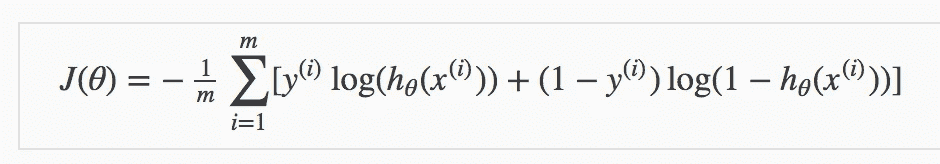

# 文本分类—从词袋到 BERT —第 1 部分(词袋)

> 原文：<https://medium.com/analytics-vidhya/text-classification-from-bag-of-words-to-bert-1e628a2dd4c9?source=collection_archive---------3----------------------->


爱德华·乔佩蒂亚在 [Unsplash](https://unsplash.com?utm_source=medium&utm_medium=referral) 上拍摄的照片

什么是文本分类？

> [文本分类](https://monkeylearn.com/text-classification/)也称为*文本标记*或*文本分类*是将文本分类成有组织的组的过程。通过使用自然语言处理(NLP)，文本分类器可以自动分析文本，然后根据其内容分配一组预定义的标签或类别。

少数应用:

1.  电子商务、新闻机构、内容管理者、博客、目录等平台可以使用自动化技术对内容和产品进行分类和标记。
2.  通过对社交媒体上的恐慌对话进行分类，可以建立更快的应急响应系统。
3.  营销人员可以根据用户在线谈论产品或品牌的方式对他们进行监控和分类。

还有更多

**问题陈述:**为了练习，我们将使用 Kaggle 竞赛命名为“ [*【有毒评论分类挑战】*](https://www.kaggle.com/c/jigsaw-toxic-comment-classification-challenge) 【由 Jigsaw(字母表的附属) ***。*** 在这场比赛中，我们面临的挑战是建立一个多头模型，能够检测不同类型的毒性，如*威胁、淫秽、侮辱和基于身份的仇恨。*该数据集包含来自维基百科谈话页面编辑的评论。(因此，除了文本分类，我们还将学习如何实现多输出/多标签分类)

***免责声明:本次比赛的数据集包含可能被视为亵渎、粗俗或冒犯的文本。我不鼓励这样的话，这只是为了实验的目的。***

**评估:**根据平均列方式 [ROC AUC](https://scikit-learn.org/stable/auto_examples/model_selection/plot_roc.html) 评估提交。换句话说，分数是每个预测列的单个 AUC 的平均值。

**模型:**模型按照复杂程度递增的顺序被提及

1.  一袋单词
2.  [Word2Vec 嵌入](/analytics-vidhya/text-classification-from-bag-of-words-to-bert-part-2-word2vec-35c8c3b34ee3)
3.  [快速文本嵌入](/analytics-vidhya/text-classification-from-bag-of-words-to-bert-part-3-fasttext-8313e7a14fce)
4.  [卷积神经网络](https://anirbansen3027.medium.com/text-classification-from-bag-of-words-to-bert-part-4-convolutional-neural-network-53aa63941ade)
5.  [长短期记忆(LSTM)](/analytics-vidhya/text-classification-from-bag-of-words-to-bert-part-5-recurrent-neural-network-b825ffc8cb26)
6.  [变压器的双向编码器表示(BERT)](/analytics-vidhya/text-classification-from-bag-of-words-to-bert-part-6-bert-2c3a5821ed16)

那么，让我们开始吧😁

> **1。一袋字**

单词袋模型是最常用的文本分类方法，其中每个单词的出现频率被用作训练分类器的特征。

**直觉:**


当然，除此之外还有预处理。但是图表给出了一个基本的理解。让我们深入研究一下实现

**实施:**

我们将使用 CountVectorizer(单词包的 sklearn 实现)模型将文本转换为数字数据集，然后可以根据输出变量 **toxic、severe_toxic、淫秽、威胁、侮辱、identity_hate、**进行映射，并且可以使用任何模型来学习输出变量的依赖性，即在这种情况下毒性类型对单词出现的依赖性。目前，我们将在 CountVectorizer 创建的数据集上使用**朴素贝叶斯和逻辑回归**，并选择在验证数据集上给出最佳结果的一个来预测测试数据集。我们将使用 sklearn 的**多输出分类器**包装器为所有 6 个输出变量创建模型。对于对完整代码感兴趣的人，你可以在这里找到它。

1.  **读取数据集**


训练数据集

我们有大约 16 万份训练文本和 15.3 万份测试文本

**2。基本预处理**

像任何其他 ML 任务一样，预处理是 NLP 中至关重要的步骤之一。在 NLP 中，通过将所有字符转换为小写、删除标点符号以及删除停用词和错别字，它有助于去除数据中无用的部分，或*噪音*。在这种情况下，标点符号和数字与停用词(如 In、the、of)一起被删除，以便这些词可以从文本中删除，因为这些词无助于确定类别(一个句子是否有毒)

```
stop_words = stop_words.ENGLISH_STOP_WORDS*#Function for basic cleaning/preprocessing texts* def clean(doc):
    *# Removal of punctuation marks (.,/\][{} etc) and numbers*
    doc = "".join([char for char **in** doc if char **not** **in** string.punctuation **and** **not** char.isdigit()])
    *# Removal of stopwords*
    doc = " ".join([token for token **in** doc.split() if token **not** **in** stop_words])
    return doc.lower()
```

**3。创建一个单词包向量**

创建一个最多包含 5000 个最常用单词的单词包模型(因为包含所有单词会使数据集变得稀疏，只会增加噪声)。此外，在使用一包单词创建数据集时，清理数据集

```
vect = CountVectorizer(max_features= 5000, preprocessor=clean)
X_train_dtm = vect.fit_transform(X_train)
X_val_dtm = vect.transform(X_val)

print(X_train_dtm.shape, X_val_dtm.shape)
#(119678, 5000) (39893, 5000)
```


词汇袋向量

以上，我们可以看到单词袋。例如，abide 在第一句中出现了 0 次。这个单词包非常稀疏(如果需要，我们可以进一步减少 max_features)。这将是机器学习分类器的输入

**4。创建多输出分类器**

由于我们需要将每个句子分类为有毒与否、严重有毒与否、猥亵与否、威胁与否、侮辱与否以及身份仇恨与否，因此我们需要针对 6 个输出变量对句子进行分类(这称为多标签分类，不同于多类别分类，多类别分类中目标变量有 2 个以上的选项，例如句子可以是正面的、负面的和中性的)

同样，我们将使用 sklearn 的 MultiOutputClassifier，正如前面提到的，它是一个包装器。该策略包括为每个目标安装一个分类器。注意:我也尝试过使用支持向量分类器，但是那花费了很多时间来训练，却没有给出最好的结果

```
*#Initializing and fitting models on Training Data*
*#Naive Bayes Model*
nb = MultiOutputClassifier(MultinomialNB()).fit(X_train_dtm, y_train)
*#Logistic Regression Model (As we have unbalanced dataset, we use class_weight which will use inverse of counts of that class. It penalizes mistakes in samples of class[i] with class_weight[i] instead of 1)*
lr = MultiOutputClassifier(LogisticRegression(class_weight='balanced', max_iter=3000)) \
                    .fit(X_train_dtm, y_train)
```

**5。测量验证数据集的性能**

由于竞争对手使用 ROC-AUC 作为评估指标，我们将在笔记本中使用相同的指标。我们将比较我们训练的所有 3 个模型的平均 ROC-AUC。我们将使用模型的 *predict_proba* 函数，而不是 *predict* 函数，后者根据阈值 0.5 给出概率得分，而不是预测值，因为 roc_auc_measure 使用它。

```
*#Function for calculating roc auc with given actual binary values across target variables and the probability score made by the model*
def calculate_roc_auc(y_test, y_pred):
    aucs = []
    *#Calculate the ROC-AUC for each of the target column*
    for col **in** range(y_test.shape[1]):
        aucs.append(roc_auc_score(y_test[:,col],y_pred[:,col]))
    return aucs
```

给定性能指标，让我们在验证数据集上运行模型

```
*#Creating an empty list of results*
results = []
*#Making predictions from all the trained models and measure performance for each*
for model **in** [nb,lr]:
    *#Extracting name of the model*
    est = type(model.estimator).__name__
    *#Actual output variables*
    y_vals = y_val.to_numpy()
    *#Model Probabilities for class 1 of each of the target variables*
    y_preds = np.transpose(np.array(model.predict_proba(X_val_dtm))[:,:,1])
    *#Calculate Mean of the ROC-AUC*
    mean_auc = mean(calculate_roc_auc(y_vals,y_preds))
    *#Append the name of the model and the mean_roc_auc into the results list*
    results.append([est, mean_auc])
```


验证结果

正如我们所看到的，两种型号的表现都很好，LR 的表现稍好一些。因此，我们将使用它作为最终模型来提交测试数据的预测。此外，这些简单的模型给出了相当好的结果，没有太多的麻烦或技术知识，这就是为什么他们仍然被广泛使用。

上一点**逻辑回归**是没有坏处的。

*逻辑模型*(或 logit 模型)用于模拟某个类别或事件存在的概率，如通过/失败、赢/输、活着/死了、健康/生病。这可以扩展到建模几类事件，如确定图像是否包含猫、狗、狮子等。图像中检测到的每个对象将被分配 0 到 1 之间的概率，总和为 1。

下图是逻辑回归最常用的图像


逻辑模型

通过简单的变换，逻辑回归方程可以写成优势比。


最后，取两边的自然对数，我们可以用 log-odds (logit)来写方程，它是预测值的线性函数。


系数(b1)是 x 中一个单位变化时 logit(对数优势)的变化量。

例如，如果等式是 1+2x，即 b0 = 1，b1 = 2。x 增加 1，对数优势增加 2，Y=1 的优势增加 10 倍。注意 Y=1 的概率也增加了，但是没有几率增加的多。

这是关于逻辑功能的。

现在，为了找到最佳分割线(换句话说，减少损失函数)，逻辑回归也使用梯度下降，但具有不同的损失函数(线性回归使用均方误差)。逻辑回归使用对数损失/最大似然估计(MLE)函数



逻辑回归的成本函数

其中 m 是样本数(取平均值)，y 是实际值，h(x)是模型的输出

**6。模型解读**

至少对我来说，这是最激动人心的部分。由于我们只是使用一个简单的逻辑回归模型，我们可以直接使用模型的系数值来了解所做的预测。通过这样做，我们可以知道哪个特征是重要的，或者哪个单词使一个句子变得有毒。如果我们使用复杂的模型，我们可以选择 SHAP 或莱姆。此外，由于我们有 6 个输出变量，我们将有 6 个特征重要性，这将是有趣的。我们将根据模型来看决定句子是否有毒的前 5 个单词。

```
*#Assigning the feature names to an empty list* feat_impts = [vect.get_feature_names()]
*#For all the models save the feature importances in the #list.estimators_ would give the internal models used by the #multioutput regressor*
for clf **in** lr.estimators_:
    feat_impts.append(clf.coef_.flatten())
*#Saving the coefficients in a dataframe*
df_feats_impts = pd.DataFrame(np.transpose(np.array(feat_impts)), columns = ["word","toxic","severe_toxic","obscene","threat","insult","identity_hate"])*#Creating Individual Feature Importance table by sorting on specific toxic-type column and selecting top 5 words*
toxic_fi = df_feats_impts[["word","toxic"]].sort_values(by = "toxic", ascending = False).head()
```

在上面代码的最后一次，我们已经为有毒输出变量创建了一个前 5 名特征重要性列表。类似地，我们可以为所有其他 5 种有毒类型创建一个数据框，根据各自模型的系数选择前 5 个单词。


我们可以看到，模型非常正确地选择了最重要的功能，这是完全有意义的。例如，对于威胁——像杀死、射杀、摧毁等词是最重要的。对于身份仇恨——如黑鬼，黑鬼，同性恋，同性恋。毒性的最重要的词没有重度毒性的最重要的词那么极端。

**7。改进的结果和范围**


Kaggle 排行榜上的结果

*TODOs:*
1。尝试用 TF-IDF 代替 CountVectorizer
在某些情况下，TF-IDF 的性能往往优于 count vectorizer
2。尝试集合模型而不是普通的 ML 模型
在大多数情况下，装袋和助推模型比经典的 ML 技术给出更好的结果
3。更好的文本预处理
可以进行错别字纠正、词汇化等，以进一步改进模型

这是关于单词袋的，下一个，将是关于 Word2Vec 的。在那之前保持安全。同样，整个代码都存在(这里的[是](https://www.kaggle.com/anirbansen3027/jtcc-bag-of-words))。请以回答和鼓掌的形式提供您的反馈:)