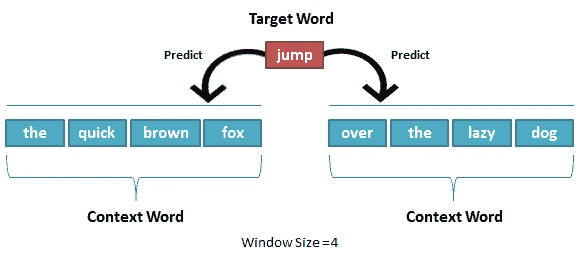
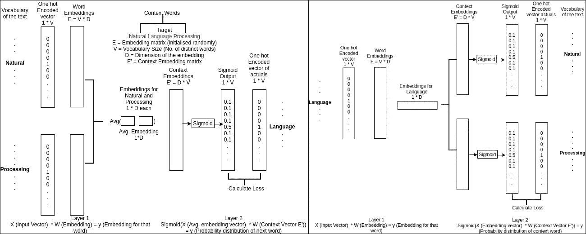
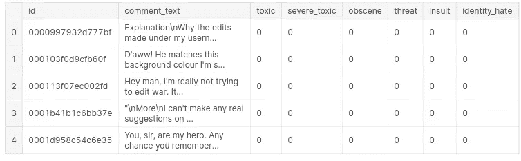
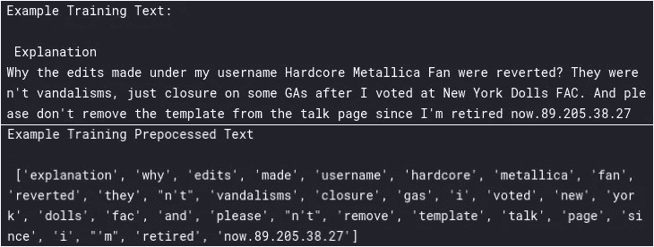
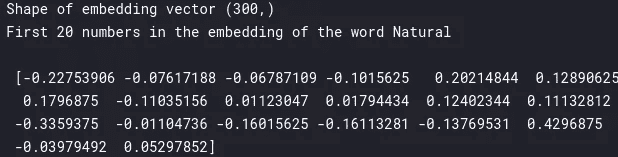
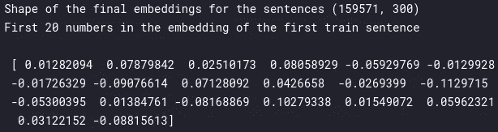

# 文本分类—从词袋到 BERT —第 2 部分(Word2Vec)

> 原文：<https://medium.com/analytics-vidhya/text-classification-from-bag-of-words-to-bert-part-2-word2vec-35c8c3b34ee3?source=collection_archive---------1----------------------->


塔曼娜·茹米在 [Unsplash](https://unsplash.com?utm_source=medium&utm_medium=referral) 拍摄的照片

这个故事是一系列文本分类的一部分——从单词袋到伯特。如果你还没有检查之前的故事，一定要检查一下，因为这将有助于理解未来的事情。

[第一部分](https://anirbansen3027.medium.com/text-classification-from-bag-of-words-to-bert-1e628a2dd4c9)

在之前的故事中( [Part 1 (BagOfWords)](https://anirbansen3027.medium.com/text-classification-from-bag-of-words-to-bert-1e628a2dd4c9) 我们使用了 CountVectorizer(一个 sklearn 的单词包实现)模型将文本转换为数字数据集，映射到输出变量 toxic、severe_toxic、淫秽、威胁、侮辱、identity_hate，并使用 sklearn 的多输出分类器包装器为所有 6 个输出变量创建逻辑回归模型。

在这个例子中，我们将用 Word2Vec 模型代替第一部分来创建嵌入，而不是 BagOfWords 向量，然后将其输入到逻辑回归模型中(任何 ML/DL 模型都可以在 Word2Vec 嵌入的基础上构建)。

**注意:我没有在这篇博客中涉及逻辑回归和特征重要性/模型解释的细节，因为我已经在上一篇文章(** [**第一部分(BagOfWords)**](https://anirbansen3027.medium.com/text-classification-from-bag-of-words-to-bert-1e628a2dd4c9)**)**中涉及过

***什么是单词嵌入？***


二维单词嵌入

单词嵌入为我们提供了一种使用高效、密集表示的方法，其中相似的单词具有相似的编码。重要的是，您不必手动指定这种编码。嵌入是浮点值的密集向量(向量的长度是您指定的参数)。

上面是一个二维单词嵌入，其中星期日与其他工作日的相似值多于家庭成员

***什么是 Word2Vec？***

Word2Vec 是创建/学习这些嵌入的最古老的方法之一。Word2Vec 不是一个单一的算法，而是一系列模型架构和优化，可用于从大型数据集学习单词嵌入。通过 Word2Vec 学习的嵌入已被证明在各种下游自然语言处理任务上是成功的，如文本分类、问题回答。该论文提出了两种学习单词表征的方法:

**连续词袋模型**基于周围上下文词预测中间词。上下文由当前(中间)单词前后的几个单词组成。这种架构被称为单词袋模型，因为单词在上下文中的顺序并不重要。

**连续跳格模型**预测同一句子中当前单词前后一定范围内的单词。



在 CBOW 中，给定单词(快速的棕色盒子，在懒惰的狗上面)，我们想要预测跳跃。在 Skipgram 中，与单词 jump 正好相反，我们想要预测(快速的棕色框，在懒狗上面)

***但是模特们是怎么学习的呢？***



【CBOW(左)和 Skip-gram(右)的架构

让我们从 CBOW 开始，我们以句子“自然语言处理”为例，其中“自然”和“处理”都是上下文词，“语言”是目标词。我们有一个浅的网络，如上图所示，只有一个隐藏层。

因此，输入是一个只有一个 1 的 V 项(词汇的大小/唯一单词的总数)的独一无二的编码向量。假设我们只有 5 个词汇(自然、语言、处理、是、很好)。自然的向量将是[1，0，0，0，0]。类似地，对于处理，它将是[0，0，1，0，0]。现在，我们有一个大小为 V * *D* 的随机初始化的嵌入向量(E ),其中 D 是可以选择的向量的维数。这是输入图层的权重矩阵。因此，我们将输入的独热编码向量乘以权重/嵌入向量。这给出了尺寸为 1 D 的上下文单词(自然的和处理的)的嵌入向量

现在，在隐藏层中，我们对上下文单词的嵌入向量进行平均，这形成了该层的大小为 1 ** D.* 的输入。这乘以另一个称为上下文向量(E’)的大小为 D * V 的向量。这给了我们 1 * V 的向量，该向量然后通过 sigmoid 函数得到最终输出。

将最终输出与语言的独热编码向量(中间字)[0，1，0，0，0]进行比较，并计算损失函数。该损失被反向传播，并且使用梯度下降来训练该模型

对于 Skip-gram，情况正好相反，我们有中间词的一个热编码向量，它乘以权重/嵌入向量 E = V * D，我们得到中间词的嵌入，作为输入层的输出和隐藏层的输入。它与上下文向量 E' = D * V 相乘，我们得到输出，该输出通过 sigmoid 传递，并与上下文单词进行比较，以得到损失和反向传播。

在这两种情况下，我们只在最后保留嵌入(E)向量

***我们将如何获得嵌入？***

Gensim 库使我们能够开发单词嵌入。Gensim 让您在训练自己的嵌入时可以选择 CBOW 或 Skip-gram。(默认为 CBOW)。除此之外，Gensim 还有一个预训练嵌入的目录，这些预训练嵌入是在几个文档上训练的，如 wiki 页面、google 新闻、Twitter tweets 等。在这个例子中，我们将使用基于谷歌新闻语料库(30 亿个运行单词)单词向量模型(300 万个 300 维英语单词向量)的预训练嵌入。定义够了。让我们深入研究代码👨‍💻

**实施:**

***1。读取数据集***



提醒一下，这是训练数据的样子

***2。基本预处理***

```
def preprocess_corpus(texts):
    *#importing stop words like in, the, of so that these can be removed from texts*
    *#as these words dont help in determining the classes(Whether a sentence is toxic or not)*
    mystopwords = set(stopwords.words("english"))
    def remove_stops_digits(tokens):
        *#Nested function that lowercases, removes stopwords and digits from a list of tokens*
        return [token.lower() for token **in** tokens if token **not** **in** mystopwords **and** **not** token.isdigit()
               **and** token **not** **in** punctuation]
    *#This return statement below uses the above function and tokenizes output further.* 
    return [remove_stops_digits(word_tokenize(text)) for text **in** tqdm(texts)]

*#Preprocess both for training and test data*
train_texts_processed = preprocess_corpus(train_texts)
test_texts_processed = preprocess_corpus(test_texts)
```



预处理的结果

在这种情况下，我们从 NLTK 库中删除停用词和完整数字，小写所有文本，并使用 word_tokenize 对文本进行标记化(分解成单独的标记/单词)

***3。加载预训练嵌入***

我们使用 Gensim 库为在 Google 新闻数据集上训练的单词加载预训练嵌入。谷歌新闻模型/嵌入向量是 300 维的。护目镜新闻模型/嵌入向量大约有 3 M 字。让我们看一个嵌入的例子，它本质上是一个字典，其中键是单词，值是该单词的嵌入向量。

```
*#Path for the models/ embedding vector*
google_news_model = '../input/gensim-embeddings-dataset/GoogleNews-vectors-negative300.gensim'
*#Loading the models/ embedding vector using KeyedVectors.load function from gensim*
w2v_google_news = KeyedVectors.load(google_news_model)
*#Print Shape of the embedding*
print("Shape of embedding vector", w2v_google_news["Natural"].shape)
*#Let's print first 20 dimensions rather than all 300*
print("First 20 numbers in the embedding of the word Natural**\n\n**", w2v_google_news["Natural"][:20])
```



这就是单词“Natural”的嵌入方式。

***4。使用预先训练的模型将文本输入转换为嵌入内容***

这里，我们从先前的输入标记化文本中获取输入，并从预先训练的嵌入向量中获取文本中每个单词的嵌入。这将为我们提供最终的输入数据集，其形式为每个句子的嵌入，可用于与输出变量一起训练。

```
*#Function that takes in the input text dataset in form of list of lists where each sentence is a list of words all the sentences are* 
*#inside a list*
def embedding_feats(list_of_lists, DIMENSION, w2v_model):
    zeros_vector = np.zeros(DIMENSION)
    feats = []
    missing = set()
    missing_sentences = set()
    *#Traverse over each sentence*
    for tokens **in** tqdm(list_of_lists):
        *# Initially assign zeroes as the embedding vector for the sentence*
        feat_for_this = zeros_vector
        *#Count the number of words in the embedding for this sentence*
        count_for_this = 0
        *#Traverse over each word of a sentence*
        for token **in** tokens:
            *#Check if the word is in the embedding vector*
            if token **in** w2v_model:
                *#Add the vector of the word to vector for the sentence*
                feat_for_this += w2v_model[token]
                count_for_this +=1
            *#Else assign the missing word to missing set just to have a look at it*
            else:
                missing.add(token)
        *#If no words are found in the embedding for the sentence*
        if count_for_this == 0:
            *#Assign all zeroes vector for that sentence*
            feats.append(feat_for_this)
            *#Assign the missing sentence to missing_sentences just to have a look at it*
            missing_sentences.add(' '.join(tokens))
        *#Else take average of the values of the embedding for each word to get the embedding of the sentence*
        else:
            feats.append(feat_for_this/count_for_this)
    return feats, missing, missing_sentences*#Embeddings for the train dataset*
train_vectors, missing, missing_sentences = embedding_feats(train_texts_processed, 300, w2v_google_news)
```



总之，每个句子将有一个 300 维的嵌入向量，它将是该句子中出现的单词嵌入的平均值。单词嵌入来自预先训练的单词嵌入，这些单词嵌入在 google news 上被训练以找到嵌入。

***5。训练和验证多输出分类器***

这一部分将涉及 5 件事

1.  获取训练数据集的嵌入向量
2.  将嵌入向量和输出变量分成训练集和验证集
3.  在训练嵌入向量和输出变量上拟合多输出逻辑回归模型*(我在之前的故事(* [*第一部分(bagowords)*](https://anirbansen3027.medium.com/text-classification-from-bag-of-words-to-bert-1e628a2dd4c9)*)*中已经详细介绍了逻辑回归)
4.  对验证嵌入向量进行预测
5.  根据 ROC-AUC 衡量绩效

```
def train_model(DIMENSION, model):
    *#Get the embedding vector for the training data*
    train_vectors, missing, missing_sentences = embedding_feats(train_texts_processed, DIMENSION, model)
    *#Split the embedding vector for the training data along with the output variables into train and validation sets*
    train_data, val_data, train_cats, val_cats = train_test_split(train_vectors, train_labels)
    *#Logistic Regression Model (As we have unbalanced dataset, we use class_weight which will use inverse of counts of that class. It penalizes mistakes in samples of class[i] with class_weight[i] instead of 1)*
    lr = MultiOutputClassifier(LogisticRegression(class_weight='balanced', max_iter=3000)).fit(train_data, train_cats)
    *#Actuals for the validation data*
    y_vals = val_cats
    *#Prediction probability for the validation dataset by the model for class 1*
    y_preds = np.transpose(np.array(lr.predict_proba(val_data))[:,:,1])
    *#Calculate the Mean ROC_AUC* 
    mean_auc = mean(accuracy(y_vals,y_preds))
    return mean_auc, lrmean_auc, lr = train_model(300, w2v_google_news)
```

这个模型被证明是相当温和的(~0。60 ROC-AUC)。但同样，我们的目标是学习如何实现单词嵌入。低性能可能是因为预训练的嵌入没有正确地捕捉细节。我们可以使用 Word2Vec 来训练我们自己的嵌入。

*TODOs:*

1.  从头开始训练 Word2Vec 模型
2.  尝试集合模型，而不是普通的 ML 模型在大多数情况下，打包和增强模型比经典的 ML 技术给出更好的结果
3.  可以做更好的文本预处理、打字错误纠正等来进一步改进模型

这是关于 Word2Vec 的，下一个，将是关于脸书的 fastText，它将单词嵌入的思想向前推进了一步，实现了一种叫做子单词嵌入的东西。在那之前保持安全。同样，完整的代码出现在[(这里)](https://www.kaggle.com/anirbansen3027/jtcc-word2vec)。请以回答和鼓掌的形式提供您的反馈:)