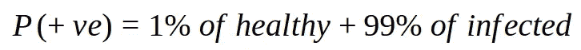

# 基于朴素贝叶斯的文本分类

> 原文：<https://medium.com/analytics-vidhya/text-classification-using-naive-bayes-e889dbf1edd?source=collection_archive---------7----------------------->

我敢打赌，我们大多数人在阅读这篇文章时，都已经解决了一个涉及贝叶斯定理的问题，无论是在不久前还是在遥远的过去。像这样的问题，

一种致命的疾病被发现了(姑且称之为 DiseaseXities)，其诊断测试准确率达 99%。众所周知，1%的人口已经患有这种疾病。你已经做了测试，结果呈阳性。你真的得了这种病的可能性有多大？


贝叶斯定理

在理清这一点之前，让我们先看看基础知识，然后我们将解决上述问题，然后尝试看看贝叶斯如何成为朴素贝叶斯并用于分类。

## 基础知识:三种概率

概率是对事件发生的可能性进行量化的度量。这个事件可以是任何事情，从掷硬币时得到一条尾巴，到掷骰子时得到 6。掷硬币或掷骰子，两者都是**实验**，而得到一个`tail`或 6 是那些实验的**事件**(一组结果)。

通常`X`被用作变量来表示事件。由此"*掷骰子得到 6 的概率是多少？*”将被表示为“ **P(X=6)** ”。

一个实验中所有结果的集合称为该实验的 ***样本空间*** 。因此，集合`{1, 2, 3, 4, 5, 6}`是掷骰子的样本空间。形式上，一个 ***事件*** 是 ***样本空间*** 的子集。

概率最简单的形式是


图 1:事件 E 的概率

***边际概率*** 是一个事件发生的概率，与另一个变量的结果无关。


图 2:联合概率

一 ***联合概率*** 是两个或两个以上事件同时发生的概率。**P(X =**T3**)**？？当从一副牌中抽出一张牌时，抽出的牌是`Heart.`的`Ace` &的概率是多少


图 3:给定 B 已经发生的概率

***条件概率*** (理解贝叶斯定理的关键要素)是给定某个其他事件已经发生的情况下，某个事件发生的概率。
例如*假设一个罐子里装着 5 个两种颜色的球(2 红 3 黑)，你挑两个球，发现其中一个是红色的。另一个球也是红色的概率是多少？*


图 4

样本空间= `{RR, RB, BB}`

P(red|red) = 1/2 ie `{RR}/{RR,RB}`

现在让我们考虑一下 ***P(A|B)*** 。这里我们特别感兴趣的是 ***一*** 。由于 B 已经发生，可能的结果必须来自图 4 中的阴影区域，将范围限制在 A 和 B 共享的区域(蓝色阴影区域),即 P(A ∩ B ),根据经典概率理论 P =相关/总，因此


图 5:条件概率。(蓝色区域/黄色区域)

此外，


图 6

同样的，


图 7

因此，从图 6 和图 7 可以看出


这就是贝叶斯定理。


图 8

## 解决问题

既然我们已经得出了公式，让我们用它来解决上面的问题。让我们再次重申这个问题

*一种致命的疾病被发现了(姑且称之为 DiseaseXities)，其诊断测试准确率达 99%。众所周知，1%的人口已经患有这种疾病。你已经做了测试，结果呈阳性。你真的得了这种病的可能性有多大？*


图 9:图像 src:[https://brilliant.org/wiki/bayes-theorem/](https://brilliant.org/wiki/bayes-theorem/)

让我们用数学方法来表述这个问题。


图 10

由于该测试有 99%的准确性——受感染的人有 99%的时间被检测为阳性，而对于健康的人，该测试有 99%的时间被检测为阴性。众所周知，1%的人口患有这种疾病。因此，一个随机的人患有疾病 P(+ve)的概率是



图 11

因为测试有 99%的准确性


图 12

根据贝叶斯定理


图 13


图 14

因此，你得这种病的可能性是 50%。

## 文本分类和情感分析

***文本分类*** 将预定义的类别分配给文本文档的任务。情感分析可以被认为是文本分类中的一个领域，其重点在于识别文本中的主观信息，并将每条数据分类为正面、负面或中性。通常被称为**意见挖掘**。

文本分类的一个经典例子是检测电子邮件是否是垃圾邮件。在这里，我们将使用餐馆评论样本。

在我们继续讨论之前，让我们再来看看贝叶斯定理，不过符号有所改变。

用数学术语来说，文本分类的问题是


应用贝叶斯定理，我们得到


因为分母在所有项中都是相同的，所以明智的做法是将其写成


对于单个术语，必须计算 P(H)先验和 P(D|H)在假设下看到文本的概率。先验帮助你把假设的先验信念。P(+ve)，任何新评论是正面评论的概率。因此


其他类别也是如此。现在我们有了获得先验的方法，让我们找出在特定假设下获得文本的概率。p(文本|假设)。

如果说一个句子中的单词不相互依赖，那就太天真了。但是，我们在计算 P(text|Hypothesis)时也做了同样的假设。因而得名 ***朴素贝叶斯*** 。

> 假设特性是独立的，是非常天真的。因此有了朴素贝叶斯这个名字。

现在在*天真的假设下，* P(Text|Hypothesis)是


P(A ∩ B) = P(A) * P(B)如果 A 和 B 是独立的

您现在知道了朴素贝叶斯分类器是如何工作的。

## 弄脏我们的手

现在，让我们尝试将我们的知识用于构建一个分类器，我们将在真实数据集上训练该分类器。

Yelp 评论数据集随时可用，只需一次谷歌搜索。要获得数据的概述，您可以参考本 [kaggle](https://www.kaggle.com/suzanaiacob/sentiment-analysis-of-the-yelp-reviews-data/data) 笔记本中的探索性数据分析(EDA)部分。

评论数据包含许多列，但是，我们将只挑选相关的列，即`text`和`stars`。`text`包含来自用户的个人评论以及他们的`stars`评分(1 到 5 分)。为了简化任务，可以对恒星进行重新标记。星数大于 3 标记为 3(正)，星数小于 3 标记为 1(负)，3 标记为 2(中性)。让我们看看个人评论是什么样的。

```
*“Love the staff, love the meat, love the place. Prepare for a long line around lunch or dinner hours. \n\nThey ask you how you want you meat, lean or something maybe, I can’t remember. Just say you don’t want it too fatty. \n\nGet a half sour pickle and a hot pepper. Hand cut french fries too.”*
```

我们首先将文本转换成小写，然后删除停用词。将单词规范化也是明智的，单词规范化就像词干化(将单词简化为它的 ***词干*** )，词汇化(将两个单词简化为它的词根，单词`is`、`am,` `are`属于同一个词根`be.`

与字符串相比，处理数字更快。我们将把文本内容转换成数字特征向量。 ***词袋*** 模型通常用在文档分类方法中，其中每个词的(出现频率)被用作训练分类器的特征。请参考[这篇文章](https://stackabuse.com/python-for-nlp-creating-bag-of-words-model-from-scratch/)上的包话。

简而言之，单词包是两个数据结构的组合，一个包含语料库(所有文档/文本中)中的单词列表及其索引，另一个是矩阵 M，其中 M[i，j]存储第`j`个文档中第`j`个单词(在第一个 ds 中以 j 作为索引的单词)的计数。第一个数据结构(即单词列表)很容易包含数千个单词，然而，一个句子很少超过 100 个单词。因此，使得矩阵非常稀疏，因为大多数条目将为零。

`scipy.sparse`矩阵是数据结构，存储相同的信息非常容易(内存优化)，并且`scikit-learn`内置了对这些结构的支持。

```
# train_df is a pandas dataframe containing "text", "stars" as
# columns (stars being revised stars positive, neutral or negative)# test_df is similar to the train_df, however it will be used for 
# testing(evaluating the classifier)from sklearn.feature_extraction.text import CountVectorizer
bog_d = CountVectorizer()
bog_m = bog_d.fit_transform(train_df.text.get_values())# get the index of the word good
>>> bog_d.vocabulary_.get(u"good")
>>> 85492# thus the number 85492 represents "good"
```

如果所有文档的字数或多或少相同，则出现次数(频率)是好的。然而，评论文本长度变化很大。对于较长的文档，它将比较短的文档具有更高的平均计数值，即使它们可能谈论相同的主题。

为了避免这些潜在的差异，将文档中每个单词的出现次数除以文档中单词的总数就足够了:这些新特征被称为**词频(tf)** 。

在`tf`之上的另一个改进是降低出现在语料库的许多文档中的单词的权重，因此比那些只出现在语料库的一小部分中的单词信息量少。这种缩减被称为**TF–IDF**，表示**“术语频率乘以逆文档频率”。**

所以让我们找到`tf-idfs.`

```
from sklearn.feature_extraction.text import TfidfTransformer
tfidf_transformer = TfidfTransformer()
train_tfidf = tfidf_transformer.fit_transform(bog_m)
```

现在我们有了正确格式的特征，让我们训练分类器。

```
from sklearn.naive_bayes import MultinomialNBclf = MultinomialNB().fit(train_tfidf, train_df.stars.get_values())
```

是的，用`sklearn`训练分类器就是这么简单。

我们来测试一下。

```
bog_tm = bog_d.transform(test_texts.get_values())
test_tfidf = tfidf_transformer.transform(bog_tm)predicted = clf.predict(test_tfidf)print("the accuracy of the classifier is", 
             np.mean(predicted == test_targets))
```

朴素贝叶斯的一个显著特征是它在训练时快如闪电。超级好理解。

## 引用和参考文献

1.  [https://brilliant.org/wiki/bayes-theorem/](https://brilliant.org/wiki/bayes-theorem/)
2.  [https://en.wikipedia.org/wiki/Probability](https://en.wikipedia.org/wiki/Probability)
3.  [https://stack abuse . com/python-for-NLP-creating-bag-of-words-model-from-scratch/](https://stackabuse.com/python-for-nlp-creating-bag-of-words-model-from-scratch/)

特别感谢[prajval gurumurthy](https://medium.com/u/2fbc374a08b5?source=post_page-----e889dbf1edd--------------------------------)校对了这篇文章。