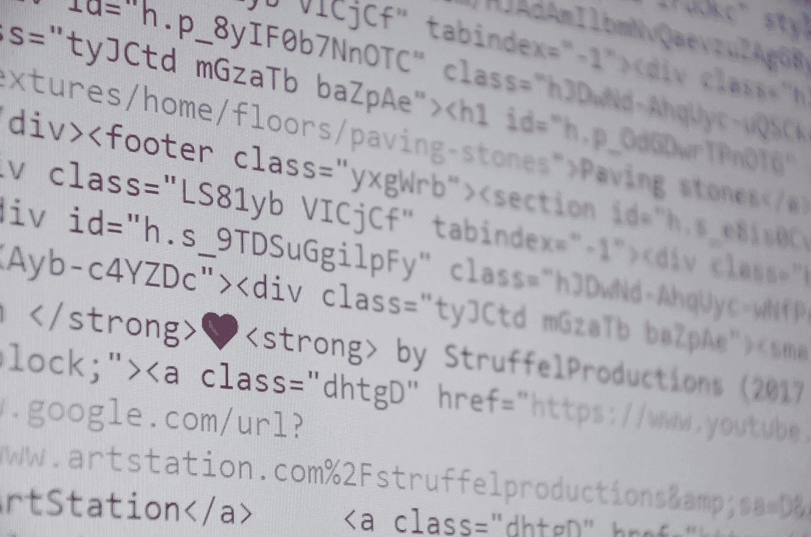

# 自然语言处理中的文本清洗

> 原文：<https://medium.com/analytics-vidhya/text-cleaning-in-natural-language-processing-nlp-bea2c27035a6?source=collection_archive---------11----------------------->

## 文本清理迷你指南



这里有许多使用自然语言处理开发的操作和产品。文本是任何类型模型的主要输入，比如分类、Q & A 模型、情感分析等等。

因此，考虑文本包含不同的符号和单词，这些符号和单词在训练时不会向模型传达含义。因此，我们将在以有效的方式输入到模型之前删除它们。这种方法称为数据预处理。或者，它也被称为文本清理。

使用 NLP 构建任何产品的端到端流程如下:

1.  数据收集
2.  数据预处理(非常重要的步骤)
3.  数据探索和可视化
4.  模型构建(当然是有趣的部分！！)
5.  模型评估

模型的准确性取决于在训练任何模型之前文本被清理的程度。通过下面的链接可以访问许多数据集:

[https://analyticsindiamag . com/10-NLP-open-source-datasets-to-start-your-first-NLP-project/](https://analyticsindiamag.com/10-nlp-open-source-datasets-to-start-your-first-nlp-project/)

数据预处理必须包括以下内容:

1.  删除 HTML 字符，ASCII
2.  将文本转换为小写
3.  删除标点符号
4.  删除停用词
5.  标记化
6.  词干化 vs 词条化(选哪个？)

步骤 1 和 2 被编译成一个函数，该函数是用于基本文本清理的模板。根据您的清洁目的，您可以使用以下模板。

**代号:**

```
input_text='''Iam <435*&(*&%_:cleaning (*&^the)) *&text'''import re
import string
def clean_text(text):#will replace the html characters with " "
    text=re.sub('<.*?>', ' ', text)  
    #To remove the punctuations
    text = text.translate(str.maketrans(' ',' ',string.punctuation))
    #will consider only alphabets and numerics
    text = re.sub('[^a-zA-Z]',' ',text)  
    #will replace newline with space
    text = re.sub("\n"," ",text)
    #will convert to lower case
    text = text.lower()
    # will split and join the words
    text=' '.join(text.split())
    return text#Running the Funtion
new_text=clean_text(input_text)
##Output:
iam cleaning the text including 123
```

**停用词的移除:**

topwords 是对句子没有多少意义的词。它们可以被安全地忽略，而不会牺牲句子的意义。例如，如果你看到下面的例子，我们可以看到停用词被删除。Nltk(自然语言工具包)提供了像标记化和停用词这样的功能。您可以使用以下模板从文本中删除停用词。

```
from nltk.corpus import stopwords
from nltk.tokenize import word_tokenize 
input_text = “I am passing the input sentence here. so we will see what happens with this and.”
stop_words = set(stopwords.words(‘english’)) 
word_tokens = word_tokenize(input_text) 
output_text = [w for w in word_tokens if not w in stop_words] 
output = [] 
for w in word_tokens: 
    if w not in stop_words: 
        output.append(w) 

print(word_tokens) 
print(output)
#Printing Word Tokens and output(stop words removed)#
['I', 'am', 'passing', 'the', 'input', 'sentence', 'here', '.', 'so', 'we', 'will', 'see', 'what', 'happens', 'with', 'this', 'and', '.']['I', 'passing', 'input', 'sentence', '.', 'see', 'happens', '.']
```

**词干对比词汇化**

这是一个有趣的话题。

> *“词干化是将单词中的词尾变化减少到其词根形式的过程，例如将一组单词映射到同一个词干，即使该词干本身在语言中不是有效的单词。”*

词干分析是一种基于规则的方法，它根据常见的前缀和后缀剥离变形的单词。

例如:常见的后缀如:“es”、“ing”、“pre”等。

> *“词干化不同于词干化，它适当地减少了词形变化，确保词根属于该语言。在引理化中，词根叫做* ***引理***

*它通常指使用词汇和词形分析来恰当地做事。在去除任何东西之前，它会观察单词的位置和词性*

*请参考下面的链接，以便更好地理解*

*[https://NLP . Stanford . edu/IR-book/html/html edition/stemming-and-lemma tization-1 . html](https://nlp.stanford.edu/IR-book/html/htmledition/stemming-and-lemmatization-1.html)*

*还在迷茫？？*

*我们将举一个小例子来理解其中的区别*

```
*from nltk.stem import PorterStemmer 
from nltk.tokenize import word_tokenize 

ps = PorterStemmer() 

# choose some words to be stemmed 
words = [‘connect’,’connected’,’connection’,’connecting’,’connects’]

for w in words: 
 print(w, “ : “, ps.stem(w))#output
connect  :  connect
connected  :  connect
connection  :  connect
connecting  :  connect
connects  :  connect#Lemma
from nltk.stem import WordNetLemmatizer 

lemmatizer = WordNetLemmatizer() 

print("studies:", lemmatizer.lemmatize("studies")) 
print("corpora :", lemmatizer.lemmatize("corpora")) 

print("better :", lemmatizer.lemmatize("better", pos ="a"))#output
studies: study
corpora : corpus
better : good*
```

*你可以从下面的文章中了解更多不同类型的词干分析器。*

*[](https://towardsdatascience.com/stemming-lemmatization-what-ba782b7c0bd8) [## 词干？引理化？什么？

### 深入探究词干化和词汇化对自然语言处理任务的作用以及它们是如何实现的…

towardsdatascience.com](https://towardsdatascience.com/stemming-lemmatization-what-ba782b7c0bd8) 

现在包装东西。

在下一篇文章中，我将处理一个数据集，并展示预处理代码的紧凑使用。永远记住，数据预处理越好，结果就越好。所以自己试试下面的数据集。分析什么样的场地可以清理，使用什么样的技术可以做到。把它当成游乐场，自己去试试。那是学习任何东西的最好方法！！

[https://www . ka ggle . com/thought vector/customer-support-on-Twitter](https://www.kaggle.com/thoughtvector/customer-support-on-twitter)

快乐学习分析！！

[](https://www.linkedin.com/in/nikhil-pentapalli-5744bb18b/) [## Nikhil Pentapalli -执行 2 -机器学习-信实工业有限公司| LinkedIn

### 真实世界人工智能产品制造经验。->在将实际问题转化为需求和解决方案方面经验丰富…

www.linkedin.com](https://www.linkedin.com/in/nikhil-pentapalli-5744bb18b/)*