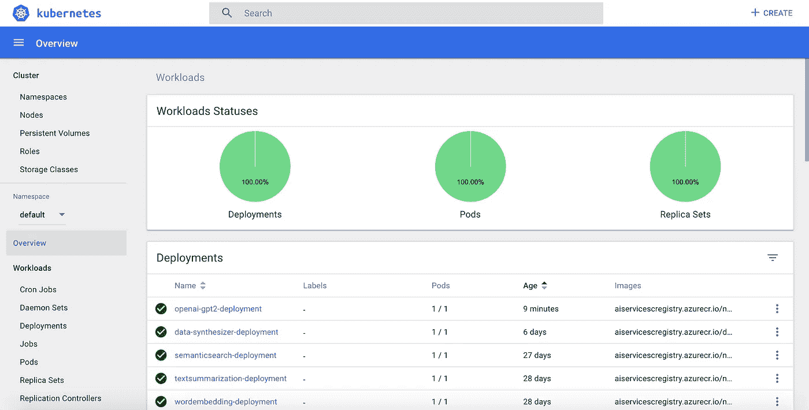

# 在生产中使用 OpenAI 的 GPT-2 生成文本

> 原文：<https://medium.com/analytics-vidhya/text-generation-with-openais-gpt-2-in-production-1379e0df103d?source=collection_archive---------4----------------------->


Open AI 最近刚刚发布了最大版本的 GPT-2，其中有 1.5 亿个参数，而 9 个月前它发布了最小版本，其中有 1.24 亿个参数。回到 2019 年 2 月，埃隆·马斯克(Elon Musk)的 OpenAI 发布声明称，OpenAI 的 GPT-2 在生成文本方面如此出色，以至于发布它是危险的。这就是最大型号推迟发布的原因。它现在就在这里，它是否危险，只有时间能证明。研究是伟大的，但是把它投入生产并在生产系统中使用才是真正的不同。

在这篇博客中，我将与你分享将开放的 AIs GPT 2 投入生产的技巧、诀窍和工具，并免费给你一个工作的 **Docker 容器映像**，你可以**将它部署到你的生产环境**。在我们深入技术实现之前，让我们看看什么是文本生成，以及开放的人工智能 GPT 2 模型如何促进它。

**什么是 OpenAI？**

OpenAI 是一家位于美国旧金山的人工智能研究公司。OpenAI 的使命是确保人工通用智能(AGI)造福全人类。我们所说的 AGI 指的是在大多数有经济价值的工作中胜过人类的高度自治的系统。

**什么是 GPT 新协议模式？**

GPT-2 是一个大型的基于转换器的语言模型，具有 15 亿个参数，在 800 万个网页的数据集上进行训练。GPT-2 训练有一个简单的目标:预测下一个单词，给定一些文本中的所有以前的单词。数据集的多样性导致这个简单的目标包含跨不同领域的许多任务的自然发生的演示。GPT-2 是 GPT 的直接放大版，参数超过 10 倍，数据量超过 10 倍。由 OpenAI 开发的 GPT-2 是一个预先训练好的语言模型。

*“GPT-2 在各种特定领域的语言建模任务上取得了一流的成绩。我们的模型没有针对这些任务的任何特定数据进行训练，只是作为最终测试对其进行评估；这就是所谓的“零射击”设置。在特定领域数据集(如维基百科、新闻、书籍)上进行评估时，GPT-2 的表现优于在这些数据集上训练的模型。”—开放 AI 团队。*

有关该模型的架构和工作的更多信息，请阅读 OpenAI 发表的[研究论文](https://d4mucfpksywv.cloudfront.net/better-language-models/language_models_are_unsupervised_multitask_learners.pdf)。

在实践层面上，它可以完成各种自然语言处理任务，例如:

*   文本生成
*   语言翻译
*   阅读理解
*   构建问答系统
*   写作辅助
*   创造性写作和艺术
*   娱乐:创造游戏、聊天机器人和娱乐一代。

这里有一个例子，说明模型如何在给出一个短句后生成一个故事或文本。


为了快速获得感觉，你可以在这里试验这个模型:[https://talktotransformer.com/](https://talktotransformer.com/)

# 现在让我们将它部署到生产环境中。


我们将使用 python 进行应用和部署。我们使用 Flask 应用程序在 Apache web 服务器(适用于生产，可以处理大量请求)上推断 GPT-2 模型，Docker 将其封装并部署在 Kubernetes 集群上，该集群处理服务编排和扩展。为了开始，

克隆这个库:【https://github.com/emmanuelraj7/opengpt2.git 

```
git clone https://github.com/emmanuelraj7/opengpt2.git
```

关键文件…

a)download _ models . py-下载所需的模型工件。

b)[flask _ predict _ API . py](https://github.com/emmanuelraj7/opengpt2/blob/master/flask_demo/flask_predict_api.py)—基于 Flask 的 web 应用，以 REST API 的形式提供 GPT-2 模型即服务

# 要在本地运行它…

所有步骤都可以使用 virtualenv 或 conda 等工具在虚拟环境中完成。拥有 python 3.6 版本(不是 3.7)。安装 tensorflow 1.12(有 GPU 支持，如果你有 GPU，希望一切运行得更快)

```
pip3 install tensorflow==1.12.0
```

或者

```
pip3 install tensorflow-gpu==1.12.0
```

安装其他需要的 python 包

```
cd flask_demo
pip3 install -r requirements.txt
```

下载模型数据:下载具有 124，355，774 百万和 15 亿个参数的模型

```
python3 download_model.py 124M
python3 download_model.py 355M
python3 download_model.py 774M
python3 download_model.py 1558M
```

运行推理-API

```
python flask_predict_api.py
```

# 在生产中运行它…

# 1.建立码头工人形象

```
FROM continuumio/anaconda3:4.4.0
MAINTAINER Emmanuel Raj, AI Engineer
EXPOSE 8000
RUN apt-get update && apt-get install -y apache2 \
	    apache2-dev \   
	    vim \
	 && apt-get clean \
	 && apt-get autoremove \
	 && rm -rf /var/lib/apt/lists/*
WORKDIR /var/www/flask_predict_api/
COPY ./flask_predict_api.wsgi /var/www/flask_predict_api/flask_predict_api.wsgi
COPY ./flask_demo /var/www/flask_predict_api/
RUN pip install -r requirements.txt
RUN python3 download_model.py 124M
RUN python3 download_model.py 355M
RUN python3 download_model.py 774M
RUN python3 download_model.py 1558M
RUN /opt/conda/bin/mod_wsgi-express install-module
RUN mod_wsgi-express setup-server flask_predict_api.wsgi --port=8000 \
	    --user www-data --group www-data \
	    --server-root=/etc/mod_wsgi-express-80

CMD /etc/mod_wsgi-express-80/apachectl start -D FOREGROUND
```

从上面的 docker 文件，我们建立一个 docker 映像来部署。首先，我们使用来自 Docker hub 的预制容器映像 continuumio/anaconda3:4.4.0，我们公开 Apache server 将在其中运行服务器的端口 8000，然后安装 Apache，为 Docker 容器创建一个工作目录，从 repo 复制所有需要的文件，并从 requirements.txt 安装所有需要的依赖项。

接下来，我们通过使用文件 download_model.py 下载所需的工件——模型文件。我们通过文件——flask _ predict _ API . WSGI 创建 web 服务器网关接口(WSGI ),使用 apache 服务器托管我们的 web 应用程序，因为 flask 开发服务器不适合生产。然后，我们用 Apache 服务器将 flask 应用程序封装到 docker 容器中，并在端口 8000 运行它。

要运行构建此 docker 映像:

```
docker build --tag openai-gpt2 .
```

将此 docker 映像推送到 Docker hub 或您需要的 Docker 注册表。从那里，它应该准备好部署到 Kubernetes 集群。

要在本地运行它:

```
docker run -d -p 8000:8000 containerid
```

这个应用程序有 Swagger UI，通过它您可以在:[http://localhost:8000/API docs/](http://localhost:8000/apidocs/)上使用和测试服务

或者简单地用“input_text”和“model_name”参数向端点“get_text_generate”发出 get 请求。例如:

```
[http://localhost:8000/text-generate?input_text=where%20is%20finland%3F&model_name=124M](http://localhost:8000/text-generate?input_text=where%20is%20finland%3F&model_name=124M)
```

将 docker 映像上传到集线器/注册表:

```
docker push openai-gpt2:latest
```

# 2.将 Docker 容器映像部署到 Kubernetes 集群

Kubernetes 是一个开源的容器编排系统，用于自动化应用程序部署、伸缩和管理。您可以使用您选择的理想工具来部署它，例如:Kubectl、Helm 或 Kompose。

这是我的 Kubernetes 集群的仪表板视图，我在其中部署了服务(使用 Helm ),该服务可以自动伸缩，并准备好一次处理多个大量的请求。



感谢阅读。这是我很高兴与你分享把开放人工智能的 GPT-2 模型投入生产。我很乐意帮助你将最先进的人工智能模型应用到生产中。如果有任何问题，请随时联系我。