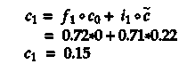

# 文本-LSTM(初学者指南)

> 原文：<https://medium.com/analytics-vidhya/text-lstm-f1aaceeb5727?source=collection_archive---------7----------------------->

## 文本分类中的 LSTM(单词嵌入)

我是机器学习的新手。我找不到一个合适的文本 LSTM 的视觉表达，也找不到喀拉斯 LSTM 单位在 LSTM 网络中是如何安排的。这是我对此最简单的解释。在我们进入这篇文章之前，我强烈建议你看看下面我所了解的关于 LSTM 的文章。

[](https://statisticalinterference.wordpress.com/2017/06/01/lstms-in-even-more-excruciating-detail/) [## LSTMs 的一个数值例子

### 许多帖子已经详细讨论了 LSTMs 的向前传球(例如，这里非常有用的帖子)…

statisticalinterference.wordpress.com](https://statisticalinterference.wordpress.com/2017/06/01/lstms-in-even-more-excruciating-detail/)  [## 了解 LSTM 网络

### 2015 年 8 月 27 日发布人类不是每秒钟都从零开始思考。当你读这篇文章时，你…

colah.github.io](http://colah.github.io/posts/2015-08-Understanding-LSTMs/?source=post_page-----37e2f46f1714----------------------) 

LSTM(长短期记忆)是 RNN(递归神经网络)高级版本。RNN 的主要问题是它不能记住文本中的长期信息，时间序列数据，过去的信息相关信息被存储以备将来使用。这被称为消失梯度下降，其中权重在初始层上被更新，但是当我们离网络的初始层更远时，权重被更新得很少或者根本不更新。

消失梯度下降问题的一个例子是，如果你的权重更新为 0.0000000001，那么这些层根本不会学习，或者因为消失梯度而学习非常慢。

上述问题在 LSTM 得到解决，因为我们有存储单元来存储与网络相关的先前信息。

# LSTM 细胞


LSTM 细胞(来源—[http://colah.github.io/posts/2015-08-Understanding-LSTMs/)](http://colah.github.io/posts/2015-08-Understanding-LSTMs/)

下面是单个 LSTM 细胞内部的示意图，以及信息如何从一个门流向另一个门，以及从一个细胞流向另一个细胞。


## 忘记大门

在中使用遗忘门来遗忘单元状态中的信息。遗忘门使用 Sigmoid 激活功能，输出范围为(0–1)的值。0 表示完全忘记信息，1 表示为下一时间步存储信息。遗忘门的一个例子如下

> 我住在浦那，但现在我住在海德拉巴。所以你可以在我现在的地方下订单。

在上面的句子中，我们可以看到位置 Pune 应该在下一个时间步骤中被删除，因为位置被更改为 Hyderabad。这是遗忘之门工作原理的一个小例子。


## 输入门

输入门决定我们将在单元状态中更新哪些值。它通过 Sigmoid Activaton 传递这些值，后者给出了要传递的新信息量。再看前面的例子


该下部门从状态中获取信息，并将 tanh 激活功能应用于 in。它提出要添加到单元状态的新信息。

下面的层是 tanh 激活层，它给出可以添加到下一个单元状态的值。它提出要添加到单元状态的新信息。


## 输出门

输出门应用 Sigmoid 激活函数，并给我们单元状态的哪一部分输出到最终状态的信息:


## 更新/下一个单元状态

这是传递到下一个单元或作为输出的最终更新的单元状态:



## 更新/下一个隐藏状态

这是给予下一个单元或作为输出的最终隐藏状态:


## 3 个隐藏单元的 LSTM 表示

句子—好日子
每个单词的嵌入维数= 5
LSTM 隐藏单元= 3

```
inp = Input(shape=(2,))
x = Embedding(50000, 5)(inp)
x = LSTM(3, return_sequences=True)(x)
x = Flatten()(x)
x = Dense(1, activation="sigmoid")(x)
model = Model(inputs=inp, outputs=x)
model.compile(loss='binary_crossentropy', optimizer='adam', metrics=['accuracy'])
print(model.summary())
```

```
_________________________________________________________________
Layer (type)                 Output Shape              Param #   
=================================================================
input_13 (InputLayer)        (None, 2)                 0         
_________________________________________________________________
embedding_13 (Embedding)     (None, 2, 5)              250000    
_________________________________________________________________
lstm_16 (LSTM)               (None, 2, 3)              108       
_________________________________________________________________
flatten_5 (Flatten)          (None, 6)                 0         
_________________________________________________________________
dense_11 (Dense)             (None, 1)                 7         
=================================================================
Total params: 250,115
Trainable params: 250,115
Non-trainable params: 0
_________________________________________________________________
None
```

下图是如何在 LSTM 用 3 个隐藏单元进行单个单元格的计算。

> 我没有计算 LSTM 中的值，这只是示例值


我们的句子是“Good Day ”,因此需要两个 STM 细胞将信息传递给下一个细胞。下图显示了信息是如何从一个单元格传递到另一个单元格的。


在上图中，您可以看到“return_sequence”和“return_state”是如何输出值的。

## 返回序列

```
return_sequence = True
```

它输出每个时间步长的值，如上图所示

```
return_sequence = False
```

它输出上一个时间步长的值，如上图所示

## 返回状态

```
return_state = True
```

它输出上图所示的最后一个时间步长和最后一个单元状态的值

> 如果你在这篇文章中发现任何我可能写错的信息，请在 raqueebilahi@gmail.com 或评论区告诉我
> 
> 我也在印度浦那寻找数据科学家的工作。如果你有任何空缺，我很乐意与你联系。请务必让我在 raqueebilahi@gmail.com 知道