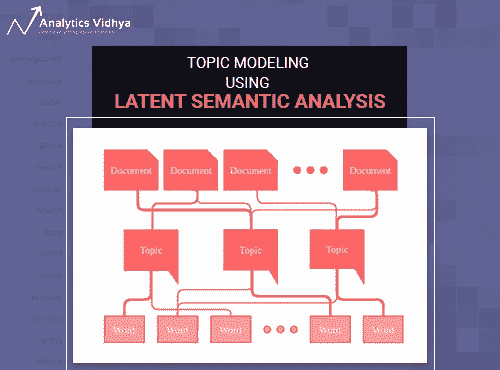
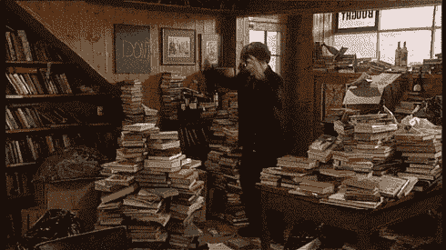
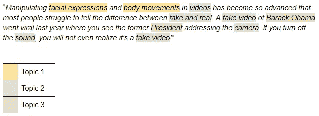
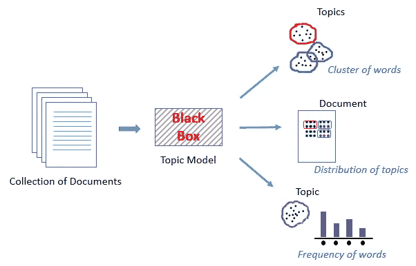
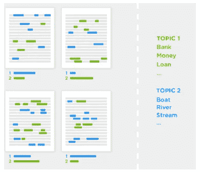
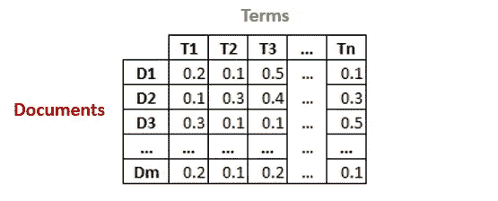
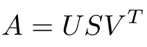
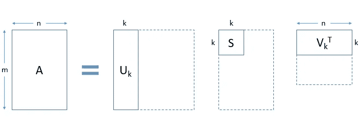
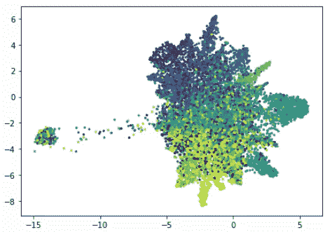

# 文本挖掘 101:使用潜在语义分析的主题建模逐步介绍(使用 Python)

> 原文：<https://medium.com/analytics-vidhya/text-mining-101-a-stepwise-introduction-to-topic-modeling-using-latent-semantic-analysis-using-add9c905efd9?source=collection_archive---------0----------------------->



你去过维护良好的图书馆吗？我总是对图书馆员按名称、内容和其他主题组织一切的方式印象深刻。但是，如果你给这些图书管理员几千本书，并要求他们根据他们的流派来安排每本书，他们将很难在一天内完成这项任务，更不用说一个小时了！

然而，如果这些书是数字格式的，这就不会发生在你身上，对吗？所有的安排似乎都在几秒钟内完成，不需要任何人工操作。所有人都欢呼自然语言处理(NLP)。



*资料来源:confessionsofabookgeek.com*

看看下面的文字片段:



从突出显示的文本中可以看出，有三个主题(或概念)——主题 1、主题 2 和主题 3。一个好的主题模型会识别相似的单词，并将它们放在一个组或主题下。上面例子中最主要的主题是主题 2，这表明这段文字主要是关于假视频的。

好奇了吗？很好！在本文中，我们将学习一种叫做主题建模的文本挖掘方法。这是一种非常有用的抽取主题的技术，当你面临 NLP 挑战时，你会经常用到它。

*注:我强烈推荐阅读本文*[](https://www.analyticsvidhya.com/blog/2018/08/dimensionality-reduction-techniques-python/)**来理解 SVD 和 UMAP 这样的术语。本文利用了它们，因此对它们有一个基本的了解将有助于巩固这些概念。**

# *目录*

1.  *什么是主题模型？*
2.  *什么时候使用主题建模？*
3.  *潜在语义分析概述(LSA)*
4.  *LSA 在 Python 中的实现*

*   *数据读取和检查*
*   *数据预处理*
*   *文档术语矩阵*
*   *主题建模*
*   *主题可视化*

*5.LSA 的利与弊*

*6.主题建模的其他技术*

# *什么是主题模型？*

*主题模型可以定义为一种无监督的技术，用于发现各种文本文档中的主题。这些主题本质上是抽象的，即彼此相关的单词形成一个主题。同样，一个文档中可以有多个主题。现在，让我们将主题模型理解为一个黑盒，如下图所示:*

**

*这个黑盒(主题模型)形成了被称为主题的相似和相关单词的集群。这些主题在一个文档中有一定的分布，每个主题都是由它所包含的不同词的比例来定义的。*

# *什么时候使用主题建模？*

*回想一下我们之前看到的将相似的书排列在一起的例子。现在假设您必须用几个数字文本文档执行类似的任务。只要文档的数量是可管理的(也就是不要太多)，您就可以手动完成这个任务。但是当这些数字文本文档的数量多到无法想象的时候，会发生什么呢？*

*这就是 NLP 技术脱颖而出的地方。对于这个特殊的任务，主题建模是我们将要用到的技术。*

**

**资料来源:topix.io/tutorial/tutorial.html**

*主题建模有助于探索大量的文本数据、发现单词簇、文档间的相似性以及发现抽象主题。似乎这些理由还不够令人信服，主题建模也被用在搜索引擎中，其中搜索字符串与结果相匹配。越来越有趣了，不是吗？好吧，那就接着读吧！*

# *潜在语义分析概述(LSA)*

*所有语言都有自己的错综复杂和细微差别，机器很难捕捉到(有时它们甚至会被我们人类误解！).这可以包括意思相同的不同单词，也可以包括拼写相同但意思不同的单词。*

*例如，考虑下面两句话:*

1.  *我非常喜欢他的上一部**小说**。*
2.  *我们想做一个**小说**营销活动。*

*在第一句中，单词“novel”指的是一本书，在第二句中它指的是新的或新鲜的。*

*我们可以很容易地区分这些单词，因为我们能够理解这些单词背后的上下文。然而，机器将不能捕捉这一概念，因为它不能理解单词被使用的上下文。这就是潜在语义分析(LSA)发挥作用的地方，因为它试图利用单词周围的上下文来捕捉隐藏的概念，也称为主题。*

*因此，简单地将单词映射到文档并不会真正有所帮助。我们真正需要的是搞清楚文字背后隐藏的概念或话题。LSA 就是这样一种技术，可以发现这些隐藏的主题。现在让我们深入了解 LSA 的内部运作。*

# *执行 LSA 所涉及的步骤*

*假设我们有 **m** 个文本文档，总共有 **n** 个唯一术语(单词)。我们希望从文档的所有文本数据中提取出 k 个主题。主题的数量 k 必须由用户指定。*

*   *生成具有 TF-IDF 分数**的形状 **m x n** 的文档术语矩阵。***

**

*   *然后，我们将使用奇异值分解(SVD)将上述矩阵的维数减少到 **k** (所需主题的数量)维。*
*   *SVD 将一个矩阵分解成另外三个矩阵。假设我们想用 SVD 分解一个矩阵 A。它将被分解成矩阵 U、矩阵 S 和 VT(矩阵 V 的转置)。*

****

*矩阵 **Uk(文档-术语矩阵)**中的每一行都是相应文档的向量表示。这些向量的长度是 k，这是期望主题的数量。我们数据中术语的向量表示可以在矩阵 **Vk(术语-主题矩阵)**中找到。*

*   *因此，SVD 为我们的数据中的每个文档和术语提供了向量。每个向量的长度将是 **k** 。然后，我们可以使用余弦相似度方法，使用这些向量来查找相似的单词和相似的文档。*

# *LSA 在 Python 中的实现*

*是时候启动 Python 并了解如何在主题建模问题中实现 LSA 了。一旦您的 Python 环境打开，请遵循我在下面提到的步骤。*

## *数据读取和检查*

*让我们在继续做任何事情之前加载所需的库。*

```
*import numpy as np 
import pandas as pd 
import matplotlib.pyplot as plt 
pd.set_option("display.max_colwidth", 200)*
```

***在本文中，我们将使用来自 *sklearn* 的“20 个新闻组”数据集。你可以在这里下载数据集**[](https://archive.ics.uci.edu/ml/datasets/Twenty+Newsgroups)****并跟随代码。*****

```
*****from sklearn.datasets import fetch_20newsgroups dataset = fetch_20newsgroups(shuffle=True, random_state=1, remove=('headers', 'footers', 'quotes')) documents = dataset.data len(documents)*****
```

*******输出:**11314*****

```
*****dataset.target_names*****
```

*******输出:** ['alt .无神论'，' comp.graphics '，' comp.os.ms-windows.misc '，' comp.sys.ibm.pc.hardware '，' comp.windows.x '，' misc.forsale '，' rec.autos '，' rec.motorcycles '，' rec.sport.hockey '，' sci.crypt '，' sci.electronics '，' sci.med '，' sci.space '，' soc.religion.christian '，' talk.politics.guns '，' talk.politics.mideast '，' talk . politi*****

*****该数据集有 11，314 个文本文档，分布在 20 个不同的新闻组中。*****

## *****数据预处理*****

*****首先，我们将尽可能地清理我们的文本数据。这个想法是使用 regex *replace("[^a-zA-Z#]"，" ")*一次性删除标点符号、数字和特殊字符，这将替换除了带空格的字母之外的所有内容。然后我们会删除较短的单词，因为它们通常不包含有用的信息。最后，我们将使所有的文本小写，以消除区分大小写。*****

```
*****news_df = pd.DataFrame({'document':documents}) # remove everything except alphabets` 
news_df['clean_doc'] = news_df['document'].str.replace("[^a-zA-Z]", " ") # remove short words 
news_df['clean_doc']=news_df['clean_doc'].apply(lambda x:' '.join([w for w in x.split() if len(w)>3])) # make all text lowercase 
news_df['clean_doc'] = news_df['clean_doc'].apply(lambda x: x.lower())*****
```

*****从文本数据中删除停用词是一个很好的做法，因为它们大多杂乱无章，几乎没有任何信息。停用词是像“它”、“他们”、“am”、“been”、“about”、“因为”、“while”等这样的术语。*****

*****为了从文档中移除停用词，我们必须对文本进行标记化，即将文本串分割成单独的标记或词。一旦我们移除了停用词，我们将把这些标记重新缝合在一起。*****

```
*****from nltk.corpus import stopwords 
stop_words = stopwords.words('english') # tokenization 
tokenized_doc = news_df['clean_doc'].apply(lambda x: x.split()) # remove stop-words 
tokenized_doc = tokenized_doc.apply(lambda x: [item for item in x if item not in stop_words]) # de-tokenization 
detokenized_doc = [] 
for i in range(len(news_df)): 
    t = ' '.join(tokenized_doc[i]) 
    detokenized_doc.append(t) news_df['clean_doc'] = detokenized_doc*****
```

# *****文档术语矩阵*****

*****这是主题建模的第一步。我们将使用 sklearn 的*tfidf 矢量器*创建一个包含 1000 个术语的文档术语矩阵。*****

```
*****from sklearn.feature_extraction.text import TfidfVectorizer vectorizer = TfidfVectorizer(stop_words='english', max_features= 1000, max_df = 0.5, smooth_idf=True) X = vectorizer.fit_transform(news_df['clean_doc']) X.shape*****
```

*******输出:** (11314，1000)*****

*****我们可以使用所有的项来创建这个矩阵，但是这将需要相当多的计算时间和资源。因此，我们将功能的数量限制为 1，000。如果你有计算能力，我建议尝试所有的条款。*****

## *****主题建模*****

*****下一步是将每个术语和文档表示为一个向量。我们将使用文档术语矩阵，并将其分解成多个矩阵。我们将使用 sklearn 的 *TruncatedSVD* 来执行矩阵分解的任务。*****

*****由于数据来自 20 个不同的新闻组，让我们试着为文本数据设置 20 个主题。主题的数量可以通过使用 *n_components* 参数来指定。*****

```
*****from sklearn.decomposition import TruncatedSVD # SVD represent documents and terms in vectors 
svd_model = TruncatedSVD(n_components=20, algorithm='randomized', n_iter=100, random_state=122) svd_model.fit(X) len(svd_model.components_)*****
```

*******输出:** 20*****

******svd_model* 的组件是我们的主题，我们可以使用 *svd_model.components_* 来访问它们。最后，让我们在 20 个主题的每一个中打印几个最重要的单词，看看我们的模型做得如何。*****

```
*****terms = vectorizer.get_feature_names() 
for i, comp in enumerate(svd_model.components_): 
    terms_comp = zip(terms, comp) 
    sorted_terms = sorted(terms_comp, key= lambda x:x[1],        
    reverse=True)[:7] 
    print("Topic "+str(i)+": ") 
    for t in sorted_terms: 
        print(t[0]) 
        print(" ")*****
```

*******输出:*******

*****话题 0:喜欢知道的人想好时间感谢
话题 1:感谢 windows 卡驱动邮件文件推进
话题 2:游戏团队年游戏季玩家好
话题 3:驱动 scsi 硬盘的硬盘问题
话题 4: windows 文件 windows 文件程序使用问题
话题 5:政府芯片邮件空间信息加密数据
话题 6:喜欢自行车知道芯片声音看起来看起来
话题 7:卡出售视频报价显示器价格耶稣
话题 8:知卡芯片视频政务民剪
话题 9:好知时间自行车耶稣问题工作
话题 10:想芯片好谢剪需要加密
话题 11:谢对问题好自行车时间窗口
话题 12:好民视窗知文件售卖文件
话题 13:太空想知道 nasa 问题年份以色列
话题 14:太空好卡民时间 nasa 感谢
话题 15:民问题窗口时间游戏想要自行车
话题 16: 时间自行车对 windows 文件需要真的
话题 17:时间问题文件想以色列长邮件
话题 18:文件需要卡文件问题对好
话题 19:问题文件感谢二手空间芯片出售*****

## *****主题可视化*****

*****为了找出我们的主题有多独特，我们应该把它们形象化。当然，我们不能可视化超过 3 维，但有像主成分分析和 t-SNE 这样的技术可以帮助我们将高维数据可视化为低维。在这里，我们将使用一个相对较新的技术称为 UMAP(统一流形近似和投影)。*****

```
*****import umap X_topics = svd_model.fit_transform(X) embedding = umap.UMAP(n_neighbors=150, min_dist=0.5, random_state=12).fit_transform(X_topics) plt.figure(figsize=(7,5)) 
plt.scatter(embedding[:, 0], embedding[:, 1], 
c = dataset.target, 
s = 10, # size 
edgecolor='none' ) 
plt.show()*****
```

*******输出:*******

**********

*****正如你在上面看到的，结果相当漂亮。每个点代表一个文档，颜色代表 20 个新闻组。我们的 LSA 模式似乎做得很好。随意摆弄 UMAP 的参数，看看情节如何改变它的形状。*****

*******本文的完整代码可以在这个** [**GitHub 资源库**](https://github.com/prateekjoshi565/latent_semantic_analysis) **中找到。*******

# *****LSA 的利与弊*****

*****正如我们在上面看到的，潜在语义分析非常有用，但是它也有其局限性。了解 LSA 的两面很重要，这样你就知道什么时候利用它，什么时候尝试其他东西。*****

*******优点:*******

*   *****LSA 快速且易于实现。*****
*   *****它给出了不错的结果，比简单的向量空间模型好得多。*****

*******缺点:*******

*   *****由于它是一个线性模型，它可能无法很好地处理具有非线性依赖关系的数据集。*****
*   *****LSA 假设文档中的术语呈高斯分布，但这并不适用于所有问题。*****
*   *****LSA 涉及 SVD，这是计算密集型的，并且很难随着新数据的出现而更新。*****

# *****主题建模的其他技术*****

*****除了 LSA，还有其他先进高效的主题建模技术，如**潜在狄利克雷分配(LDA)和 lda2Vec** 。**我们有一篇关于 LDA 的精彩文章，你可以点击这里**[](https://www.analyticsvidhya.com/blog/2016/08/beginners-guide-to-topic-modeling-in-python/)**。lda2vec 是一个更高级的主题建模，它基于 word2vec 单词嵌入。如果你想了解更多，请在下面的评论区告诉我，我很乐意回答你的问题。*******

# *******结束注释*******

*******这篇文章试图与大家分享我的学习。主题建模是一个非常有趣的主题，它为您提供了处理许多文本数据集的技能和技术。因此，我强烈建议大家使用本文中给出的代码，并将其应用于不同的数据集。如果您对本文有任何问题或反馈，请告诉我。快乐文采！*******

********原载于 2018 年 10 月 1 日 www.analyticsvidhya.com**的* [*。*](https://www.analyticsvidhya.com/blog/2018/10/stepwise-guide-topic-modeling-latent-semantic-analysis/)*******