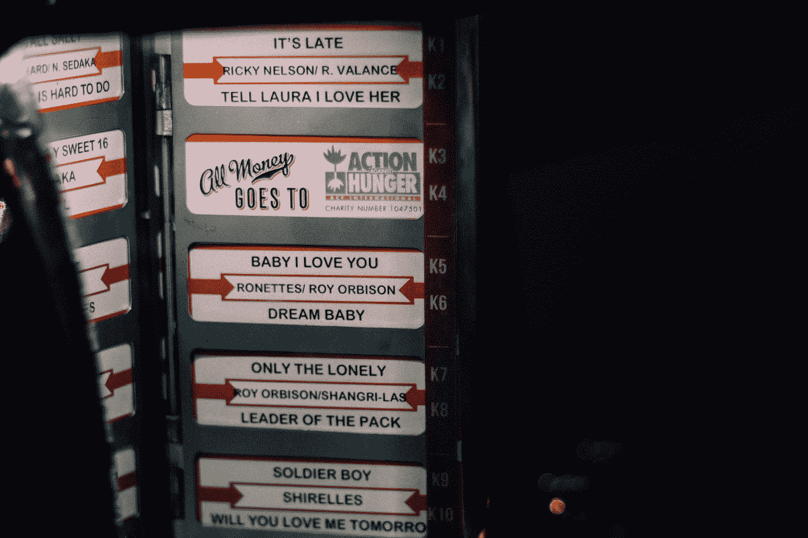

# 2010 年代歌曲的文本挖掘和情感分析

> 原文：<https://medium.com/analytics-vidhya/text-mining-and-sentiment-analysis-for-songs-of-the-2010s-decade-7d31e77aeaa?source=collection_archive---------9----------------------->

当我们接近 2010 年的时候，让我们花点时间回顾一下这十年来我们喜爱的一些歌曲。

亚历克斯·霍利奥克在 [Unsplash](https://unsplash.com?utm_source=medium&utm_medium=referral) 上拍摄的照片

# 关于数据

在这篇文章里，我摘录了 2010 年到 2019 年每年排名前 10 的歌曲。总共使用了 99 首歌曲。2011 年没有排名 7。