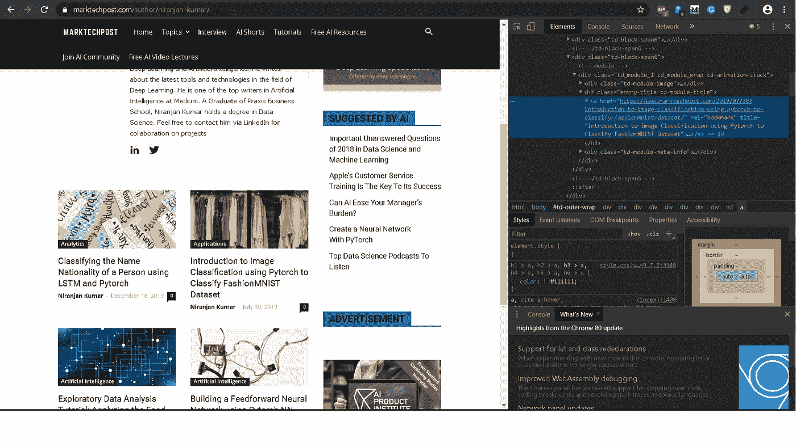
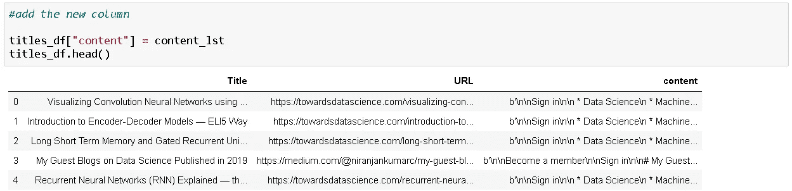
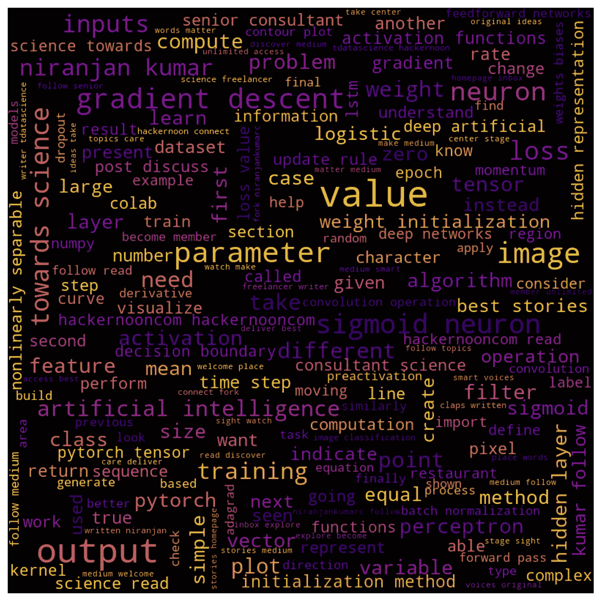
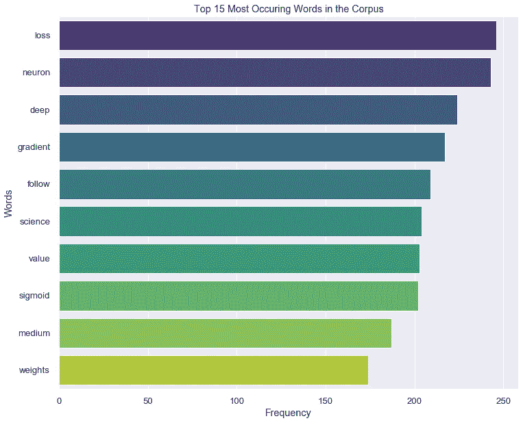
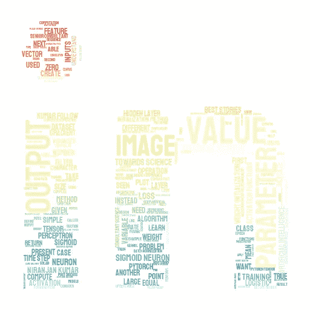
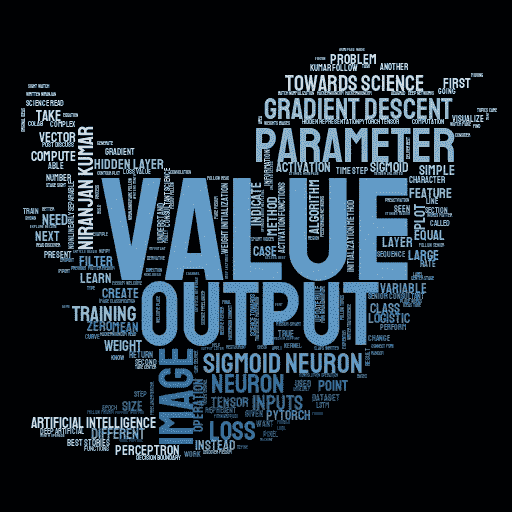

# 文本挖掘:提取和分析我所有关于机器学习的博客

> 原文：<https://medium.com/analytics-vidhya/text-mining-extracting-and-analyzing-all-my-blogs-on-machine-learning-b6983c7a608e?source=collection_archive---------1----------------------->


照片由 [Unsplash](https://unsplash.com?utm_source=medium&utm_medium=referral) 上的[思想目录](https://unsplash.com/@thoughtcatalog?utm_source=medium&utm_medium=referral)拍摄

最近我开始在工作和家里从事自然语言处理。所以我决定应用一些我遇到过的技术，从我所有的博客中提取单词，创建一个单词云。

我在 2019 年 2 月 15 日发表了我的第一篇文章。写作两个月后，我被选为人工智能媒体的顶级作家。这种认可激励我继续与数据科学界分享我的知识。从那时起，我已经在[媒体](/@niranjankumarc)和 [Marktechpost](https://www.marktechpost.com/author/niranjan-kumar/) 上写了超过 25 篇关于机器学习、深度学习相关主题的文章。

在本文中，我们将删除所有文章的内容，并使用 NLTK 包处理数据以供进一步分析。为了丢弃数据，我们将使用`Selenium`和`BeautifulSoup`。

> 在您开始从任何网站废弃数据之前，请检查该网站的条款和条件。

# 设置环境

下载并安装 Anaconda 包管理器。Anaconda 发行版包含许多开源包的集合。除了 Anaconda 中现有的包，我们将使用新的包从网页中提取内容。

要安装新的包，您可以使用 Anaconda 的包管理器、conda 或 pip 来安装这些包。

```
pip install selenium
pip install beautifulsoup4
```

# 检查网页

为了找出我们需要使用 python 提取网页的哪些元素，我们需要首先检查网页。要检查任何[网页](https://www.marktechpost.com/author/niranjan-kumar/),您需要右击网页并选择 inspect 或 Fn + F12。这将打开 HTML 代码检查工具，在这里我们可以看到每个字段所包含的元素。

例如，如果我检查 marktechpost [author](https://www.marktechpost.com/author/niranjan-kumar/) 页面，您可以看到文章链接和文章标题出现在`<a>`标签中。`<a>`标签有`href`属性，它指定链接到的页面的 URL，它还有`title`属性，它定义文档的标题。



通过进一步检查，作者页面下的所有文章都遵循相同的模式`href`和`title`。所有文章的`<a>`标签都有`rel`属性，用于指定当前文档和链接文档之间的关系。利用这些属性，我们可以很容易地使用 BeautifulSoup 包从网页 HTML 代码中抓取相关信息。(我将在下面讨论如何使用 BeautifulSoup 进行提取)

类似地，我们可以检查[媒体作者页面](/@niranjankumarc)，并找出相关信息(如文章链接和文章标题)出现在哪个标签下。

文章中讨论的所有代码都在我的 GitHub 上

[](https://github.com/Niranjankumar-c/DataScienceBlogAnalysis_NLP) [## niranjankumar-c/DataScienceBlogAnalysis _ NLP

### 这个库包含了删除我所有文章的内容并使用 NLTK 包处理数据的代码…

github.com](https://github.com/Niranjankumar-c/DataScienceBlogAnalysis_NLP) 

## 用硒刮除介质网页

首先，我们将从媒体中抓取[我的账号下所有已发表文章的链接。由于中型网站使用 javascript 加载页面，我们不能直接使用 BeautifulSoup 来抓取数据。我们将使用 Selenium web 驱动程序打开网页，搜索文章的链接并返回结果，而不是 BeautifulSoup。](/@niranjankumarc)

```
from selenium import webdriver
import timemedium_profile_link = "[https://medium.com/@niranjankumarc](/@niranjankumarc)"
```

在本教程中，我将使用 Chrome 作为我的浏览器，所以我们需要下载 Chrome WebDriver。你可以从[这里](https://sites.google.com/a/chromium.org/chromedriver/home)下载网络驱动。如果您使用任何其他浏览器，那么您需要下载特定的网络驱动程序。一旦你下载了网络驱动，运行 Chrome 网络驱动，将可执行文件路径指向下载文件路径。

```
#create the driver for chrome browser with executable.driver = webdriver.Chrome(executable_path = 'C:\\Users\\NiranjanKumar\\Downloads\\chromedriver.exe')
```

现在，我们可以连接到网页并搜索文章的链接。当我们在浏览器中加载网页时，通常需要一段时间来加载整个页面，甚至可能直到我们向下滚动到页面末尾时才加载。为了解决这个问题，我们将执行一段 javascript 代码来帮助加载整个网页。

```
#load the webpage and scroll till the bottom of the page
driver.get(medium_profile_link)# Get scroll height
last_height = driver.execute_script("return document.body.scrollHeight")while True:
    # Scroll down to bottom
    driver.execute_script("window.scrollTo(0, document.body.scrollHeight);")# Wait to load page
    time.sleep(30)# Calculate new scroll height and compare with last scroll height
    new_height = driver.execute_script("return document.body.scrollHeight")
    if new_height == last_height:
        break
    last_height = new_height
```

一旦你执行了上面的脚本，Chrome 将打开指定的 URL 并向下滚动到页面底部。接下来，我们需要获取网页的内容。为了找到所有感兴趣的元素，我们将创建一个 BeautifulSoup 对象，并提取所有相关的`div`标签。

使用“检查网页”选项找出文章和文章标题的相关链接。使用 BeautifulSoup 对象中的`findAll`命令，我们将提取相关的标签。

```
#get the html content of the page
html = driver.page_source#create a soup object
medium_soup = BeautifulSoup(html)#finding the divs with class = 'r s y'
soup_divs = medium_soup.findAll("div", {'class' : 'r s y'})
```

一旦我们获得了`div`标签，我们就遍历每个标签并获得文章链接和文章标题。文章链接出现在`a`标签中，文章链接在`h1`标签中。

```
title_lst = []
links_lst = []for each_div in soup_divs:

    article_link = each_div.find("a").get("href").split("?")[0]
    article_title = each_div.find("a").find("h1").text.strip()

    if article_link.startswith("https") == False:
        article_link = "[https://medium.com](/)" + article_link #appending the address for links (eg. hackernoon: moved out of medium)

    #append the values to list
    title_lst.append(article_title)
    links_lst.append(article_link)driver.quit() #stop the driver
```

现在我们已经有了文章的所有链接和标题，我们将执行`driver.quit()`来确保浏览器关闭。

## 使用 BeautifulSoup 删除 Marktechpost 网页

为了抓取 marktechpost[author page](https://www.marktechpost.com/author/niranjan-kumar/)的数据，我们可以使用 selenium，如前一步所示。在这一步，我们将使用`requests`和`BeautifulSoup`库来抓取数据。

一旦我们有了想要抓取数据的网页的 URL。然后，我们使用`requests`连接到网页，并使用`BeautifulSoup`解析网页，将对象存储在变量‘mark _ soup’中。

```
import requests#creating a variable
mark_url = requests.get('[https://www.marktechpost.com/author/niranjan-kumar/'](https://www.marktechpost.com/author/niranjan-kumar/'))#create a beautifulsoup object
mark_soup = BeautifulSoup(mark_url.content)#print soup
print(mark_soup.prettify())
```

正如上一节所讨论的——检查网页，我们需要搜索 soup 对象来找到相关的标签。一旦我们获得了`div`标签，我们就遍历每个标签并获得文章链接和文章标题。

```
#iterate the articles and get the links and titles
for eachitem in mark_soup.findAll("a", {'rel': 'bookmark'}):    
    title_lst.append(eachitem.get("title"))
    links_lst.append(eachitem.get("href"))
```

将搜索操作的结果添加到文章链接和文章标题列表中。我们可以通过将收集到的数据保存到数据框中来利用这一点。我们可以打印数据框来查看内容。

```
#create a dataframe
titles_df = pd.DataFrame(list(zip(title_lst, links_lst)), columns = ["Title", "URL"])titles_df.head()
```

# 提取内容

现在我们已经有了所有发表文章的链接，让我们获取这些文章的内容。由于我们是从网页中提取整个内容，包括 HTML 内容，我们将使用`html2text`包将一页 HTML 转换成干净、易读的普通 ASCII 文本。

安装`html2text`包

```
!pip install html2text
```

`html2text`提供多个选项，如忽略链接、忽略图像、忽略提取数据中的表格，以获得清晰易读的文本。

```
import html2texth = html2text.HTML2Text()#ignoring all the links, tables and images in the blog
h.ignore_links = True
h.ignore_images = True
h.ignore_tables = True
```

迭代每个链接并提取 HTML 内容，将其添加到`titles_df`数据框中的新列。

```
content_lst = []#iterating through all the links 
for ind in titles_df.index: 

    #content request object
    request_content = requests.get(titles_df["URL"][ind])

    main_content = h.handle(str(request_content.content)) #get the text from the html content

    content_lst.append(str(main_content))
```

生成的数据帧应该如下所示:



最终数据帧

# 文本预处理—清理数据

在本节中，我们将讨论如何预处理(清洗)网页的内容，以便我们可以从清洗后的数据中提取有用的信息。

## 导入包

在我们开始挖掘数据之前，首先我们需要导入所需的库。我们将`nltk`对文本进行分词，并从语料库和`wordcloud`包中移除停用词，以生成词云。

让我们清理数据。


索菲·埃尔维斯在 [Unsplash](https://unsplash.com?utm_source=medium&utm_medium=referral) 上的照片

## 1.移除链接

尽管我们已经使用`html2text`包设置了忽略链接的选项，但某些链接仍有可能出现在网页内容中。第一个预处理步骤是删除内容中的链接。我们将通过使用 regex 来实现这一点。

```
def remove_links(text):    
    return re.sub(r'https?://[^\s]+', '', text)
```

`remove_links`函数将文本作为输入，并用文本中的空值替换 URL。我们将使用`lambda`函数对所有内容的数据帧应用此函数。

```
# 1\. Remove all the links if present in the contenttitles_df["content"] = titles_df.content.apply(lambda content: remove_links(content))
titles_df.head()
```

## 2.删除多余的空格和制表符

在移除多余的空格之前，我们将使用“\n\n”连接数据框中的所有内容，并使其成为单个字符串。使用正则表达式，我们将用一个空格替换多余的空格和制表符。

```
# 2\. Join all the contents in the dataframe using "\n\n" and make it a single stringmain_content_string =  "\n\n".join(titles_df.content)# Remove all whitespaces (\n and \t) with spacemain_content_string = re.sub('\s+',' ',main_content_string).strip()
main_content_string[:300]
```

## 3.扩张收缩

[**缩写**](https://www.thoughtco.com/contractions-commonly-used-informal-english-1692651) 是通过去掉一个或多个字母而被缩短的单词或短语。缩写的例子有像“不是”、“不是”、“不”这样的词。我们利用 Rahul Agarwal 编写的一组现有函数来扩展收缩。点击查看原帖[。](https://mlwhiz.com/blog/2019/01/17/deeplearning_nlp_preprocess/)

```
# 3\. expand contractionsdef _get_contractions(contraction_dict):
    contraction_re = re.compile('(%s)' % '|'.join(contraction_dict.keys()))
    return contraction_dict, contraction_recontractions, contractions_re = _get_contractions(contraction_dict)def replace_contractions(text):
    def replace(match):
        return contractions[match.group(0)]
    return contractions_re.sub(replace, text)# Usage
main_content_string = replace_contractions(main_content_string)
```

## 4.删除标点符号和特殊字符

标点符号和特殊字符是非字母数字字符，在挖掘数据时不提供任何信息。因此，删除这些字符将为我们提供干净的数据进行分析。

为了删除标点符号，我们将使用之前导入的`string`包。

## 5.小写字母

我们需要将所有的推文转换为小写，以消除重复出现的单词，如' **USA** '、 **usa** 和' **Usa** '。

```
# 5\. Lowercasemain_content_string = main_content_string.lower().strip("b").strip()
```

## 6.标记化

标记化是将文本分成单词或句子的过程。因为我们只有一个大句子，我们将使用 NLTK 包中的`word_tokenize`把这个句子拆分成单词。

```
# 6\. Tokenizationword_tokens = word_tokenize(main_content_string)
word_tokens[:10]
```

## 7.删除停用词

停用词是在语料库中频繁出现的词，并且对从文本中提取的特征具有很小或没有意义。通常，这些可以是冠词、连词、介词等等。停用词的一些例子有: *a* ，*a*，*a*，*和。*

我们将利用 NLTK 库中的停用词列表从我们的标记中删除这些词。

```
# 7\. remove stop words
stop_words = stopwords.words('english')#remove stopwords
main_content_tokens = [w for w in word_tokens if not w in stop_words]
```

## 8.移除字母数字单词

既包含字母又包含数字的单词不会给出关于文本的任何额外信息。因此，我们将删除所有包含数字的单词。

```
# 8\. Remove all words containing numbersmain_content_tokens = [word for word in main_content_tokens if word.isalpha()]
```

## 9.去除语料库中频繁出现的单词

首先，我们将检查语料库中出现频率最高的单词。我觉得这些话不会影响分析，我们会在数据上做。所以我已经把这些词从语料库中删除了。

```
# 9\. Remove frequently occuring words in the corpusfreq = pd.Series(main_content_tokens).value_counts()[:10]
freq#output
data        659
network     483
function    460
learning    447
nnnn        441
xexx        394
neural      355
model       309
input       306
using       290#removing words
main_content_tokens = [word for word in main_content_tokens if word not in list(freq.index)]
```

## 10.移除生僻字移除

我们将从语料库中删除 1000 个生僻字，这些生僻字不会对分析产生任何影响。这些词非常罕见，以至于它们成为分析的干扰。

```
# 10\. removing the least frequent words in the corpusfreq = pd.Series(main_content_tokens).value_counts()[-1000:]
freq#removing words - less frequent words
main_content_tokens = [word for word in main_content_tokens if word not in list(freq.index)]
```

## 11.删除杂词

在进一步检查我们到目前为止获得的清理过的标记时，我发现在我们的语料库中有一些没有意义的杂词。例如' **rnrn** '，' **rntt** '和' **xcxb** '。所以我删除了所有包含这些单词的标记。

```
#11\. Removing miscellaneous wordsmain_content_tokens = [word for word in main_content_tokens if not 
any([phrase in word for phrase in ["rnrn", "rntt", "xcxb", "xx"]])]#miscellaneous words
main_content_tokens = [word for word in main_content_tokens if len(word) >= 4]
```

## 干净的语料库

到目前为止，我们已经完成了所有的文本清理或预处理步骤，现在我们将清理后的标记合并到一个句子中，以便我们可以使用 WordCloud 清理语料库来识别热门话题。

```
#merge all the tokens
cleaned_content = " ".join(main_content_tokens)
```

# WordCloud

现在我们准备创建一个词云来识别语料库中的热门话题。为了创建一个单词云，我们将利用`wordcloud`库。

```
# Create stopword list:
stopwords = set(STOPWORDS)wordcloud = WordCloud(width = 800, height = 800, max_font_size=50,min_font_size = 10,
                stopwords = stopwords, background_color = "black", colormap="plasma").generate(cleaned_content) 

# plot the WordCloud image     
plt.figure(figsize = (12, 12)) 
plt.imshow(wordcloud, interpolation="bilinear") 
plt.axis("off") 
plt.tight_layout()# store to file
plt.savefig("av_wordcloud.png", dpi=150)

plt.show()
```

一旦我们执行了上面的脚本，WordCloud 就会生成并保存到本地目录中，名为`av_wordcloud.png`。



从词云中，我们可以清楚地看到一些热门词汇，如“梯度下降”、“输出”、“损失”、“决策边界”、“隐藏表示”等..表明语料库主要谈论神经网络和深度学习技术。这是意料之中的，因为我的大多数文章都是围绕深度学习展开的，从基础开始，如[感知器](/hackernoon/perceptron-deep-learning-basics-3a938c5f84b6?source=---------26------------------)到[编码器-解码器模型](https://towardsdatascience.com/introduction-to-encoder-decoder-models-eli5-way-2eef9bbf79cb?source=---------4------------------)。

# 最常用的词

另一种可视化热门词汇的方法是使用条形图。我们将使用`collections`包中的`Counter`来统计单词的频率，并绘制出前 10 个单词及其频率。

```
#frequent wordscounted_words = Counter(main_content_tokens)
most_common_df = pd.DataFrame(counted_words.most_common(10), columns=["words", "count"])#plot the most common words
sns.barplot(y = "words", x = "count", data = most_common_df, palette="viridis")
plt.xlabel("Frequency")
plt.ylabel("Words")
plt.title("Top 15 Most Occuring Words in the Corpus")
plt.show()
```

生成的柱状图如下所示，



# 风格云

我们将使用`stylecloud`包来生成有风格的单词云，包括渐变和图标形状，而不是创建简单而枯燥的单词云！。

`stylecloud`是一个 Python 包，它利用了流行的 [word_cloud](https://github.com/amueller/word_cloud) 包，添加了有用的功能来创建真正独特的 word clouds！

要安装软件包

```
pip install stylecloud
```

## 使用

使用`stylecloud`,我们可以生成任何形状和大小的文字云。例如，让我们试着创建一个以深色为主题背景的狗形状的单词云。

为了得到狗的形状，我们只需要将`icon_name`改为“ **fas fa-dog** ”，通过将`background_color`设置为“ **black** ”，我们将得到黑暗主题。

```
import stylecloud#dog wordcloud
stylecloud.gen_stylecloud(text = cleaned_content,
                          icon_name='fas fa-dog',
                          background_color='black',
                          gradient='horizontal', output_name='stylecloud_dog.png')
```


可爱的狗

如果你想把 WordCloud 变成 twitter 或 LinkedIn 的图标，我们只需要修改一行代码就可以做到。

```
#can also generate linkedln wordcloudsstylecloud.gen_stylecloud(text = cleaned_content,
                          icon_name="fab fa-linkedin-in",
                          palette='colorbrewer.diverging.Spectral_11',
                          background_color='white',
                          gradient='vertical', output_name='stylecloud_li.png')
```



```
#can also generate twitter wordcloudsstylecloud.gen_stylecloud(text = cleaned_content,
                          icon_name="fab fa-twitter",
                          palette='colorbrewer.sequential.Blues_9',
                          background_color='black',
                          gradient='vertical', output_name='stylecloud_tw.png')
```



Twitter 图标

[](https://github.com/Niranjankumar-c/DataScienceBlogAnalysis_NLP) [## niranjankumar-c/DataScienceBlogAnalysis _ NLP

### 这个库包含了删除我所有文章的内容并使用 NLTK 包处理数据的代码…

github.com](https://github.com/Niranjankumar-c/DataScienceBlogAnalysis_NLP) 

# 结论

在本文中，我们讨论了两种不同的方法，根据网站是否使用 javascript 动态加载站点来废弃来自两个不同网站的数据。我们已经看到了如何使用 selenium web 驱动程序来废弃数据。之后，我们讨论了在分析数据以获得洞察力之前清理数据的各种技术。从那里，我们创建了一个 WordCloud 和 Barplot 来识别语料库中的热门话题。最后，我们已经看到了如何使用 stylecloud 包创建一个时尚的 WordCloud。

如果你在实现我的 GitHub 库中的代码时遇到任何问题，请随时通过 LinkedIn 或 twitter 联系我。

直到下次和平:)

NK。

# 作者简介

[Niranjan Kumar](/@niranjankumarc) 是好事达印度公司的高级数据科学顾问。他对深度学习和人工智能充满热情。除了在媒体上写作，他还作为自由数据科学作家为 Marktechpost.com 写作。点击这里查看他的文章。

你可以在 [LinkedIn](https://www.linkedin.com/in/niranjankumar-c/) 上与他联系，或者在 [Twitter](https://twitter.com/Nkumar_283) 上关注他，了解关于深度学习和机器学习的最新文章。

## 参考

*   [处理文本数据(使用 Python)的终极指南——面向数据科学家和工程师](https://www.analyticsvidhya.com/blog/2018/02/the-different-methods-deal-text-data-predictive-python/)
*   [数据科学技能:使用 python 进行网页抓取](https://towardsdatascience.com/data-science-skills-web-scraping-using-python-d1a85ef607ed)
*   [数据科学技能:使用 python 进行网页抓取 javascript】](https://towardsdatascience.com/data-science-skills-web-scraping-javascript-using-python-97a29738353f)