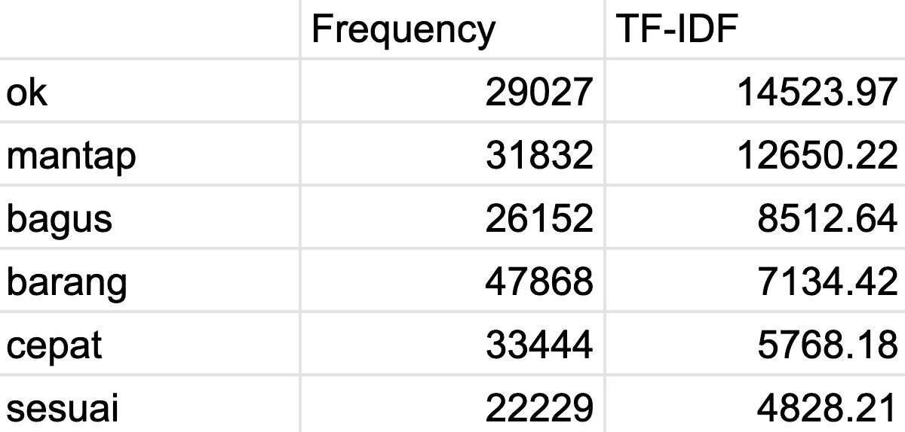
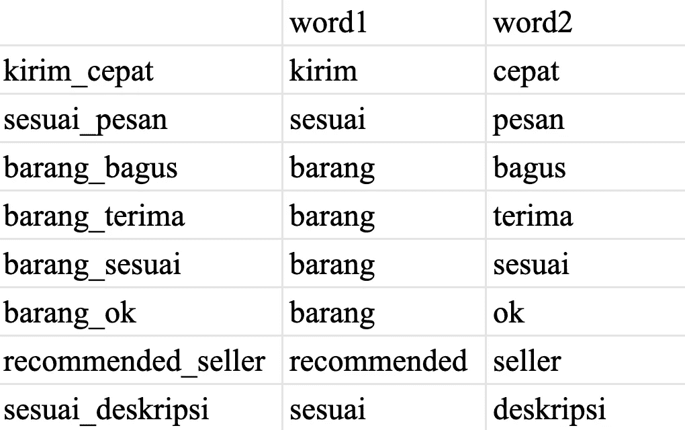
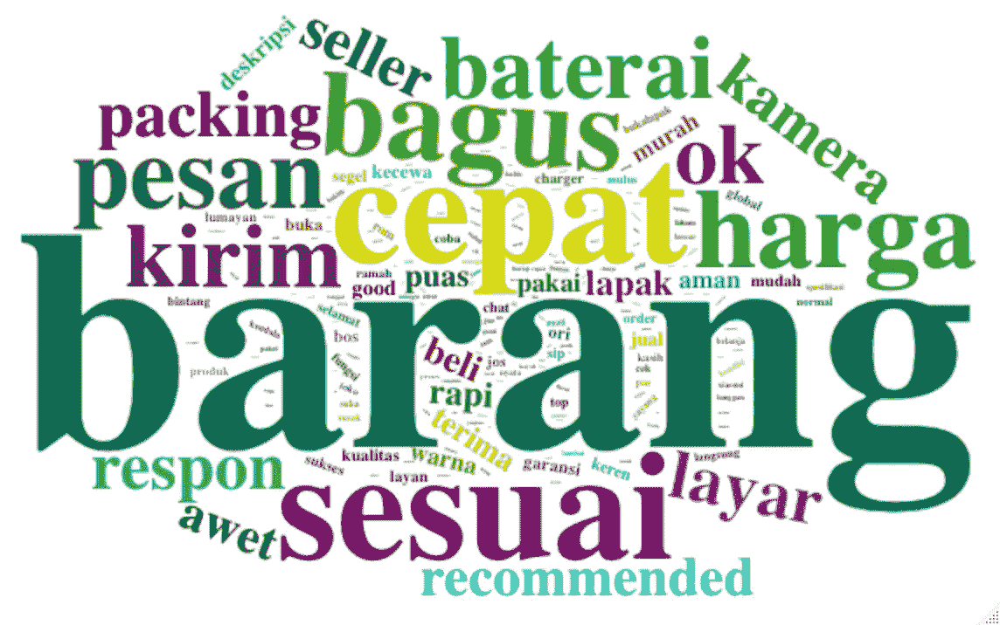

# 用于信息抽取的文本挖掘

> 原文：<https://medium.com/analytics-vidhya/text-mining-for-information-extraction-ff8112059183?source=collection_archive---------19----------------------->

## 如何为信息提取进行数据转换和可视化，以及为什么需要它们

*免责声明:我使用了从几个电子商务平台收集的印度尼西亚语顾客评论数据。然而，这些文本挖掘技术也可以应用于其他语言。提到的教程大多是在 RStudio 中使用 R 执行的(网络分析除外)。*

T 文本挖掘是从大量非结构化文本数据中提取信息并进行分析的过程。文本挖掘是数据挖掘的一个子集。然后获得的信息可以用于诊断问题或推动业务计划。文本挖掘步骤包括文本数据收集、数据预处理、数据转换、数据可视化和数据解释以发现新知识。这篇文章将涵盖数据转换和可视化的技术。对于印尼语的文本预处理，您可以从[这里](/@cindyhosea/text-pre-processing-in-bahasa-indonesia-6895154532db)开始执行步骤。

在预处理或清理文本数据后，您将拥有一个词袋集合，通常采用文档术语矩阵(DTM)或术语文档矩阵(TDM)的形式。但是，您需要转换这些数据以获得更深入的了解，了解哪个单词经常出现，哪些单词经常一起出现，哪些单词可能具有相似的含义，等等。你还需要做一个很棒的可视化来表现文字数据，让受众迅速得到思路，有更好的理解。在这篇文章中，我想介绍几种文本数据转换(TF-IDF、主题分类、bigram 共现)和可视化(wordcloud 和网络分析)的技术。

# 数据转换

## TF-IDF

TF-IDF 代表术语频率-逆文档频率。TF-IDF 是一种文本数据的加权方法，用于评估一个词在一个文档或一组文档(语料库)中的重要性。

假设您有 10 条在线评论，这些评论是从 10 个购买了产品 x 的随机用户那里收集来的。前 9 条评论各包含 20 个单词。同时，第十篇评论由 200 个单词组成。如果只根据单词出现的频率来衡量，第十篇评论更有可能主导语料库。第十个用户的意见将与九个用户的意见加起来一样重要。因此，为了克服这一点，我们可以应用术语频率(TF)加权方法。

在这篇文章中，我不会解释计算 TF 权重的详细公式，但你可以在这里找到它，由数据科学道场解释。总的思路是用一个词在文档中出现的次数除以同一文档中的总字数。结果等于 TF 重量。因此，对于在两个不同文档中出现一次的相同单词，该单词的 TF 权重在较长的文档中较低。

另一方面，逆文档频率(IDF)意味着归一化在许多文档中经常出现的词的权重。假设您有从包含 10 条评论的产品 X 和包含 100 条评论的产品 Y 收集的在线评论。如果将它们放在一起解读，您可能会得出只代表产品 Y 的结论，而忽略产品 x。因此，我们需要计算 IDF 权重，以便将在许多文档中出现频率较高的单词视为“不太重要”。IDF 加权法也适用于归一化可能频繁出现且具有一般意义的词，如“商品”、“卖家”、“商店”，或者取决于数据的上下文。

最后，我们将 TF 和 IDF 的值相乘，得到每个文档中每个单词的 TF-IDF 权重。在 RStudio 中构建 TF-IDF 函数的完整教程可以在这里[找到](https://code.datasciencedojo.com/datasciencedojo/tutorials/blob/master/Introduction%20to%20Text%20Analytics%20with%20R/IntroToTextAnalytics_Part5.R)(数据科学道场的另一个功劳！).下面是 TF-IDF 函数的代码摘要，您可以快速浏览一下:

```
#Build the TF-IDF function
term.frequency <- function(row) {
row / sum(row)
}inverse.doc.freq <- function(col) {
corpus.size <- length(col)
doc.count <- length(which(col > 0))
log10(corpus.size / doc.count)
}tf.idf <- function(x, idf) {
x * idf
}#Apply the TF-IDF function to an existing DTM
tokens.df <- apply(tokens.matrix, 1, term.frequency)
tokens.idf <- apply(tokens.matrix, 2, inverse.doc.freq)
tokens.tfidf <- apply(tokens.df, 2, tf.idf, idf = tokens.idf)
tokens.tfidf <- t(tokens.tfidf)
```

因此，您将获得一个新的文档术语矩阵，其值是 TF-IDF 权重，而不是频率。之后，我们可以合计每个单词的 TF-IDF 权重，下面是您将得到的结果:



如你所见，出现频率最高的单词可能没有最高的 TF-IDF 得分，反之亦然。单词“barang”(项目)出现频率最高，它可能经常出现在许多文档中，但它被解释为不太重要。这可能是因为单词“barang”在不同的文档中出现得太频繁(导致较低的 IDF 权重)和/或它通常出现在较长的文档中(导致较低的 TF 权重)。

## 主题分类

为了增加解释文本数据的粒度，我们还可以将单词分成几个主题。这可以根据您的理解手动执行，或者通过实现主题建模技术来执行。主题建模使用无监督学习方法进行文本分类。主题建模最流行的方法之一是潜在狄利克雷分配(LDA ),你可以按照 Silge & Robinson 下面的教程来尝试。

 [## 整洁主题建模

### 主题建模是一种对文档进行无监督分类的方法，通过将每个文档建模为一个混合的…

cran.r-project.org](https://cran.r-project.org/web/packages/tidytext/vignettes/topic_modeling.html) 

通过执行主题分类，您可以了解哪些主题在语料库中更占优势。这可能是一个有价值的见解，作为在进行进一步研究和制定业务计划时设置优先级的起点。

## 二元共现

有时，你可能不确定某个特定的词，是否应该归类到哪个主题，因为它有一个非常笼统的意思。例如，在电子商务中，“快”这个词可以与交付速度或卖家响应度相关。对此，你需要探索更广阔的领域，而不仅仅局限于一个单词。构建二元共现可以帮助你对单词的上下文有一个更大的了解。

二元模型是在文档中同时出现的两个单词的序列。例如，“快速交付”或“快速响应”。像单词一样，二元模型可以基于频率或 TF-IDF 权重或其他加权方法进行加权。通过构建二元共现，您可以基于单词的上下文进行更深入的分析，并且可以将它们与特定主题相关联。此外，二元模型可以用作输入数据来构建关联分析网络。



二元模型的例子

以下是您可以在 RStudio 中应用的一些步骤，以根据文档中的标记列表构建 bigram 共现的数据框架:

```
library(quanteda)
bigram.tokens <- tokens_ngrams(tokenstrimmed, n = 2)
bigram.dfm <- dfm(bigram.tokens)
```

如果您注意到 tokens_ngrams 函数，您可以确定 n 的值。这意味着您还可以构建三元模型(n = 3)，这是三个单词一起出现的序列，或者其他形式的 n 元模型。

# 数据可视化

## Wordcloud

Wordcloud 是可视化文本数据的最简单的方法，它允许你快速浏览并获得关于哪些单词最能代表整个数据集的整体想法。你可以根据词频或任何加权方法来设置词云中每个词的大小。要在 RStudio 中构建 wordcloud，需要一个包含 2 列的数据框架:第一列是单词列表，第二列是每个单词的频率(或权重)列表。以下是构建单词云的步骤:

```
library(wordcloud2)#Turn the document-term matrix to a two-column dataframe
colsums <- colSums(matrix)
dfm <- as.data.frame(colsums)
dfm$word <- row.names(dfm)
dfm <- subset(dfm, select = c("word", "colsums"))#Build the wordcloud
wordcloud2(dfm)
```

就我个人而言，我更喜欢使用这个 **wordcloud2** 包，而不是 **wordcloud** ，因为它能够执行更高级的定制，比如更多的字体大小、字体颜色和形状选项。然而，你可以两者都尝试，挑选你个人最喜欢的！作为输出，以下是您将获得的结果的示例:



**wordcloud2** 输出示例

较大的单词表示较高的频率或权重。词云可能不会显示你拥有的所有单词，但它会让你大致了解哪些单词在语料库中占主导地位。此外，如果你试图在一个 wordcloud 中容纳数千个单词，它将过于拥挤，无法可视化。在我看来，一百个单词就足够作为一个 wordcloud 中的表示。

## 网络分析(语义关联分析)

为了获得语料库中每个单词如何相互关联的整体视图，我们还可以建立一个数据可视化网络。然后可以基于图论中的社会网络分析来分析该网络。基于文本数据构建网络分析的思想是由[侯等人(2019)](https://doi.org/10.1016/j.tourman.2019.03.009) 在他们关于语义关联分析的研究中实现的。除了可视化，我们还可以获得有关网络统计的信息，这些信息解释了网络的结构属性，如密度、模块性、度分布等。我们还可以得到基于彼此接近程度而聚集在一起的单词社区。Gephi 是一款可用于构建和执行网络分析的软件。下面是关于如何使用 Gephi 构建网络的教程链接，后面是一个使用 Gephi 的网络可视化结果的例子。

[](https://seinecle.github.io/gephi-tutorials/generated-html/simple-project-from-a-to-z-en.html) [## 从 A 到 Z 的简单 Gephi 项目

### 用文本编辑器打开 miserables.gexf 文件(以下是在 Mac 和 Windows 上的操作方法)。查看节点和…

seinecle.github.io](https://seinecle.github.io/gephi-tutorials/generated-html/simple-project-from-a-to-z-en.html) 

Gephi 的网络可视化示例

从上面的网络中，我们可以获得一些见解，如:节点大小越大的单词表示与其他节点(作为中心节点)的连通性越高，线越粗的节点之间的链接表示两个节点之间的关系越强，颜色差异表示网络中形成的各种社区。倾向于一起出现的单词更有可能聚集在同一个社区中。

上述数据转换和可视化技术可用于从大量文本数据中提取信息。您转换数据的粒度越细，获得的分析和知识就越多。处理文本等非结构化数据可能具有挑战性，但我相信，一旦你设法处理它，就可以产生许多见解！从在线评论中收集的客户意见是许多有助于分析消费者行为的信息来源之一。文本挖掘仍然有许多可以探索的来源，比如推文、客户投诉、新闻标题等等。