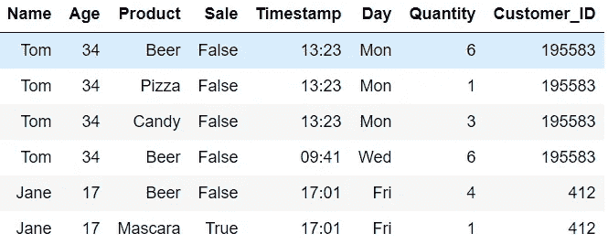
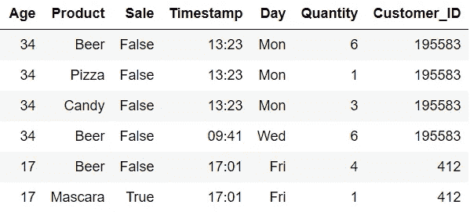
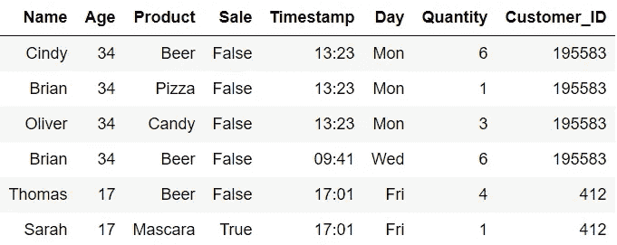
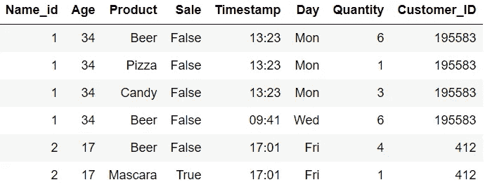
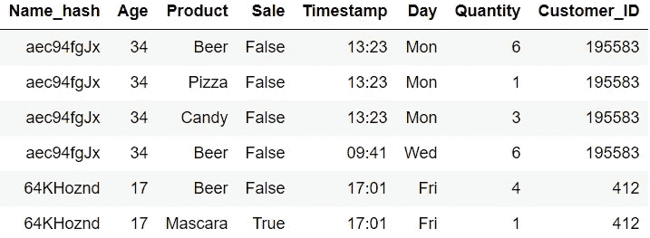
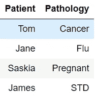
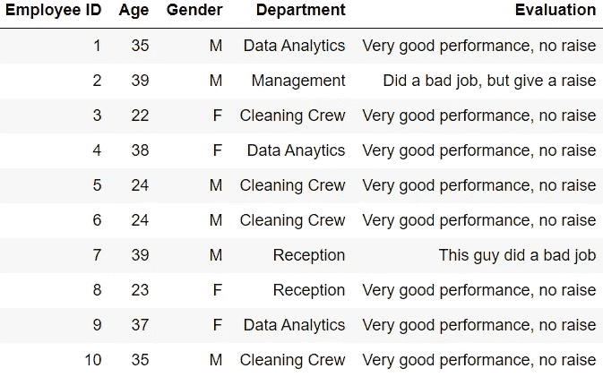
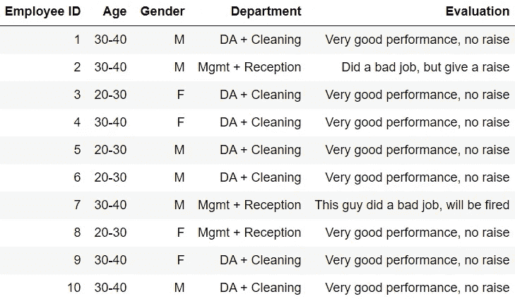

# GDPR 时代个人数据的文本挖掘

> 原文：<https://medium.com/analytics-vidhya/text-mining-on-personal-data-in-the-age-of-gdpr-f8e7a2c138c6?source=collection_archive---------14----------------------->

亚历杭德罗·埃斯卡米拉在 [Unsplash](https://unsplash.com?utm_source=medium&utm_medium=referral) 上的照片

# **处理隐私敏感文本数据**

事实证明，文本分析在丰富客户分析和使用以前很难利用的数据方面非常有用。所以很自然的，很多公司想投资建立一个文本挖掘管道。不幸的是，许多人意识到使用文本数据意味着使用个人数据，并试图找到一种匿名化这些数据的方法。

在这里，我将概述为什么完全数据匿名是非常非常困难的。但是不要担心，如果你至少意识到所有可能的问题，你就处于一个很好的位置来正确地评估所涉及的风险并通知所有的利益相关者。在第一篇文章中，我将从基础开始，即文本数据仍然是结构化的。在后续文章中，我将深入探讨非结构化文本问题

# **个人、匿名和假名信息**

在我们开始之前，理解 GDPR 规则中定义的敏感数据的概念是很重要的。

**个人**数据是最容易理解的。它指的是指定关于一个人的某些信息的数据，以及到那个人的链接。例如，*约翰一直在度假*。你知道某人的一些事。在许多情况下，这些信息不会有什么害处，但在其他情况下，比如约翰有外遇，人们可能会不高兴这些数据被分析。

**匿名**数据处于光谱的另一端。在这种情况下，所有敏感信息都不可能联系到单个人，而且不可逆转。这意味着简单的预处理功能(比如在保存映射表的同时进行映射)不会使您的数据匿名。
预处理隐私敏感数据的目标通常是匿名化。然而，严格地说，这样做是非常困难的，因为总会有某种信息泄漏。

**假名**数据介于两者之间。数据本身是匿名的，但是如果你包含额外的数据，仍然有可能把它和一个人联系起来，所以这个过程是可逆的。但是在很多情况下，假名化很有意义，并且足以符合 GDPR。

# **表格格式的文本数据**

这是容易的部分。假设您有一个这样的表:

显然，你已经可以识别出一些清晰的个人信息。有人名，有 customer_ID。解决方法很简单，对吗？把柱子去掉就行了？当然可以！

唯一的缺点是你丢失了有价值的信息。查看哪些交易是由同一个人完成的将非常有用(例如对于推荐系统)。因此，自然存在多种技术来处理这些数据。

例如，让我们处理“名称”列。我们可以使用的一些技术有:

*   **屏蔽**:屏蔽指的是让这个列看起来好像从一开始就不存在。这只是删除专栏的老一套。

*   **伪造**:有时候你仍然想要合理的数据，比如在测试你的数据管道的时候。在这种情况下，用随机但合理的替换数据替换数据是有意义的。

*   **映射**:在这种情况下，我们用另一个数据库中记录的 id 替换属性。例如，如果您想将数据集提供给另一个不需要访问个人信息的团队，这将非常有用。这样，您仍然可以根据实际数据训练模型，并在分析后将结果反馈给用户

*   **散列**处理这类数据而不实际删除数据的最安全的方法是散列。在这种情况下，我们执行与映射相同的操作，但是无法检索原始值。*散列*函数是一种将一些数据转换成字母数字标识符的数学技术。哈希函数不允许反向计算用作哈希输入的值。

**敏感属性**

客户 ID 就是我们所说的**敏感属性**。它本身并不敏感(只是一个数字)，但当与其他信息结合在一起时，它就变成了敏感信息。医疗保健就是一个很好的例子。
以这个数据集为例:

你可以想象，疾病列表本身并不是那么敏感的隐私，但是当它与一个人联系在一起时，就变成了非常私人的信息。你可以想象简不在乎人们知道她患了流感，但是如果这些数据被泄露出去，詹姆斯和汤姆可能会不高兴。

因此，非常重要的一点是，您还应该考虑到，当更多的信息添加到数据库中时，孤立的非个人信息列可能会成为一个问题。

# **通过查找泄露数据**

假设这个数据集包含你的员工和他们去年的评估。这是高度个人化和敏感的信息，所以应该非常安全地存储，对吗？

如果这个数据泄露了，当然你可以说没有名字，但是如果只有一个老板，当人们听到他们今年没有加薪时，他们会发疯的。为了解决这个问题，您需要确保数据不够具体，一组列不足以识别某个人。接待处的人也可以这么说。他是接待团队中唯一的我，所以每个人都知道我们在谈论谁。

**k-匿名**

因此，即使使用不直接识别人的列，仍然有可能使用这些列的组合来识别人。例如，仅使用*年龄*，您可能很难准确识别数据集中的人，但是组合*年龄*、*城市*、*性别*、*街道*极有可能指向一个人。

k-匿名性的概念暗示了每一个可能的具有敏感属性的列的分组(在我们的例子中是雇员的评估列)至少识别了 k 个成员。

让我们将年龄和部门分组来解决这个问题:

**I-多样性**

然而，匿名是不够的。例如，你能告诉我关于前台的男性史蒂文的什么情况吗？尽管无法用我们的数据说出哪一行是 Steven(可能是雇员 ID 2 或 7)，但这并不重要，因为敏感属性的值是相同的:两者都得到了不好的评价。

因此，同样重要的是，在一个群体中，标签有足够的多样性，你希望保持隐私。这个概念被称为 **I-diversity** ，其中一个组需要包含 *I* 至少一个敏感属性的不同值。

结果在我们的数据集中，要么我们需要更多的数据来引入更多的多样性，要么我们需要删除一些数据。让我们删除这个部门

我们走吧！现在，我们有了一个 2-匿名、2-多样化的数据集，可以安全地传递给我们的分析团队进行进一步评估。

# **实时更新数据时的防范技术**

如果您的数据集是固定的，并且您有时间和资源在移交数据集进行进一步处理之前执行编校过程，知道这些非常好。

然而，在现实世界中，通常情况下，您甚至需要直接从源匿名化敏感数据，那么您如何处理这一点呢？

为了保证任何关于敏感信息的事情，你需要处理这些信息。所以让我们做些别的事情来代替，让我们尝试引入**似是而非的否认**

想象一下，你正在对你的员工进行一项调查,“你有没有从专为管理层准备的花式咖啡机里拿过一杯咖啡”?我想这是许多组织的共同问题。很自然，如果你问你的员工这个问题，他们会担心数据泄露会给他们带来麻烦，每个人都会撒谎说他们从来没有用过这种别致的咖啡机。这不是我们想要的。

相反，我们可以引入一个随机误差发生器。让我们假设在 95%的情况下，按照随机机会的定义，您存储了员工的真实答案(是或否)。在另外的 5%中，你忽略答案并且总是在数据收集系统中存储 *yes* 。这样，如果有数据泄漏，每个员工都可以声称自己只是那 5%的一部分，而不会陷入麻烦，因为没有办法知道员工是否真的回答了是或否。