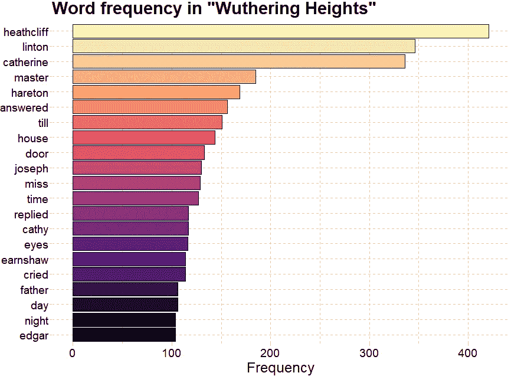
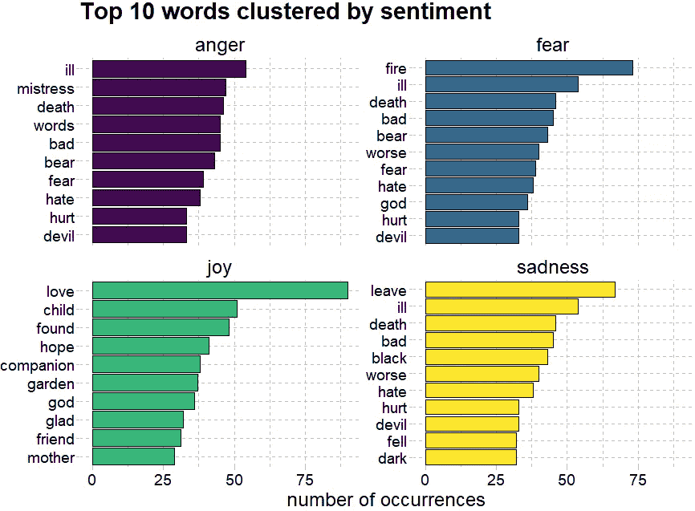
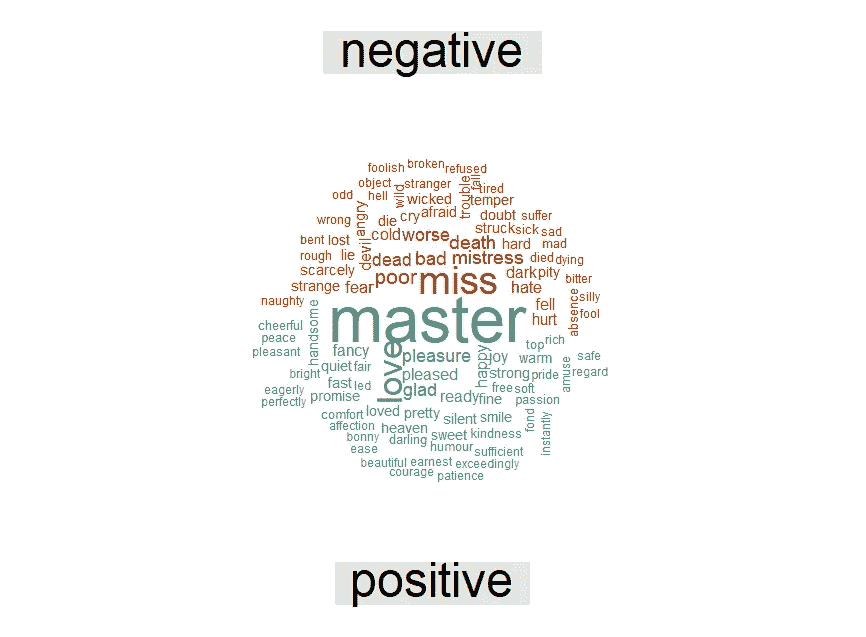

# 基于 R 的文本挖掘

> 原文：<https://medium.com/analytics-vidhya/text-mining-with-r-d5606b3d7bec?source=collection_archive---------17----------------------->


感情很复杂，但情感分析不一定。当涉及到交流概念和情感时，词语总是很重要的。鉴于我们现在在社交媒体平台上消费词语的注意力持续时间很短，选择使用什么词语变得更加紧迫。

最近，我在探索 R 中可用的不同数据集和包时，碰巧看到了由 [**Julia Silge**](https://juliasilge.com/) 和 [**大卫·罗宾逊**](http://varianceexplained.org/) 写的《 [**带 R 的文本挖掘》，并立即被这本书吸引住了。我没有关于文本挖掘或情感分析的先验知识，我决定读这本书。**](https://www.tidytextmining.com/)

> **情感分析**(又称**意见挖掘**或**情感 AI** )是指利用自然语言处理、文本分析、计算语言学、生物特征识别等技术，对情感状态和主观信息进行系统的识别、提取、量化和研究。

在这篇文章中，我决定将这些概念应用到我正在读的这本书上，这本书是艾米莉·勃朗特的《呼啸山庄》。这本书和其他 60，000 本书可以使用`gutenbergr`包从[古腾堡项目](https://www.gutenberg.org/)下载。

我将通过安装和加载练习所需的包来开始情绪分析。最常见的方法是使用 CRAN repository，然后你只需要包的名字，使用命令`install.packages("package")`。要加载已安装的软件包，请使用`library(package)`。

以下是本文中的包所需的包:

```
library(dplyr)
library(tidytext)
library(gutenbergr)
library(wordcloud)
library(ggplot2)
```

现在，是时候使用古腾堡计划图书 ID 号安装图书进行分析了。

```
WHeights_Bronte <- gutenberg_download(768)
```

分析的下一步是整理用于文本挖掘和情感分析的数据。对于这一步，我将使用`unnest_token()`包将一行(row)转换成单独的单词(tokens)。我可以下载文本，将其分成单个单词，并使用`anti_join()`删除无用的单词(例如，“the”、“of”、“to”)。

```
Tidy_Bronte <- Emily_Bronte %>%
  unnest_tokens(word,text) %>%
  anti_join(stop_words)
```

# 词频

第一步是量化单词在小说 34 章中的使用频率，对内容有一个初步的概念。因此，我统计了每个单词出现的次数，并只选择了最常见的单词(即出现超过 100 次)。



不出所料，主角的名字是小说中出现频率最高的词，其次是凯瑟琳和恩萧。在希斯克利夫和凯瑟琳之间看到林顿这个词是很有趣的:因为希斯克利夫和凯瑟琳的爱情故事在林顿和凯瑟琳结婚时结束了。

# 情感分析

这本书的类型被描述为黑暗、悲剧和哥特式小说。我将借助情感分析来验证这一点。在前一篇文章中，我们看到了书中常用的词。接下来，你将了解这些词语如何促成不同的情感。我将使用由`tidytext`包提供的几个情感词典中的一个来进行情感分析，这个词典是“ [NRC](http://saifmohammad.com/WebPages/AccessResource.htm) ”。

```
nrc_emotions <- get_sentiments("nrc") %>%
  filter(sentiment == "joy" |
           sentiment == "anger" |
           sentiment == "fear" |
           sentiment == "sadness")TB_emotions <- Tidy_Bronte %>%
  inner_join(nrc_emotions) %>% 
  count(word, sentiment) %>% 
  arrange(sentiment)
```



我从 [NRC 单词-情绪联想词典](http://saifmohammad.com/WebPages/NRC-Emotion-Lexicon.htm)中提取情绪分类，选择了四种情绪:**愤怒**、**恐惧**、**喜悦**和**悲伤**。的确，悲剧似乎是《呼啸山庄》中这些人物生活的主旋律。

# 词云

最后，我用这些单词创建了一个**单词云**，用“ [bing](https://www.cs.uic.edu/~liub/FBS/sentiment-analysis.html) ”情感词典将频繁出现的单词的正面和负面情感可视化。



# 结论

这太有趣了！现在您已经看到了使用 tidytext 包进行情感分析的基本实现。如果你想获得更多的见解，可以查阅本书 [*文字挖掘与 R*](https://www.tidytextmining.com/) *。*感谢您的阅读！

整篇文章的代码见[此处](https://github.com/namithadeshpande/Data-Analysis-with-R/blob/master/Emily_bronte.R)。