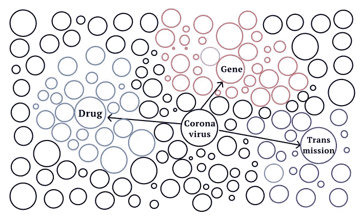

# 挖掘新冠肺炎潜在药物和基因信息的文本网络

> 原文：<https://medium.com/analytics-vidhya/text-network-to-mine-potential-drugs-and-genes-information-of-covid-19-2024967f65cc?source=collection_archive---------19----------------------->

## 萨伯·艾哈迈德(sabbers@gmail.com)，马纳尔·萨马德·(msamad@tnstate.edu)

在这个项目中，我们使用 10，683 篇科学文章的摘要开发了一个基于图的模型，以找到三个主题的关键信息:传播、药物类型和冠状病毒相关的基因组研究。