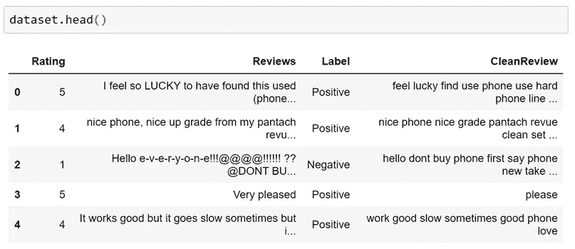

# 文本预处理适合 NLP(自然语言处理)，初学者掌握

> 原文：<https://medium.com/analytics-vidhya/text-preprocessing-for-nlp-natural-language-processing-beginners-to-master-fd82dfecf95?source=collection_archive---------0----------------------->

抄送:[https://www.flickr.com/photos/stevensnodgrass/6274372541/](https://www.flickr.com/photos/stevensnodgrass/6274372541/)

在这个博客中，我们将讨论自然语言处理(NLP)问题的文本预处理。基本上， *NLP 是一种从文本中提取一些信息的艺术*。现在，许多组织都要处理大量的文本数据，如客户评论、推文、新闻信函、电子邮件等。并通过使用 NLP &机器学习从文本中获取更多信息。

自然语言处理的第一步是文本预处理，这是我们将要讨论的。在这里，我使用[亚马逊评论:解锁手机](https://www.kaggle.com/PromptCloudHQ/amazon-reviews-unlocked-mobile-phones)数据集进行文本预处理。

所以，在开始之前，我们都需要知道为什么需要文本预处理？

# ***为什么要进行文本预处理？***

我们知道机器学习需要数字形式的数据。我们基本上使用编码技术(BagOfWord、Bi-gram、n-gram、TF-IDF、Word2Vec)将文本编码成数字向量。但是在编码之前，我们首先需要清理文本数据，*这个在编码之前准备(或清理)文本数据的过程称为文本预处理，*这是解决 NLP 问题的第一步。

我正在对 [*亚马逊点评的情感分析逐步做文本预处理:解锁手机*](https://www.kaggle.com/PromptCloudHQ/amazon-reviews-unlocked-mobile-phones) 数据集，我们来玩玩数据吧…😊😎

# 内容

1.  *导入数据集&库。*
2.  *处理缺失值。*
3.  *标注数据集。*
4.  *数据清洗和文本预处理。*

## *1。导入数据集&库*

第一步通常是导入程序中需要的库。库本质上是可以被调用和使用的模块的集合。

让我们看看我们得到的数据集，它看起来如下所示，这里我们可以看到有 6 个特征' ***'产品名称'，'品牌名称'，'价格'，'评级'，'评论'和'评论投票'。***

# 2.处理缺失值

在这一步中，我们将检查数据集中的空值，并根据数据集进行替换或删除。

我们正在对这个数据集进行情感分析。所以我们基本上要求两个特性' ***'评级*** '和' ***'评审*** '。如上，评论只有 62 个空值。现在，我们将首先用两个特征来修剪数据集，然后在下面代码的帮助下移除所有 62 条记录。

正如我们所见，所有空值都已从数据集中删除。让我们根据客户给出的评分来创建标签。

# 3.标注数据集

根据我们的数据集，有从 1 到 5 的评级。因此，根据评级，我们将创建三个标签，*正*(针对 1 & 2 评级)、*中性*(针对 3 评级)和*负*(针对 4、& 5 评级)。

标记

因此，如上面的代码所示，我们*根据评级创建标签。让我们看看数据集。*

# 4.数据清洗和文本预处理。

对于文本预处理，我们只考虑数据集中的“*评论*”特征。我将在这里做一些步骤来清理文本数据，通常这取决于文本数据或问题的要求。在这里，我一步一步地解释这个过程。

## **预处理原始文本:**

这包括以下内容:

*一、删除网址。*

*二。删除所有不相关的字符(数字和标点)。*

*三。将所有字符转换成小写。*

*四。标记化*

*五.删除停用词*

六。词干化和词汇化

*七。删除长度为< = 2* 的单词

*VIII。将令牌列表转换回字符串*

> 为了更好地理解，我们回顾一下数据集，看看它在每个步骤后会如何变化。

例子

## ***一、删除网址—***

正如我们所见，有一个网址，我们不希望它成为我们的语料库的一部分。让我们通过使用下面的代码行来删除它。

> 结果:正如我们所见，url(用绿色突出显示)已被删除。

正在删除 URL

## ***二世。删除所有不相关的字符(数字和标点)——***

如果数字与您的分析无关，请将其删除(0–9)。和标点符号也将被删除。标点符号基本上就是符号的集合[！"#$%&'()*+,-./:;<=>？@[\]^_`{|}~]:

> 结果:所有数字和标点符号都已替换为空格“”。

删除所有无关字符

## *III。将所有字符转换成小写—*

所有单词都变成小写或大写以避免重复。因为如果不完成这一步,“phone”和“Phone”将被视为两个独立的单词。

> 结果:所有用绿色突出显示的大写字母都被替换为小写字母(用黄色突出显示)。

*将所有字符转换成小写*

## *四。标记化—*

记号化是将给定文本分割成称为记号的更小片段的过程。单词、数字、标点符号和其他可以被认为是记号。我们将使用自然语言工具包(nltk)库进行标记化。

> 注意:如果我们有段落形式的数据，我们希望将段落转换成句子，那么我们将使用 nltk.sent_tokenize(paragraph)。

这里我们将使用下面的代码行来执行令牌化。

> 结果:正如我们所看到的，字符串已经被转换为令牌，并以“字符串列表”的形式存储。

标记化

现在我们得到每个记录(或行)的字符串列表。让我们看看数据集。

## *五、删除停用词—*

“停用词”是语言中最常见的词，如“the”、“a”、“me”、“is”、“to”、“all”。这些词没有重要的意义，通常从文本中删除。可以使用自然语言工具包(nltk)删除停用词。您也可以使用下面的代码来检查停用词列表。

停用词列表

这些是我们需要移除的停用词，让我们移除停用词。

> 结果:现在我们可以看到，在应用 clean_stopwords()函数后，所有突出显示的标记都已从语料库中删除。

删除停用词

## *六世。词干化和词汇化—*

这两个过程的目的是一样的:将每个单词的屈折形式简化为一个共同的基础或词根。这两个过程是不同的，让我们看看什么是词干化和词汇化。

*词干化*通常指的是一个粗糙的过程，即砍掉单词的词尾，希望在大多数时候都能正确实现这一目标，通常还包括去除派生单位(获得的元素称为词干)。

另一方面，*词汇化*包括使用词汇和单词的形态分析来正确地做事情，以返回单词的基本或字典形式，这被称为词汇。

如果我们把句子“我看见了一件令人惊奇的事情”词干化，我们将得到“s”而不是“saw ”,但是如果我们把它变型，我们将得到“see ”,这就是引理。

这两种技术都可以删除重要的信息，但也有助于我们规范化我们的语料库(虽然词汇化是一种常用的方法)。实际上词干创造了一些词，这些词可能没有任何意义，所以我们通常使用词汇化。

我将借助代码和结果向您展示两者之间的区别。

我们先来看看词干。

*   ***词干:***

> 结果:在观察输出时，有一些单词已经被词干化，如“commponents”到“commpon”，“says”到“say”，“people”到“peopl”，以及“perming”到“troubl”。

堵塞物

现在我们可以看到，一些没有意义的单词被改变了，这是使用词干的挑战。让我们继续进行词汇化，看看输出中的差异。

*   ***词汇化:***

> 结果:现在，我们可以看到它找到了词根，如“麻烦”到“麻烦”，“采取”到“采取”和“支付”到“支付”。因此，与词干化相反，词汇化并不简单地砍掉词形变化。相反，它使用词汇知识库来获得单词的正确基本形式。

词汇化

所以，这里我们可以看到词干化和词汇化的区别。一般来说，我们使用词汇化。

让我们考虑进一步处理的词汇化输出。

## *七。删除长度为< = 2 —* 的单词

基本上，在执行了文本处理中所有需要的过程之后，我们的语料库中会出现某种类型的噪声，所以我会删除长度非常短的单词。

> 结果:删除长度小于或等于 2 的单词。

删除长度为<= 2

Now we get the required corpus after text preprocessing. now we will convert back this list to string. for encoding the text.

## *VII 的文字。将令牌列表转换回字符串—*

> 结果:执行上述代码后，得到一串输入列表。

将令牌转换为字符串

让我们看看执行文本预处理后的数据集。

文本预处理后的最终数据

现在我们得到了编码文本所需的数据集。

*同样的事情可以通过使用我想与你分享的单一功能来实现。*

文本预处理功能

以上是自然语言处理问题中文本预处理的步骤。你不需要遵循所有的过程，有些时候你需要覆盖更少的步骤。实际上，这取决于你的数据集和你的问题。

让我们看看关于文本预处理的另一件有趣的事情，那就是文本可视化。

# 文本可视化

在文本预处理之后，让我们看看我们的语料库，观察它是否准备好编码成数字向量？

在这里，我将在语料库标签方面可视化标记，这意味着我们必须拆分与标签对应的数据集。这可以通过下面的代码来完成。

根据标签拆分数据

让我们将我们的语料库与标签相对应，在下面一行代码的帮助下，我在这里取了前 20 个单词，并查看它们在我们的语料库中的频率。

将得到如下正面、中性和负面评价的结果。

*   ***为正面文集***

正面语料库中的前 20 个单词

*   ***为中性语料库***

中性语料库中的前 20 个单词

*   ***为否定语料库***

负面语料库中的前 20 个词

***观察*** :在这里我们可以清楚的观察到有一个词' ***phone*** '，这个词在所有的标签中都是常见的，出现频率也是最高的。因此，如果我们从我们的语料库中移除‘phone’单词以获得更好的性能，这将是一个很好的步骤。

> 注意:如果你想的话，你也可以去掉一些其他的常用词，比如“would”、“get”，这些词对于你的问题来说也不是很重要。

所以，在这里我只是删除'电话'字，这将是我们在文本预处理的最后一步。让我们去争取吧。

## 从语料库中删除“电话”:

所以，如果你再次想象你的语料库，你会发现那里没有“phone”这个词，这是我们准备好进行编码的最终语料库。

一般我们使用 ***BagOfWord、Bi-gram、n-gram、TF-IDF***&***word 2 vec***技术将文本编码成数值向量。之后应用机器学习进行情感分析。我将在接下来的博客中讨论所有的编码技术。

所以这是我博客的结尾，希望你喜欢并从这里有所收获。如果我在文本预处理中遗漏了什么，请告诉我。

快乐学习，不断成长…😊😊