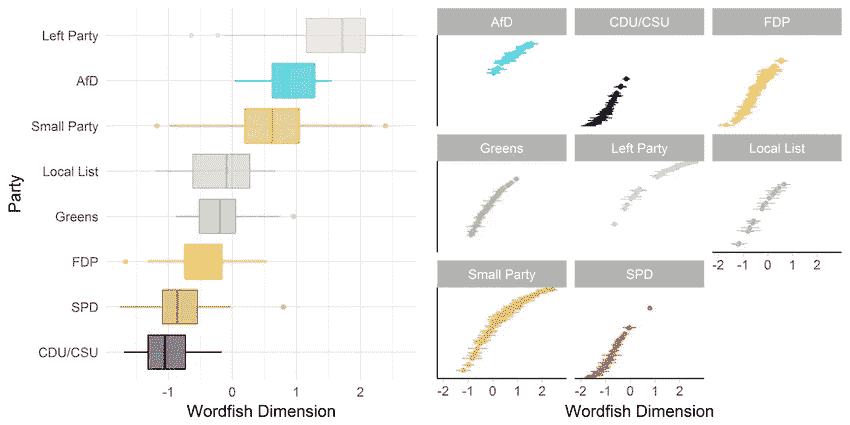
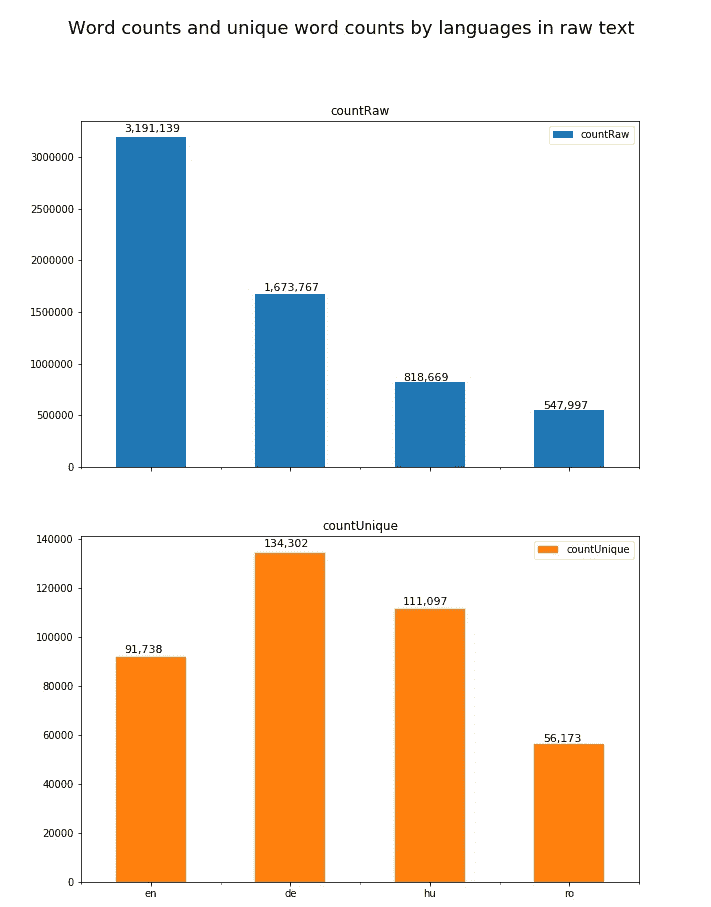
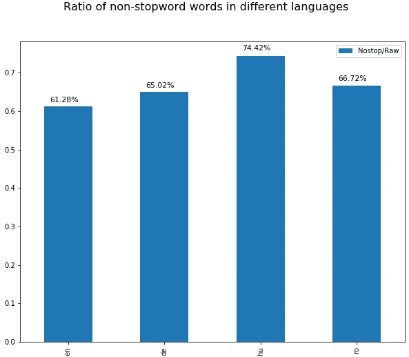
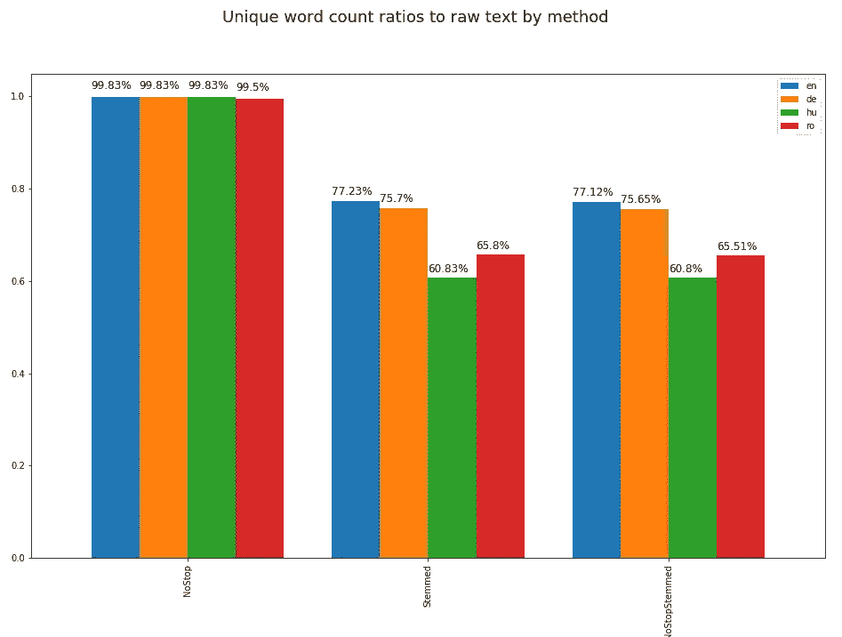
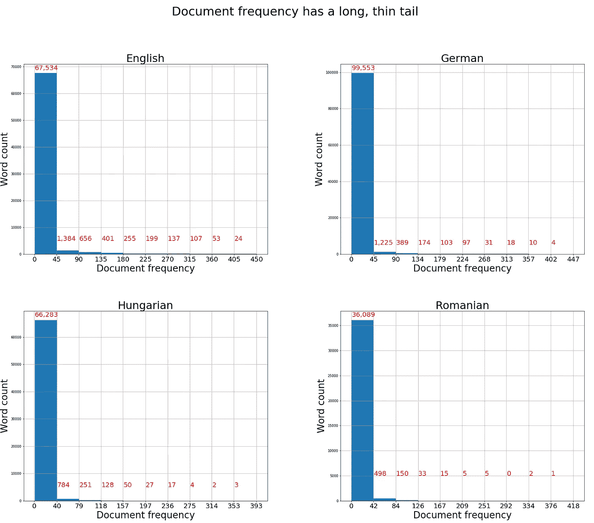
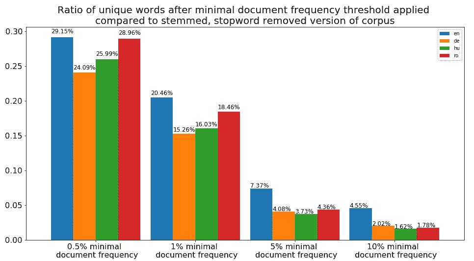
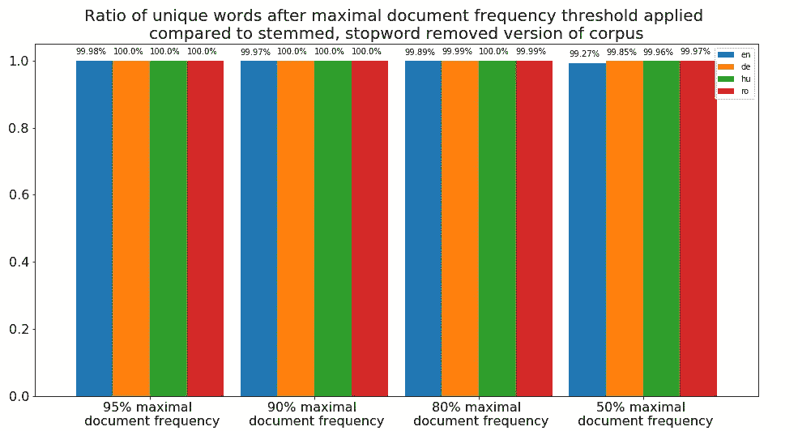

# Python 中自然语言处理的不同语言文本预处理

> 原文：<https://medium.com/analytics-vidhya/text-preprocessing-in-different-languages-for-natural-language-processing-in-python-dee4205ad350?source=collection_archive---------14----------------------->

如今，自然语言处理是一个朗朗上口的短语

这是关于 python 中文本预处理的两个教程的第 2 部分。在第一部分，我奠定了理论基础。在第二部分中，我将演示 python 中第一部分中描述的不同语言文本的步骤，同时讨论不同语言结构产生的不同效果。

如果你还没有，你应该先看看[第一部](/starschema-blog/a-comprehensive-guide-to-text-preprocessing-with-python-a47670c5c344)！

你可以在 [GitHub](https://github.com/morkapronczay/meetup-talk-text-preproc) 上查看代码！

 [## morkapronczay/meetup-talk-text-preproc

### 此时您不能执行该操作。您已使用另一个标签页或窗口登录。您已在另一个选项卡中注销，或者…

github.com](https://github.com/morkapronczay/meetup-talk-text-preproc) 

作者是在 [Starschema Ltd.](https://starschema.com/) 工作的客座作者，也可以查看他们的[出版物](https://medium.com/starschema-blog)！

# 关联

在第一部分中，我根据一篇学术文章的框架概述了文本预处理的原则。所有这些技术的根本目标是减少文本数据的维数，但保持相关信息包含在文本中。在第二部分中，我将介绍以下技术对文本的两个主要属性(字数统计和唯一字数统计)的影响，后者代表文本数据的维度:

1.  删除停用词
2.  词干分析，一种将单词简化为基本形式的自动化技术
3.  删除非常频繁和不常用的单词

来源:[**https://www . research gate . net/figure/Results-of-the-word fish-Analysis _ fig 3 _ 317616075**](https://www.researchgate.net/figure/Results-of-the-Wordfish-Analysis_fig3_317616075)

此外，他们还报告了文本预处理技术对文本的独特字数的影响，即词干化如何降低每种语言的语料库中的独特字数。如果你感兴趣的话，我建议你在这篇[论文](https://osf.io/ghxj8/)中查看他们的结果！

由于研究人员使用了本质上不同的政治文本，因此不同语言的结果并不完全可比。例如，他们分析了丹麦 4 个不同政党的 61 份下午演讲和意大利 15 个不同政党的 104 份书面动议。这就是为什么我决定用 4 种语言创建一个可比较的语料库来进行分析。语料库不仅需要具有可比性，而且还必须包括许多领域的文本，以便产生对这些语言具有良好通用性的结果。然而，重要的是要注意，特定的语料库对这些技术可能有完全不同的反应！

## 创建语料库

为了进行分析，我们需要大量不同语言的文本。由于我是匈牙利人，所以我选择比较英语、德语、匈牙利语和罗马尼亚语。对于其他语言也可以很容易地进行分析。此外，文本必须涵盖广泛的主题，必须至少大致相同的东西。我考虑了两种方法:

1.  不同语言的书籍，以及
2.  不同语言的维基百科。

这个 python 包简化了维基百科的内容提取。

事实证明，获取除英语以外的其他语言的书籍文本是一项更复杂的任务，最重要的是，更难实现自动化。然而，有了 [Wikipedia python 包](https://pypi.org/project/wikipedia/)，自动访问不同语言的 Wikipedia 页面内容就像你在左边的要点中看到的一样简单。

1.  [最具影响力 100 人](https://www.biographyonline.net/people/100-most-influential.html)，
2.  [最适合居住的 100 个城市](https://www.bestcities.org/rankings/worlds-best-cities/)，
3.  [2019 年表现最佳的 100 家公司](https://ceoworld.biz/2019/06/28/the-top-100-best-performing-companies-in-the-world-2019/)，
4.  [百强流行/摇滚乐队](https://www.imdb.com/list/ls076954447/)，
5.  [顶级运动品牌](https://en.wikipedia.org/wiki/Forbes%27_list_of_the_most_valuable_sports_teams)按价值和
6.  [百强图书](/world-literature/creating-the-ultimate-list-100-books-to-read-before-you-die-45f1b722b2e5)。

最后，我们需要包含大量文本的维基百科页面。为此，我选择从互联网上收集一些列表，因为我认为我可以找到一些知名实体的精彩页面:

使用这种方法，我最终得到了 452 个实体，因为我只保留了那些在所有 4 种语言中页面位置明确的实体。尽管如此，添加上一个列表中的实体并没有改变结果的本质，因此我停止了向语料库添加文本。

## 预处理 101

用 NLTK 的 [RegexpTokenizer](https://kite.com/python/docs/nltk.RegexpTokenizer) 清除不必要的字符和拆分文本就是这么简单！

在[第 1 部分](/starschema-blog/a-comprehensive-guide-to-text-preprocessing-with-python-a47670c5c344)中，我详细阐述了文本预处理中要考虑的前 3 个步骤。在本案例研究中，在内存中阅读完文本后，它们会立即变成小写。此外，使用 [RegexpTokenizer](https://kite.com/python/docs/nltk.RegexpTokenizer) 可以毫不费力地删除数字和特殊字符。

## 文集

原始文本的原始字数和唯一字数。

看看原始字数，英文维基百科比任何其他语言的文本都多并不奇怪，但匈牙利语维基百科比罗马尼亚语维基百科的文本更多，而罗马尼亚的人口是匈牙利的两倍。

从独特的统计来看，似乎德语和匈牙利语在词汇上比英语和罗马尼亚语更多样化。然而，这可能是由语言的潜在结构造成的:匈牙利语比英语更倾向于在词尾使用后缀，从而产生更多独特的单词。因此，评估词汇多样性最好在预处理步骤之后进行！

## 停用词删除

要演示的第一个文本预处理技术是停用词去除。这是一种基本的方法:大多数 NLP 包，如 [NLTK](https://www.nltk.org/) 都带有支持语言的内置停用词表。因此，只需浏览文档并删除停用词列表中的任何词:

使用 NLTK 移除停用字词。注意:您必须使用 nltk.download 下载停用字词资源！

停用词移除主要影响语料库的原始字数，因为它仅移除停用词列表中包括的词，但是这些词往往具有高频率，因为它们支持语法角色。

在左图中，我们可以评估去除停用词后剩余的单词部分。这与我们之前的解释一致，即英语的价值相对较低:许多停用词被用来代替后缀来创建单词周围的上下文。另一方面，后缀很多的匈牙利语只损失了大约 25%的单词，相比之下，英语损失了将近 40 个单词。

## 堵塞物

词干提取是一种自动技术，可以将单词简化为基本形式。它基于语言特定的规则。在本文中，NLTK 使用了[波特词干算法，NLTK](http://www.nltk.org/howto/stem.html)拥有[公开可用的词干规则](http://snowball.tartarus.org/algorithms/porter/stemmer.html)。

使用 NLTK 去除词干和停用词。注意:您必须使用 nltk.download 下载资源！

分析词干化的效果可以通过唯一单词计数来完成，因为词干化不会删除任何单词，而是从许多单词中产生一个唯一的单词，从而降低文本维度。这可以从下图中看出:

停用词移除几乎不会改变唯一的单词计数，而词干处理会显著改变。根据前面的陈述，词干对后缀较多的匈牙利语影响最大，对英语影响最小。一般来说，词干分析可以将文本数据的维度减少 20%到 40%，这取决于语言(当然还有文本的性质，如果它没有这里使用的语料库那么通用的话)。

## 删除极不常用的单词

正如之前在这些文章中提到的，词频往往有一个长尾分布:许多词在文本中出现的频率很低。文档频率也是如此；许多单词只出现在少量文档中。这可以在每种语言的文档频率直方图上看到。

红色数字表示在文档频率箱中的字数，而 x 记号标签是箱边界。例如:在英文图中，第一个条形表示语料库中 0–45 个文本中出现了 67534 个单词。下一个条意味着 1384 个单词出现在 45-90 个文本中，等等。

请仔细阅读 filter_extremes()方法文档，因为这两个参数都很重要，并且都有默认值！

为了从语料库中移除不常用的(或者相反，过于频繁的)术语，我建议使用 [gensim](https://radimrehurek.com/gensim/) 包。您应该创建一个[gensim . corpora . dictionary](https://radimrehurek.com/gensim/corpora/dictionary.html)对象，为初始化器提供一个嵌套列表，其中每个列表元素都是一个文档，它是一个令牌列表。对于这个字典，用正确的参数调用 *filter_extremes* 方法将会帮你完成这个任务。

去掉这些可以减少大量的维数，但是你可能会从你的文本中去掉最重要的单词。如果你有一个平衡的二进制分类问题，删除低于 0.5%文档频率的单词可能无关紧要，因为这个单词出现在太少的文档中，不会成为一个决定性因素。然而，在一个多类问题中，也许这些稀疏的单词包含了最多的信息！

正如我们从文档频率直方图中可以看到的，移除具有低文档频率的单词极大地减少了语料库中唯一单词的数量，这是真实的，与语言无关；四个语料库对这一过程有相对相似的反应。尽管如此，对于词汇更加多样化的语言，即德语(和匈牙利语)，独特词汇的减少甚至更加明显。

# 删除非常频繁的单词

我打算介绍的最后一个过程是寻找特定领域或特定语料库关键字的方法。这个想法是，如果一个单词出现在一个语料库的大多数文档中，它可能不传达关于该特定语料库中的文档的任何信息。尽管如此，一个词在所有文档中出现的文档内频率可能会有很大不同，这也可能包含信息！

在我们的例子中，在两种语言的 50%的文档中都出现了少量的单词。这是因为我们正在分析许多不同领域的语料库，但是对于关于特定主题的语料库，可以使用这种方法去除特定领域的停用词。

# 外卖食品

一个普遍的观点是，在对文本预处理技术的反应方面，语言可以有很大的不同。停用字词删除会从后缀不常用的语言中删除更多的字词，而词干处理对后缀较多的语言影响更大。注意删除不常用的单词。你可能删除了太多，它们可能非常重要！虽然在搜索出现在所有文本中的单词时可以找到特定领域或特定语料库的停用词，但是需要注意的是，出现在所有文本中的单词在文档中的频率可能是分类问题的决定性因素！

# 参考资料:

格林、切隆、舒马赫和法泽卡斯(2016 年 11 月 1 日)。自动化文本分析的基本要素。比较四个国家不同的文件预处理技术。[https://doi.org/10.31219/osf.io/ghxj8](https://doi.org/10.31219/osf.io/ghxj8)

*原载于 2019 年 10 月 17 日*[*【https://medium.com】*](/starschema-blog/text-preprocessing-in-different-languages-for-natural-language-processing-in-python-fb106f70b554)*。*