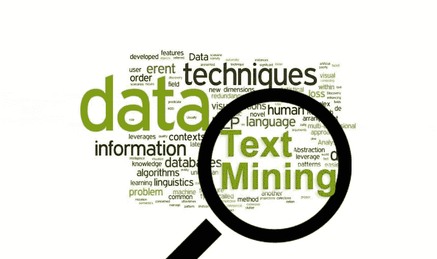
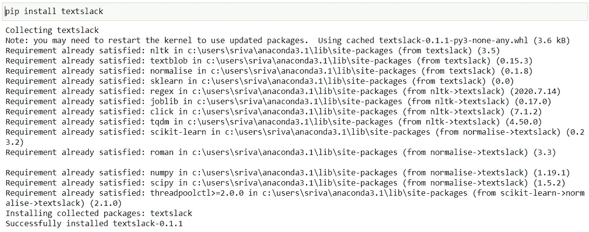
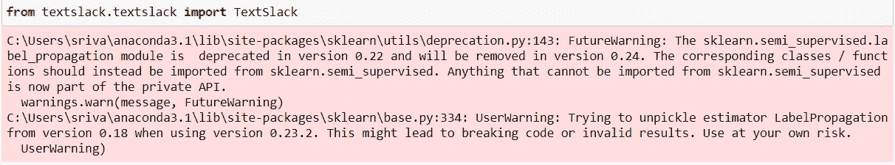
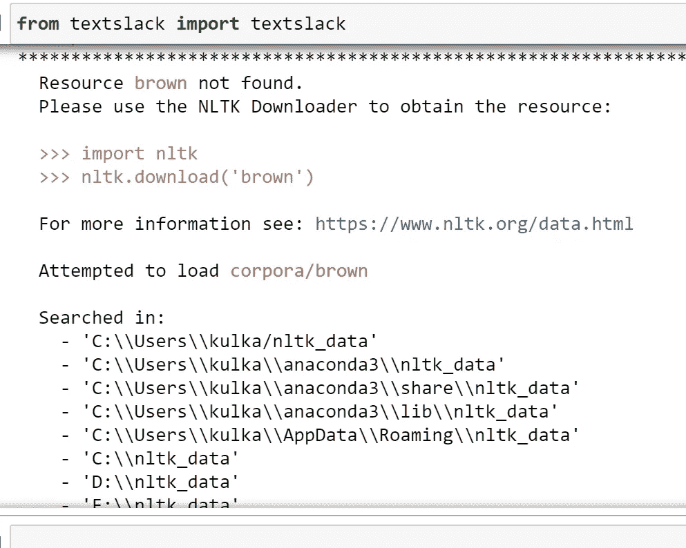
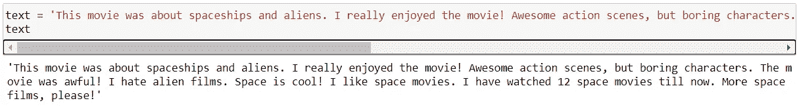
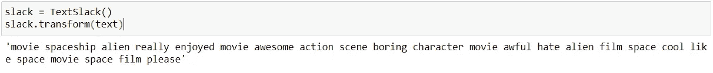
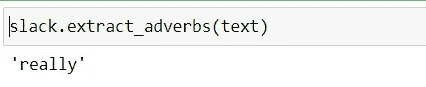
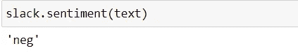
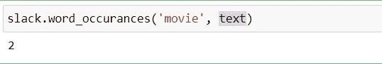

# 使用 textslack 简化文本处理

> 原文：<https://medium.com/analytics-vidhya/text-processing-made-easy-with-textslack-4214ae6bc67a?source=collection_archive---------8----------------------->

每当我们想到自然语言处理(NLP)任务时，我们首先想到的是什么？是的，你猜对了，文字处理。当我们使用术语文本处理时，我们到底指的是什么？简而言之，它是将文本转换为机器学习算法可以消化的形式的过程。

这里我们不打算讨论整个文本处理过程，而是讨论和利用一个预建的库，它处理文本处理中所需的一些初步和最重要的步骤，即文本清理和从文本中生成洞察。

您可能已经注意到，每当我们必须处理非结构化文本数据时，我们基本上每次都要编写相同的代码。如果我们有一个架构或一个库，可以为我们处理文本清理和特征提取的平凡任务，这不是很好吗？

“textslack”就是我构建的一个这样的架构，它可以清理你的文本数据，还包括从文本中提取有用见解的附加功能。

所以，让我们直接进入主题，好吗？

首先，我们从哪里得到这个包裹？嗯，像大多数开源的 python 包一样，它只是一个 pip 安装。

那么，我们开始吧…

tada……很快就安装好了。

现在，让我们继续将这个库导入到我们的笔记本或 IDE 中，无论您喜欢什么。在将代码用于主要项目之前，我通常更喜欢用笔记本进行初步分析。

而且，已经完成了，尽管忽略未来的警告。

但是，有些人在导入库时可能会遇到一些 nltk 下载错误。

不过没什么好担心的，您只需要依次导入 nltk、下载缺失的资源和再次导入 textslack。不过，我会在下一个版本中包含这些资源。

现在，我们已经导入了库，让我们在一些随机的文本数据上尝试一下。

为此，我们只需要创建一个从 TextSlack 导入的 textslack 模块的实例，并调用 transform 方法。

很简单，不是吗？文本已被规范化并清除了所有停用词、标点符号等。在一个函数调用中。

但是，这只是文本清理，我之前提到的其他功能呢？放心吧！我们会涵盖 textslack 提供的所有内容。

如果我们只对文本中出现的名词、动词或形容词感兴趣呢？让我们试一试这个想法，试着把课文中除了副词之外的所有东西都清理掉。

嗯……看起来我们的课文里只有一个副词。

无论如何，我们可以通过分别调用 extract _ 名词、extract _ 动词和 extract _ 形容词函数，类似地过滤掉文本中的名词、动词和形容词。

那么，现在我们已经看到了 textslack 在清理方面提供的一切，让我们看看我们还能提取出什么其他见解。

文字的整体感悟呢？让我想想。

我们得到了一个整体的负面情绪，这在某种程度上是合理的，因为“恨”这个词，在文本中有非常高的情绪极性。

现在，来看图书馆的最后一个特色，让我们看看“电影”这个词在文中被提到了多少次。

为了避免任何混淆，现在，它只是给我们一个单词以其提到的形式出现的频率，而不是以其基本形式出现的频率。所以，如果文本中出现了“电影”这个词，它就不算数。我知道，这不是我们想要的。但是，这将在下一个版本中解决。

所以，是的，这就是关于 textslack 的基本功能，在未来的版本更新中继续检查新功能。

谢谢你们的关注，我希望，你们都能试一试，希望，这个库对处理你们的文本分析有所帮助。

**库链接:**

https://pypi.org/project/textslack/

**参考文献:**

 [## Python 中的 NLP 文本预处理和清理管道

### 通过语言，我们表达了人类的经验。语言是我们交流、表达情感、倾听、思考和…

towardsdatascience.com](https://towardsdatascience.com/nlp-text-preprocessing-and-cleaning-pipeline-in-python-3bafaf54ac35)  [## Python 中的文本挖掘:步骤和示例

### 作者:Dhilip Subramanian 在今天的场景中，人们成功的一种方式取决于他们如何沟通…

towardsai.net](https://towardsai.net/p/data-mining/text-mining-in-python-steps-and-examples-78b3f8fd913b) 

[https://towards data science . com/text-cleaning-methods-for-natural-language-processing-f2fc 1796 e8c 7](https://towardsdatascience.com/text-cleaning-methods-for-natural-language-processing-f2fc1796e8c7)