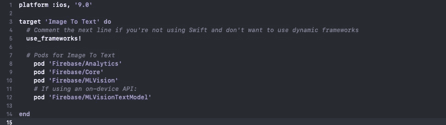
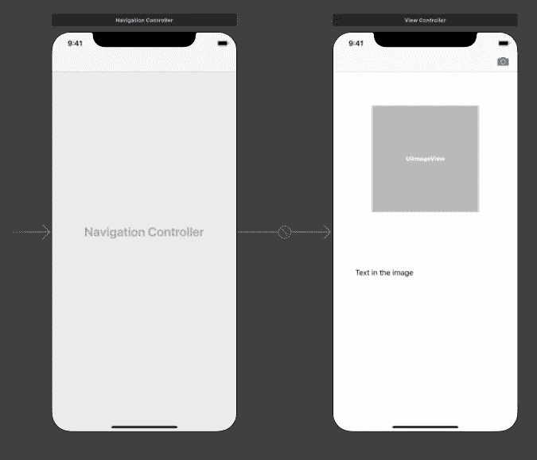
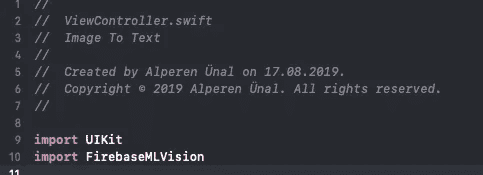
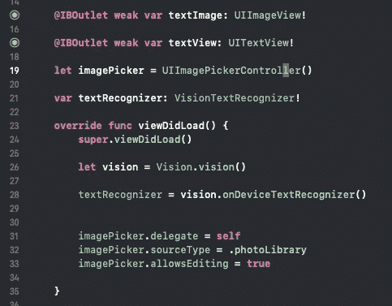
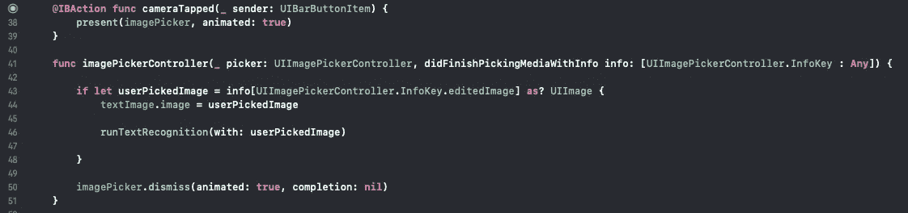
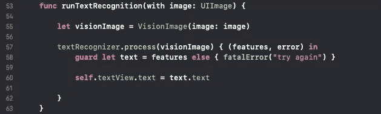
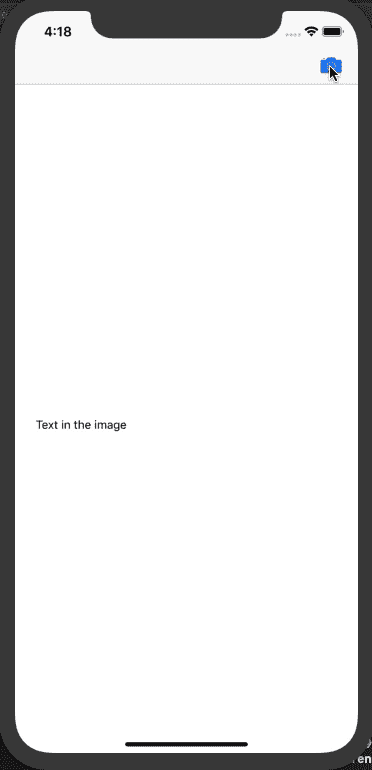

# 使用 Firebase ML 工具包从图像中识别文本— iOS 开发(Swift)

> 原文：<https://medium.com/analytics-vidhya/text-recognition-from-image-using-firebase-ml-kit-ios-development-swift-77e0baa9b641?source=collection_archive---------6----------------------->

朋友们好，今天我将告诉你如何使用 Firebase ML(机器学习)工具包和 Swift 5 在图像中进行文本识别。首先，什么是 Firebase ML 套件？

> Google 对于 Firebase ML Kit 的定义是*“ML Kit 是一个移动 SDK，它将 Google 的机器学习专业知识以一个强大而又易于使用的包的形式带到了 Android 和 iOS 应用中”。*所以简单来说，我们可以在我们的移动应用程序中使用谷歌训练过的机器学习模型。

为了使用 Firebase ML 工具包，我从 Firebase 控制台打开一个 iOS 应用程序。(本文不打算展示这个)然后我们把 google.plist 添加到我们的项目中，把项目和 Firebase 连接起来。作为 pod，我们将以下 pod 添加到我们的项目中，并从终端运行“pod install”命令。

我使用 CocoaPods 作为一个包管理器，你可以使用任何你想要的。

使用 Firebase ML 工具包进行文本识别的两种方法:

1.  设备上的文本识别
2.  云文本识别

我们将在这个项目中使用设备上的文本识别。在该项目中，用户将上传一张带有文本的照片，我们将识别它并将其打印在屏幕上。应用程序的用户界面如下。

编辑完 UI 后，我们将*【firebasemvision】*库导入到视图控制器中。

我们需要实现*UIImagePickerControllerDelegate&UINavigationControllerDelegate*来从用户处获取图像。我们应该在“Info.plist”中添加*“隐私-图片库使用说明”*和*“隐私-相机使用说明”*，以便用户访问图片库。

我们使用“vision”对象创建*“VisionTextRecognizer”的对象。创建 imagePicker 对象并设置用于拍摄图像的委托属性 self 后。*

我用照片库作为 imagePicker 的源类型，你可以使用任何你想要的。

现在，我们可以实现委托方法。我们将拾取的图像展开，设置*" text image "*ui imageview 的图像，并将 *"userPickedImage"* 发送到 *"runTextRecognition"* 方法，以便在*" image picker controller "*委托方法中从拾取的图像中识别文本。

在*“runTextRecognition”*方法中，我们获取用户选择的图像。我们使用用户选择的图像创建一个*“vision image”*对象。我们将 *"visionImage"* 对象发送给我们之前创建的 *"textRecognizer"* 对象的 *"process"* 方法。我使用*“guard let”打开*“features”*，这意味着我*f*“features”*返回 nil 应用程序将崩溃并发送*“fatal error”*“textView”的其他文本在用户选择的图像中设置为可识别的文本。

在 process 方法中，我使用了尾随闭包语法

应用程序的最终版本如下。但是请记住，Firebase ML 工具包仍处于测试阶段，因此可能会有一些问题:)

我们应用程序的最终版本

感谢您阅读这篇文章。如果你有任何问题，你可以联系我。如果你能为我的文章鼓掌，我将不胜感激。希望以后能在其他文章里看到你，保重:)