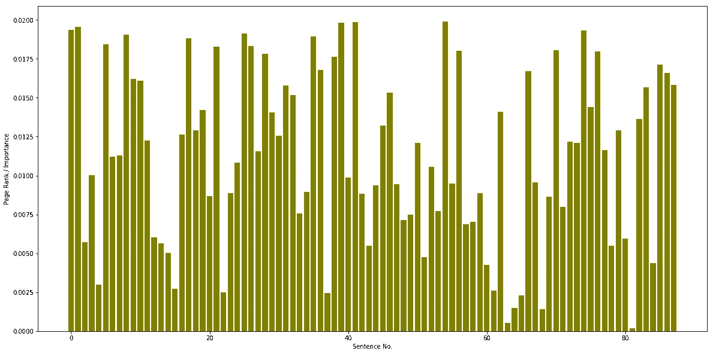
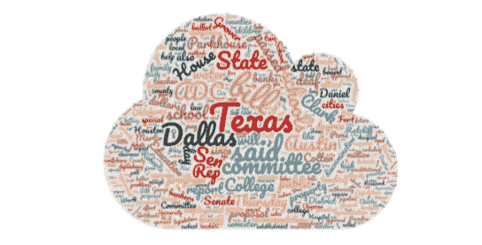
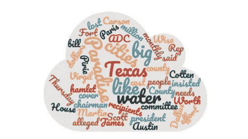

# 文本摘要-实现

> 原文：<https://medium.com/analytics-vidhya/text-summarization-implementation-a0001f66647b?source=collection_archive---------10----------------------->

## 像 Inshorts 这样的应用程序是如何工作的

为了理解文本摘要的关键主题，我强烈推荐你阅读[文本摘要-关键概念](https://towardsdatascience.com/text-summarization-key-concepts-23df617bfb3e)。

https://unsplash.com/photos/-gG86PdIzUA

## 摘要文本摘要的特征

1.  **标题词特征:**第一份报告中的句子由标题中引用的词组成，有更多的机会添加到最后的大纲中，因为它们作为记录主题的指针填充。例如:如果文档的标题是“医疗保健行业的自动化”,那么内容中出现的自动化、医疗保健等词将被赋予更大的意义
2.  **实词特征:**关键词是区分句子重要性的基础。由主要关键字组成的句子很有可能被合并到最后的概要中。实体(关键词)词将是名词、动作词、副词和形容词
3.  **大写单词特征:**大写单词，例如“UNESCO”被视为重要单词，由这些单词组成的句子被命名为与最后一个概要的句子确定相关的重要单词
4.  **提示短语特征:**提示表达式是显示档案流的结构的单词和表达式，并且它被用作句子选择中的元素。包含符号表达式的句子(例如“最终结果”、“自”、“此数据”、“大纲”、“创建”、“因为”等)。)大部分将被并入最后的纲要中
5.  **偏向词特征:**由偏向词组成的句子几乎肯定是重要的。偏向词是可能是区域(主题)明确的预定义词集的纲要。它们通常是描述档案主题的重要词汇

## 基于图的 TextRank 算法

最初，我们使用 nltk 句子标记器将文本输入标记成句子。

**预处理**

互联网上的普通文本都有撇号，用来标记所有物，如那是，不，那是等等。并标出缩写中省略的字母，如 you 're for you are。在我们使用正则表达式的文本中，这样的撇号需要被删除，整个单词需要被替换。我们用最常见的缩写代替，比如我，他的，那是，她的，等等。变成一个完整的单词，这将有助于删除停用词。我们从 nltk 停用词语料库中导出停用词。

**使用正则表达式重整句子**

**所有单词的词性标注**

**预处理:**

两个句子的重叠可以简单地确定为两个句子的词汇表示之间的共同标记的数量，或者可以通过语法过滤器来运行，该过滤器只计算特定语法类别的单词。此外，为了避免推广长句，我们使用了一个归一化因子，并用每个句子的长度来划分两个句子的内容重叠

为了建立句子之间的联系(边缘)，我们定义了阿宁“相似性”关系，其中“相似性”是作为内容重叠的函数来测量的。两个句子之间的这种关系可以被看作是一个“推荐”的过程:一个句子涉及文本中的某些概念，给读者一个“推荐”来参考文本中涉及相同概念的其他句子，因此可以在任何两个具有共同内容的句子之间建立联系。

两个句子的重叠可以简单地确定为两个句子的词汇表示之间的共同标记的数量，或者可以通过语法过滤器来运行，该过滤器只计算特定语法类别的单词。而且为了避免推广长句，我们在使用一个归一化因子，用每个句子的长度来划分两个句子的内容重叠。得到的图是高度连接的，每条边都有一个权重，表示文本 2 中不同句子对之间的连接强度。因此，文本被表示为加权图，因此，我们使用基于加权图的排名公式。

**使用 PageRank 算法对句子进行排序**

在图表上运行排序算法后，句子按其得分的逆序排序，并选择排名靠前的句子包含在摘要中。

**代表所有句子重要性的条形图**

**选择摘要的前几个句子**

## 投入

**棕色语料库—输入词云**

**输出**

**棕色语料库—输出词云**

## 结论:

最重要的句子给出了更多关于文章的信息，因为它们有更高的分数。该算法可高度移植到其他领域、流派或语言。它检查文本中实体之间的联系，并对它们应用建议。它比监督学习技术更简单和有效，因为数据不需要训练。这是因为，在监督方法中，模型应使用一些特定数据进行训练，然后在适当验证后使用其他数据进行测试。这是一种通用的方法，对于所有类型的数据，验证并不相同。因此，与无人监管的方法不同，这种方法风险更大。点击查看完整的笔记本[。](https://github.com/harshdarji23/Text-Summarization-An-Extractive-Method-NLP/blob/master/Text_Summarization-final%20Code.ipynb)

## 参考资料:

[1]5 步文本摘要，[https://becoming human . ai/Text-summarying-in-5-steps-using-nltk 65 b 21 e 352 b 65](https://becominghuman.ai/text-summarization-in-5-steps-using-nltk65b21e352b65)

[2]文本摘要介绍，[https://www . analyticsvidhya . com/blog/2018/11/Introduction-Text summary-Text rank-python/](https://www.analyticsvidhya.com/blog/2018/11/introduction-textsummarization-textrank-python/)

[3]无监督文本摘要，[https://medium . com/jatana/Unsupervised-Text-summary-using sentence-embedding-ADB 15 ce 83 db 1](/jatana/unsupervised-text-summarization-usingsentence-embeddings-adb15ce83db1)

[4]文本摘要措施，[http://www.cai.sk/ojs/index.php/cai/article/viewFile/37/24](http://www.cai.sk/ojs/index.php/cai/article/viewFile/37/24)

[5]基于图的句子抽取排序算法，[https://dl.acm.org/citation.cfm?id=1219064](https://dl.acm.org/citation.cfm?id=1219064)

[6]摘要文本摘要综述，[https://ieeexplore.ieee.org/document/7944061/](https://ieeexplore.ieee.org/document/7944061/)