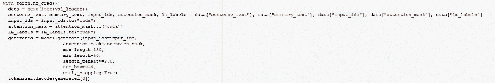

# 文本摘要，摘录，T5，印度尼西亚语，拥抱脸的变形金刚

> 原文：<https://medium.com/analytics-vidhya/text-summarization-t5-bahasa-indonesia-huggingfaces-transformers-ee9bfe368e2f?source=collection_archive---------7----------------------->

图片来自:[https://www . kdnugges . com/2019/11/getting-started-automated-text-summary . html](https://www.kdnuggets.com/2019/11/getting-started-automated-text-summarization.html)

是的，标题只是我在谷歌上搜索做这个实验时使用的一堆关键词。然而你在这里，想知道如何利用 huggingface transfomers 来制作你自己的*印尼语*文本摘要，不是吗？

# **数据**

在这个实验中，我使用的是 kata . ai[Indosum](https://github.com/kata-ai/indosum)数据集。你可以去那里的链接获取数据集。在这个实验中，我只使用他们数据集的第一个文件夹(17k 训练数据)，并且文本被设置为段落，而不是全文文章和摘要的标记。

使用的数据快照。

# 模型

自然地，在文本摘要任务中，我们想要使用具有编码器-解码器模型的模型(序列输入，序列输出//全文输入，摘要输出)。因此，在回购中，我们可以选择具有这种架构的模型。基于它的[页面](https://huggingface.co/transformers/summary.html#sequence-to-sequence-models)目前只有 3 款车型支持它: **Bart，T5，MarianMT。**因为我想为巴哈萨语做这个任务，所以只有一个用户 [huseinzol](https://huggingface.co/huseinzol05) 用这种语言上传模型(尽管我很确定他是用巴哈萨马拉雅语而不是印尼语训练的)，但是 [t5 模型用于摘要](https://huggingface.co/huseinzol05/t5-base-bahasa-summarization-cased)效果很好。(还有他的艾伯特，用于分类)。所以，我选择他的模型进行微调。

启动记号赋予器和模型

# 数据集类。

数据集类。

这里是**使用 t5 模型的重要部分。**因为它将 nlp 任务转换为文本到文本的格式，而不是像 **BERT** 这样的特殊记号，所以在输入中我们必须开始***“summary:”。*** 你可以在上面的截屏中看到 ***编码 _ 段落*** 变量中的代码。然后，模型需要知道整篇文章的结尾在哪里，对吗？所以我们可以添加***EOS token***(tokenizer 的 vocab 中的*句尾*/*/s>*)。在这个记号之后，记号赋予器将通过 args***pad _ to _ mask _ length****填充输入，直到它达到 max_length (512，因为…默认情况下 t5 也在编码器状态下使用它)。垫本身是有用的，所以我们可以有批量大小> 1，如果设备可以处理它。***return _ attention _ mask****也被设置为 **True** ，因为那个填充。它让模型知道它加入的令牌是否是 pad，然后它不会加入/记录它。我们设置好了序列输入。**

**现在序列目标的一部分。 [t5 是用老师逼的，](https://huggingface.co/transformers/model_doc/t5.html#training)是说我们要转移 seq。目标由一个令牌表示，通常是一个 ***句首< sos >*** 令牌。不过在文档中，写了我们可以使用 *pad* token 作为 *< sos >* token，因此在我的***encoding _ summary***中，我将其添加到摘要文本中，与 *< eos >* 并排，就像在输入中一样。max_length 应该与输入相差小于，因为它的目标…***pad _ to _ mask _ length***仍然设置为 ***True*** 跟序列输入的原因一样。**

**在 ***__getitem__*** 的返回中我把全文(*句子 _ 正文*)、摘要正文(*摘要 _ 正文*)、全文' input_ids ( *input_ids* )、全文' attention _ mask(*attention _ mask*)以及摘要的我们可以使用不同的配置，但不要忘记这两个主要输出。摘要的输入标识。**

# **培训**

****

**训练日程**

**在这里，培训本身就像 pytorch 开发的常规培训路线。**

**model.train() ->定义 dataset ->定义 dataloader ->遍历它->将数据放入设备(cpu/cuda) ->训练模型->获取输出->获取损失值->将每个 batch_size 的损失值添加到完整的 train_loss ->反向损失->步进优化器。**

**然而，模型本身需要 3 个特定的输入。 *input_ids* (序列输入令牌) *attention_mask* (序列输入 pad 令牌与否) *lm_labels* (右移序列目标)。**

**验证是类似的，不同的是我们定义模型不更新其梯度，所以我们只需要它来计算损失，如果损失比前一个时期好，我们保存当前模型。**

# **推理**

****

**推理模型**

**为了进行推理(或者生成摘要本身)，transformer 在 model 类中已经有了一个函数 ***generate*** 。我们只需要 input_ids 和 attention_mask 的输入。差不多就是这样。其他参数是可选的。它的返回是摘要的 ***令牌 id，*** 因此我们需要使用令牌化器对其进行解码。而且也已经有了，很方便。**

# **结果呢**

****

**全文是原文，摘要来自数据，生成的摘要来自模型。**

**我认为摘要本身的结果与全文的前几个部分非常相似。我想这是因为输入模型是一篇新闻文章，并且输入的摘要也被用作摘要。**

**总结任务中通常使用的指标是 ROUGE。但在这一次，我不是计算指标，而是依靠收集的损失。在 3 个时期之后，对于第一次折叠的数据，我得到了大约 0.35 的训练损失和价值损失。**

**你可以在这里看到完整的笔记本[，](https://github.com/imanueldrxl/NLPLearning/blob/master/Text%20Summarization.ipynb)但是不要忘记把“cuda”换成你拥有的设备…还有读/写文档的路径。**

**干杯。**