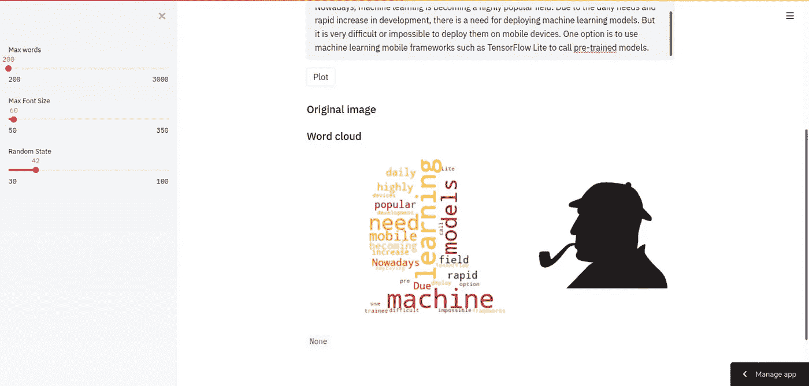
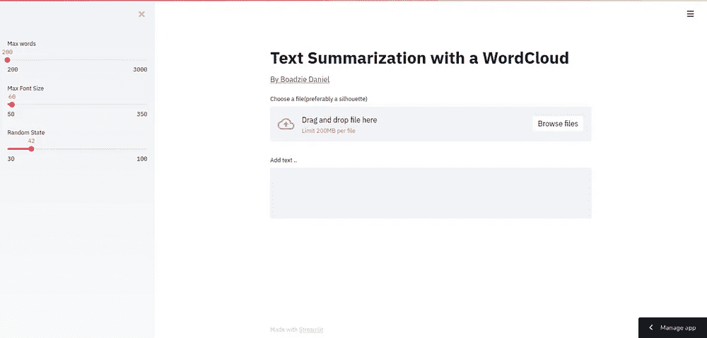

# 使用单词云的文本摘要&部署在 Streamlit 上

> 原文：<https://medium.com/analytics-vidhya/text-summarization-using-a-wordcloud-deployed-on-streamlit-cbce2f411c24?source=collection_archive---------9----------------------->



词云是快速总结客户情绪最简单的方法。在本教程中，我们将使用 word cloud 创建一个文本摘要器，并使用其令人敬畏的新一键式部署功能将其部署在 Streamlit 上。

让我们从创建一个虚拟环境并激活它开始。

```
python3 -m venv env
```

然后激活它

```
source env/bin/activate # if you are running on Linux or Macenv\Scripts\activate # for windows users
```

现在用…安装软件包

```
pip install wordcloudpip install streamlit
```

我们将为我们的应用程序创建两个函数。一个函数将保存单词云逻辑，另一个将是我们的 [Streamlit](http://streamlit.io/) UI。让我们在项目的根目录下创建一个 app.py 文件，并添加以下代码。

云函数

我们首先在文件顶部导入我们的库，然后创建第一个函数。这个函数有五个参数，我们将把它们输入到我们的单词云中。参数中的图像将被用作单词云的形状。我们还会给单词云添加颜色，最后用 Matplotlib 绘图。

既然我们已经有了自己的逻辑，让我们把重点放在使用 Streamlit 的 UI 上；用于构建数据应用程序的超棒的库。

主要功能

在上面的代码中，我们使用我们创建的别名“st”来表示 Streamlit。然后我们调用“write”方法来启用 Markdown 的写入；像 HTML 这样的标记语言的变体。这是 HTML 的一个简单的替代品。“st.write”是通用的，因此可以处理许多格式的输出，包括 Markdown、images、plots 等。

最后，我们调用我们的函数并给它提供正确的参数。这些来自用户将给出的输入。滑块输入将在侧边栏中。

现在，让我们添加一行代码，将我们的 app.py 识别为 Python 模块。

如果一切顺利，那么我们可以使用下面的命令运行应用程序，并导航到“http:localhost:8501”并查看应用程序实况。



既然我们已经确定我们的应用运行良好，让我们准备在 Streamlit 上部署它。为此，我们需要:

1.  使用 git 将 Github 上的项目保存为公共项目。
2.  在虚拟环境中运行以下命令，创建 requirements.txt 文件来保存我们的依赖关系。' pip freeze > requirements.txt '
3.  把你的项目推给 Github
4.  注册 Streamlit 共享
5.  创建项目
6.  在 Github 上搜索项目
7.  最后，点击大的“部署”按钮，瞧，你的应用程序上线了。很简单，对吗？

Streamlit 是构建数据应用程序的一种真正令人敬畏的方式，随着他们新的一键部署，使用它的乐趣刚刚翻了三番。:)

这个应用程序的代码可以在[这里](https://github.com/Boadzie/sammaryman)找到