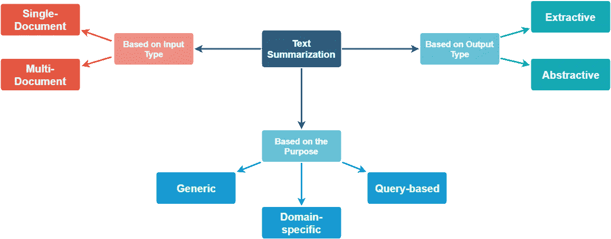

# 使用自然语言处理的文本摘要

> 原文：<https://medium.com/analytics-vidhya/text-summarization-using-nlp-3e85ad0c6349?source=collection_archive---------2----------------------->

文本摘要是为较长的文本文档生成简短、流畅，最重要的是准确摘要的过程。自动文本摘要背后的主要思想是能够从整个集合中找到最重要信息的一个简短子集，并以人类可读的格式呈现它。随着在线文本数据的增长，自动文本摘要方法有可能非常有用，因为可以在短时间内阅读更多有用的信息。

**为什么是自动文本摘要？**

1.  摘要减少阅读时间。
2.  研究文档时，摘要使选择过程更容易。
3.  自动摘要提高了索引的效率。
4.  自动摘要算法比人工摘要更少偏差。
5.  个性化摘要在问答系统中是有用的，因为它们提供个性化信息。
6.  使用自动或半自动摘要系统使得商业摘要服务能够增加它们能够处理的文本文档的数量。

# 总结的类型:



**基于输入类型:**

1.  *S* 单个文件*，*输入长度短。许多早期的摘要系统处理单个文档的摘要。
2.  多文档，这里输入的长度可以任意。

**基于目的:**

1.  通用，其中模型对要汇总的文本的领域或内容不做任何假设，并将所有输入视为同类。已经完成的大部分工作都围绕着一般的总结。
2.  特定于领域，其中模型使用特定于领域的知识来形成更准确的摘要。例如，总结特定领域的研究论文、生物医学文献等。
3.  基于查询，其中摘要仅包含回答关于输入文本的自然语言问题的信息。

**基于输出类型:**

1.  摘录，从输入文本中选择重要的句子形成摘要。今天的大多数摘要方法本质上都是提取的。
2.  Abstractive，模型形成自己的短语和句子来提供更连贯的摘要，就像人类会生成的一样。这种方法肯定更吸引人，但比提取摘要要困难得多。

## **如何做文本摘要**

*   文本清理
*   句子标记化
*   单词标记化
*   词频表
*   摘要

## **文字清理:**

```
# !pip instlla -U spacy# !python -m spacy download en_core_web_smimport spacyfrom spacy.lang.en.stop_words import STOP_WORDSfrom string import punctuationstopwords = list(STOP_WORDS)nlp = spacy.load(‘en_core_web_sm’)doc = nlp(text)
```

## **单词标记化:**

```
tokens = [token.text for token in doc]print(tokens)punctuation = punctuation + ‘\n’punctuationword_frequencies = {}for word in doc:if word.text.lower() not in stopwords:if word.text.lower() not in punctuation:if word.text not in word_frequencies.keys():word_frequencies[word.text] = 1else:word_frequencies[word.text] += 1print(word_frequencies)
```

## **句子标记化:**

```
max_frequency = max(word_frequencies.values())max_frequencyfor word in word_frequencies.keys():word_frequencies[word] = word_frequencies[word]/max_frequencyprint(word_frequencies)sentence_tokens = [sent for sent in doc.sents]print(sentence_tokens)
```

## **词频表:**

```
sentence_scores = {}for sent in sentence_tokens:for word in sent:if word.text.lower() in word_frequencies.keys():if sent not in sentence_scores.keys():sentence_scores[sent] = word_frequencies[word.text.lower()]else:sentence_scores[sent] += word_frequencies[word.text.lower()]sentence_scores
```

## **总结:**

```
from heapq import nlargestselect_length = int(len(sentence_tokens)*0.3)select_lengthsummary = nlargest(select_length, sentence_scores, key = sentence_scores.get)summaryfinal_summary = [word.text for word in summary]summary = ‘ ‘.join(final_summary)
```

**输入:**

```
text = “””Maria Sharapova has basically no friends as tennis players on the WTA Tour. The Russian player has no problems in openly speaking about it and in a recent interview she said: ‘I don’t really hide any feelings too much.I think everyone knows this is my job here. When I’m on the courts or when I’m on the court playing, I’m a competitor and I want to beat every single person whether they’re in the locker room or across the net.So I’m not the one to strike up a conversation about the weather and know that in the next few minutes I have to go and try to win a tennis match.I’m a pretty competitive girl. I say my hellos, but I’m not sending any players flowers as well. Uhm, I’m not really friendly or close to many players.I have not a lot of friends away from the courts.’ When she said she is not really close to a lot of players, is that something strategic that she is doing? Is it different on the men’s tour than the women’s tour? ‘No, not at all.I think just because you’re in the same sport doesn’t mean that you have to be friends with everyone just because you’re categorized, you’re a tennis player, so you’re going to get along with tennis players.I think every person has different interests. I have friends that have completely different jobs and interests, and I’ve met them in very different parts of my life.I think everyone just thinks because we’re tennis players we should be the greatest of friends. But ultimately tennis is just a very small part of what we do.There are so many other things that we’re interested in, that we do.’“””
```

## **输出(最终汇总):汇总**

```
I think just because you’re in the same sport doesn’t mean that you have to be friends with everyone just because you’re categorized, you’re a tennis player, so you’re going to get along with tennis players. Maria Sharapova has basically no friends as tennis players on the WTA Tour. I have friends that have completely different jobs and interests, and I’ve met them in very different parts of my life. I think everyone just thinks because we’re tennis players So I’m not the one to strike up a conversation about the weather and know that in the next few minutes I have to go and try to win a tennis match. When she said she is not really close to a lot of players, is that something strategic that she is doing?
```

完整的代码请查看我的回购:

[https://github.com/anoopsingh1996/Text_Summarization](https://github.com/anoopsingh1996/Text_Summarization)